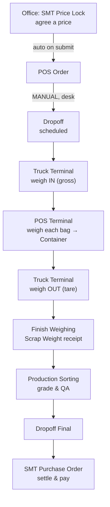

# Testing Handoff — branch `BR-dev2`

> **For:** taynaja
> **Branch:** `BR-dev2` (15 commits ahead of `develop`)
> **Date:** 2026-08-21
> **Status:** test candidate — **not** for production yet

---

## 1. What this branch is

`develop` (what production runs today, v1.1.0) records a drop-off as **one Scrap Weight document per truck**. That model had a duplication bug and no per-bag traceability.

`BR-dev2` replaces it with a **per-bag Container model**: every bag that goes on the scale becomes its own `Scrap Weight Container` record with its own ID (`CTN-YYMM-#####`), its own QR sticker, and its own audit chain. The customer-facing `Scrap Weight` receipt is now generated *from* those bags at the end of weighing, rather than being the thing you edit as you go.

Two ideas matter for testing:

**Containers are immutable.** You never edit a bag. A "reweigh" voids the old bag and creates a new one linked back to it (`reweighed_from`). The history stays intact and auditable — nothing is silently overwritten.

**Three weights must reconcile.** The weighbridge (`gross − tare`), the sum of the individual bags, and what the supplier *declared* they were bringing. Each gap is tracked separately with its own tolerance, because each means something different — moisture explains one, miscounting another, a deliberate substitution a third.

---

## 2. The flow you're testing

**One step is manual and easy to miss:** nothing creates the `Dropoff` for you. The Price Lock auto-creates the POS Order, but somebody has to make the Dropoff in the desk and link that order to it. Walk-ins are rejected — a Dropoff with no linked POS Order throws *"POS Order Required"*. See [guide/user/13-scheduling-a-dropoff.md](guide/user/13-scheduling-a-dropoff.md).

---

## 3. Where to read

Start at **[docs/guide/README.md](guide/README.md)** — it indexes everything and explains the conventions.

**To operate the system (bilingual Thai/English, walkthroughs with real numbers):**

| Doc | Covers |
|---|---|
| [user/00-start-here.md](guide/user/00-start-here.md) | Sessions, scales, the shared UI, QR scanning |
| [user/12-dropoff-receiving.md](guide/user/12-dropoff-receiving.md) | **The core flow** — bag by bag, reweigh, void, pause, finish |
| [user/11-truck-terminal.md](guide/user/11-truck-terminal.md) | Weighbridge: gross, tare, net |
| [user/13-scheduling-a-dropoff.md](guide/user/13-scheduling-a-dropoff.md) | The manual step above |
| [user/01-adding-items-to-the-screen.md](guide/user/01-adding-items-to-the-screen.md) | Why a new grade doesn't appear on the terminal |
| [user/90-troubleshooting.md](guide/user/90-troubleshooting.md) | Symptom → cause → fix, with known bugs marked 🐞 |

**To understand or debug it:**

| Doc | Covers |
|---|---|
| [admin/00-architecture.md](guide/admin/00-architecture.md) | System map, 40 doctypes, auth model, hardware coupling |
| [admin/12-dropoff-receiving.md](guide/admin/12-dropoff-receiving.md) | Data model, state machine, all 29 endpoints |
| [admin/01-master-data-and-setup.md](guide/admin/01-master-data-and-setup.md) | Everything a human must enter in the desk, in order |
| [admin/60-deployment-operations.md](guide/admin/60-deployment-operations.md) | Deploy, backup, runbook |
| [admin/70-testing.md](guide/admin/70-testing.md) | Every test suite and how to run it |

Older files in `docs/` (`DROPOFF_ARCHITECTURE.md`, `PHASE_8_*`, `USER_MANUAL*`, `USER_GUIDE_V2*`) **predate this redesign and are historical.** Where they disagree with `guide/`, `guide/` is right.

---

## 4. Please focus your testing here

Automated tests cover a lot (E2E 24/24, 100+ assertions across six suites), but they all use **manually typed weights**. Nothing below has ever met real hardware.

### 4.1 Highest priority — never tested with a real scale

Weighing a bag with the **scale connected** has literally never worked on this branch until today. The terminal sent an invalid value and every scale-driven save failed. It's a one-word fix and it is in this branch, but it has only been proven at the schema level — **not against a physical scale.**

> Please weigh several bags with the scale actually connected and confirm they save.

### 4.2 Printing, on paper

The thermal templates were rebuilt this week: all text is now solid black, Thai text is at least 10px, and the sticker's `↻ REWEIGHT / ชั่งซ้ำ` marker changed from red to bold black (red dithers to a pale smudge on a monochrome head).

**None of it has been printed on paper** — only verified in rendered HTML. Please print: a bag sticker, a weight receipt, a truck slip, and the bilingual queue slip. Check Thai tone marks are legible at arm's length.

### 4.3 Scanning

QR on stickers and drop-off documents, using the real scanner — including scanning a bag that belongs to a *different* drop-off than the one on screen (it should load that bag's drop-off and highlight the row).

### 4.4 Permissions — this one matters

**The dev site does not have your roles.** `SMT Manager`, `Production Manager` and `Production Worker` exist only on production, configured through the Role Permission Manager, which writes to that database and **not** to the repo. So nothing about permissions has been tested against how production actually behaves.

> Please test as a **real `SMT Manager`**, not as Administrator.
> In particular: can they create a Dropoff? On the dev site only `System Manager` can.

⚠️ Related: **a fresh install would come up with only `System Manager` able to create a Dropoff**, because the permission config isn't in version control. Not a blocker for testing this branch, but it matters before any rebuild.

---

## 5. Known bugs still present — not yours to chase

These are found, documented, and deliberately **not** fixed in this branch:

| Symptom | Note |
|---|---|
| Blue production terminal `/production/terminal` can't save | Sends the wrong argument name. **Use the orange `/pos/production`** — it is the one that works, despite what `UI_TERMINAL_UNIFORMITY_PLAN.md` says |
| Manager portal prices look wrong | That module is unfinished. Don't use its numbers |
| Supplier registration can't approve a Thai company name | Needs a short code that no UI supplies |
| Some settings do nothing | Now labelled "⚠️ NOT USED" in the form itself |
| A drop-off stuck at "In Progress" | Fixed — there's now an **Accept Variance & Release** button for a manager |

Full list with severity: [admin/70-testing.md](guide/admin/70-testing.md) §known issues, and §11 of [admin/30-settlement.md](guide/admin/30-settlement.md).

---

## 6. How to report

Please include the **document number** — `DO-…`, `CTN-…`, `SW-…`, `PLO-…`. It finds the exact record in seconds; a description alone can take an hour.

Also useful: a screenshot, what you clicked immediately before, and roughly when.

**Hard-refresh (Ctrl+Shift+R) before testing.** Browsers cache this app's CSS and JS for up to 12 hours, and no server-side command can clear it. If something looks unchanged, that's the first thing to rule out.

---

## 7. What happens next

Once you've tested, `cam_integration_v0` (the CCTV work) gets merged into this branch, and the combined result goes to production as **one release** — never one without the other, because the container change carries a data migration and running that cutover twice doubles the risk.

**Do not deploy this branch on its own.**
