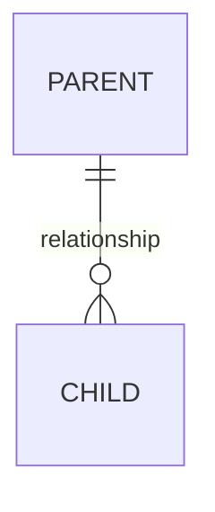
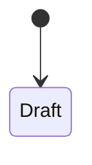

<!--
COPY ME to admin/NN-<module>.md when adding a module.

Rules for this tier:
  - English only.
  - Cite path:line for every behavioural claim. A claim without a citation is
    a claim nobody can re-verify when it drifts.
  - Diagrams as ```mermaid fences (they render on GitHub).
  - Known issues are a REQUIRED section. An empty one means you looked and
    found nothing — say that explicitly rather than deleting the heading.
  - If you did not verify it, mark it: ⚠️ UNVERIFIED — reason
  - Delete these comments and every "<...>" placeholder before committing.
-->

# <Module Name> — Developer & Admin Reference

> **Status:** Production
> **Source:** `<primary files, comma separated>`
> **Last verified:** <YYYY-MM-DD> against <branch or tag>

---

## 1. Purpose & scope

<What this subsystem owns, and — just as important — what it does not. Name the
adjacent modules and link to their references so the boundary is explicit.>

---

## 2. Data model



| DocType | Type | Purpose |
|---|---|---|
| `<name>` | Submittable / Child / Single / Normal | <what it represents> |

**Fields that carry behaviour** — not an exhaustive dump; the ones whose value changes what the system does:

| Field | DocType | Type | Why it matters |
|---|---|---|---|
| `<field>` | `<doctype>` | <type> | <the behaviour it drives> |

---

## 3. Lifecycle / state machine



| From | To | Trigger | Guard | Source |
|---|---|---|---|---|
| <state> | <state> | <what causes it> | <what must be true> | `path:line` |

---

## 4. API surface

| Endpoint | Args | Returns | Auth guard | Notes |
|---|---|---|---|---|
| `<module.function>` | <args> | <shape> | <guard> | <caveats> |

---

## 5. UI surface

| Page / element | File | Notes |
|---|---|---|
| `<route or #id>` | `path` | <what it drives> |

---

## 6. Business rules & validations

<Each rule as a statement of what is enforced, why, and where. The "why" is the
part that stops someone deleting it later as dead weight.>

- **<Rule>** — <what it enforces and why> (`path:line`)

---

## 7. Permissions

| Role | Can | Cannot |
|---|---|---|
| <role> | <actions> | <blocked> |

---

## 8. Configuration

| Setting | Where | Default | Effect |
|---|---|---|---|
| `<field>` | `<Settings doctype>` | <default> | <what changes> |

---

## 9. Known issues & gotchas

<Required. Traps that cost someone an afternoon, in enough detail that the next
person recognises the symptom. If there are none, write "None known as of
<date>." rather than deleting the section.>

- **<Symptom>** — <cause, and the fix or workaround> (`path:line`)

---

## 10. Testing

| Suite | Covers | Run |
|---|---|---|
| `<path>` | <what> | `<exact command>` |

**Not covered:** <the honest gaps — what a green run does not prove>
