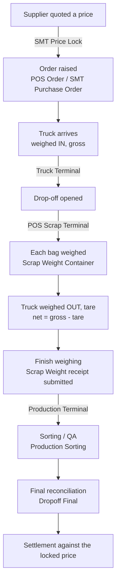
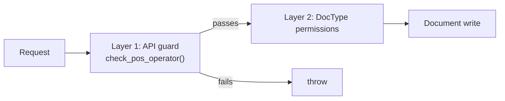

# Architecture — Developer & Admin Reference

> **Status:** Production
> **Source:** `hooks.py`, `modules.txt`, `scrap_metal_suite/doctype/**`, `api/v1/**`, `www/**`
> **Last verified:** 2026-08-21 against `feature/container-redesign`
> **App version:** `2.0.0` (`scrap_metal_suite/__init__.py`)

This is the map. Each subsystem has its own reference — follow the links rather than expecting depth here.

---

## 1. What the app does

Scrap Metal Suite runs the buying side of a scrap metal yard: a supplier arrives with a truck of mixed metal, the yard weighs it, grades it, and pays for it. The app exists because those four steps happen in different places, at different times, on different hardware, and the numbers have to reconcile at the end.

It is a Frappe/ERPNext v15 app — a single module (`Scrap Metal Suite`), 40 DocTypes, 66 whitelisted endpoints, and 18 web pages, most of which are touch-first terminals rather than desk forms.

**Two distinct interfaces, deliberately:**

- **Custom terminals** (`www/pos/*`, `www/production/*`) — full-screen, touch-first, bilingual, driven by hardware (serial scales, QR scanners, thermal printers). Operators live here and never see the desk.
- **The Frappe desk** — where managers and accounting work: approvals, corrections, reporting, and anything requiring a proper form.

---

## 2. The physical flow, and what the software does at each step



The reconciliation problem this exists to solve: **three independent weights must agree.** The weighbridge says one thing (`net = gross − tare`), the sum of individually weighed bags says another, and what the supplier *declared* they were bringing says a third. Each gap is tracked separately, with its own threshold, because each means something different — moisture and debris explain one, miscounting explains another, and a deliberate substitution explains a third.

---

## 3. Subsystem map

| Subsystem | Owns | Entry point | Reference |
|---|---|---|---|
| POS Scrap Terminal | Sessions, POS profiles, scale binding | `/pos/terminal?session=…` | [10](10-pos-scrap-terminal.md) |
| Truck Terminal | Weighbridge, gross/tare/net | `/pos/truck?session=…` | [11](11-truck-terminal.md) |
| Drop-off & Containers | The core receiving model | `/pos/terminal` (three-pane) | [12](12-dropoff-receiving.md) |
| Production Sorting | Post-receipt grading and QA | `/pos/production` (see §10) | [20](20-production-sorting.md) |
| Settlement | Price locks, POs, final money | Desk | [30](30-settlement.md) |
| Printing & i18n | 8 print formats, bilingual UI | cross-cutting | [40](40-printing.md) |
| Platform | Roles, scheduler, hooks, patches | — | [50](50-platform-roles-scheduler.md) |
| Portals | Supplier / manager self-service | `/supplier`, `/manager` | [80](80-portals-internals.md) ⚠️ incomplete |

---

## 4. Code layout

```
scrap_metal_suite/
├── api/v1/                     66 whitelisted endpoints
│   ├── auth.py                 check_pos_operator, check_production_operator
│   ├── dropoff.py              29  — receiving, containers, truck weights
│   ├── pos.py                  19  — sessions, profiles, scales, orders
│   ├── production.py           16  — sorting sessions and documents
│   └── __init__.py              2  — get_countries, debug_supplier_link
├── scrap_metal_suite/doctype/  40 DocTypes (+ controllers, + tests)
├── www/                        18 pages — terminals, portals, registration
├── public/
│   ├── css/                    pos.css, production.css, production-theme.css, portals
│   └── js/                     pos-core, pos-scanner, scale_reader, translations
├── fixtures/                   Custom Field, Scale, Print Format
├── patches/v2_0/               container migration + backfills
├── overrides/                  naming.py, reportview.py, supplier.py
├── scheduler.py                3 cron jobs
├── api_test/                   server-side suites + re-runnable tools
└── ui_test/                    Playwright browser tests
```

---

## 5. DocType inventory

40 total. Grouped by the subsystem that owns them; child tables are indented conceptually under their parent.

| Group | DocTypes |
|---|---|
| **Receiving** | `Dropoff`, `Dropoff Expected Item`*, `Dropoff Actual Item`*, `Dropoff Item Summary`*, `Dropoff Order`*, `Dropoff Truck`* |
| **Weighing** | `Scrap Weight`†, `Scrap Weight Item`*, `Scrap Weight Container`, `Container Weight History`*, `Truck Weight`, `Weight Photo`* |
| **POS** | `POS Session`, `POS Profile Scrap`, `POS Profile Item`*, `POS Order`, `POS Order Item`*, `POS Order Weighed Item`*, `POS Authority Code`, `Scale` |
| **Sorting** | `Production Sorting`†, `Production Session`, `Production Sorting Item`*, `Production Sorting Good Item`*, `Production Sorting Unwanted Item`*, `Production Sorting Source Item`*, `Production Sorting Item Group`* |
| **Settlement** | `SMT Price Lock`†, `SMT Price Lock Item`*, `SMT Purchase Order`†, `SMT Purchase Order Allocation`*, `SMT Purchase Order Dropoff`*, `Dropoff Final`, `Dropoff Final Good Item`*, `Dropoff Final Unwanted Item`*, `Scrap Purchase`, `Scrap Purchase Item`* |
| **Portals** ⚠️ | `Supplier Registration Request`† |
| **Settings** | `Dropoff Container Settings`‡, `Production Sorting Settings`‡ |

`*` child table  `†` submittable  `‡` single

**Submittable doctypes matter disproportionately.** Submit/cancel/amend is the app's audit spine: a submitted `Scrap Weight` is the customer-facing receipt and is immutable, and correcting it means cancelling and amending rather than editing. Anything with a `†` behaves this way.

---

## 6. Authorisation: two layers, on purpose



**Layer 1** — `api/v1/auth.py` guards the endpoint: is this caller allowed to be doing this kind of work at all?
**Layer 2** — Frappe's own permission model on each DocType.

Where an endpoint calls `insert(ignore_permissions=True)` **after** a guard has run, that is deliberate, not an oversight. Terminal operators hold narrow roles that intentionally lack blanket create rights on core doctypes; the guard is the real authorisation and the flag stops Frappe second-guessing it. Removing it breaks exactly the role the endpoint exists to serve. Full treatment in [50 — Platform, Roles & Scheduler](50-platform-roles-scheduler.md).

**Roles in use:** POS Operator, POS Manager, Production Manager, SMT Accounting Manager, Supplier, System Manager.

---

## 7. Hardware coupling

This app talks to physical devices, which is unusual for a Frappe app and drives several design choices.

| Device | How | Where |
|---|---|---|
| Bench scale (scrap) | WebSerial, continuous read | `public/js/scale_reader.js` |
| Weighbridge (truck) | WebSerial, HP-05 variants | same |
| QR / barcode scanner | camera via `html5-qrcode` | `public/js/pos-scanner.js` |
| Thermal receipt printer (80mm) | browser print, hidden iframe | print formats |
| Label printer (50×80mm) | browser print, hidden iframe | print formats |

Consequences worth knowing before you change anything:

- **WebSerial requires a secure context and a user gesture.** Scales cannot be opened from a background script or over plain HTTP.
- **A `Scale` carries an in-use lock** bound to a session, so two terminals cannot read the same device.
- **Thermal output is 1-bit.** No greys, and Thai below ~10px becomes unreadable — see [40 — Printing](40-printing.md).
- **Browsers cache assets aggressively** and no server-side command can evict them — see [60 — Deployment](60-deployment-operations.md).

---

## 8. Scheduled work

| Job | Schedule | Does |
|---|---|---|
| `scheduler.close_idle_sessions` | `*/15 * * * *` | Closes POS sessions idle > 90 min |
| `scheduler.close_idle_production_sessions` | `*/5 * * * *` | Closes production sessions idle > 10 min |
| `scheduler.expire_open_pos` | `0 1 * * *` | Expires purchase orders past their expiry date |

Idle-session cleanup exists because operators walk away from a terminal without closing a session, and an open session holds a scale lock. Details in [50](50-platform-roles-scheduler.md).

---

## 9. Migrations

`patches.txt` runs under `[post_model_sync]`:

| Patch | Purpose |
|---|---|
| `patches.v2_0.migrate_to_containers` | Converts pre-redesign `Scrap Weight` rows into per-bag `Scrap Weight Container` records |
| `patches.v2_0.backfill_container_snapshot_fields` | Populates snapshot fields on migrated containers |
| `patches.v2_0.fix_variance_threshold_defaults` | Corrects variance threshold defaults |

The first is the significant one: it is a **breaking data-model migration** and has not yet run against production data. Its dry-run on a production snapshot is the real deploy gate. See [60 — Deployment](60-deployment-operations.md).

---

## 10. Known architectural debt

Recorded here so it is visible from the map rather than buried:

- **Two production terminals exist, and the working one is not the one the plan names.** `www/pos/production.html` (the older "orange" one) is the only one that functions: `www/production/terminal.html` (the newer "blue" one) posts `items=` to `create_sorting`/`update_sorting`, which take `good_items`/`unwanted_items` (`api/v1/production.py:307,396`), so **every save from it raises TypeError**. It also never loads `scale_reader.js`, so it has no live scale reading. [UI_TERMINAL_UNIFORMITY_PLAN.md:90-96](../../UI_TERMINAL_UNIFORMITY_PLAN.md) recommends keeping blue and deleting orange — read that as a *target*, not a description of today. Acting on it as written would delete the only working sorting terminal. See [20](20-production-sorting.md).
- **Terminal JS is inline and large** — `www/pos/terminal.html` is ~3,900 lines. Extraction is planned in [UI_TERMINAL_UNIFORMITY_PLAN.md](../../UI_TERMINAL_UNIFORMITY_PLAN.md).
- **Three CSS namespaces** (`.terminal-*`, `.production-*`, `.prod-*`) with no shared base stylesheet.
- **Asset URLs are unversioned** on all terminal pages but one, so deploys can leave browsers on stale JS for up to 12 hours.
- **The portals are incomplete** and must not be presented to users as working. See [80](80-portals-internals.md).
