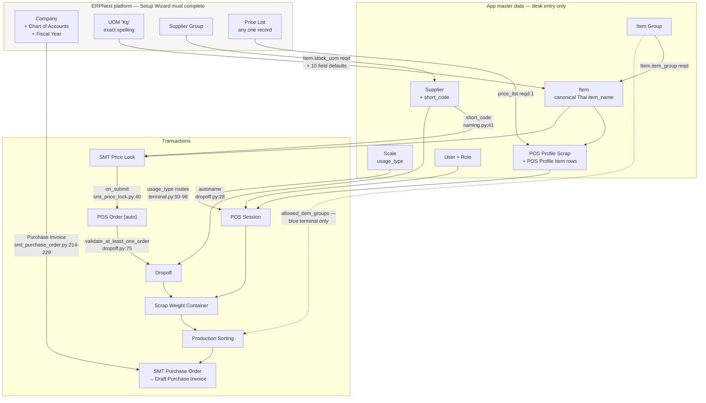

# Master Data & Fresh-Site Setup — Developer & Admin Reference

> **Status:** Production
> **Source:** `hooks.py`, `overrides/supplier.py`, `overrides/naming.py`, `api/v1/**`, `www/pos/**`, `www/production/**`, `scrap_metal_suite/doctype/{scale,pos_profile_scrap,pos_profile_item,dropoff_container_settings,production_sorting_settings,dropoff,dropoff_final,smt_price_lock,smt_purchase_order}/**`, `fixtures/**`
> **Last verified:** 2026-08-21 against `feature/container-redesign` (`ce7a9d6`), live site `metal`

This document answers one question: **what must a human type into the ERPNext desk before this app works, and which of those inputs actually take effect?**

Every behavioural claim below was verified by reading the consuming code or by running it against the `metal` dev site. Where a field is declared but consumed by nothing, that is stated as a finding, with the grep result that proves it. Paths are relative to the inner package `scrap_metal_suite/scrap_metal_suite/`.

---

## 1. Purpose & scope

**In scope:** the desk-entered master records the app reads at runtime, the order they must be created in, who owns each, and which configuration fields are honoured.

**Out of scope:** installing Frappe/ERPNext and the bench ([60 — Deployment & Operations](60-deployment-operations.md)); operator walkthroughs ([user/](../user/)); per-module data models ([10](10-pos-scrap-terminal.md), [12](12-dropoff-receiving.md), [20](20-production-sorting.md), [30](30-settlement.md)).

### 1.1 The governing fact: no API creates master data

Verified by grepping `api/v1/` for every write path against `Item`, `Item Group`, `Scale`, `POS Profile Scrap`, `Supplier`, `UOM`, `Price List`, `Warehouse`, `Company`, `Item Price`:

| Probe | Result |
|---|---|
| `{"doctype": "<master>"}` dict inserts in `api/v1/` | 1 hit — `api/v1/__init__.py:54`, a *filter* on Dynamic Link, not an insert |
| `frappe.new_doc("<master>")` / `frappe.get_doc("<master>")` in `api/v1/` | 4 hits, **all reads**: `api/v1/pos.py:42` (profile), `api/v1/pos.py:839` + `api/v1/production.py:173` (Scale — write the in-use lock only), `api/v1/__init__.py:60` (Supplier read) |
| `frappe.db.set_value("<master>", …)` in `api/v1/` | **0 hits** |

**Consequence:** every master record in this document is **desk entry**. The terminals read master data; they never author it. The only master field any *app* endpoint writes is `Scale.in_use` / `Scale.in_use_by_session` (`api/v1/pos.py:838-841`, `api/v1/production.py:173-176`) — a runtime lock, not configuration.

> ⚠️ **One exception, via a generic Frappe endpoint.** The `/scale-test` page patches eight `Scale` serial fields through `frappe.client.set_value` (`www/scale-test/index.html:930-950`) — `baud_rate`, `data_bits`, `parity`, `stop_bits`, `flow_control`, `protocol_detected`, `unit_conversion_factor`, `signal_unit`. It cannot *create* a Scale. `www/scale-test/index.py` sets no role guard, and both `POS Operator` and `Production Worker` hold `write` on `Scale`, so **any operator can overwrite any scale's serial config — including one another operator is using.**

There is also **no `after_install` hook** (`hooks.py:93-94` are commented-out stubs), so installing the app creates nothing beyond its three fixtures (§3.6).

---

## 2. Dependency graph

Solid arrows are hard dependencies (the dependent cannot be created without it); dashed arrows are soft (it works, but degraded or only for one module).



**Reading the graph:** the longest hard chain is
`Item Group → Item → SMT Price Lock → POS Order → Dropoff → Scrap Weight Container`,
with `Supplier.short_code` gating the middle and `POS Profile Scrap → POS Session → Scale` joining from the side. Nothing can be weighed until both branches exist. **Company only enters at the very end**, when settlement submits.

---

## 3. Setup order — every doctype requiring human input

### 3.1 ERPNext platform prerequisites

> 🔴 **Run the ERPNext Setup Wizard to completion.** It is what installs the `Kg` UOM, the base Item Groups, `Standard Buying`/`Standard Selling`, the Company, and the Chart of Accounts. A wizard-skipped site fails on the first Item save. `Kg` specifically comes from `add_uom_data()` in ERPNext's `setup_wizard/operations/install_fixtures.py:322,354-357` — **not** from `bench install-app erpnext`.

| Record | Desk path | Required? | Evidence |
|---|---|---|---|
| **UOM `Kg`** | `/app/uom` | 🔴 **HARD** | The literal `"Kg"` is a **field `default` on 10 Link→UOM fields** — `pos_order_item.json:39`, `smt_price_lock_item.json:37`, `scrap_weight_item.json:52`, `scrap_purchase_item.json:50`, `dropoff_final_good_item.json:45`, `dropoff_final_unwanted_item.json:47`, `production_sorting_item.json:41`, `production_sorting_good_item.json:46`, `production_sorting_unwanted_item.json:47`, `production_sorting_settings.json:33` — so a missing `Kg` throws `LinkValidationError` on save. It is also the hardcoded Python fallback at `api/v1/dropoff.py:230,673`, `api/v1/production.py:356,371,438,453`, `www/pos/terminal.py:132`, `www/pos/production.py:80`, `scrap_metal_suite/doctype/smt_price_lock/smt_price_lock.py:54`, `scrap_metal_suite/doctype/smt_purchase_order/smt_purchase_order.py:225`, `scrap_metal_suite/doctype/dropoff/dropoff.py:696`. **Do not rename it.** |
| **Item Group** | `/app/item-group` | 🔴 **HARD (transitively)** | `Item.item_group` is `reqd: 1` in ERPNext v15. No Item Group → no Item → no app. |
| **Price List** (any one) | `/app/price-list` | 🔴 **HARD as a record, ❌ inert as a value** | `POS Profile Scrap.price_list` is `reqd: 1` (`pos_profile_scrap.json:42-47`). Without one you cannot save a profile → cannot open a POS Session → the POS module is dead. But **nothing reads the value** (§5.3). Failure: `Error: Value missing for POS Profile Scrap: Default Price List`. No specific name is hardcoded — the test fixtures use `frappe.db.get_value("Price List", {"buying": 1}, "name")`, i.e. any buying list works. |
| **Supplier Group** | `/app/supplier-group` | 🟢 optional | Not `reqd` on ERPNext v15's `Supplier`. Registration approval resolves it from `Buying Settings.supplier_group`, falls back to the first row, and leaves it unset if none exists (`scrap_metal_suite/doctype/supplier_registration_request/supplier_registration_request.py:89-97`). |
| **Company** + Chart of Accounts + Fiscal Year | `/app/company` | 🟠 **HARD for settlement only** | See §3.1.1. |
| **Warehouse** | `/app/warehouse` | 🟢 **optional, zero consumers** | §5.3. |
| **Item Price** | `/app/item-price` | 🟢 **optional** | Only reader is `www/manager/price.py:48-62`, inside `try/except`, in the ⚠️ incomplete Manager Portal. Live `metal` has **0 Item Price rows** and the 24/24 E2E suite passes. Missing price renders `฿-` (`www/manager/price.html:45-51`). |
| **Currency / THB** | — | 🟢 optional | No app code accesses the `Currency` doctype. `฿` is a literal glyph in the manager portal; `(THB)` appears only in field *labels* (`smt_price_lock_item.json:60`). If you use settlement, set the Company's `default_currency` to THB — the Draft Purchase Invoice inherits it. |
| **Customer** | — | ⚪ **unused** | Grep finds 3 hits, none the doctype: a dashboard group label (`dropoff.json:691`) and two docstrings. The app is Supplier-only. |

#### 3.1.1 Company — required only at the settlement boundary

The app declares **no `Company` Link field on any of its 40 doctypes** (verified by sweeping every `doctype/*/*.json` for `"options": "Company"` — zero hits), and no code calls `get_default_company()`. POS weighing, Dropoff, Truck Weight, Scrap Weight Container, Production Sorting, Dropoff Final and SMT Price Lock all work on a site with **zero Companies**.

But `SMT Purchase Order.on_submit` creates a real ERPNext **Draft Purchase Invoice** (`scrap_metal_suite/doctype/smt_purchase_order/smt_purchase_order.py:214-229`) without setting `pi.company`, relying on the framework default. With no Company that resolves to `None` and ERPNext throws from `get_party_account` while filling the `reqd` `credit_to` field:

```
ValidationError: Please select a Company
```
— reproduced on `metal` with the Company defaults monkeypatched away, inside a rolled-back savepoint.

With a Company present it auto-resolves `credit_to`, `expense_account`, `currency`, and `buying_price_list`. So settlement additionally needs a **payable account in the Chart of Accounts** and ⚠️ UNVERIFIED — an **open Fiscal Year** covering the PO's `final_date`; `metal` has FY 2025 + 2026, so the missing-FY path was never exercised.

**No warehouse is needed for the PI**: `update_stock` stays at its `0` default and `set_warehouse` is never set, so a PI inserts with no warehouse. The invoice is left **Draft** deliberately — the accountant reviews and submits it. `SMT Purchase Order` posts to no ledger itself; the sweep found zero references to `Journal Entry`, `GL Entry`, `Payment Entry`, `Purchase Receipt`, `Stock Entry`, or `Cost Center` anywhere in app code.

> **Owner:** IT. One-time, during ERPNext setup.

### 3.2 Roles and Users — `/app/user`

Roles are created automatically by `bench migrate` because they are named in the app's DocType permission rows; you never create the Role record. What you must do is **assign** them.

| Role | Grants (app doctypes) | Needed by |
|---|---|---|
| `POS Operator` | R/W `Dropoff`, `POS Order`, `Scale`; R `POS Profile Scrap`; R/W/C `POS Session`, `Scrap Weight Container`, `Scrap Purchase`, `Truck Weight`; full `Scrap Weight` | Yard operators — scrap and truck terminals |
| `Production Worker` | R/W/C `Dropoff Final`, `Production Session`, `Production Sorting`; R/W `Scale` | Sorting line |
| `Production Manager` | as above + delete/cancel | Sorting supervisor |
| `SMT Accountant` / `SMT Accounting Manager` | R/W/C/submit/cancel `SMT Price Lock`, `SMT Purchase Order`; read-only across the receiving chain | Office / settlement |
| `System Manager` | everything — **including the only `create` right on `Dropoff`** (§9) | Admin |

**Two API guards sit in front of the DocType layer** (`api/v1/auth.py`):

| Guard | Accepts | Rejection message |
|---|---|---|
| `check_pos_operator()` (`auth.py:7-18`) | `POS Operator`, `System Manager` | `Access denied. POS Operator role required.` (`:18`) |
| `check_production_operator()` (`auth.py:21-32`) | `Production Worker`, `Production Manager`, `System Manager` | `Access denied. Production Worker role required.` (`:31`) |

Anonymous callers get `Please login to access POS` (`auth.py:14`) / `Please login to access Production` (`:28`).

> ⚠️ **`Production Operator` is a trap.** The role exists — it holds read on `Scrap Weight Container` — and is assignable in the desk, but `check_production_operator()` does **not** accept it (`api/v1/auth.py:31`). A user given only `Production Operator` is rejected by every production endpoint. Assign `Production Worker`.

> ⚠️ **`POS Manager` is a second trap — a half-open door.** The page guards admit it (`www/pos/index.py:34`, `www/pos/truck.py:73` accept `POS Operator | POS Manager | System Manager`), but `check_pos_operator()` does not (`api/v1/auth.py:17`). A user holding **only** `POS Manager` loads `/pos` normally and then gets `Access denied. POS Operator role required.` on every single API call. Always pair `POS Manager` with `POS Operator`. The production side is consistent by comparison — `www/pos/production.py:39` and `api/v1/auth.py:31` accept the same set.

> **Owner:** IT, per person. **API:** desk only.

### 3.3 Item Group — `/app/item-group`

| Field | Req | Drives |
|---|---|---|
| `item_group_name` | yes | Groups Items; selectable in `Production Sorting Settings.allowed_item_groups` |
| parent group | yes (ERPNext) | Tree position |

**Consumers:** `www/production/terminal.py:51-65` and `api/v1/production.py:275-289` filter `Item` by `item_group IN (allowed_groups) AND disabled = 0`; `www/manager/price.py:23` uses a hardcoded `like "%Scrap%"`. That is the complete runtime use — see §5.2 for why it reaches neither *working* terminal.

Live on `metal`: `Scrap Metal`, `Bag and wastage`.

> **Owner:** office. **API:** desk only.
> **If `allowed_item_groups` is empty:** `api/v1/production.py:276-277` returns a bare `[]` and `www/production/terminal.py:57-65` leaves the grid empty. **Silently unusable, no error message** — the most likely fresh-site "why is the sorting screen blank" ticket.

### 3.4 Item — `/app/item`

Stock ERPNext `Item`. The app ships **no custom fields on Item** — its only three custom fields are on `Supplier` (`fixtures/custom_field.json`).

| Item field | Read at | Drives | Required |
|---|---|---|---|
| `item_code` | `www/pos/terminal.py:120-122`, `www/pos/production.py:66-68`, `www/production/terminal.py:60-62`, `api/v1/production.py:281-287` | Identity; stored on every container | **yes** |
| `item_name` | `www/pos/terminal.py:131`, `www/pos/production.py:79`, `api/v1/production.py:287`, `scrap_metal_suite/doctype/dropoff/dropoff.py:479`, `scrap_metal_suite/doctype/scrap_weight_container/scrap_weight_container.py:34-37` | **The button caption on the terminal**, and the line on every receipt and sticker. Canonical Thai — never translated ([BILINGUAL_GUIDE](../../BILINGUAL_GUIDE.md)) | **yes** |
| `stock_uom` | `www/pos/terminal.py:122,132`, `www/pos/production.py:80`, `api/v1/production.py:287` | UOM shown on the terminal; falls back to `"Kg"` | recommended |
| `item_group` | `api/v1/production.py:284`, `www/production/terminal.py:61` | Sorting-terminal filtering only | only for sorting |
| `disabled` | `api/v1/production.py:285`, `www/production/terminal.py:61` | Excludes the Item from the **sorting** grid. **Not checked by the POS terminal** — §9 | — |

Beyond these, 16 `fetch_from` declarations pull `item_code.item_name`, `item_code.stock_uom` and `item.item_group` into child tables at save time (e.g. `pos_order_item.json:27,40`, `smt_price_lock_item.json:29,38`, `production_sorting_item.json:24,32`).

**Never read anywhere:** `is_stock_item`, `has_variants`, `image`, `weight_uom`, `description`, `brand`. Setting them changes nothing in this app.

**The app applies no `set_query` filter to any Item Link field** — grep across all app JS found 4 `set_query` calls, none on Item. Desk pickers therefore show every Item, including disabled ones and variant templates.

> **Owner:** office (the item master is the grade vocabulary).
> **API:** **desk only.** No endpoint creates or edits an Item.
> **If an Item referenced by a POS Profile is deleted:** `www/pos/terminal.py:125` guards with `if item_doc:` and **silently skips it**. The grade button vanishes with no error and no warning on the profile. See §9.

### 3.5 Supplier — `/app/supplier`

The app adds exactly three custom fields, all here (`fixtures/custom_field.json`):

| Field | Type | Req | Unique | Read-only | Consumed at |
|---|---|---|---|---|---|
| `short_code` | Data(8) | **1** | **1** | no | `overrides/naming.py:41` — **the only production reader** |
| `custom_source` | Select (blank/Manual/Webform) | 0 | 0 | **1** | `www/supplier/utils.py:97` — placed in a context dict, **never rendered**. Provenance only |
| `custom_registration_request` | Link → Supplier Registration Request | 0 | 0 | **1** | `www/supplier/utils.py:98,105-117` — drives the ⚠️ incomplete Supplier Portal only |

**`short_code` is the single most important field an admin types in this app.** It is embedded in the docname of five doctypes (§6.2). Without it, nothing referencing the supplier can be created:

```
Supplier {0} has no Short Code. Open the supplier and set one
(2-8 ASCII chars) before creating documents that reference it.
```
— `overrides/naming.py:43-49`, title `Supplier Short Code Missing`.

Other Supplier fields the app depends on:

| Field | Consumed at | If blank |
|---|---|---|
| `supplier_name` | `api/v1/dropoff.py:99,110,124,193,267,805`; `api/v1/pos.py:235,274,308,341,463`; `api/v1/production.py:195,211,218,261`; **all 8 print formats** | No throw — blank name on every receipt, sticker and terminal header, and the production supplier search (`production.py:218`) stops matching |
| `supplier_group` | ERPNext validation | Optional in v15; the registration path degrades gracefully |
| `default_price_list` | **nowhere** — 0 hits repo-wide | No effect. The price-tier plan in `CLAUDE.md` is unimplemented |
| `disabled` | `www/manager/index.py:17` | Manager-portal KPI only |

For the ⚠️ incomplete Supplier Portal, a login additionally needs a `Contact` whose `user` field points at it **and** a `Dynamic Link` row to the Supplier (`www/supplier/utils.py:72-88`); otherwise the portal shows `No supplier account linked to your user. Please contact support.` (`utils.py:57-59`).

> **Owner:** office. **API:** desk only.

### 3.6 Scale — `/app/scale`

**The app ships 5 Scale records as a fixture** (`hooks.py:271-272`, `fixtures/scale.json`), so a fresh `bench migrate` creates them:

| Name | `usage_type` | `scale_type` | `is_active` | `max_capacity_kg` |
|---|---|---|---|---|
| `SCALE-001` | Scrap | Platform | 1 | 5 000 |
| `SCALE-002` | Scrap | Platform | 1 | 5 000 |
| `SCALE-003` | Scrap | Hanging | **0** | 500 |
| `TRUCK-001` | Truck | Weighbridge | 1 | 60 000 |
| `TRUCK-002` | Truck | Weighbridge | 1 | 60 000 |

> 🔴 **No fixture Scale has `usage_type = "Production"`.** `www/pos/production.py:93-98` filters `{"usage_type": "Production", "is_active": 1}`, so on a fresh site the production terminal's scale list is **empty** and sorting cannot start until someone creates a Production scale by hand. (`metal`'s `Prod-1` / `Prod-2` were hand-created and are **not** in the fixture.) All five fixture scales also ship with **blank serial settings** — baud rate, parity and conversion factor are per-site desk entry.

Field-by-field (`scrap_metal_suite/doctype/scale/scale.json`, autoname `field:scale_name`):

| Field | Type | Req | Default | Drives |
|---|---|---|---|---|
| `scale_name` | Data | **1** | — | **Is the docname.** Uppercased by `scale.py:11-12` — but see §9 |
| `scale_type` | Select: Platform/Weighbridge/Hanging/Floor/Bench | **1** | — | Displayed only; no branching logic |
| `usage_type` | Select: **Scrap / Truck / Production** | **1** | — | **Routes the operator to a terminal** — see below |
| `is_active` | Check | 0 | 1 | Gate: `api/v1/pos.py:827`, `api/v1/production.py:164`, `www/pos/terminal.html:2458`, `www/pos/truck.html:2264`, `www/pos/production.py:95` |
| `in_use`, `in_use_by_session` | Check, Link→POS Session | 0 | 0 | **Runtime lock**, written by `api/v1/pos.py:838-841`. Do not hand-edit |
| `max_capacity_kg` | Float | 0 | — | ✅ **The only server-side weight bound** — `api/v1/dropoff.py:346,350-353`, `:652,667-668`, `:1121-1125`; client guard `www/pos/terminal.html:1578-1587`. Set it |
| `location` | Data | 0 | — | Shown in the scale picker (`www/pos/terminal.html:2456`, `www/pos/production.html:104`) |
| `baud_rate`, `data_bits`, `parity`, `stop_bits`, `flow_control` | Select | 0 | `flow_control=none` | WebSerial auto-reconnect params (`api/v1/pos.py:60-64`). If **any** is blank, `www/pos/terminal.html:2626` short-circuits and auto-reconnect never runs |
| `unit_conversion_factor` | Float | 0 | **1** (JSON) | Multiplier on raw readings (grams→kg = 0.001, tons→kg = 1000, lb→kg = 0.453592). Read `api/v1/pos.py:83,100,729`, `api/v1/production.py:71,84,528`; applied `public/js/production-terminal.js:144,203`. 🟠 **The five fixture scales land with `0.0`, not `1`** — `fixtures/scale.json` omits the key so the JSON default never applies (verified live on all five). Masked at runtime because every reader does `parseFloat(…) \|\| 1`, but the desk form shows `0.000000` |
| `protocol_detected` | Data | 0 | — | ⚠️ **write-only.** Written by `/scale-test`, shipped to the client (`api/v1/pos.py:83,99`), stored in JS state (`www/pos/terminal.html:2383`) — never read again. The protocol shown at `terminal.html:2687` comes from the live handshake, not this field |
| `signal_unit` | Select: kg/grams/tons/lb | 0 | — | ⚠️ **write-only**, same pattern (`www/pos/terminal.html:2385`) |
| `asset_link`, `last_calibration_date`, `next_calibration_date`, `calibration_certificate`, `notes` | — | 0 | — | 🪦 **dead** — 0 code references each, repo-wide. Record-keeping for humans only |

> This `unit_conversion_factor` is a **Float on the app's own `Scale` doctype**, not ERPNext's `UOM Conversion Factor`. Grep for `"UOM Conversion Detail"` / `"UOM Conversion Factor"` across app code: **zero hits.** No ERPNext UOM-conversion records are required.

**`usage_type` decides which terminal a session lands on** — `www/pos/terminal.py:93-98`:

```python
93  if session.scale:
94      scale_usage_type = frappe.db.get_value("Scale", session.scale, "usage_type")
95      if scale_usage_type and scale_usage_type != "Scrap":
96          # Session has a Truck scale - redirect to truck terminal
97          frappe.local.flags.redirect_location = f"/pos/truck?session={session_name}"
98          raise frappe.Redirect
```

The test is `!= "Scrap"`, **not** `== "Truck"`. `www/pos/truck.py:50-55` is the mirror image (`!= "Truck"` → `/pos/terminal`).

> 🔴 **Binding a `Production` scale to a POS Session causes an infinite redirect loop.** `terminal.py:95` sends it to `/pos/truck`; `truck.py:52` sends it back to `/pos/terminal`; repeat forever. It is reachable because `api/v1/pos.py:788-851` validates existence, `is_active` and the lock but **never checks `usage_type`** — the UI dropdown is the only thing preventing it. Keep Production scales out of the Scrap/Truck pickers by setting `usage_type` correctly at creation.

Production work uses a separate doctype (`Production Session`) reached from `/pos/production`, which filters `usage_type == "Production"` (`www/pos/production.py:95`).

> 🔴 **Start production sessions from `/pos/production`, not the `/production/terminal` scale badge.** `api/v1/production.py:173-176` assigns a `Production Session` name to `Scale.in_use_by_session`, which is a Link to **`POS Session`** only (`scale.json` options). Reproduced live: `LinkValidationError: Could not find In Use By Session: PSORT-SES-26-08-21-00001`. The whole call rolls back, so the scale is never bound. `/pos/production` sets `Production Session.scale` at insert (`api/v1/production.py:26-31`) and bypasses the broken path — it also never takes a lock at all.

**Scale errors** (`api/v1/pos.py:814-833`, mirrored at `api/v1/production.py:153-168`):

| Condition | Message |
|---|---|
| Session already has a scale | `Scale already set for this session. Close session and open a new one to use a different scale.` |
| Unknown scale | `Scale '{0}' not found` |
| `is_active = 0` | `Scale '{0}' is not active` |
| Locked by another session | `Scale '{0}' is already in use by session {1}` |
| Deactivating a scale with an open session | `Cannot deactivate scale '{name}' while it has open POS sessions. Please close all sessions using this scale first.` (`scale.py:26-28`) |

**What breaks with no Scale of the right `usage_type`** — a soft dead-end per terminal, never a stack trace:

| Terminal | Behaviour |
|---|---|
| `/pos/terminal` | `No scrap scales found. Please contact administrator to set up scales.` + a disabled `No scrap scales available` option (`www/pos/terminal.html:2416-2423,2445-2451`) |
| `/pos/truck` | `No truck scales found. Please contact administrator to set up scales.` (`www/pos/truck.html:2222-2229`) |
| `/production/terminal` | `No production scales found` (`www/production/terminal.html:541`) |
| `/pos/production` | 🔇 **Silent** — a Jinja loop with no `` renders an empty list (`www/pos/production.html:98-108`). No session can ever start |

> 🔴 **The scrap/truck scale modal cannot be dismissed.** The click-outside handler exempts it (`if (modal.id === 'scaleModal') return;` — `www/pos/terminal.html:2350-2351`) and both buttons are disabled (`:2493-2494`). **Manual Entry does not rescue you either** — `confirmScaleManualMode()` still requires a selected Scale and calls `set_session_scale` (`terminal.html:2927-2937`). With zero scales the operator is stuck behind an empty modal. The POS Session itself opens fine (`POS Session.scale` is not `reqd`); the block is entirely at the terminal.

**QR codes carry the bare scale name, not a URL.** `get_scale_by_id` strips a `/scale/` prefix (`api/v1/pos.py:753-754`) and `.strip().upper()`s the value (`:757`) before matching `scale_name` (`:765`) — but **there is no `/scale/<name>` web route in this app** (no `website_route_rules` in `hooks.py`). Encoding a URL produces a QR that 404s if anyone opens it in a browser.

> **Owner:** IT (hardware). **API:** create is **desk only** (System Manager); the app's endpoints write only the `in_use` lock; serial config is additionally writable from `/scale-test` (§1.1). Note `get_scales` does **not** filter `is_active` (`api/v1/pos.py:715-719`) — inactive scales are returned and greyed out client-side.

### 3.7 POS Profile Scrap — `/app/pos-profile-scrap`

**This is what renders the grade buttons on the weighing terminal.** Autoname `field:profile_name`.

| Field | Type | Req | Verdict | Evidence |
|---|---|---|---|---|
| `profile_name` | Data, unique | **1** | ✅ honoured — is the docname; rendered `www/pos/terminal.html:32`, `www/pos/index.html:69` | — |
| `is_active` | Check (dflt 1) | 0 | ❌ **dead** | `www/pos/index.py:50-54` lists **all** profiles with no filter; no other query filters on it |
| `price_list` | Link → Price List | **1** | ❌ **dead value, mandatory field** | Selected at `www/pos/index.py:52`; `www/pos/index.html` never renders it (only `profile.name` / `profile_name` at `:69`) |
| `warehouse` | Link → Warehouse | 0 | ❌ **dead** | Only reader is `api/v1/pos.py:46`, inside `get_pos_profile` — which has **no UI caller** |
| `show_price` | Check (dflt 1) | 0 | ❌ **dead** | Repo-wide grep: 2 hits, both its own JSON definition (`pos_profile_scrap.json:14,63`) |
| `items` | Table → POS Profile Item | **1** | ✅ honoured — the grade grid | `www/pos/terminal.py:118-139` |
| `enable_sticker_print` | Check (dflt 1) | 0 | ✅ honoured | `api/v1/dropoff.py:1039-1044` gates `print_urls["sticker"]`; consumed at `www/pos/terminal.html:3082` |
| `sticker_printer_name` | Data | 0 | ❌ **dead** | Repo-wide grep: 2 hits, both its own JSON definition (`pos_profile_scrap.json:19,93`) |

**Child table `POS Profile Item`** (grid sorted `display_order ASC`):

| Field | Req | Verdict |
|---|---|---|
| `item_code` | **1** | ✅ Link → Item. Duplicates blocked: `Duplicate items are not allowed in POS Profile` (`scrap_metal_suite/doctype/pos_profile_scrap/pos_profile_scrap.py:17`) |
| `item_name` | read-only, `fetch_from: item_code.item_name` | ⚠️ **stale copy.** The terminal ignores it and re-reads `Item.item_name` live (`www/pos/terminal.py:119-131`). Only `api/v1/pos.py:49` uses the child copy, and that endpoint is dead |
| `category` | 0 | ✅ honoured — becomes the tab strip. Blank sorts last via the `"zzz"` sentinel (`www/pos/terminal.py:139`) |
| `display_order` | 0 | ✅ honoured — auto-filled `idx + 1` when blank (`pos_profile_scrap.py:19-23`); sort key at `www/pos/terminal.py:139`, `www/pos/production.py:85`, `api/v1/pos.py:53` |

> **Owner:** office (defines the grade vocabulary operators see).
> **API:** **desk only.** `api/v1/pos.py:42` reads a profile; nothing creates or edits one. Only `System Manager` has `create`/`write`; `POS Operator` has read.
> **If missing:** `www/pos/index.py:50` returns `[]` → no profile to pick → no session can open (`POS Session.pos_profile` is `reqd: 1`).

### 3.8 Dropoff Container Settings (Single) — `/app/dropoff-container-settings`

| Field | Type | Default | Verdict |
|---|---|---|---|
| `weight_variance_threshold_pct` | Percent | 0.1 | ❌ **dead at runtime.** Its only reader is the one-shot migration `patches/v2_0/migrate_to_containers.py:126`. Live variance uses the **per-Dropoff** fields `truck_variance_threshold_percent` / `indicated_variance_threshold_percent`, each with a literal `0.1` fallback (`scrap_metal_suite/doctype/dropoff/dropoff.py:503,526`) |
| `auto_print_sticker_default` | Check | 1 | ❌ **dead.** Repo-wide grep: 3 hits — its own JSON (`:10,33`) and its own test (`test_dropoff_container_settings.py:29`). Its description claims "per-Profile override exists"; in reality only the per-Profile `enable_sticker_print` is read, and it never consults this default |

**This entire Single has no runtime effect.** Its permission row grants read/write/create to the ambiguous `Manager` role — a role that exists on `metal` but is not one of the app's operational roles.

### 3.9 Production Sorting Settings (Single) — `/app/production-sorting-settings`

| Field | Type | Default | Verdict |
|---|---|---|---|
| `variance_threshold_percent` | Percent, **reqd** | 0.1 | ✅ **honoured** since 2026-08-21 — see §4 |
| `default_uom` | Link → UOM | `Kg` | ❌ **dead.** Repo-wide grep outside `docs/`: 2 hits, both its own JSON (`:10,34`). Every write path hardcodes `item.get("uom", "Kg")` (`api/v1/production.py:356,371,438,453`) |
| `allowed_item_groups` | Table → Production Sorting Item Group | — | ⚠️ **partially honoured** — §5.2 |

> **Owner:** admin. **API:** desk only. Only `System Manager` has any permission — **not even `Production Manager` can edit the sorting threshold.**

### 3.10 POS Authority Code — `/app/pos-authority-code` — 🪦 skip it entirely

Autoname `field:user`, so the docname *is* the user's email. It looks like a supervisor-override register and asks for real input: `user` (reqd, unique), `pin_code` (reqd, Password — digits only, minimum 4, per `scrap_metal_suite/doctype/pos_authority_code/pos_authority_code.py:14-19`), and three capability checkboxes — `can_override_rate` (default **on**), `can_void_purchase`, `can_close_any_session`.

**It gates nothing.** Its only would-be consumer is `POSAuthorityCode.verify_pin` (`pos_authority_code.py:22`), and a repo-wide grep for `verify_pin` returns **exactly one hit — the definition itself**. Zero call sites in `api/`, `www/`, `public/js/`, or the tests. The place it was meant to plug into is stubbed out:

```python
162  # Verify ownership or authority
163  if session_doc.operator != frappe.session.user:
164      # Check if user has authority to close any session
165      # For now, just block - can add authority check later
166      frappe.throw(_("You can only close your own sessions"))
```
— `api/v1/pos.py:162-166`

No fixture ships any record. Creating one is wasted effort; do not let it into the setup routine. [10 — POS Scrap Terminal §](10-pos-scrap-terminal.md) covers the security flaws to fix before anyone revives it.

### 3.11 POS Session — what a human supplies

Not master data, but it is the one transactional record an admin may create by hand. Only **`pos_profile`** is human input — it is the single argument to `pos.open_session` (`api/v1/pos.py:106-138`). Everything else is set server-side.

> ⚠️ **`operator` is force-overwritten.** `pos_session.py:13` sets `self.operator = frappe.session.user` in `before_insert`, unconditionally. **An admin who creates a session in the desk "for" an operator gets it reassigned to themselves**, and `www/pos/terminal.py:88-90` will then refuse the real operator with `This session belongs to another operator`. Sessions must be opened by the person who will use them.

> ⚠️ `POS Session.closed_by` is never populated on a normal close — `POSSession.close_session` (`pos_session.py:51-55`) omits it and only the idle scheduler sets it (`scheduler.py:30`, to `Administrator`). Do not use it for audit.

---

## 4. `Production Sorting Settings.variance_threshold_percent` — was dead, FIXED 2026-08-21

> **Current status: ✅ honoured.** The analysis below is retained because the *shape* of this bug recurs — see [90 — Extending this app](90-extending-this-app.md), "The fallback trap".
>
> **The fix:** delete `"default": "0.1"` from `Dropoff Final.variance_threshold_percent` in `dropoff_final.json`. No code changed — the consumer was always correct.
>
> **Behaviour change: none at the time of the fix.** Both defaults were `0.1`, so new documents fall through to a Setting that already held `0.1`. Existing records keep their stored value. The only difference is that changing the Setting now works.
>
> **Verified after the fix** (rolled back):
> ```
> Settings=0.1  ->  threshold used 0.1,  variance 1.00%  ->  variance_ok=False
> Settings=7.5  ->  threshold used 7.5,  variance 1.00%  ->  variance_ok=True
> ```
> **Guarded by** `api_test/test_variance_threshold.py` (5 checks), which asserts the field never regains a default. Confirmed to fail 4/5 when the default is reintroduced.

### What was wrong (retained for the pattern)

**The consumer** — `scrap_metal_suite/doctype/dropoff_final/dropoff_final.py:85-100`:

```python
 94  threshold = flt(self.variance_threshold_percent)
 95  if not threshold:
 96      threshold = flt(frappe.db.get_single_value(
 97          "Production Sorting Settings", "variance_threshold_percent"
 98      )) or 5.0
 99      self.variance_threshold_percent = threshold
100  self.variance_ok = self.variance_percent <= threshold
```

**Why line 95 is never true.** `Dropoff Final.variance_threshold_percent` carries a **schema default of `0.1`**:

```json
{"default": "0.1", "fieldname": "variance_threshold_percent", "fieldtype": "Percent", "precision": "3"}
```
— `scrap_metal_suite/doctype/dropoff_final/dropoff_final.json`

Frappe applies schema defaults in `_set_defaults()` during `new_doc`/`insert`, **before** `validate()` runs. So `self.variance_threshold_percent` is already `0.1` when line 94 executes, `flt(0.1)` is truthy, and lines 96-99 are unreachable.

**Experiment** (`bench --site metal console`, 2026-08-21) — Settings set to `7.77`, then:

```
JSON default on Dropoff Final.variance_threshold_percent = '0.1'
new_doc value = 0.1
flt() truthy? -> True => fallback branch SKIPPED
```

**Verdict at the time: ❌ dead.** The Settings value was reachable only by manually zeroing `variance_threshold_percent` on an individual `Dropoff Final`.

**Verdict now: ✅ honoured.** The schema default was removed, so the three-tier fallback works as originally written: per-document override → Settings → hardcoded `5.0`. In practice the third tier stays unreachable because the Settings field is `reqd: 1` with its own default, which is fine — it exists only as a backstop.

---

## 5. "Does this setting actually do anything?" — consolidated

Legend: ✅ honoured · ⚠️ partially · ❌ dead (proven).

### 5.1 Settings singles

| Setting | DocType | Verdict | Consumer / proof |
|---|---|---|---|
| `weight_variance_threshold_pct` | Dropoff Container Settings | ❌ | Only `patches/v2_0/migrate_to_containers.py:126` (one-shot migration). Runtime uses `dropoff.py:503,526` with literal `0.1` fallbacks |
| `auto_print_sticker_default` | Dropoff Container Settings | ❌ | 0 consumers; grep hits are its own JSON (`:10,33`) + its own test |
| `variance_threshold_percent` | Production Sorting Settings | ✅ | §4 — schema default removed 2026-08-21, fallback now reachable. Guarded by `api_test/test_variance_threshold.py` |
| `default_uom` | Production Sorting Settings | ❌ | 0 consumers; `"Kg"` hardcoded at `api/v1/production.py:356,371,438,453` |
| `allowed_item_groups` | Production Sorting Settings | ⚠️ | §5.2 |

### 5.2 Why `allowed_item_groups` is only "partially" honoured

There are two production-sorting terminals, and they source their item grids differently.

| Terminal | Route | Item source | Works? |
|---|---|---|---|
| Blue | `/production/terminal` | `Production Sorting Settings.allowed_item_groups` → `Item` where `item_group IN (…) AND disabled = 0` (`www/production/terminal.py:51-65`) | ❌ every save raises TypeError ([00 §10](00-architecture.md), [20](20-production-sorting.md)) |
| Orange | `/pos/production` | **the first `POS Profile Scrap` returned by an unordered query** (`www/pos/production.py:58-62`) | ✅ the only working one |

```python
58  profiles = frappe.get_all("POS Profile Scrap", limit=1)
59  if not profiles:
60      return items, categories
62  profile = frappe.get_doc("POS Profile Scrap", profiles[0].name)
```
— `www/pos/production.py:58-62`. **No `order_by`, no `is_active` filter.**

`allowed_item_groups` *is* passed into the orange terminal's context (`www/pos/production.py:108`), but the grid was already built from the profile at `:85` and never consults it.

The third consumer, `get_allowed_items` (`api/v1/production.py:270-300`), reads the setting correctly — but **has no UI caller**: repo-wide grep finds it only in `api_test/test_full_workflow.py:743,1185`.

**Practical consequence:** to change what the *working* sorting terminal shows, edit a **POS Profile Scrap**, not Production Sorting Settings. And because the profile is selected without ordering, **adding or deleting any POS Profile can silently change the sorting item grid.**

### 5.3 POS Profile Scrap

| Field | Verdict | Proof |
|---|---|---|
| `profile_name` | ✅ | Docname (`autoname: field:profile_name`); `www/pos/terminal.html:32` |
| `is_active` | ❌ | `www/pos/index.py:50-54` — unfiltered `get_all`. Unticking it does **not** hide the profile from the operator's picker |
| `price_list` | ❌ value (record still required) | Fetched `www/pos/index.py:52`, never rendered or used downstream |
| `warehouse` | ❌ | Only `api/v1/pos.py:46`, in the caller-less `get_pos_profile`. Grepping `www/**/*.html` and `public/js/**/*.js` for `warehouse` returns **zero matches**. All four live profiles on `metal` have `warehouse: null` and the E2E suite passes |
| `show_price` | ❌ | Only occurrences repo-wide are its own JSON lines `:14,63` |
| `items` | ✅ | `www/pos/terminal.py:118-139`; `www/pos/production.py:65-85` |
| `enable_sticker_print` | ✅ | `api/v1/dropoff.py:1039-1044` → `www/pos/terminal.html:3082` |
| `sticker_printer_name` | ❌ | Only occurrences repo-wide are its own JSON lines `:19,93` |
| `items[].item_code` | ✅ | `www/pos/terminal.py:119` |
| `items[].item_name` | ⚠️ | Stale child copy; terminal re-reads `Item` (`terminal.py:131`) |
| `items[].category` | ✅ | `www/pos/terminal.py:126-142` (tab strip) |
| `items[].display_order` | ✅ | `www/pos/terminal.py:139`; auto-filled `pos_profile_scrap.py:19-23` |

### 5.4 Phantom fields — read by code, absent from the schema

Both resolve via `getattr` defaults, so they can never be configured:

| Read at | Field | Doctype has it? | Effective value |
|---|---|---|---|
| `www/pos/terminal.py:111` | `use_container_model` | **no** | always `True` — the container model cannot be switched off |
| `www/pos/production.py:109` | `session_timeout_minutes` | **no** | always `10` |

`www/pos/terminal.py:112` also sets `context.enable_sticker_print`, but `www/pos/terminal.html` never references it (grep count: **0**). The flag reaches the browser only through `print_urls` from `api/v1/dropoff.py:1039-1044`.

---

## 6. Data-entry conventions that matter

### 6.1 `Supplier.short_code` — and why Thai names are a hard blocker

`populate_short_code` runs on **`before_insert` and `before_save`** (`hooks.py:284-289`) — i.e. on every save of every Supplier, forever.

```python
65  def _derive_default(supplier_name: str) -> str:
68      cleaned = re.sub(r"[^A-Za-z0-9]", "", supplier_name)
69      cleaned = cleaned.upper()[:ASCII_PREFIX_LEN]      # ASCII_PREFIX_LEN = 4
70      return cleaned if len(cleaned) >= 2 else ""
```
— `overrides/supplier.py:65-70`

Thai script is entirely outside `[A-Za-z0-9]`, so **a pure-Thai supplier name yields `""`** and the hook throws (`overrides/supplier.py:44-52`):

```
Short Code is required. Auto-default could not derive an ASCII abbreviation
from the supplier name — please type a 2-8 character code (A-Z, 0-9) the
office uses for this supplier (e.g. TRP, ACME01).
```
Title: `Short Code Required`.

| Rule | Where |
|---|---|
| Format `^[A-Z0-9]{2,8}$` — **lowercase is rejected, not up-cased** | `overrides/supplier.py:9,57-62` → `Short Code must be 2-8 ASCII characters (A-Z, 0-9 only). Got: {0}` |
| Auto-derivation: strip non-ASCII-alnum → uppercase → first 4 chars | `overrides/supplier.py:65-70` |
| Collision ladder `ACME`, `ACME2`, … `ACME99` (starts at **2**, not 1); caps at 8 chars | `overrides/supplier.py:73-87` |
| Collision exhausted | `Could not auto-generate a unique Short Code from {0}; please type one manually.` |
| Already set → format-checked only, no collision re-check | `overrides/supplier.py:39-41` |
| Changing it later **does not rename existing documents** | `fixtures/custom_field.json` field description |

**Because the hook also fires on `before_save`,** the programmatic path breaks too: `Supplier Registration Request` approval builds a Supplier without a `short_code` (`scrap_metal_suite/doctype/supplier_registration_request/supplier_registration_request.py:81-100`), so **approving a Thai-named registration throws with no in-UI remedy.**

> **Office rule: for every Thai-named supplier, decide the short code before you press Save.** It becomes part of every document ID that supplier ever touches.

### 6.2 Naming series

Five doctypes build their names in Python from `Supplier.short_code` (`overrides/naming.py`) — these ignore `naming_series` entirely:

| DocType | Rule | Format | Example |
|---|---|---|---|
| SMT Price Lock | `smt_price_lock.py:13-15` | `PLO-{short}-YYMM-###` | `PLO-ACME-2608-001` |
| POS Order | `pos_order.py:27-31` | `PDR-{short}-YYMM-###` (mirrors its PLO when sourced from one) | `PDR-ACME-2608-001` |
| SMT Purchase Order | `smt_purchase_order.py:13-18` | `SPO-{short}-YYMM-###`, **or `custom_reference` verbatim** | `SPO-ACME-2608-001` |
| Dropoff | `dropoff.py:25-28` | `DO-{short}-YYMMDD-#` | `DO-ACME-260821-1` |
| Scrap Weight | `scrap_weight.py:34-42` | `SW-{short}-YYMMDD-#` | `SW-ACME-260821-1` |

Counters are scoped per literal prefix, so each *(supplier × period)* gets its own sequence starting at 1. The `.#` pad is a **minimum** — counters grow past it (`SW-TEST-260821-13` is live).

The remainder use standard `naming_series`:

| DocType | Series |
|---|---|
| Scrap Weight Container | `CTN-.YY.MM.-.#####` |
| POS Session | `SES-.YY.MM.DD.-` |
| Production Session | `PSORT-SES-.YY.MM.DD.-` |
| Production Sorting | `SORT-.YY.MM.DD.-` |
| Dropoff Final | `DFL-.YY.MM.DD.-` |
| Truck Weight | `TW-.YY.MM.DD.-` |
| Scrap Purchase | `PUR-.YYYY.-` |
| Supplier Registration Request | `SUP-REG-.YYYY.-` |

And three are named from a field you type — **what you type becomes the primary key**: `Scale` → `field:scale_name`, `POS Profile Scrap` → `field:profile_name`, `POS Authority Code` → `field:user`.

### 6.3 The `_TEST_` prefix

A manual prefix on the *human-readable* field (`supplier_name`, `scale_name`, `profile_name`) so test suites can find and delete their own rows. Each suite owns a sub-prefix — `_TEST_WF_`, `_TEST_UI_`, `_TEST_SWC_`, `_TEST_LOOP_`, `_TEST_SETTLE_`, and seven more.

**Exactly one piece of production code special-cases it** — the Scale fixture filter (`hooks.py:271-272`):

```python
271  "dt": "Scale",
272  "filters": [["name", "not like", "_TEST_%"]]
```

The comment above it (`hooks.py:267-270`) warns that the pattern is **deliberately not backslash-escaped**: Frappe escapes the backslash itself, so `r"\_TEST\_%"` matches nothing and would ship all test scales. Do not "fix" it.

**What an admin must know:**

1. `_TEST_` rows are **not** hidden from list views, reports, permissions, or the terminals. They are live business data everywhere except that one fixture filter.
2. **Never name a real Scale, Supplier or Profile with a leading `_TEST_`** — a real scale so named is silently dropped from `bench export-fixtures`.
3. The prefix **does not survive into docnames**: `_derive_default` strips `_` (`overrides/supplier.py:68`), so `_TEST_UI_Supplier` → short code `TEST`. Running the suites against production burns real short-code namespace and produces production-looking IDs like `DO-TESTPR-260501-1`.
4. An aborted suite leaves its rows behind. `metal` currently carries `_TEST_WF_Profile`, `_TEST_SWC_Profile`, `_TEST_LOOP_Profile` and five test suppliers.
5. Frappe/ERPNext's own `_Test …` rows (single underscore, different convention) match none of these filters and are never cleaned up.
6. Check what a re-exported `fixtures/scale.json` picked up before committing it.

### 6.4 `Scale.usage_type`

Three values, and the choice is effectively permanent for a session because `Scale already set for this session` blocks changing it (`api/v1/pos.py:814`).

| `usage_type` | Session doctype | Terminal | Selected by |
|---|---|---|---|
| `Scrap` | POS Session | `/pos/terminal` (three-pane weighing) | `www/pos/terminal.py:95` — anything *not* `Scrap` is redirected away |
| `Truck` | POS Session | `/pos/truck` (weighbridge) | `www/pos/terminal.py:97` |
| `Production` | **Production Session** | `/pos/production` | `www/pos/production.py:95` |

---

## 7. Fresh-site setup checklist

Minimum viable dataset to get **one drop-off weighed end to end**. Tick in order — each step depends on the ones above it.

**Platform (IT, once)**

- [ ] 1. **Run the ERPNext Setup Wizard to completion** — Company, currency (THB), fiscal year, Chart of Accounts. Skipping it leaves the site without the `Kg` UOM and the app breaks on the first Item save.
- [ ] 2. Confirm UOM **`Kg`** exists at `/app/uom`, spelled exactly that way. It is the `default` on 10 Link→UOM fields.
- [ ] 3. Confirm a buying **Price List** exists at `/app/price-list` (e.g. `Standard Buying`). The *record* is required; the *value* is inert (§5.3).
- [ ] 4. Confirm at least one **Supplier Group** exists at `/app/supplier-group`.
- [ ] 5. `bench --site <site> migrate` — installs the 3 Custom Fields, 5 Scales and the Print Formats (`hooks.py:256-278`), and creates the Role records.

**Master data (office / admin)**

- [ ] 6. **Item Groups** at `/app/item-group` — e.g. `Scrap Metal`, `Bag and wastage`.
- [ ] 7. **Items** at `/app/item` — one per grade you buy. `item_name` = the **canonical Thai grade name** (never an English alias), `stock_uom = Kg`, correct `item_group`. Ignore `is_stock_item`, `has_variants`, `image`, `description` — nothing reads them.
- [ ] 8. **Scale**: the fixture gives you `SCALE-001/002` (Scrap) and `TRUCK-001/002` (Truck). 🔴 **Create at least one Scale with `usage_type = Production`** at `/app/scale/new` — the fixture ships none, and sorting cannot start without it. **Type `scale_name` in UPPERCASE** — it becomes the docname verbatim and lowercase names cannot be found by QR (§9). Set `max_capacity_kg`; it is the only server-side weight bound.
- [ ] 9. Run every real scale through **`/scale-test`** to auto-detect and store `baud_rate`, `data_bits`, `parity`, `stop_bits`, `flow_control` and `unit_conversion_factor`. The fixtures ship these blank, and a blank baud rate disables auto-reconnect (`www/pos/terminal.html:2626`). Fix the fixture scales' `unit_conversion_factor` from `0.0` to `1` while you are there.
- [ ] 10. **POS Profile Scrap** at `/app/pos-profile-scrap/new`: `profile_name`, `price_list` (mandatory, inert), and one `items` row per grade with `item_code` + `category`. Leave `display_order` blank to auto-number.
- [ ] 11. **Production Sorting Settings** at `/app/production-sorting-settings`: add `allowed_item_groups`, or the blue terminal renders blank with no error. *(Note §5.2 — it does not affect the working orange terminal.)*
- [ ] 12. Skip **Dropoff Container Settings** entirely — no field on it has runtime effect (§3.8).
- [ ] 13. **Suppliers** at `/app/supplier/new`: `supplier_name` (Thai), `supplier_group`, and **`short_code` typed by hand for every Thai name** (§6.1).

**Users (IT)**

- [ ] 14. Create Users at `/app/user` and assign `POS Operator` (yard), `Production Worker` (sorting), `SMT Accountant` (office). **Do not assign `Production Operator` alone**, and **never `POS Manager` alone** — both load the pages and then fail every API call (§3.2).
- [ ] 14a. Skip `POS Authority Code` — it is wired to nothing (§3.10).
- [ ] 15. Confirm at least one `System Manager` account exists — 🔴 **it is the only role that can create a `Dropoff`** (§9).

**Smoke test the chain**

- [ ] 16. `/app/smt-price-lock/new` → supplier, `po_date`, one item row with `po_qty > 0` and `po_rate > 0` → **Submit**. A `POS Order` is auto-created (`smt_price_lock.py:38-66`).
- [ ] 17. `/app/dropoff/new` → set `supplier` **explicitly**, `dropoff_scheduled_start`, `license_plate`, and add the POS Order to `orders`. Save.
- [ ] 18. Log in as the operator → `/pos` → pick the profile → open a session → bind a `Scrap` scale → `/pos/terminal` → look up the Dropoff → weigh one container.

**Only if you will use settlement**

- [ ] 19. Verify `Global Defaults.default_company` is set, the Company's `default_currency` is `THB`, the Chart of Accounts has a payable account, and a Fiscal Year covers today (§3.1.1).

---

## 8. Ownership summary

| Record | Owner | Frequency | API can create? |
|---|---|---|---|
| Company, UOM, Supplier Group, Price List | IT | once | desk only |
| User + Role assignment | IT | per person | desk only |
| Item Group | office | rare | **desk only** |
| Item | office | when a new grade is bought | **desk only** |
| Supplier (+ `short_code`) | office | per new supplier | **desk only** |
| Scale | IT (hardware) | per device | **desk only** (API writes the `in_use` lock only) |
| POS Profile Scrap + items | office | when the grade list changes | **desk only** |
| Production Sorting Settings | admin (System Manager only) | rare | desk only |
| Dropoff Container Settings | — | never (inert) | desk only |
| SMT Price Lock → POS Order | office (SMT Accountant) | per deal | desk; POS Order auto-created on submit |
| Dropoff | 🔴 **System Manager only** | per truck | **no API creates one** |

---

## 9. Known issues & gotchas

- **Only `System Manager` can create a `Dropoff`, and no API creates one either.** `dropoff.json` permissions grant `create` to `System Manager` alone; `POS Operator` gets read/write, `SMT Accountant` read-only. None of the 29 endpoints in `api/v1/dropoff.py` inserts a `Dropoff`, and repo-wide `new_doc("Dropoff")` outside tests returns 0 hits. **Scheduling the daily drop-off therefore requires a System Manager account.** Either widen the permission or accept that the office runs as System Manager.

- **A `Dropoff` inserted without an explicit `supplier` dies during naming.** `supplier` is not `reqd` in `dropoff.json` and is auto-filled by `set_supplier_from_orders` — but that runs in `before_save` (`dropoff.py:44`), *after* `autoname` (`dropoff.py:25-28`). Error: `Supplier is required to generate a document ID.` (`overrides/naming.py:40`). Set `supplier` on the form before saving.

- **A Dropoff with no linked POS Order is rejected** (Wave 9, no walk-ins): `A Dropoff must be linked to at least one POS Order. Create a Price Lock first (it auto-creates the POS Order), then add it to this Dropoff's Linked Orders table.` — `dropoff.py:75-83`, title `POS Order Required`.

- **Deleting an Item silently removes its button from the terminal.** `www/pos/terminal.py:125` guards with `if item_doc:` and skips missing Items — no error, no log, and the `POS Profile Item` row stays in the profile looking healthy. Disable Items rather than deleting them, and re-check profiles after any Item cleanup.

- **Disabling an Item does *not* remove it from the POS terminal.** `www/pos/terminal.py:118-133` never checks `disabled`, while `api/v1/production.py:285` and `www/production/terminal.py:61` do. The two halves of the app disagree about what "disabled" means. To retire a grade from POS you must remove its row from the POS Profile.

- **`POS Profile Scrap.is_active` does nothing.** Unticking it does not remove the profile from the operator picker (`www/pos/index.py:50-54`). To retire a profile you must delete it — which will also change what the orange production terminal shows (next item).

- **Adding or deleting *any* POS Profile can change the sorting item grid.** `www/pos/production.py:58` takes `limit=1` with no `order_by`, so the "first" profile is whatever MariaDB returns. Nobody touching sorting configuration would expect this.

- **Empty `allowed_item_groups` fails silently.** `api/v1/production.py:276-277` returns a bare `[]` (not the dict shape callers expect) and `www/production/terminal.py:57-65` renders an empty grid. No message, no diagnostic.

- 🔴 **Type Scale names in UPPERCASE — the controller's auto-uppercase is defeated by Frappe.** `scale.py:11-12` does `self.scale_name = self.scale_name.upper().strip()`, and calling `validate` in isolation works. But in the real insert path Frappe (v15.74.2, `frappe/model/document.py`) runs `set_new_name()` at `:304` from the **raw** field value, then `validate` at `:309` uppercases the field, then `_validate()` at `:310` calls `_sync_autoname_field()` (`frappe/model/base_document.py:1021-1027`), which writes the docname **back** over `scale_name`. Net effect: the case you typed wins, in both `name` and `scale_name`. Confirmed live — inserting `_test_probe_lc` stored it verbatim, and `Prod-1` / `Prod-2` retain mixed case on `metal`.
  **This breaks QR scanning for lowercase names**: `get_scale_by_id` uppercases the scanned value (`api/v1/pos.py:757`) before matching `scale_name` (`:765`), so a scale named `Prod-1` can never be found by QR.

- 🔴 **Binding a Production scale to a POS Session causes an infinite `/pos/terminal` ↔ `/pos/truck` redirect loop** — `www/pos/terminal.py:95` tests `!= "Scrap"`, `www/pos/truck.py:52` tests `!= "Truck"`, and `api/v1/pos.py:788-851` never validates `usage_type`. §6.4.

- 🔴 **`production.set_session_scale` is dead on arrival.** `api/v1/production.py:175` assigns a `Production Session` name to `Scale.in_use_by_session`, a Link to `POS Session` only. Reproduced live: `LinkValidationError: Could not find In Use By Session: PSORT-SES-26-08-21-00001`. Use `/pos/production` to start sorting sessions. Already logged at `docs/TEST_FINDINGS_2026-04-14.md:57-61` — the fix is to make the field a Dynamic Link.

- **The scale modal traps the operator when no scale exists**, and Manual Entry does not escape it — §3.6.

- **Fixture scales get `unit_conversion_factor = 0.0`, not the JSON default `1`**, because `fixtures/scale.json` omits the key. Harmless at runtime (`parseFloat(…) || 1`) but alarming in the desk form. Fixture scales also ship with **no serial settings at all**, so `www/pos/terminal.html:2626` skips auto-reconnect until someone runs each scale through `/scale-test`.

- **`Production Session` has no `on_trash` scale release.** `pos_session.py:69-99` sweeps and clears stuck locks when a POS Session is force-deleted; `production_session.py` implements only `on_update`. Moot today only because `/pos/production` never takes a lock in the first place.

- **`POS Session.operator` is overwritten to the creating user** (`pos_session.py:13`) — you cannot open a session on someone else's behalf. §3.11.

- **Any operator can rewrite any scale's serial config** via `/scale-test`, which has no role guard (§1.1).

- **`POS Authority Code` asks for a PIN and grants nothing** — `verify_pin` has zero call sites (§3.10).

- **The fixture ships no Production scale.** `fixtures/scale.json` has 5 rows, all `Scrap` or `Truck`, all with blank serial settings. `www/pos/production.py:93-98` filters `usage_type == "Production"`, so a fresh site shows an empty scale list on the production terminal.

- **A session bound to a Production scale is bounced to the truck terminal.** `www/pos/terminal.py:95` tests `!= "Scrap"`, not `== "Truck"`.

- **Property Setters can silently override `naming_series` from the JSON.** 14 `Property Setter` rows for `naming_series.options` exist on `metal`; `Property Setter` is **not** in `hooks.py:256-278` fixtures, so a fresh install has none while an existing site does. If a `naming_series` change in a `.json` appears to do nothing after `bench migrate`, check:
  `frappe.get_all("Property Setter", filters={"doc_type": "<DT>", "field_name": "naming_series"}, fields=["name","value"])`
  Five of those rows are **orphans** for doctypes that name themselves in Python (`Dropoff` → `DO-.YY.MM.DD.-`, `SMT Price Lock` → `PL-.YYYY.-`, `POS Order`, `Scrap Weight`, `SMT Purchase Order`), and two point at doctypes that no longer exist (`SMT PO`, `SMT PO Final`). They are misleading; nothing cleans them up.

- **`SMT Purchase Order.custom_reference` becomes the primary key verbatim** (`smt_purchase_order.py:15-17`) — no format validation, no prefix, no uniqueness pre-check beyond the DB constraint.

- **`Production Manager` cannot edit `Production Sorting Settings`.** Only `System Manager` has permission. `Dropoff Container Settings`, by contrast, grants the ambiguous `Manager` role write access. The two singles are governed inconsistently — and both are inert anyway (§5.1).

- **Mandatory-but-inert input.** `POS Profile Scrap.price_list` is `reqd: 1` and changes nothing downstream — it must be filled anyway. (`Production Sorting Settings.variance_threshold_percent` was in this list until 2026-08-21; it is now honoured — see §4.)

- **There is no master-data workspace.** The app ships two — `SMT Production` (Production Sorting + its Settings) and `SMT Accounting` (Price Lock, Purchase Order, read-only references). Neither surfaces `Item`, `Scale`, `POS Profile Scrap`, or `Dropoff Container Settings`. Admins must navigate by URL; the paths in §3 are the reference.

- **The Weight Receipt's company address block is permanently blank.** `print_format/weight_receipt/weight_receipt.html:290-297` reads `company.address_line1`, `address_line2`, `city`, `state`, `pincode`, `phone` — **none of which exist on ERPNext v15's `Company` doctype** (address lives on `Address`; the phone field is `phone_no`). Filling in the Company record will not make them appear. The company *name* falls back correctly to the literal `Scrap Metal Trading` (`:280`).

---

## 10. Testing

| Suite | Covers | Run |
|---|---|---|
| `scrap_metal_suite/doctype/dropoff_container_settings/test_dropoff_container_settings.py` | Asserts the two fields **exist** — not that they do anything | `bench --site metal run-tests --module scrap_metal_suite.scrap_metal_suite.doctype.dropoff_container_settings.test_dropoff_container_settings` |
| `api_test/test_e2e_full_flow.py` | Builds the full master-data chain in fixtures (Item → Supplier → Scale → Profile → Price Lock → POS Order → Dropoff), 24/24 | `bench --site metal execute scrap_metal_suite.api_test.test_e2e_full_flow.run` |
| `ui_test/fixtures.py` | `_ensure_price_lock_with_order()` — the canonical minimum dataset | `SMT_UI_HEADLESS=1 SMT_UI_ADMIN_PWD=… env/bin/pytest apps/scrap_metal_suite/scrap_metal_suite/ui_test/ -v` |

**Not covered:** no test asserts that any Settings field has an *effect* — which is precisely why the dead fields in §5 survived. A green run proves the fields exist and the transaction chain works, not that configuration is honoured. Nor does any suite exercise a site with no Company, no `Kg` UOM, or an empty `allowed_item_groups`; all three failure modes in this document were reproduced by hand.
