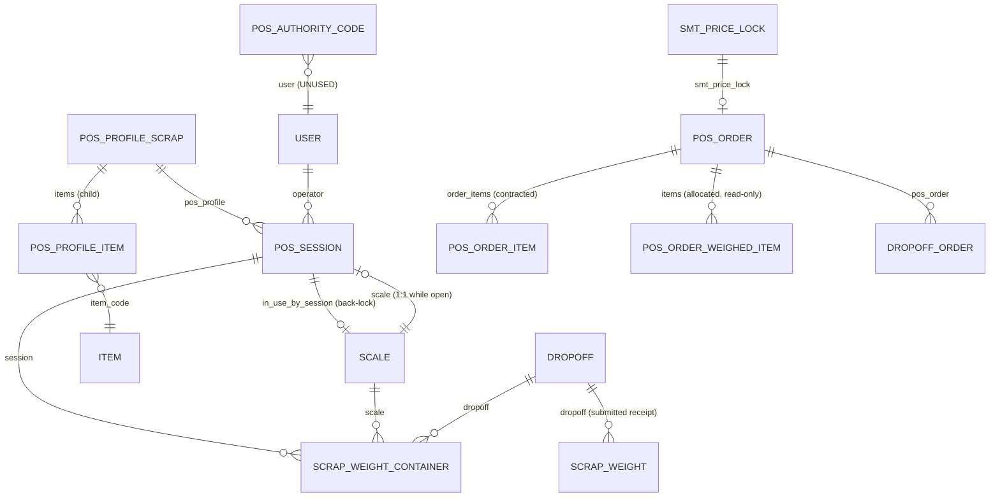
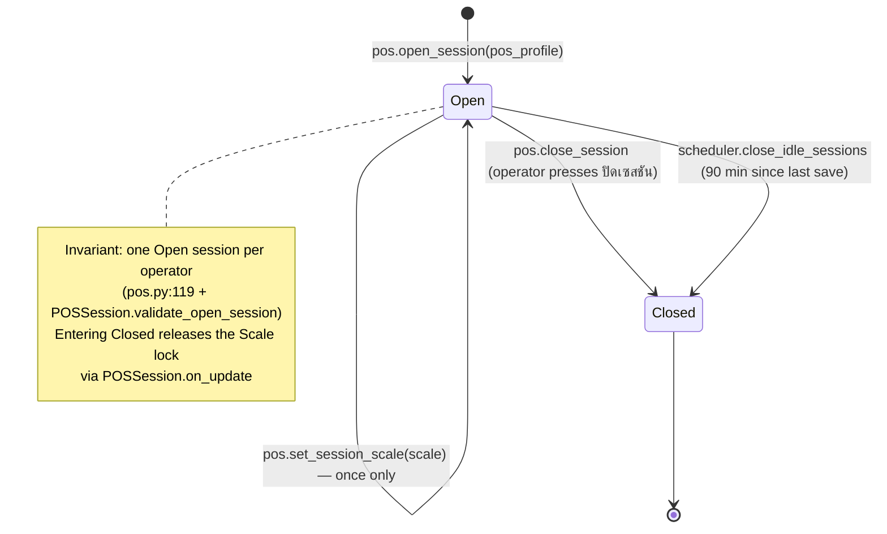
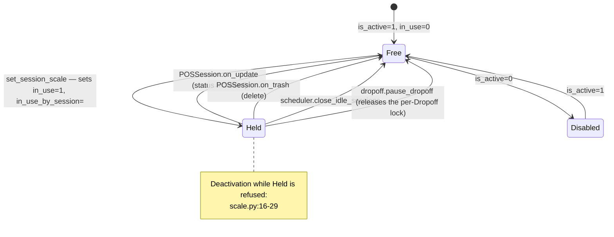
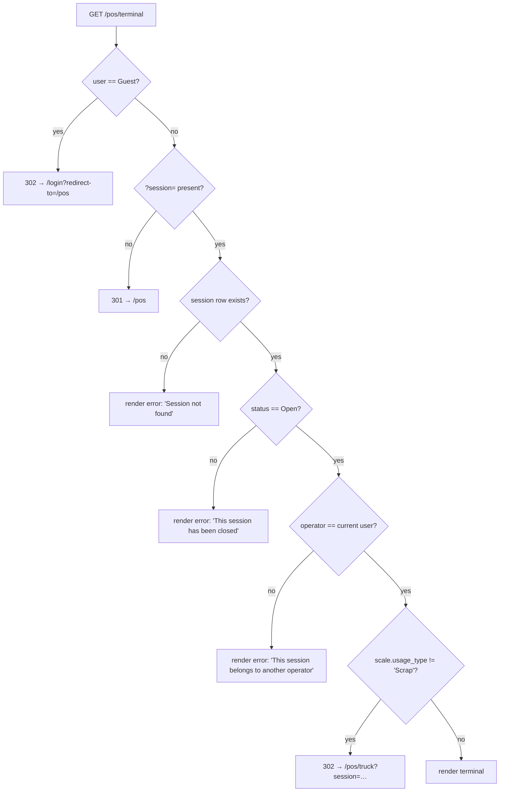

# POS Scrap Terminal — Developer & Admin Reference

> **Status:** Production (with one blocking defect — see [§9.1](#91-blocking-entry_method-scale-is-rejected-by-select-validation))
> **Source:** `www/pos/terminal.html`, `www/pos/terminal.py`, `www/pos/index.html`, `www/pos/index.py`, `www/scale-test/index.html`, `api/v1/pos.py`, `api/v1/auth.py`, `scheduler.py`, `public/js/{pos-core,pos-scanner,scale_reader,pos-resizer,pos-translations}.js`, `public/css/pos.css`, doctypes `POS Session`, `POS Profile Scrap`, `POS Profile Item`, `Scale`, `POS Authority Code`, `POS Order`, `POS Order Item`, `POS Order Weighed Item`
> **Last verified:** 2026-08-21 against `feature/container-redesign` (dev site `metal`)

---

## 1. Purpose & scope

This subsystem owns **the operator's identity on the yard floor and the hardware they hold**:

- **Sessions** — who is working, on which scale, since when (`POS Session`).
- **Profiles** — which item grades appear on the terminal (`POS Profile Scrap` + `POS Profile Item`).
- **Scales** — the device registry, serial parameters, unit conversion, and the exclusive in-use lock (`Scale`).
- **The scrap bench terminal page itself** — the three-pane weighing screen at `/pos/terminal`.
- **The scale diagnostic/calibration page** at `/scale-test`.

**What it does not own.** The terminal page is a *shell*: everything it does with material belongs to the Drop-off subsystem. Every weighing call it makes — `add_container`, `reweigh_container`, `void_container`, `pause_dropoff`, `resume_dropoff`, `reopen_dropoff`, `finish_weighing_session`, `complete_dropoff`, `lookup_dropoff`, `get_dropoff_details`, `list_containers`, `get_container`, `get_weight_photos`, `save_weight_photo` — lives in `api/v1/dropoff.py` and is documented in **[12 — Drop-off & Containers](12-dropoff-receiving.md)**. Only seven of the nineteen `api/v1/pos.py` endpoints are actually reachable from the UI; see [§4](#4-api-surface).

Adjacent references: **[11 — Truck Terminal](11-truck-terminal.md)** (the weighbridge sibling — shares `Scale`, `POS Session`, and `scale_reader.js`), **[40 — Printing](40-printing.md)** (sticker and receipt formats), **[50 — Platform, Roles & Scheduler](50-platform-roles-scheduler.md)** (idle sweep, roles).

> **`POS Order` and its two child tables sit in this scope only for historical reasons.** They are the *commercial* document — the supplier's contracted order — and are now created and maintained by the Settlement subsystem (**[30](30-settlement.md)**). The scrap terminal never reads or writes a POS Order. The `api/v1/pos.py` endpoints that do are all dead; see [§9.2](#92-blocking-dead-truck-weight-endpoints-write-to-orphaned-columns-and-silently-discard-data).

---

## 2. Data model



| DocType | Type | Purpose |
|---|---|---|
| `POS Session` | Normal, `SES-.YY.MM.DD.-` | One operator + one scale + one shift. The unit of attribution and of the scale lock. |
| `POS Profile Scrap` | Normal, `field:profile_name` | Which grades render on the terminal, which price list, sticker-print toggle. |
| `POS Profile Item` | Child of the above | One row per grade button, with `category` and `display_order`. |
| `Scale` | Normal, `field:scale_name` | Device registry: type, usage, capacity, serial params, unit conversion, calibration, in-use lock. |
| `POS Authority Code` | Normal, `field:user` | PIN-based supervisor override. **Dead — zero callers anywhere in the repo.** See [§9.6](#96-pos-authority-code-is-entirely-dead-code). |
| `POS Order` | Normal, `autoname()` in controller | The contracted order (`PDR-…`). Owned by Settlement; the terminal never touches it. |
| `POS Order Item` | Child | Contracted item + weight, with `received_weight` / `item_fulfillment_percent` written back by allocation. |
| `POS Order Weighed Item` | Child, read-only | Allocation results pushed from Drop-off closure. |

### Fields that carry behaviour

| Field | DocType | Type | Why it matters |
|---|---|---|---|
| `status` | `POS Session` | Select `Open` / `Closed` | Only `Open` sessions pass `terminal.py`'s guard (`www/pos/terminal.py:84`) and `add_container`'s guard (`api/v1/dropoff.py:1095`). Setting it to `Closed` fires `on_update` → releases the scale lock. |
| `scale` | `POS Session` | Link → Scale | **Write-once.** `set_session_scale` throws if already set (`api/v1/pos.py:813`). Its `usage_type` decides which terminal you land on. |
| `last_activity` | `POS Session` | Datetime, read-only | Sole input to the 90-minute idle sweep. **Never written by the terminal UI** — only by `dropoff._update_session_activity` on save-type calls (`api/v1/dropoff.py:12`). See [§9.4](#94-no-idle-heartbeat-the-90-minute-sweep-is-driven-by-saves-not-by-presence). |
| `usage_type` | `Scale` | Select `Scrap` / `Truck` / `Production` | `terminal.py:93-98` redirects to `/pos/truck` if the bound scale is not `Scrap`. `get_scales(usage_type='Scrap')` filters the picker. |
| `is_active` | `Scale` | Check | Unchecking is blocked while an open session holds the scale (`scale.py:16-29`). Inactive scales render disabled in the dropdown. |
| `in_use` + `in_use_by_session` | `Scale` | Check + Link | The exclusive lock. Set by `set_session_scale`, cleared by `POSSession.on_update`, `POSSession.on_trash`, and `scheduler.close_idle_sessions`. |
| `max_capacity_kg` | `Scale` | Float | Server-side ceiling in `dropoff.add_container` (`api/v1/dropoff.py:1121-1125`) and `pos.record_truck_weight` (`api/v1/pos.py:546`). Also shipped to the client for pre-checks. |
| `baud_rate`, `data_bits`, `parity`, `stop_bits`, `flow_control` | `Scale` | Select | Fed straight into `SerialPort.open()`. If **any one** is empty, the terminal skips the connect attempt entirely and shows the `no_config` failure state (`terminal.html:2628`). |
| `unit_conversion_factor` | `Scale` | Float, precision 6 | Multiplier applied to every raw reading (`terminal.html:2723`, `2749`). Read as `parseFloat(x) \|\| 1`, so `0` and `null` both behave as `1`. |
| `protocol_detected` | `Scale` | Data, read-only | Informational only — written by `/scale-test`, never used to select a decoder. Decoding is always by frame sniffing. |
| `enable_sticker_print` | `POS Profile Scrap` | Check, default 1 | Exposed to the template as `context.enable_sticker_print` (`terminal.py:112`) but **the template never reads it** — `fireBothPrints` always prints. See [§9.7](#97-enable_sticker_print-is-plumbed-but-never-honoured). |
| `items` | `POS Profile Scrap` | Table | Required. Sorted by `(category or 'zzz', display_order)` server-side (`terminal.py:139`). |

---

## 3. Lifecycle / state machine

### POS Session



| From | To | Trigger | Guard | Source |
|---|---|---|---|---|
| — | `Open` | `open_session(pos_profile)` | Caller has `POS Operator` or `System Manager`; no existing open session for this user | `api/v1/pos.py:117-138` |
| `Open` | `Open` (+scale) | `set_session_scale(session, scale)` | Owner or System Manager; `session.scale` empty; scale exists, `is_active`, not `in_use` | `api/v1/pos.py:802-842` |
| `Open` | `Closed` | `close_session(session)` | `session.operator == frappe.session.user` — **no override path** | `api/v1/pos.py:159-168` → `pos_session.py:39-62` |
| `Open` | `Closed` | `scheduler.close_idle_sessions` (cron `*/15 * * * *`) | `COALESCE(last_activity, opening_time) < now − 90 min` | `scheduler.py:8-51`, `hooks.py:162-164` |
| any | released lock | `POSSession.on_update` | `status == 'Closed'` and `scale` set and the scale still points here | `pos_session.py:64-67`, `101-110` |
| any | released lock | `POSSession.on_trash` | Sweeps **all** scales whose `in_use_by_session` is this session | `pos_session.py:69-99` |

### Scale lock



### Terminal page routing (`www/pos/terminal.py:56-100`)



All five outcomes verified live on `metal` (2026-08-21): no-session → `301 → /pos`; unknown session → *Session not found*; closed session → *This session has been closed*; valid open Scrap session → full three-pane markup.

> Note `terminal.py` returns the error **page**, not an HTTP error code — the response is `200` with a `.pos-error` block. The `<script>` body is wrapped in `` (`terminal.html:822`) because it dereferences `session`; without that guard the error path 500'd.

---

## 4. API surface

`api/v1/pos.py`. Every endpoint calls `check_pos_operator()` first — `POS Operator` **or** `System Manager`, Guest rejected (`api/v1/auth.py:7-18`).

### Live — called by the shipped UI

| Endpoint | Args | Returns | Auth guard | Notes |
|---|---|---|---|---|
| `pos.open_session` | `pos_profile` | `{session, pos_profile, operator, opening_time}` | `check_pos_operator` | Throws if the user already has an open session. `insert(ignore_permissions=True)` is deliberate — a pure POS Operator has no *create* on `POS Session` (`pos.py:135-138`). Called from `www/pos/index.html:243`. |
| `pos.get_active_session` | — | Session dict + flattened scale fields (`scale_name`, `scale_type`, `scale_usage_type`, `scale_location`, `scale_max_capacity_kg`, `baud_rate`, `data_bits`, `parity`, `stop_bits`, `flow_control`, `protocol_detected`, `unit_conversion_factor`, `signal_unit`), or `None` | `check_pos_operator` | The terminal's bootstrap call (`terminal.html:2366`). Absent `scale` ⇒ show the mandatory scale modal. |
| `pos.set_session_scale` | `session`, `scale` | `{session, scale, scale_name, scale_type, usage_type, location}` | `check_pos_operator` + owner-or-System-Manager | **Write-once per session.** Also flips `Scale.in_use`. Called from three paths in `terminal.html` (2805 connect, 2934 manual-mode, 2966 manual-after-failure) and three in `truck.html`. |
| `pos.get_scales` | `usage_type=None`, `scale_type=None` | list of scale dicts incl. lock state and serial params | `check_pos_operator` | Terminal calls it with `usage_type='Scrap'` (`terminal.html:2406`). Returns inactive and in-use scales too — the client greys them out rather than hiding them. |
| `pos.get_scale_by_id` | `scale_id` | `{scale: {...}}` or `{error: "..."}` | `check_pos_operator` | QR path. Strips a `/scale/<name>` URL prefix, then `.strip().upper()`. **Returns an error dict, never throws** — callers must check `.error`. |
| `pos.get_session_summary` | `session` | `{session: {...}, totals: {weight_count, total_weight}}` | `check_pos_operator` | Drives both the Summary modal and the Close-Session modal (`terminal.html:2267`, `2301`). **Counts are wrong** — see [§9.3](#93-session-summary-always-reports-zero). |
| `pos.close_session` | `session` | `{total_purchases, total_amount, total_weight}` | `check_pos_operator` + **owner only** | Delegates to `POSSession.close_session()`, which totals `Scrap Purchase` rows — a doctype nothing writes any more, so all three numbers are always `0`. No supervisor override exists despite `POS Authority Code.can_close_any_session`. |

### Reachable but unused

| Endpoint | Args | Returns | Auth guard | Notes |
|---|---|---|---|---|
| `pos.update_session_activity` | `session` | `{success, last_activity}` or `{success: False, message}` | `check_pos_operator` + owner | Works correctly. **No UI calls it** — only `api_test/test_full_workflow.py:430,1126`. See [§9.4](#94-no-idle-heartbeat-the-90-minute-sweep-is-driven-by-saves-not-by-presence). |
| `pos.get_pos_profile` | `profile_name` | `{profile_name, warehouse, items[]}` | `check_pos_operator` | Zero callers. The terminal gets its items server-side from `terminal.py:118-139`. |

### Dead — kept only as surface area

All of the following have **zero callers in the repository**, including tests. They read and write `POS Order` and `Scrap Weight` fields that the container redesign deleted from the doctypes but that MariaDB still carries as orphaned columns. **Reads return stale values; writes are silently discarded** (see [§9.2](#92-blocking-dead-truck-weight-endpoints-write-to-orphaned-columns-and-silently-discard-data)).

| Endpoint | Broken because | Source |
|---|---|---|
| `pos.create_scrap_weight` | **Deliberately stubbed.** Always `frappe.throw`s, naming `dropoff.finish_weighing_session` as the replacement. Verified live: raises `ValidationError` with that message. | `pos.py:405-434` |
| `pos.lookup_order` | Queries `POS Order.order_id` / `.license_plate` — neither is in the meta. | `pos.py:206-287` |
| `pos.get_order_details` | Returns 14 keys sourced from orphaned columns. | `pos.py:290-369` |
| `pos.load_scrap_weight` | Reads `sw.pos_order` / `sw.is_reweight` — gone from `Scrap Weight`. | `pos.py:372-402` |
| `pos.get_session_weights` | Filters `Scrap Weight` on `session`, selects `supplier`, `pos_order`, `posting_time`. | `pos.py:437-469` |
| `pos.record_truck_weight` | Assigns `gross_weight` / `tare_weight` / `net_truck_weight`; `save()` drops them. | `pos.py:505-597` |
| `pos.save_truck_remarks` | `hasattr(order, 'truck_weight_remarks')` is `True` (orphan column loads), so the guard passes and the write vanishes. Returns `{success: True}` regardless. | `pos.py:600-625` |
| `pos.update_total_scrap_weight` | Sums `Scrap Weight.pos_order` (orphan) into `POS Order.total_scrap_weight` (orphan). | `pos.py:628-664` |
| `pos.mark_reweighed` | Sets `is_truck_reweighed` / `is_scrap_reweighed` — orphans. | `pos.py:667-697` |
| `pos.get_weight_verification` | Reads 16 orphan columns; hardcodes a 2 % variance threshold that nothing else in the app uses. | `pos.py:854-906` |

### What the terminal actually calls

Counted from `www/pos/terminal.html` — 23 call sites, 17 of them into the Drop-off module:

```
pos.set_session_scale        ×3     dropoff.lookup_dropoff          ×3
pos.get_session_summary      ×2     dropoff.get_container           ×3
pos.get_scales               ×1     dropoff.list_containers         ×2
pos.get_scale_by_id          ×1     dropoff.get_dropoff_details     ×2
pos.get_active_session       ×1     dropoff.save_weight_photo       ×2
pos.close_session            ×1     dropoff.add_container           ×1
                                    dropoff.reweigh_container       ×1
frappe.upload_file           ×1     dropoff.void_container          ×1
                                    dropoff.pause_dropoff           ×1
                                    dropoff.resume_dropoff          ×1
                                    dropoff.reopen_dropoff          ×1
                                    dropoff.finish_weighing_session ×1
                                    dropoff.complete_dropoff        ×1
                                    dropoff.record_scrap_weight     ×1  (legacy branch, unreachable)
                                    dropoff.load_scrap_weight       ×1
                                    dropoff.get_latest_scrap_weight ×1
                                    dropoff.get_weight_photos       ×1
```

---

## 5. UI surface

### Pages

| Route | Files | Notes |
|---|---|---|
| `/pos` | `www/pos/index.html`, `index.py` | Launcher. Own role check (`has_pos_access`: `POS Operator` \| `POS Manager` \| `System Manager`, `index.py:31-34`) — note `POS Manager` is accepted here but **not** by `check_pos_operator`, so a pure POS Manager sees the launcher and then gets *Access denied* from every API call. Three cards; the Scrap and Truck cards both call `open_session` and differ only in redirect target. |
| `/pos/terminal?session=…` | `www/pos/terminal.html` (3982 lines), `terminal.py` | The subject of this document. |
| `/pos/truck?session=…` | `www/pos/truck.html`, `truck.py` | Sibling. See [11](11-truck-terminal.md). |
| `/scale-test` | `www/scale-test/index.html` (1072 lines), `index.py` (14 lines) | Calibration wizard. `get_context` does **no** auth check; verified live that a Guest gets `200` and full markup. Data operations use `frappe.client.get_list` / `frappe.client.set_value`, which enforce permissions server-side, so a Guest sees an empty scale list and cannot save. Still worth a `login_required` guard. |

### Asset loading and cache busting

`terminal.html:5-14` hand-links six scripts plus two stylesheets with `?v={{ asset_v }}`. `terminal.py:24-53` computes `asset_v` as the newest `mtime` across `_LINKED_ASSETS` — deliberately *not* `get_build_version()`, because `public/` is symlinked into `sites/assets` and editing `pos.css` would not move `assets.json`. **If you add a `<script>`/`<link>` to `terminal.html`, add its path to `_LINKED_ASSETS` too**, or that file will be served stale for up to 12 hours (`Cache-Control: max-age=43200`).

### Three-pane layout (`public/css/pos.css`)

| Element | Selector | Width | Source |
|---|---|---|---|
| Body | `.terminal-body` | `display:flex` | `pos.css:244` |
| LEFT — items | `.panel-items` | `flex: 1` (absorbs all resizes) | `pos.css:256` |
| Divider 1 | `#panelResizer` | `6px`, `cursor: col-resize` | `pos.css:360` |
| MIDDLE — work pane | `.panel-transaction` | `460px` default | `pos.css:262` |
| Divider 2 | `#panelResizerJournal` | `6px` | — |
| RIGHT — journal | `.panel-journal` | `380px` default | `pos.css:273` |

`@media (max-width: 1280px)` hides `.panel-journal` **and** `#panelResizerJournal` (`pos.css:352-357`). `@media (max-width: 768px)` switches `.terminal-body` to `flex-direction: column`, caps `.panel-items` at `50vh`, and hides both resizers (`pos.css:401-403`, `2047-2060`). Item grid is `repeat(auto-fill, minmax(140px, 1fr))`, dropping to 3 fixed columns on mobile.

`POS_RESIZER.init()` is called twice (`terminal.html:879-888`) with `localStorage` keys `sms.pos.terminal.rightPaneWidth` and `sms.pos.terminal.journalPaneWidth`. Clamp is `[min(320, 50vw), 50vw]`; double-click clears the inline width and the stored key (`pos-resizer.js:8-12`, `80-83`).

### Element IDs worth knowing

| ID | Pane | Role |
|---|---|---|
| `#posTerminal` | root | Theme class target (`light-theme`) |
| `#scaleBadgeContainer`, `#scaleBadge`, `#scaleStatusIndicator`, `#scaleMenu` | header | Scale status + connect/disconnect menu |
| `#dropoffSearch`, `#dropoffResults` | middle | Debounced (300 ms) drop-off / container search |
| `#dropoffDetailsCard`, `#dropoffCardStatus`, `#truckWeightRow`, `#dropoffItemsList` | middle | Drop-off summary card |
| `#containerPanel` | middle | Wrapper, hidden until a drop-off is loaded |
| `#containerWeighCard` | middle | **The `use_container_model` sentinel** — `CONTAINER_UI.isEnabled()` is `!!document.getElementById('containerWeighCard')` |
| `#activeGradeEmpty`, `#activeGradePill`, `#activeGradeText` | middle | Active-grade display |
| `#weighLiveValue`, `#weighLiveStable`, `#weighScaleDisconnected` | middle | Live scale stream |
| `#containerNetWeight`, `#containerType`, `#containerRemarks` | middle | Save payload inputs |
| `#btnSaveActiveContainer`, `#btnContainerTakePhoto`, `#containerPhotoCountPill` | middle | Primary actions |
| `#btnPauseDropoff`, `#btnResumeDropoff`, `#btnCompleteContainerDropoff`, `#btnReopenDropoff` | middle | Action bar (visibility driven by `refreshActionBar()`) |
| `#dropoffCompletedBanner` | middle | Replaces the weigh card when the drop-off is closed |
| `#panelJournal`, `#containerList`, `#containerCountBadge`, `#containerTotalWeight`, `#containerEmptyState` | right | Journal |
| `#scaleModal`, `#scaleDropdown`, `#confirmScaleBtn`, `#manualModeBtn` | modal | Mandatory scale picker (no close button; click-outside suppressed at `terminal.html:2351`) |
| `#scaleConnectionModal`, `#scaleConnecting`, `#scaleConnectSuccess`, `#scaleConnectFail` | modal | Connection state machine |
| `#scaleScannnerModal` | modal | Scale QR scanner — **note the triple `n`**, consistent across all three references (`terminal.html:668`, `2512`, `2605`), so it works; do not "fix" one site in isolation |
| `#reweighContainerModal`, `#voidContainerModal`, `#pauseDropoffModal` | modal | Row actions |
| `#photoModal`, `#cameraVideo`, `#photoThumbnails` | modal | Capture with optical/digital zoom + tilt |

### JS modules

| Module | Global | Exposed on `window`? | Responsibility |
|---|---|---|---|
| `pos-translations.js` | `POS_I18N` | yes | EN/TH dictionary, `t()`, `setLanguage`, `extend()`. `localStorage['posLanguage']`. |
| `container-translations.js` | — | — | `POS_I18N.extend()` with container-specific keys. Loaded globally via `web_include_js` (`hooks.py:38-41`). |
| `pos-core.js` | `POS_CORE` | yes | `init/t/toggleLanguage/applyLanguage/toggleTheme/applyTheme/startClock/callAPI/playBeep`. `callAPI` is a bare `fetch` POST to `/api/method/<dotted>` with `X-Frappe-CSRF-Token`, throwing on `data.exc`. |
| `pos-scanner.js` | `POS_SCANNER` | **no** — top-level `const` | `open/close/submitManual/parseQRValue/detectDoctype`. In Playwright use `typeof POS_SCANNER`, not `window.POS_SCANNER`. |
| `scale_reader.js` | `ScaleReader` (class) | yes | WebSerial. See [§5.1](#51-scale-hardware). |
| `pos-resizer.js` | `POS_RESIZER` | yes | Drag-to-resize, persisted per key. |
| `html5-qrcode.min.js` | `Html5Qrcode` | yes | Camera QR decoding. |
| *(inline in `terminal.html`)* | `CONTAINER_UI` | **yes** (`window.CONTAINER_UI = …`) | The whole weighing flow, `terminal.html:3040-3956`. |

### 5.1 Scale hardware

**Transport.** WebSerial only — Chrome/Edge/Opera. `navigator.serial.requestPort()` requires a user gesture and shows the OS port chooser *every time*, including on reconnect; there is no silent re-open path even though `navigator.serial.getPorts()` is wrapped as `ScaleReader.getPorts()` (unused).

**Connect strategy** (`connectWithConfig`, `scale_reader.js:95-157`): open with the `Scale` doctype's saved params → `testRead(5000)` → on success bind; on failure close and fall through to `_autoDetectWithPort`.

**Auto-detect ladder** (`scale_reader.js:163-181`, duplicated verbatim in `autoDetect` at `271-286`) — tried in order, 500 ms settle + up to 5 s read each, worst case ~40 s:

| # | Baud | Framing | Typical device |
|---|---|---|---|
| 1 | 4800 | 8N1 | HP-05 variant, small bench scales |
| 2 | 2400 | 7E1 | truck scale / STX-M |
| 3 | 1200 | 7E1 | STX |
| 4 | 2400 | 8N1 | truck scale, alternate framing |
| 5 | 1200 | 8N1 | — |
| 6 | 9600 | 8N1 | — |
| 7 | 9600 | 7E1 | — |

`bufferSize: 255` and `flowControl: 'none'` on every attempt.

**Protocol decoding** is by frame sniffing, tried in this order on every byte (`tryDecodeAny`, `scale_reader.js:434-452`). `Scale.protocol_detected` is *never* consulted.

| Protocol | Header | Terminator | Weight extraction | Stable when | Source |
|---|---|---|---|---|---|
| `STX-M` | `0x02 0x4D` | `CR LF` | first `/(\d+\.?\d*)/` in the payload | `frame[2] == '0'` | `scale_reader.js:459-522` |
| `STX` | `0x02 0x28` | `CR LF`, ≥18 B | ASCII digits `frame[3..10]`, **divided by 1000** (grams → kg) | `frame[2] == '0'` | `scale_reader.js:528-583` |
| `HP-05-VAR` | `0x82 0x28`, `0x82 0xAA`, `0x02 0x28`, `0x02 0x2A` | `0x0D` or `0x8D` + 1 byte | high-bit ASCII (`byte & 0x7F`), decimal from `.`/`0xAE` | `frame[2] == 0x30` | `scale_reader.js:613-697` |
| `HP-05` | `0x82 0x28` | fixed 17 B | digits `frame[3..8]`, decimal shift from `frame[9]`, unit from `frame[10]`, XOR checksum vs `frame[16]` | `status & 0x01` | `scale_reader.js:824-895` |

> Three different stability conventions coexist (`'0'`, `0x30` — the same byte written differently — and a bitmask). Only `HP-05` validates a checksum; the other three accept any well-framed payload, so line noise that happens to frame correctly is reported as a weight.

**Unit conversion.** Decoders return the raw number except `STX`, which bakes in a `/1000`. The `Scale.unit_conversion_factor` multiply happens **client-side, in the page, not in `scale_reader.js`** — twice: once for the connection-test reading (`terminal.html:2723`) and once per streamed sample (`terminal.html:2749`). Both use `parseFloat(x) || 1`.

**Buffer handling** (`startReading`, `scale_reader.js:738-790`): a fixed `Uint8Array(255)`; `tryDecodeAny` runs after **every single byte**; on a successful decode `bufferIndex` resets to 0; a sliding window drops the oldest 100 bytes past index 200. Per-byte re-scan is O(n²) but the data rate is a few frames/second.

**Disconnect.** A `disconnect` listener on the port (`_setupDisconnectListener`) fires on USB unplug → `state.isScaleConnected = false`, `state.scaleReader = null`, orange toast, badge goes red (`terminal.html:2992-3006`). Weighing continues in manual mode. `disconnect(forgetPort=true)` also calls `port.forget()` — used by nothing in the terminal.

**The in-use lock is a database lock, not a hardware lock.** It stops two *sessions* claiming the same `Scale` row. It does not stop a second browser tab grabbing the same serial port — WebSerial enforces that itself, which is why `/scale-test` cannot open a port an active terminal holds.

---

## 6. Business rules & validations

- **One open session per operator.** Enforced twice: pre-check in `open_session` (`api/v1/pos.py:119-127`) and `POSSession.validate_open_session` (`pos_session.py:18-37`). The controller check short-circuits for already-open, non-new docs (`pos_session.py:20-21`) so ordinary saves of an open session don't re-run it.

- **A session's scale is write-once.** `set_session_scale` throws *"Scale already set for this session…"* if `session_doc.scale` is truthy (`api/v1/pos.py:813-814`). Deliberate: every container records the scale it was weighed on, so mid-session swaps would silently break attribution. Cost: picking the wrong scale means closing and reopening the session.

- **A scale can be held by one session at a time.** `set_session_scale` refuses when `in_use and in_use_by_session` (`api/v1/pos.py:831-832`). Released on close, trash, idle-sweep, and pause.

- **A scale cannot be deactivated while held.** `Scale.before_save` throws if `is_active` was just cleared and any `Open` session references it (`scale.py:16-29`).

- **Scale name is normalised to uppercase** on every save (`scale.py:11-12`). `get_scale_by_id` `.upper()`s the scanned value to match (`api/v1/pos.py:757`).

- **Terminal type follows the scale, not the operator's choice.** A session bound to a non-`Scrap` scale is redirected to `/pos/truck` on every request (`www/pos/terminal.py:93-98`). The `/pos` launcher does not know this, so its Scrap card can land you on the truck screen.

- **You may only close your own session.** `close_session` throws for any other user, including System Manager (`api/v1/pos.py:163-166`). The inline comment says an authority check could be added later; `POS Authority Code.can_close_any_session` exists for exactly this and is unused.

- **Heartbeat is owner-only and open-only.** `update_session_activity` returns `{success: False}` for a closed session and throws for a foreign one (`api/v1/pos.py:192-196`). Writes with `update_modified=False` so the heartbeat doesn't churn `modified`.

- **Weight ceiling is server-side.** `add_container` rejects `net_weight > Scale.max_capacity_kg` (`api/v1/dropoff.py:1121-1125`); `record_truck_weight` does the same (`api/v1/pos.py:546-548`). The client is given `max_capacity_kg` for a pre-check but is not trusted.

- **Remarks are sanitised and capped.** `sanitize_html(...)[:1000]` in `add_container` (`api/v1/dropoff.py:1127-1129`); `record_truck_weight` sanitises and throws past 1000 chars (`api/v1/pos.py:566-572`).

- **Profile items must be unique and get an implicit order.** `POSProfileScrap.validate` rejects duplicate `item_code` and back-fills `display_order` as `idx+1` (`pos_profile_scrap.py:13-22`). Rendering sorts by `(category or 'zzz', display_order)`, so uncategorised grades land last (`www/pos/terminal.py:139`).

- **Item names are rendered verbatim, never translated.** `terminal.html:3175` (`renderContainerList`) and `3341` (`setActiveGrade`) both carry explicit `NOTE: item_name is canonical` comments. Item names are canonical Thai (`ทองแดงปอก`) and are identifiers, not labels. See [BILINGUAL_GUIDE.md](../../BILINGUAL_GUIDE.md).

- **The save button needs three things.** `refreshSaveButton` enables `#btnSaveActiveContainer` only when an active grade, a loaded drop-off, and a numeric `net_weight > 0` are all present (`terminal.html:3318-3333`). The photo button needs only grade + drop-off.

- **Manual typing wins over the scale stream.** `onWeightInput` sets `manualWeightOverride = true` and `weightFromScale = false`; `onLiveWeight` then stops overwriting the input (`terminal.html:3371-3398`). Both flags reset in `resetWeighCard` after a successful save.

- **A closed drop-off hides the weigh card.** `refreshActionBar` sets `weighCard.style.display = 'none'` and shows `#dropoffCompletedBanner` for `Completed` / `Cancelled` / `Verified` / `Needs Review`, leaving only Reopen (`terminal.html:3090-3131`).

- **Complete is two calls, not one.** `finish_weighing_session` (issue/amend the `Scrap Weight`, print the thermal) then `complete_dropoff`, then `window.clearDropoff()` to reset the workspace for the next truck (`terminal.html:3802-3853`).

- **Reopen requires a non-empty reason** collected via `window.prompt`; a blank or cancelled prompt aborts client-side (`terminal.html:3775-3780`). Reweigh and Void likewise require a reason before firing (`terminal.html:3645`, `3690`).

---

## 7. Permissions

### Role → DocType matrix (from the doctype JSONs)

| DocType | System Manager | POS Operator | Production Worker | SMT Accountant / Accounting Manager |
|---|---|---|---|---|
| `POS Session` | full | create, read, write, print, email (**no delete, no export**) | — | read, report, export, print, email |
| `POS Profile Scrap` | full | **read only** | — | — |
| `Scale` | full | read, write | read, write | read, report, export, print, email |
| `POS Order` | full | read, write, print, report | — | read, report, export, print, email |
| `POS Authority Code` | full | — | — | — |

### API-layer guard

`check_pos_operator()` (`api/v1/auth.py:7-18`) admits `POS Operator` and `System Manager` only. It is the *only* authorisation in `api/v1/pos.py` — ownership checks are per-endpoint and inconsistent:

| Endpoint | Ownership check |
|---|---|
| `close_session` | owner **only** — System Manager is refused |
| `set_session_scale` | owner **or** System Manager |
| `get_session_weights` | owner **or** System Manager |
| `update_session_activity` | owner only |
| `get_session_summary` | **none** — any POS Operator can read any session's totals |
| `get_scales`, `get_scale_by_id`, `get_pos_profile` | none (read-only reference data) |

### The `POS Manager` gap

`www/pos/index.py:31-34` admits `POS Manager`, but `check_pos_operator` does not. A user holding only `POS Manager`:

1. loads `/pos` successfully,
2. clicks a terminal card,
3. gets `PermissionError: Access denied. POS Operator role required.` from `open_session`.

Either add `POS Manager` to `check_pos_operator` or drop it from `has_pos_access`. The role exists on the dev site.

### `ignore_permissions` usage

`open_session` inserts with `ignore_permissions=True` (`api/v1/pos.py:138`). **This is correct**, not a bug: `check_pos_operator()` has already authorised the caller, and a pure POS Operator has no *create* permission on `POS Session` — a plain `insert()` would fail for exactly the role the endpoint serves. The two-layer pattern (API guard authorises, `ignore_permissions` bypasses the redundant DocType check) is used throughout this app.

---

## 8. Configuration

| Setting | Where | Default | Effect |
|---|---|---|---|
| `profile_name` | `POS Profile Scrap` | — | Document name; shown in the terminal header |
| `is_active` | `POS Profile Scrap` | `1` | ⚠️ **Not filtered anywhere** — `index.py:48-54` lists every profile regardless |
| `price_list` | `POS Profile Scrap` | — | Required by validation; the scrap terminal never reads it (no prices on this screen) |
| `warehouse` | `POS Profile Scrap` | — | Returned by `get_pos_profile`, which nothing calls |
| `show_price` | `POS Profile Scrap` | `1` | ⚠️ **Not read anywhere** in `www/pos/*` |
| `items` | `POS Profile Scrap` | — | **Required.** The grade buttons |
| `enable_sticker_print` | `POS Profile Scrap` | `1` | ⚠️ Plumbed to the template, never read — see [§9.7](#97-enable_sticker_print-is-plumbed-but-never-honoured) |
| `sticker_printer_name` | `POS Profile Scrap` | — | ⚠️ Never read; printing goes through the browser's print dialog |
| `usage_type` | `Scale` | — | **Required.** `Scrap` for this terminal |
| `is_active` | `Scale` | `1` | Inactive scales render disabled |
| `max_capacity_kg` | `Scale` | — | Server-side weight ceiling |
| `baud_rate` / `data_bits` / `parity` / `stop_bits` / `flow_control` | `Scale` | empty / `none` | Serial params. **All four of the first must be set** or connection is skipped |
| `unit_conversion_factor` | `Scale` | `1` | Raw → kg multiplier. `0` behaves as `1` |
| `signal_unit` | `Scale` | — | Documentation only |
| `protocol_detected` | `Scale` | — | Written by `/scale-test`; never read by the decoder |

**Hooks** (`hooks.py`)

| Hook | Value | Effect |
|---|---|---|
| `web_include_css` | includes `css/pos.css` (line 36) | Loaded on **every** web page, not just POS |
| `web_include_js` | `js/pos-translations.js`, `js/container-translations.js` (38-41) | Same — global |
| `scheduler_events.cron["*/15 * * * *"]` | `scrap_metal_suite.scheduler.close_idle_sessions` (162-164) | 90-minute idle sweep |
| `fixtures` | `{"dt": "Scale"}` (261-263) | **Unfiltered** — `bench export-fixtures` exports every `Scale` row on the site, test scales included |

`terminal.html` and `truck.html` also hand-link `css/pos.css`, `css/pos-fullscreen.css`, and six JS files with `?v={{ asset_v }}` — `pos.css` and `pos-translations.js` therefore load twice on POS pages.

**Fixtures on the dev site (2026-08-21):** 12 `Scale` rows — `SCALE-001/002` (Scrap, 5000 kg), `SCALE-003` (Scrap, inactive), `TRUCK-001/002` (Truck, 60000 kg), `Prod-1/2` (Production), and five `_TEST_*` scales. 4 `POS Profile Scrap` rows, all `_TEST_*` or `TEST_POS_PROFILE`. **No production-shaped profile exists on this site.**

---

## 9. Known issues & gotchas

### 9.1 BLOCKING: `entry_method: 'Scale'` is rejected by Select validation

**Every save whose weight came from the live scale stream fails.**

`terminal.html:3547` sends:

```js
entry_method: containerState.weightFromScale ? 'Scale' : 'Manual Entry',
```

`Scrap Weight Container.entry_method` options are `Scale (Auto)` and `Manual Entry`. `'Scale'` is not among them, and Frappe's `_validate_selects` rejects it on insert.

Reproduced end-to-end against a seeded drop-off on `metal` (2026-08-21):

```
--- add_container with entry_method='Scale' (what terminal.html:3547 sends) ---
  THROWS: ValidationError |  Entry Method cannot be "Scale".
          It should be one of "Scale (Auto)", "Manual Entry"

--- add_container with entry_method='Manual Entry' (control) ---
  OK -> {'success': True, 'container': 'CTN-2608-00000', 'net_weight': 246.7}
```

The operator sees a red `frappe.msgprint` and no container is created. **Fix:** change `'Scale'` to `'Scale (Auto)'`. `truck.html:1571,2948` and `terminal.html:2130` already use the correct literal — only the container path regressed.

**Why no test caught it.** `ui_test/test_pos_terminal.py:117-120` fills `#containerNetWeight` and calls `onWeightInput()`, which sets `weightFromScale = false`. Every automated path takes the manual branch. The three Playwright suites (6/6 green, 24.8 s) and the API suites never exercise the scale branch, because none of them can produce a live serial reading.

**Interim workaround for operators:** after the scale auto-fills the box, click into it and retype the value — that flips `weightFromScale` to `false` and the save succeeds. Documented in the [operator guide §6](../user/10-pos-scrap-terminal.md#6-what-can-go-wrong--ปัญหาที่พบบ่อย).

### 9.2 BLOCKING: dead truck-weight endpoints write to orphaned columns and silently discard data

`POS Order` and `Scrap Weight` both carry columns that the container redesign removed from the doctype JSON. MariaDB kept the columns. Frappe's `Document.load_from_db` does `SELECT *`, so those values **load onto the document object** — but `get_valid_dict()` filters by meta, so `save()` **never writes them back**.

Verified on `metal` (2026-08-21):

```
doc has gross_weight attr? True  0.0
valid_dict keys incl gross_weight? False
d.gross_weight = 12345.0; d.save(); commit
AFTER SAVE db gross_weight = ((0.0,),)     ← write vanished
```

| Table | Orphaned columns |
|---|---|
| `tabPOS Order` | `order_id`, `gross_weight`, `gross_weight_time`, `gross_weight_scale`, `tare_weight`, `tare_weight_time`, `tare_weight_scale`, `net_truck_weight`, `total_scrap_weight`, `weight_variance`, `weight_variance_percent`, `is_truck_reweighed`, `is_scrap_reweighed`, `truck_weight_remarks`, `truck_weight_photo`, `scale`, `scrap_scale`, `dropoff_date`, `dropoff_status`, `variance_threshold_percent` |
| `tabScrap Weight` | `pos_order`, `supplier`, `posting_time`, `license_plate`, `session`, `operator`, `pos_profile`, `is_reweight`, `scale`, `reweight_reason`, `reweight_at`, `reweight_by`, `entry_method` |

There are **no** Custom Fields on either doctype (confirmed: `frappe.get_all("Custom Field", {"dt": …})` returns `[]` for both), so this is pure schema drift.

**Consequences.** `record_truck_weight`, `save_truck_remarks`, `update_total_scrap_weight`, and `mark_reweighed` all return success payloads built from in-memory values while persisting nothing. `save_truck_remarks`'s `hasattr` guard (`pos.py:616`) is useless — the orphan column makes it `True`. `frappe.get_all` with orphan field names does **not** raise (the columns exist), so failures are entirely silent.

**They are harmless today** only because nothing calls them. **Fix:** delete the ten dead endpoints, then drop the orphaned columns in a patch. Until then, treat any of them as a live data-loss trap for external integrations.

### 9.3 Session summary always reports zero

`get_session_summary` sums `tabScrap Weight WHERE session = %s` (`api/v1/pos.py:484-490`). `Scrap Weight.session` is an orphaned column that nothing has written since Wave 10 — the receipt is now per-Dropoff and carries no session. So the Summary modal and the close-session confirmation both show `0` weighings and `0.00 Kg` for every session.

`close_session` is worse: `POSSession.close_session()` totals `Scrap Purchase` (`pos_session.py:45-49`), a doctype from the original POS design that no current code path writes. `total_purchases`, `total_amount`, and `total_weight` are therefore always `0` on every closed session.

**Fix:** count `Scrap Weight Container` by `session` instead — that field is live and indexed.

### 9.4 No idle heartbeat: the 90-minute sweep is driven by saves, not by presence

`scheduler.close_idle_sessions` closes any `Open` session where `COALESCE(last_activity, opening_time) < now − 90 min` (`scheduler.py:14-21`). `pos.update_session_activity` exists and works — **but no page calls it.** Confirmed: `grep 'update_session_activity\|last_activity\|setInterval'` across `www/pos/*.html` returns nothing; the only callers are `api_test/test_full_workflow.py:430,1126`.

`last_activity` *is* bumped, but only server-side as a side effect of `dropoff._update_session_activity` (`api/v1/dropoff.py:12-15`), called from `record_scrap_weight` (:356), another weighing path (:643), and `add_container` (:1100).

Net effect: **the clock measures time since the last container was saved, not time since the operator last touched the screen.** A terminal open and idle for 91 minutes — waiting for a truck, on a long break — is force-closed, dropping the scale lock and requiring a fresh session.

Dev-site evidence: `last_activity` is set on 4 of 32 `POS Session` rows, and all four are from the API test.

**Fix:** either add a `setInterval` heartbeat in `terminal.html` and `truck.html`, or accept save-driven timing and document it. Don't leave a working endpoint with no caller.

### 9.5 `use_container_model` is not a real feature flag

`terminal.py:111` reads `bool(getattr(profile, "use_container_model", True))`. There is **no such field** on `POS Profile Scrap` — not in the JSON, not in `frappe.get_meta`, not as a Custom Field, not even as an orphaned column. `getattr` therefore always returns the `True` default.

Every `` branch in `terminal.html` (the cart, totals, and Record Weight sections, lines 296-337) is **unreachable dead template code**. Confirmed live: the rendered page contains zero occurrences of `class="cart-section"`, `class="totals-section"`, or `id="recordWeightBtn"`.

The associated JS (`addToCart`, `renderCart`, `recordWeight`, `showConfirmModal`, ~600 lines) is likewise dead, though defensively guarded — `renderCart` and `updateButtonStates` null-check their DOM nodes and return cleanly (`terminal.html:1609`, `1668-1673`).

**Fix:** either add the field for real or delete both branches. A flag that reads a field that does not exist is worse than no flag.

### 9.6 `POS Authority Code` is entirely dead code

Zero references outside its own doctype folder. `verify_pin` is never called; `can_override_rate`, `can_void_purchase`, and `can_close_any_session` gate nothing.

Beyond being dead, `verify_pin` (`pos_authority_code.py:37-63`) has two flaws worth knowing before anyone revives it: it loads **every** authority row and decrypts each PIN in a Python loop until one matches — O(n) decryptions per attempt, and the comparison is a plain `==` (not constant-time), so it leaks timing. There is no rate limiting or lockout.

**Fix:** delete it, or reimplement properly (index by user, `frappe.utils.password.check_password`, attempt throttling).

### 9.7 `enable_sticker_print` is plumbed but never honoured

`terminal.py:112` sets `context.enable_sticker_print`. `terminal.html` never reads it. `fireBothPrints` unconditionally prints the sticker on every `add_container` and `reweigh_container` success (`terminal.html:3079-3084`). Unchecking the box on the profile changes nothing.

`sticker_printer_name` is likewise never read — output goes through the browser print dialog, so routing is an OS/browser concern.

### 9.8 `refreshActionBar` tests statuses that `Dropoff.status` cannot hold

`terminal.html:3109-3112` treats `'Verified'` and `'Needs Review'` as closed statuses. `Dropoff.status` options are `Draft / Scheduled / In Progress / Paused / Completed / Cancelled` (verified via `get_meta`). Those two values live on `Dropoff.verification_status`, a separate `Data` field. Two branch conditions are unreachable. Harmless, but misleading to anyone reading the state machine from this code.

### 9.9 `expected_items` is always an empty Set

`terminal.html:3270` reads `(det.expected_items || []).map(e => e.item)`. `get_dropoff_details` renames that key before returning: `item["item_code"] = item.pop("item", "")` (`api/v1/dropoff.py:228`). So `e.item` is `undefined`, `.filter(Boolean)` drops everything, and `containerState.dropoff.expected_items` is always empty.

Currently harmless — grade-mix deviation moved to the Dropoff level in Wave 9 and nothing reads the Set. It will bite whoever next tries to use it. Fix the key to `e.item_code`, or delete the block.

### 9.10 Stale "Previous weighing loaded" banner under the container model

`fetchDropoffDetails` still calls `loadExistingScrapWeight` when the drop-off already has a `Scrap Weight` (`terminal.html:1281-1288`). That loads items into `state.cart` (invisible — no cart DOM), shows a yellow "Previous weighing loaded" toast, and reveals `#reweightBanner`. Under the container model this is pure noise: nothing about the reweight path applies. The operator sees a warning about a flow that no longer exists.

### 9.11 `/scale-test` is unauthenticated at the page level

`www/scale-test/index.py` has no login or role check. Verified: a Guest gets HTTP `200` and the full page. Data access is safe — `frappe.client.get_list` and `frappe.client.set_value` enforce permissions server-side, so a Guest sees an empty scale list and cannot save — but the page should still gate on `POS Operator`/`System Manager`, if only to avoid an anonymous WebSerial prompt on a public URL.

Also note the page writes scale config through generic `frappe.client.set_value`, which requires **write on `Scale`**. `POS Operator` and `Production Worker` both have it, so any operator can recalibrate any scale. Consider a dedicated whitelisted endpoint with a narrower guard.

### 9.12 Scale-picking dead ends

- **Wrong scale type.** Bind a `Truck` scale to a session and `/pos/terminal` redirects to `/pos/truck` forever (`terminal.py:93-98`). Because `set_session_scale` is write-once, the only exit is to close the session and open a new one. The `/pos` launcher offers no warning.
- **Zero scrap scales.** `loadScales` shows *"No scrap scales found. Please contact administrator"* and populates a disabled option, but the mandatory modal still cannot be dismissed (`terminal.html:2416-2423`). The operator is stuck on a modal with no exit.
- **`unit_conversion_factor = 0`.** Five of the twelve dev-site scales (`SCALE-001/002/003`, `TRUCK-001/002`) have `0.0`. `parseFloat(0) || 1` yields `1`, so readings pass through unscaled rather than zeroed. Silent, and correct-by-accident only when the scale genuinely emits kg.

### 9.13 Reconnect always re-prompts for the port

`handleScaleReconnect` → `testScaleConnection` → `connectWithConfig` → `navigator.serial.requestPort()` (`scale_reader.js:103`). Since `this.port` was nulled on disconnect, Chrome shows the port chooser every time. `ScaleReader.getPorts()` wraps `navigator.serial.getPorts()` (previously-granted ports) but nothing calls it, so the silent re-open path is unimplemented. A shift with a flaky USB cable means repeated modal prompts.

### 9.14 Smaller traps

- **`#scaleScannnerModal`** — three `n`s, consistently, in all three references. It works. Fix all three or none.
- **`_LINKED_ASSETS`** (`terminal.py:12-21`) must be kept in sync with the `<script>`/`<link>` tags or new assets are served stale for 12 hours.
- **`POS_SCANNER` is a top-level `const`**, not on `window`. Playwright must use `typeof POS_SCANNER`. `CONTAINER_UI` *is* on `window`.
- **Naming-series Property Setters override the JSON.** `Scrap Weight Container` and `POS Session` both have `Property Setter` rows for `naming_series.options`. Editing the doctype JSON alone has no effect — check `frappe.get_all("Property Setter", {"doc_type": …, "field_name": "naming_series"})` first.
- **`fixtures = [{"dt": "Scale"}]`** is unfiltered — `bench export-fixtures` will export `_TEST_*` scales into the app.
- **Launcher branding.** `www/pos/index.html:55` renders `🏭 SMT Price LockS by X-DESK`, and `pos-translations.js` carries the same string as `posTitle`. Almost certainly a global find-and-replace of `POS` → `SMT Price Lock` that caught a plural. Cosmetic.
- **`pos.css` and `pos-translations.js` load twice** on POS pages — once globally via `hooks.py`, once hand-linked with a cache-busting query. Harmless, wasteful.
- **`window.prompt` for Reopen and for the container action chooser** (`terminal.html:3775`, `3884`) — blocking, unstyleable, invisible to the theme, and suppressible by browser settings. The action chooser asks the operator to type `1`, `2`, or `3`.

---

## 10. Testing

| Suite | Covers | Run |
|---|---|---|
| `ui_test/test_pos_terminal.py` | Terminal renders under `?session=`; `#containerWeighCard` present; select drop-off → set grade → fill `246.7` → Save & Print; badge reaches `1`; row shows canonical `item_name` and weight; sticker print URL matches `CTN-\d{4}-\d+`. Plus `test_wave11_surface`: `detectDoctype` over 6 input shapes, three panes visible, both resizers `col-resize`, photo button gating. | `cd ~/frappe-bench && SMT_UI_HEADLESS=1 SMT_UI_ADMIN_PWD='<pwd>' env/bin/pytest apps/scrap_metal_suite/scrap_metal_suite/ui_test/test_pos_terminal.py -v` |
| `ui_test/test_pos_terminal_flows.py` | Pause/resume cycle, reweigh flow, CTN scan loads parent drop-off, container photo viewer surface. | `… env/bin/pytest apps/scrap_metal_suite/scrap_metal_suite/ui_test/test_pos_terminal_flows.py -v` |
| Both, together | — | `… env/bin/pytest apps/scrap_metal_suite/scrap_metal_suite/ui_test/ -v` |
| `api_test/test_full_workflow.py` §97, §100, §101 | `open_session` → `update_session_activity` → `get_active_session` → `close_session` as a pure POS Operator; heartbeat on a closed session; double-close rejection; scale orphan-state recovery. | `MSYS_NO_PATHCONV=1 wsl.exe -e bash -lc "cd /home/brighton/frappe-bench && bench --site metal execute scrap_metal_suite.api_test.test_full_workflow.run"` |
| `api_test/test_full_loop.py` | `open_session` / `set_session_scale` / `close_session` inside the long-running loop scenario. | `bench --site metal execute scrap_metal_suite.api_test.test_full_loop.run` |
| `api_test/test_e2e_full_flow.py` | Lane B regression across the whole receiving flow. | `bench --site metal execute scrap_metal_suite.api_test.test_e2e_full_flow.run` |

**Prerequisites for the Playwright suites:** `bench start` running (the fixture fails fast if `localhost:8000` is unreachable), `redis_cache` on port 13001 alive (desk pages won't bootstrap without it — restart with `redis-server config/redis_cache.conf &`), and `playwright install chromium`. Env vars: `SMT_UI_SITE`, `SMT_UI_BASE_URL`, `SMT_UI_ADMIN_USER`, `SMT_UI_ADMIN_PWD`, `SMT_UI_HEADLESS`, `SMT_UI_KEEP_DATA`.

**Results on 2026-08-21 (`feature/container-redesign`, site `metal`):**

- `ui_test/test_pos_terminal.py` + `test_pos_terminal_flows.py` — **6 passed** in 24.8 s.
- `api_test/test_full_workflow.py` — **38 passed, 8 failed, 8 skipped.** All 8 failures are pre-existing Wave 9 fixture drift, not POS Terminal regressions: seven trace to `A Dropoff must be linked to at least one POS Order`, because the fixtures build a bare Dropoff instead of the required `SMT Price Lock → POS Order → Dropoff` chain. The failure labelled `create_scrap_weight` is a name collision — the test constructs a `Scrap Weight` document directly and fails on the missing `dropoff`; it does not call `pos.create_scrap_weight`. Every POS-session assertion passed.

**Not covered — what a green run does not prove:**

- **No test exercises a live scale.** WebSerial cannot be driven from Playwright, so `scale_reader.js` — all four decoders, the auto-detect ladder, unit conversion, the disconnect listener — has **zero automated coverage**. This is exactly how [§9.1](#91-blocking-entry_method-scale-is-rejected-by-select-validation) shipped: the tests only ever take the manual-entry branch.
- **No test covers the scale-selection modal**, `set_session_scale`'s write-once rule, or the in-use lock from the UI side.
- **No test covers the `usage_type` redirect** to `/pos/truck`, nor the three `terminal.py` error pages (verified manually with `curl` for this document).
- **No test covers `close_session` cross-user refusal.** The "Manager can close worker's session" assertion in §101 is against `production.close_session`, which has different rules.
- **No test covers `/scale-test`** at all.
- **No test covers the idle sweep** (`scheduler.close_idle_sessions`).
- **Printing is asserted only by URL.** The tests confirm a `printview` request fires; nothing verifies the sticker renders or that a printer receives it.

---

**See also:** [12 — Drop-off & Containers](12-dropoff-receiving.md) (where the weighing logic actually lives) · [11 — Truck Terminal](11-truck-terminal.md) · [40 — Print Formats & Bilingual](40-printing.md) · [50 — Platform, Roles & Scheduler](50-platform-roles-scheduler.md) · [Operator guide](../user/10-pos-scrap-terminal.md)
