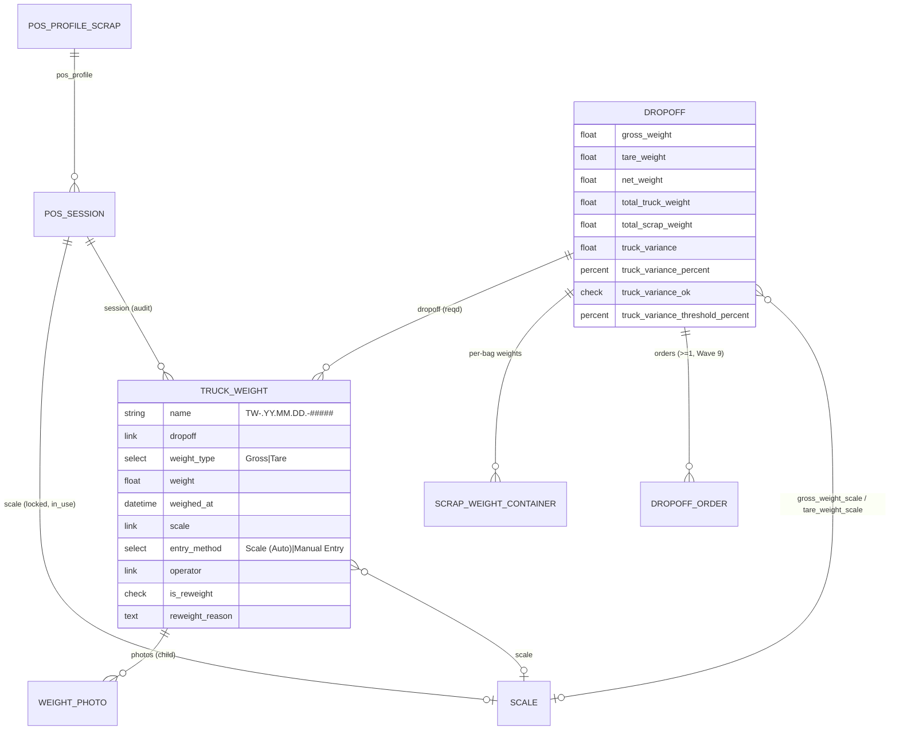
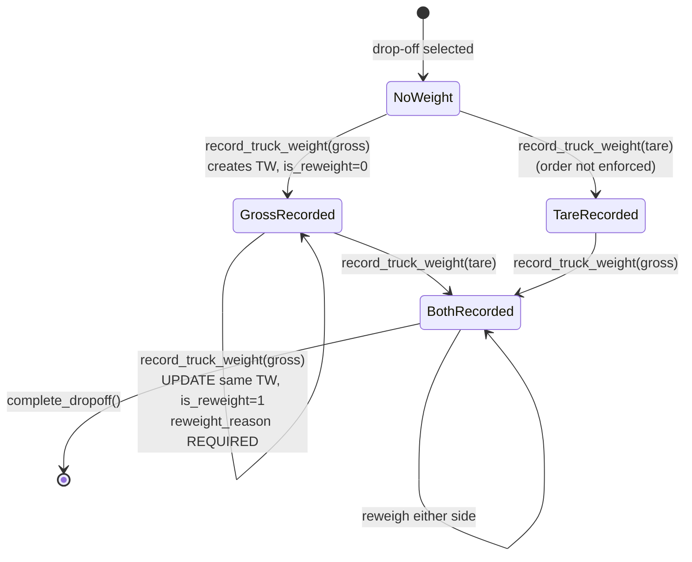
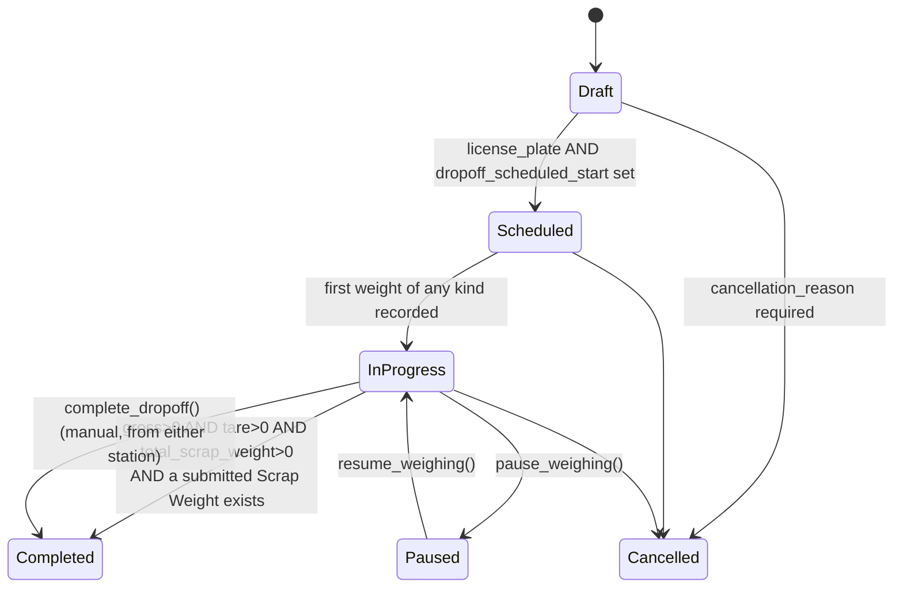

# Truck Terminal — Developer & Admin Reference

> **Status:** Production
> **Source:** `www/pos/truck.html`, `www/pos/truck.py`, `www/pos/terminal.py`, `api/v1/dropoff.py`, `api/v1/pos.py`, `scrap_metal_suite/doctype/truck_weight/`, `scrap_metal_suite/doctype/weight_photo/`, `scrap_metal_suite/doctype/scale/`, `scrap_metal_suite/doctype/dropoff/dropoff.py`, `public/js/scale_reader.js`, `fixtures/print_format.json`
> **Last verified:** 2026-08-21 against `feature/container-redesign` @ `d598a9b`
> **App version:** `1.1.0` (`scrap_metal_suite/__init__.py`)

---

## 1. Purpose & scope

The Truck Terminal is the weighbridge station. It owns exactly two numbers per drop-off — **gross** (truck in, loaded) and **tare** (truck out, empty) — and the **net** derived from them. It writes those to a `Truck Weight` document (one per weight type per drop-off), mirrors them onto the parent `Dropoff`, prints an 80 mm thermal ticket for the driver, and surfaces the reconciliation between the weighbridge and the bag-by-bag scale.

**What it does NOT own:**

| Not this subsystem | Where it lives | Reference |
|---|---|---|
| Per-bag container weighing (`Scrap Weight Container`) | `/pos/terminal` (three-pane) | [12](12-dropoff-receiving.md) |
| Creating or scheduling the `Dropoff` | Desk | [12](12-dropoff-receiving.md) |
| Grade sorting / QA after receipt | `/production/terminal` | [20](20-production-sorting.md) |
| Price locks, POs, settlement | Desk | [30](30-settlement.md) |
| Session/scale binding mechanics | shared with POS Scrap Terminal | [10](10-pos-scrap-terminal.md) |

The terminal is *coupled* to container weighing only through the `Dropoff`: it reads `total_scrap_weight` (which container weighing writes) to show truck-vs-scrap variance, and it can mark the whole drop-off Completed. Wave 9 made those two stations deliberately independent — either can finish first, and either can complete the drop-off (`api/v1/dropoff.py:1466-1473`).

**Route:** `/pos/truck?session=<POS Session>` — full-screen, touch-first, bilingual (TH/EN), WebSerial-driven.

---

## 2. Data model



### DocTypes

| DocType | Type | Purpose |
|---|---|---|
| `Truck Weight` | Normal (not submittable) | One weighing event. `autoname: naming_series:` → `TW-.YY.MM.DD.-` (`truck_weight.json:3,40`). Default print format `Truck Weight Thermal` (`truck_weight.json:4`). |
| `Weight Photo` | Child (`istable: 1`) | Photos attached to a `Truck Weight` (also used by `Scrap Weight` and `Scrap Weight Container`). `weight_type` options: `Scrap`, `Truck Gross`, `Truck Tare` (`weight_photo.json:49`). |
| `Scale` | Normal | Hardware record. `autoname: field:scale_name`. `usage_type` ∈ `Scrap` / `Truck` / `Production` (`scale.json`). |
| `Dropoff` | Normal | Parent. Carries the mirrored truck fields and all variance state. |
| `Dropoff Truck` | Child (`istable: 1`) | **DEAD.** Marked `"description": "DEPRECATED: No longer used…"` (`dropoff_truck.json:4`) and referenced by zero files in the app (grep for `Dropoff Truck` / `dropoff_truck` outside its own directory returns nothing). 2 orphan rows in `tabDropoff Truck` on the `metal` dev DB. |

### Fields that carry behaviour

| Field | DocType | Type | Why it matters |
|---|---|---|---|
| `weight_type` | `Truck Weight` | Select `Gross\nTare` | Chooses which pair of `Dropoff` fields gets written (`truck_weight.py:47-56`). The API takes lowercase `gross`/`tare` and capitalises (`api/v1/dropoff.py:378`). |
| `is_reweight` / `reweight_reason` | `Truck Weight` | Check / Small Text | Set when a second weighing overwrites the first. Reason is mandatory (`api/v1/dropoff.py:396-397`) and prints as `** ชั่งซ้ำ **` on the thermal ticket. |
| `entry_method` | `Truck Weight` | Select `Scale (Auto)\nManual Entry` | Audit only — was the number typed or captured from the serial stream. Prints as `[A]` / `[M]`. Client decides from `state.weightCapturedFromScale` (`truck.html:2948`). |
| `usage_type` | `Scale` | Select | **Routes the whole page.** `Truck` → `/pos/truck`; anything else → `/pos/terminal` (`truck.py:50-55`, `terminal.py:92-98`). |
| `unit_conversion_factor` | `Scale` | Float, precision 6 | Multiplier applied to every raw serial reading to get kg (`truck.html:2826-2827`, `truck.html:2566-2567`). |
| `max_capacity_kg` | `Scale` | Float | *Intended* over-capacity guard. See §10 — the guard does not fire from this terminal. |
| `truck_variance_threshold_percent` | `Dropoff` | Percent, default `0.1` | Pass/fail line for truck-vs-scrap. Stored as the percent number itself (`1.0` = 1 %). |
| `indicated_variance_threshold_percent` | `Dropoff` | Percent, default `0.1` | Pass/fail line for declared-vs-actual. |
| `verification_status` | `Dropoff` | Data (read-only) | `Pending` / `Verified` / `Needs Review`, recomputed on every valid save. |
| `weighing_scale`, `weighing_session` | `Dropoff` | Link | Container-weighing lock. The truck terminal neither reads nor sets these. |

---

## 3. Weight lifecycle / state machine

### Per-weighing (`Truck Weight`)



There is **one `Truck Weight` row per (`dropoff`, `weight_type`) pair, forever.** A reweigh is an in-place `save()` on the existing document, not a new row (`api/v1/dropoff.py:381-410`). The old value survives only in the Frappe version history (`track_changes: 1`, `truck_weight.json:256`). The `TW-…` number on the driver's first ticket therefore stays valid after a reweigh — the ticket is reprinted with the new figure under the same ID.

### Parent (`Dropoff.status`) — auto-transitions



| From | To | Trigger | Guard | Source |
|---|---|---|---|---|
| Draft | Scheduled | any save | `license_plate` and `dropoff_scheduled_start` both set | `dropoff.py:289-291` |
| Scheduled | In Progress | any save | `gross_weight > 0` OR `tare_weight > 0` OR `total_scrap_weight > 0` | `dropoff.py:294-296` |
| In Progress | Completed | any save | all three weights > 0 **AND** `frappe.db.exists("Scrap Weight", {"dropoff": …, "docstatus": 1})` | `dropoff.py:303-306` |
| In Progress / Completed | Completed | `complete_dropoff()` | status not `Paused`, status ∈ (`In Progress`, `Completed`) | `api/v1/dropoff.py:1481-1490` |
| any (not Cancelled) | — | — | `auto_transition_status` returns immediately if `status == "Cancelled"` | `dropoff.py:281-282` |

The submitted-`Scrap Weight` gate on In Progress → Completed exists so `reopen_dropoff` (which cancels the receipt) does not immediately bounce back to Completed (`dropoff.py:298-302`).

### `verification_status`

Recomputed in `before_save` on every validating save (`dropoff.py:308-335`):

```
if verification_overridden      -> "Verified"          (durable manager override, never reset)
elif not (gross>0 and tare>0 and scrap>0) -> "Pending"
elif truck_variance_ok and indicated_variance_ok and grade_deviation_ok -> "Verified"
else                            -> "Needs Review"
```

It is informational — nothing blocks on it. Resolution is a manager action (`verify_dropoff`, `api/v1/dropoff.py:1711`).

---

## 4. Variance calculation

Two independent variances, each with its own threshold, computed server-side in `Dropoff.before_save` and *re-computed identically* client-side for live display.

### Truck variance — weighbridge vs. sum of bags

`dropoff.py:485-507`:

```python
self.total_truck_weight = flt(self.net_weight) if self.net_weight else 0          # :493
self.total_scrap_weight = flt(self.total_actual_weight)                           # :497
if self.total_truck_weight:
    self.truck_variance         = self.total_truck_weight - self.total_scrap_weight            # :501
    self.truck_variance_percent = abs(self.truck_variance / self.total_truck_weight * 100)     # :502
    self.truck_variance_ok      = self.truck_variance_percent <= flt(self.truck_variance_threshold_percent or 0.1)  # :503
else:
    self.truck_variance = 0; self.truck_variance_percent = 0; self.truck_variance_ok = 1       # :505-507
```

with `net_weight` from `dropoff.py:346-353`:

```python
if gross and tare:  net_weight = flt(gross) - flt(tare)
else:               net_weight = None          # gross alone is NOT enough
```

and `total_actual_weight` = sum of **Active** `Scrap Weight Container.net_weight` for the drop-off (`dropoff.py:355-420`, `sync_actual_items`). The legacy per-`Scrap Weight` summing path is retired.

**Sign convention:** positive = the weighbridge saw more than the bags did (normal: moisture, dust, debris left in the bed). Negative = the bags weighed more than the truck lost — investigate.

**Percent is absolute**, so a negative variance of the same magnitude fails the same way.

Verified against live data on site `metal` (2026-08-21): `DO-260427-00004` stores `net_weight 100.0`, `total_scrap_weight 123.0`, `truck_variance -23.0`, `truck_variance_percent 23.0`, `threshold 1.0`, `truck_variance_ok 0` — recomputing from the formula reproduces both figures exactly.

### Indicated variance — what the supplier declared vs. what was weighed

`dropoff.py:512-530`:

```python
indicated = flt(self.total_indicated_weight)   # sum of Dropoff Expected Item.indicated_weight (:256-265)
actual    = flt(self.total_actual_weight)
if indicated > 0:
    self.indicated_variance         = indicated - actual                              # :524
    self.indicated_variance_percent = abs(self.indicated_variance / indicated * 100)  # :525
    self.indicated_variance_ok      = self.indicated_variance_percent <= flt(self.indicated_variance_threshold_percent or 0.1)  # :526
else:
    self.indicated_variance = 0; self.indicated_variance_percent = 0; self.indicated_variance_ok = 1  # :528-530
```

Note the denominator differs between the two: truck variance divides by **net truck weight**, indicated variance divides by **indicated weight**.

### Client-side mirror (three-band display)

The terminal recomputes both, but renders **three** bands rather than the server's two-state boolean (`truck.html:1335-1364` for truck, `1377-1406` for indicated; and again in the completion modal at `3236-3278`):

| Condition | Class | Text |
|---|---|---|
| `pct <= threshold` | `variance-ok` | ✔ Variance within tolerance |
| `threshold < pct <= threshold * 2` | `variance-warning` | ⚠ Variance warning |
| `pct > threshold * 2` | `variance-error` | ✘ Variance exceeds tolerance |

The amber middle band exists only in the browser. The server has no equivalent — `truck_variance_ok` is already `0` there. Threshold defaults to `0.1` client-side when the field is empty (`truck.html:1344`, `:1386`, `:3243`, `:3265`), matching the server's `or 0.1`.

The panel is only rendered at all when **both** `net_truck_weight` and `total_scrap_weight` are truthy (`truck.html:1326`); the indicated section additionally requires `total_indicated_weight` (`truck.html:1369`).

### Threshold configuration

`truck_variance_threshold_percent` and `indicated_variance_threshold_percent` are **per-`Dropoff` fields**, not a Settings single. Default `0.1` comes from the DocType JSON default. Live distribution on `metal`: `0.1` × 55 drop-offs, `1.0` × 3, `5.0` × 3. There is no UI in the truck terminal for changing them — that is a desk edit on the `Dropoff`.

---

## 5. API surface

### Live endpoints — the ones the truck terminal actually calls

| Endpoint | Args | Returns | Auth guard | Notes |
|---|---|---|---|---|
| `api.v1.dropoff.record_truck_weight` | `dropoff`, `weight_type` (`gross`\|`tare`), `weight`, `scale=None`, `session=None`, `remarks=None`, `reweight_reason=None`, `entry_method=None` | `{dropoff, status, gross_weight, gross_weight_time, tare_weight, tare_weight_time, net_weight, truck_weight_record, is_reweight, total_scrap_weight, truck_variance, truck_variance_percent}` | `check_pos_operator()` (`:329`) | The core write. Creates or updates the single TW row for that (dropoff, type). **The terminal never passes `scale`** (`truck.html:2943-2949`) — `scale` is back-filled from `POS Session.scale` (`:401`, `:419`). |
| `api.v1.dropoff.lookup_dropoff` | `query` | list of `{name, dropoff_scheduled_start, license_plate, supplier_name, status, order_count}` | `check_pos_operator()` (`:87`) | Exact match on name → exact on `license_plate` → `LIKE` within `dropoff_scheduled_start` ±3 days, `LIMIT 10` (`:96-131`). Min length 2. |
| `api.v1.dropoff.get_dropoff_details` | `dropoff` | full dict incl. `truck_weights[]` (each with `photos[]`), `expected_items[]`, both thresholds, `total_indicated_weight` | `check_pos_operator()` (`:183`) | Called on selection (`truck.html:1067-1070`) via `frappe.call`, not `callAPI`. |
| `api.v1.dropoff.get_dropoff_verification` | `dropoff` | weights + both variances + `scrap_records[]` + `can_complete` + `completion_blockers[]` | `check_pos_operator()` (`:787`) | Drives the left-pane state on load (`truck.html:1249`). The terminal ignores `can_complete`/`completion_blockers` and recomputes its own blockers client-side. |
| `api.v1.dropoff.save_weight_photo` | `parent_doctype`, `parent_doc`, `photo_url`, `weight_type=None`, `dropoff=None`, `session=None` | `{success, parent_doctype, parent_doc, photo_url, photo_count}` | `check_pos_operator()` (`:895`) | Appends a `Weight Photo` child row. Terminal passes `parent_doctype: "Truck Weight"` and `weight_type: "Truck Gross"` / `"Truck Tare"` (`truck.html:1932-1939`). |
| `api.v1.dropoff.complete_dropoff` | `dropoff` | `{success, status, verification_status, grade_deviation_ok, grade_deviation_summary}` | `check_pos_operator()` (`:1477`) | Throws on `Paused`; requires status ∈ (`In Progress`, `Completed`). |
| `api.v1.pos.get_active_session` | — | session dict + flattened `scale_*` and serial settings | `check_pos_operator()` (`:66`) | Terminal reads `unit_conversion_factor`, `baud_rate`, `data_bits`, `parity`, `stop_bits`, `flow_control` from here (`truck.html:2178-2194`). |
| `api.v1.pos.get_scales` | `usage_type=None`, `scale_type=None` | list with `is_active`, `in_use` | `check_pos_operator()` (`:713`) | Terminal always passes `usage_type: 'Truck'` (`truck.html:2212-2214`). |
| `api.v1.pos.get_scale_by_id` | `scale_id` (name or URL containing `/scale/`) | `{scale}` or `{error}` | `check_pos_operator()` (`:749`) | Used after QR scan. Terminal rejects non-`Truck` `usage_type` client-side (`truck.html:2378-2385`). |
| `api.v1.pos.set_session_scale` | `session`, `scale` | `{session, scale, scale_name, scale_type, usage_type, location}` | `check_pos_operator()` (`:802`) | Refuses if the session already has a scale (`:813-814`) or the scale is `in_use` elsewhere (`:831-832`). Sets `Scale.in_use = 1`. |
| `api.v1.pos.close_session` | `session` | totals dict | `check_pos_operator()` (`:159`) | Owner-only. `POSSession.on_update` releases the scale lock (`pos_session.py:64-67`). |
| `frappe.client.set_value` | `Dropoff`, `truck_remarks` | — | Frappe core perms | Remarks are saved through core, **not** through `save_truck_remarks` (`truck.html:1664-1672`). |
| `upload_file` (core) | multipart | `{message: {file_url}}` | Frappe core | Raw `XMLHttpRequest` with `is_private=0` (`truck.html:1910-1928`). |

### Whitelisted but unused by this terminal

| Endpoint | Status | Notes |
|---|---|---|
| `api.v1.dropoff.save_truck_remarks` | Works, orphaned | Sanitises to 2000 chars (`:513-515`); the UI bypasses it. Only caller is `api_test/test_dropoff_api.py:198`. |
| `api.v1.dropoff.mark_truck_reweighed` | Works, orphaned | Sets `Dropoff.is_reweighed`/`reweight_reason`/`reweight_by`/`reweight_at`. `record_truck_weight` already sets `is_reweighed` (`:444-445`) but **not** the reason/by/at trio. Only caller is `api_test/test_dropoff_api.py:362`. |
| `api.v1.dropoff.save_truck_photo` | Works, orphaned | Different mechanism from `save_weight_photo`: attaches a `File` to the TW rather than appending a `Weight Photo` child row (`:561-589`). Two parallel photo models; the UI uses the other one. |
| `api.v1.pos.record_truck_weight` | **BROKEN** | Writes `order.gross_weight`, `order.net_truck_weight`, … on `POS Order` — none of those fields exist (`frappe.get_meta("POS Order")` returns 21 fields, no weight fields). Pre-Dropoff legacy. |
| `api.v1.pos.save_truck_remarks` | **BROKEN** | Guards with `hasattr(order, 'truck_weight_remarks')` and throws "run bench migrate" (`:616-617`) — the field will never exist. |
| `api.v1.pos.mark_reweighed` | **BROKEN** | Writes `order.is_truck_reweighed` / `is_scrap_reweighed` — neither field exists. |
| `api.v1.pos.update_total_scrap_weight` | **BROKEN** | `SELECT … FROM tabScrap Weight WHERE pos_order = %s` — `Scrap Weight` has no `pos_order` field. |
| `api.v1.pos.get_weight_verification` | **BROKEN** | Reads 15 non-existent `POS Order` fields (`:870-878`) and filters `Scrap Weight` by `pos_order`. Hard-codes a 2 % threshold (`:894`) that matches nothing in the current model. |

All five `pos.py` truck endpoints, plus `_calculate_variance` (`pos.py:11-27`), are dead legacy from the pre-`Dropoff` design. See §10.

---

## 6. UI surface

### Page and gating

| File | Role |
|---|---|
| `www/pos/truck.py` | `get_context` — auth, session validation, scale-type routing. 73 lines. |
| `www/pos/truck.html` | Everything else. 3 365 lines: 680 lines of markup, ~2 660 lines of inline JS in one `<script>`. No inline CSS. |

`get_context` gate order (`truck.py:13-56`):

1. Guest → redirect `/login?redirect-to=/pos` (`:13-15`)
2. `has_pos_access()` — `POS Operator` **or** `POS Manager` **or** `System Manager` → else `context.error` (`:18-20`, `:70-73`)
3. No `?session=` → redirect `/pos` (`:25-27`)
4. Session not found / not `Open` / not owned by `frappe.session.user` → `context.error` (`:37-47`)
5. `Scale.usage_type != "Truck"` → redirect `/pos/terminal?session=…` (`:50-55`)

The mirror gate lives in `terminal.py:92-98`: `usage_type != "Scrap"` → redirect to `/pos/truck`. A session with **no** scale set passes both gates — the redirect only fires once a scale is bound.

The whole inline `<script>` is wrapped in `` (`truck.html:699`, `:3362`) because it dereferences `{{ session.name }}`; without the guard an invalid `?session=` returned HTTP 417 instead of the error page.

### Assets (`truck.html:6-14`)

`css/pos.css`, `css/pos-fullscreen.css`, `js/pos-translations.js`, `js/container-translations.js`, `js/pos-core.js`, `js/html5-qrcode.min.js`, `js/pos-scanner.js`, `js/scale_reader.js`, `js/pos-resizer.js`.

Loaded with **plain paths — no `?v=` cache-buster**, unlike `terminal.html:6-13`. See §10.

### Layout

```
┌─────────────────────────────────────────────────────────────────────────────────────┐
│ ← X-DESK  SES-…  Truck Scale  <operator>  [⚖ TRUCK-001 ●]   HH:MM   🌐EN ☀ 🖶Print  ✕ │  .terminal-header
├──────────────────────────────────────────────────┬─┬────────────────────────────────┤
│ 🚚 Truck Weights                                 │▐│ Drop-off ID                    │
│ ┌───────────────────┬───────────────────┐        │▐│ [ search / scan ] [📷 Scan]    │
│ │ Gross Weight   ✔  │ Tare Weight       │        │▐│ ┌ #dropoffDetailsCard ───────┐ │
│ └───────────────────┴───────────────────┘        │▐│ │ ▼ DO-…                  ✕  │ │
│  #grossLiveWeight  ┌──────────────────────────┐  │▐│ │ Supplier / Date / Plate /  │ │
│  (scale connected) │  12480.00 Kg  [STABLE]   │  │▐│ │ Status                     │ │
│                    └──────────────────────────┘  │▐│ │ ▼ Expected Items      (n)  │ │
│  #grossWeightInput   [   12480.00   ] Kg         │▐│ └────────────────────────────┘ │
│  [📷 Photo]            [ Save Weight ]           │▐│ ┌ #variancePanel ────────────┐ │
│  #grossConfirmation  ✔ 12480.00 Kg  hh:mm  ⚖     │▐│ │ Truck Variance (Net↔Scrap) │ │
│ ┌ #netWeightSummary ────────────────────────┐    │▐│ │ Indicated Variance         │ │
│ │ Gross / Tare / Net                        │    │▐│ └────────────────────────────┘ │
│ └───────────────────────────────────────────┘    │▐│ ┌ #scrapPanel           (n) ▼┐ │
│  [💬 Remarks]      [✔ Complete Dropoff]          │▐│ └────────────────────────────┘ │
│ .panel-items (flex:1)              #panelResizer ↑│ .panel-transaction (460px)      │
└──────────────────────────────────────────────────┴─┴────────────────────────────────┘
```

Two panes, not three — the journal pane (`.panel-journal`) exists only on `/pos/terminal`. `.panel-transaction` is `460px` by default (`pos.css:262-267`), drag-resizable between `320px` and `50vw`, persisted to `localStorage['sms.pos.truck.rightPaneWidth']` (`truck.html:757-763`, `pos-resizer.js:4-6`). Resizing is disabled below `768px` viewport width.

Tab colours: Gross active `#3b82f6` (blue), Tare active `#8b5cf6` (purple) (`pos.css:5793-5808`).

### Key element IDs

| ID | Purpose | Driven by |
|---|---|---|
| `#dropoffSearch` / `#dropoffResults` | debounced 300 ms search + result list | `searchDropoff` (`truck.html:985-1023`) |
| `#tabGross` / `#tabTare`, `#grossCheck` / `#tareCheck` | tab buttons + green ✔ when saved | `switchWeightTab` (`:2877`), `updateTabCheckmarks` (`:3067`) |
| `#grossLiveValue` / `#tareLiveValue`, `#grossStable` / `#tareStable` | live serial reading, both tabs updated simultaneously | `handleTruckWeightUpdate` (`:2824-2863`) |
| `#grossWeightInput` / `#tareWeightInput` | manual entry; `oninput` clears `state.weightCapturedFromScale` | inline handler (`:119`, `:158`) |
| `#saveGrossBtn` / `#saveTareBtn` | opens the confirm modal | `saveGrossWeight` / `saveTareWeight` (`:2895-2929`) |
| `#weightConfirmModal` | confirm + optional remarks + mandatory reweigh reason | `showWeightConfirmModal` (`:3138-3168`) |
| `#netWeightSummary` | Gross / Tare / Net roll-up | `updateNetWeightSummary` (`:3102-3123`) |
| `#variancePanel` | dual variance | `updateWeightDisplay` (`:1324-1414`) |
| `#scrapPanel` / `#scrapList` / `#scrapTotal` | `Scrap Weight` receipts for this drop-off | `updateWeightDisplay` (`:1417-1442`) |
| `#completeDropoffBtn` | shown once gross AND tare exist | `updateCompleteButton` (`:3350-3360`) |
| `#photoModal` + `#zoomSlider` / `#tiltSlider` | camera with optical-or-digital zoom | `initCameraControls` (`:2013-2060`) |
| `#scaleModal`, `#scaleConnectionModal`, `#scaleScannnerModal` | scale pick → connect → confirm | `checkSessionScale` (`:2172`) onward. Note the triple-`n` typo in `scaleScannnerModal` — consistent across markup and JS. |

### Dead UI

`#weightModal` (`truck.html:366-400`) with `openWeightModal()` / `closeWeightModal()` / `saveWeight()` (`:1525-1603`) is the pre-tab flow. `openWeightModal` has **zero call sites**. Its `Capture Weight` button calls `captureAndSaveWeight()`, which is **not defined anywhere**. Likewise `updateWeightDisplay` still guards for `#grossValue`, `#tareValue`, `#netValue`, `#btnGross`, `#btnTare` (`:1282-1321`) — none of which exist in the markup.

---

## 7. Scale protocols & serial settings

All scale I/O is browser-side over the **WebSerial API** (`navigator.serial`) — Chrome/Edge only, HTTPS or `localhost` only. There is no server-side serial path. `ScaleReader` lives in `public/js/scale_reader.js` (990 lines).

### Supported protocols

| # | Protocol | Header bytes | Framing | Terminator | Weight extraction | Source |
|---|---|---|---|---|---|---|
| 1 | **STX-M** | `0x02 0x4D` (`STX`,`M`) | typical 2400 / 7E1 | `0x0D 0x0A` | first `/(\d+\.?\d*)/` in the ASCII payload after byte 3 | `:471-525` |
| 2 | **STX** | `0x02 0x28` (`STX`,`(`) | typical 1200 / 7E1, fixed ≥18 bytes | `0x0D 0x0A` | ASCII digits from bytes 3–10, **interpreted as grams**, `/1000` | `:531-584` |
| 3 | **HP-05** | `0x82 0x28` | fixed 17 bytes | none (length-framed) | digits bytes 3–8, decimal position from byte 9, unit from byte 10, XOR checksum vs byte 16 | `:589-600`, `:845-904` |
| 4 | **HP-05 variant** | `0x82 0x28`, `0x82 0xAA`, `0x02 0x28`, or `0x02 0x2A` | variable ~12–25 bytes | `0x0D` **or** `0x8D` (high-bit CR), plus one trailing byte | mask each data byte with `& 0x7F` then read ASCII digits and `.`; `0xAE`/`.` marks the decimal | `:617-700` |

`tryDecodeAny` runs them in the order **STX-M → STX → HP-05-variant → HP-05** and returns the first hit (`:445-463`).

**Truck-scale specifics.** Variant 4 is the truck case. The header's second byte distinguishes it: `0x2A` / `0xAA` (`*`) is flagged `isTruckVariant` (`:654`). Two framings of the same data are handled:

- **8N1** — every byte carries the high bit: header `0x82 0xAA`, data `0xB0`–`0xB9` for `'0'`–`'9'`, `0xA0` for space, terminator `0x8D 0xA5`.
- **7E1** — the parity bit strips the high bit, so the same stream arrives as plain ASCII: header `0x02 0x2A`, terminator `0x0D 0x25`.

The parser handles both by masking `byte & 0x7F` before interpreting, so one code path covers both wirings (`:666-678`). This is why `0x82`/`0x02` and `0xAA`/`0x2A` are accepted as equivalent header pairs.

Stability: STX-M and STX read the status character (`'0'` = stable) (`:501`, `:559`); HP-05 variant compares the status byte to `0x30` (`:658`); HP-05 tests bit 0 of the status byte (`:853`).

### Connection sequence

`connectWithConfig(savedConfig, onProgress)` (`:98-164`):

1. `navigator.serial.requestPort()` — **always prompts the user to pick a port.** There is no silent reconnect; the browser permission model requires a gesture-driven picker every time.
2. Try the `Scale` document's saved `baud_rate` / `data_bits` / `parity` / `stop_bits` / `flow_control` (single attempt, `bufferSize: 255`).
3. On failure, fall back to `_autoDetectWithPort` (`:169-227`) on the **already-selected** port.

Auto-detect probe order (`:171-184`, duplicated at `:272-285`), 5-second `testRead` each, 500 ms settle between attempts:

| Order | Config | Comment in source |
|---|---|---|
| 1 | 4800 8N1 | "Most common: HP-05 variant (smaller scales)" |
| 2 | **2400 7E1** | "Truck scale" |
| 3 | 1200 7E1 | "STX protocol" |
| 4 | **2400 8N1** | "Truck scale alternate (same data, different framing)" |
| 5 | 1200 8N1 | |
| 6 | 9600 8N1 | |
| 7 | 9600 7E1 | |

Worst case ≈ 7 × (5 s + 0.5 s) ≈ 38 s before "Could not detect scale".

### Continuous reading and `unit_conversion_factor`

`startReading()` (`:751-828`) loops on `port.readable.getReader()`, appends byte-by-byte into a 255-byte sliding buffer, runs `tryDecodeAny` after **every** byte, and on a hit fires `onWeightUpdate({weight, stable, unit, protocol, rawData})` and resets `bufferIndex = 0`.

**`ScaleReader` returns the raw scale number, not kg.** The comment at `:689-690` is explicit. Conversion is the page's job:

```js
// truck.html:2826-2827  (continuous reading — commit 9bad181)
const conversionFactor = parseFloat(state.scale?.unit_conversion_factor) || 1;
const weight = parseFloat(data.weight) * conversionFactor;
```

The same multiplication is applied to the one-shot reading shown in the connection-success modal (`truck.html:2566-2567`).

`|| 1` makes a `0`, `null`, or unparseable factor behave as 1 — which is what saves the two live truck scales on the `metal` site, both of which have `unit_conversion_factor = 0.0`.

Reference factors (from `Scale.conversion_help` HTML, `scale.json`): grams → kg `0.001`, kg → kg `1`, tons → kg `1000`, lb → kg `0.453592`.

### Auto-capture

When a decoded reading is **stable and > 0**, the value is written into the *currently active tab's* input and `state.weightCapturedFromScale = true` (`truck.html:2852-2861`). Typing in the input clears the flag via the inline `oninput` (`:119`, `:158`). The flag becomes `entry_method` on save (`:2948`). Both tabs' live displays update from the same stream — the scale does not know which tab you are on.

### Disconnect handling

`ScaleReader._setupDisconnectListener` (`:48-77`) binds `port.addEventListener('disconnect', …)` for physical unplug and fires `onDisconnect` → `handleTruckScaleDisconnect` (`truck.html:2865-2873`), which flips the badge to red and toasts. Reconnect (`handleScaleReconnect`, `:2723-2746`) calls `connectTruckScale()` — and therefore re-prompts for the port.

### Manual-entry fallback

Two paths reach it: `confirmScaleManualMode()` from the picker (`:2452-2481`) and `useManualEntryMode()` from the connection-failure modal (`:2632-2662`). Both call `set_session_scale` and set `state.isScaleConnected = false`, which hides both live-weight strips (`:2693-2694`). Typing weights still works.

`confirmScaleSelection` short-circuits to the `'no_config'` failure state without touching the port when the `Scale` record has no `baud_rate`/`data_bits`/`parity`/`stop_bits` (`:2433-2437`) — the case for both live truck scales today.

---

## 8. Business rules & validations

**Server-side, `api/v1/dropoff.record_truck_weight`:**

- **`weight_type` must be `gross` or `tare`** — lowercase; capitalised to `Gross`/`Tare` for the DocType Select (`api/v1/dropoff.py:331-332`, `:378`).
- **Weight must parse as a float and be > 0** (`:335-341`). A second, identical check lives on the DocType (`truck_weight.py:13-16`).
- **Explicit `scale` must exist and the weight must not exceed `max_capacity_kg`** (`:344-353`). The terminal never sends `scale`, so this never fires from the UI — see §10.
- **A reweigh REQUIRES a reason.** If a `Truck Weight` already exists for that (dropoff, weight_type), `reweight_reason` is mandatory or the call throws (`:396-397`). The reason is sanitised through `sanitize_html` and truncated to 500 chars (`:371-374`); `remarks` to 1000 (`:365-369`).
- **Reweigh updates in place** and stamps `is_reweight=1`, `reweight_at`, `reweight_by` (`:405-408`), and sets `Dropoff.is_reweighed = 1` (`:444-445`).
- **Session activity is touched** on every call (`:356`, `_update_session_activity` at `:12-15`) — this is what keeps the session out of the idle sweeper.

**Server-side, `Dropoff` controller (fires on the `doc.save()` at `api/v1/dropoff.py:448`):**

- **At least one linked POS Order** — Wave 9, no walk-ins (`dropoff.py:65-84`). Legacy drop-offs with zero orders cannot be saved at all; `record_truck_weight` on one will throw. 36 of 50 drop-offs on the `metal` dev DB are in this state.
- **Tare must be strictly less than gross** (`dropoff.py:230-240`). Because the API's `doc.save()` re-validates, a bad tare rolls the whole request back including the already-written `Truck Weight` row.
- **License plate is immutable once any weight exists** — cannot be cleared or changed; the message tells you to cancel the drop-off instead (`dropoff.py:205-228`).
- **Cancellation requires a reason**, and stamps `cancelled_by` / `cancelled_at` (`dropoff.py:242-254`).
- **Closed drop-offs are immutable** — orders cannot be removed from a Completed drop-off (`dropoff.py:181-203`).

**Client-side only (not enforced server-side):**

- Weight must be a positive number before the confirm modal opens (`truck.html:2899-2903`, `:2917-2921`).
- Reweigh reason non-empty before submit (`truck.html:3193-3196`) — this one *is* backed by the server check.
- Completion blockers: missing gross, missing tare, no scrap weight (`truck.html:3282-3284`). The Complete button is disabled while any exist (`:3290-3299`). The server's `complete_dropoff` does **not** check these — it only checks status.
- Photo button disabled until the corresponding weight is saved (`truck.html:1713-1718`, `:3067-3099`).

---

## 9. Permissions

### Page access (`truck.py:70-73`)

`POS Operator` **or** `POS Manager` **or** `System Manager`.

### API access (`api/v1/auth.py:7-18`)

`check_pos_operator()` allows only `POS Operator` **or** `System Manager`. `POS Manager` is **not** in the list — a POS Manager can load the page and then every single API call fails with "Access denied. POS Operator role required." See §10.

### DocType permissions

`Truck Weight` (`truck_weight.json:211-252`, verified against `tabDocPerm`; no `Custom DocPerm` overrides):

| Role | read | write | create | delete | print | report | export | email | share |
|---|---|---|---|---|---|---|---|---|---|
| System Manager | ✔ | ✔ | ✔ | ✔ | ✔ | ✔ | ✔ | ✔ | ✔ |
| POS Operator | ✔ | ✔ | ✔ | ✘ | ✔ | ✔ | ✘ | ✔ | ✘ |
| SMT Accountant | ✔ | ✘ | ✘ | ✘ | ✔ | ✔ | ✔ | ✔ | ✘ |
| SMT Accounting Manager | ✔ | ✘ | ✘ | ✘ | ✔ | ✔ | ✔ | ✔ | ✘ |

`Dropoff`:

| Role | read | write | create | delete |
|---|---|---|---|---|
| System Manager | ✔ | ✔ | ✔ | ✔ |
| POS Operator | ✔ | ✔ | ✘ | ✘ |
| SMT Accountant | ✔ | ✘ | ✘ | ✘ |
| SMT Accounting Manager | ✔ | ✘ | ✘ | ✘ |

A POS Operator can therefore write truck weights onto an existing drop-off but cannot create or delete one — the intended split. `record_truck_weight` calls plain `.insert()` / `.save()` with **no** `ignore_permissions`, so it relies on these DocPerms being correct.

`Weight Photo` and `Dropoff Truck` are child tables with empty `permissions: []` — they inherit from the parent.

---

## 10. Known issues & gotchas

**Bugs — verified, reproducible**

- **`Truck Weight.validate_scale_max` never fires.** It tests `hasattr(scale_doc, 'max_capacity')` but the `Scale` field is `max_capacity_kg` (`truck_weight.py:22`). Confirmed on `metal`: `hasattr(Scale('TRUCK-001'), 'max_capacity')` → `False`, `hasattr(…, 'max_capacity_kg')` → `True`. Combined with the terminal never passing `scale` to `record_truck_weight` (`truck.html:2943-2949`, so the working check at `api/v1/dropoff.py:344-353` is skipped), **over-capacity truck weights are not blocked anywhere.** Fix is one word: `max_capacity` → `max_capacity_kg`, and/or send `scale: state.scale.name` from the terminal.

- **Editing a `Truck Weight` from the desk leaves the Dropoff's variance stale.** `TruckWeight.update_dropoff_weight` saves the parent with `dropoff.flags.ignore_validate = True` (`truck_weight.py:62`). In Frappe v15 that flag skips **both** `validate` *and* `before_save` (`frappe/model/document.py:1132-1137`), so `calculate_totals`, `calculate_verification_status`, and `auto_transition_status` never run. Reproduced on `DO-260415-00012`: changing `TW-260415-00019` from 1000 → 1500 kg updated `gross_weight` to 1500 and `net_weight` to 600, but left `total_truck_weight = 100`, `truck_variance = 5.0`, `truck_variance_percent = 5.0`, `verification_status = "Needs Review"` — all describing the *old* weight. The API path hides this because `record_truck_weight` does a second, fully-validating `doc.save()` at `api/v1/dropoff.py:448`. `clear_dropoff_weight` (`truck_weight.py:65-117`) has the identical defect on delete. **Workaround:** open the `Dropoff` and save it to force a recompute (only works if it has ≥1 linked order).

- **Keyboard-selecting a search result loses the drop-off date.** `handleDropoffSearchKeydown` reads `data.dropoffDate` (`truck.html:970`) but the markup writes `data-dropoff-start` → `dataset.dropoffStart` (`truck.html:1003`). Enter-to-select shows "Drop-off Date: -"; clicking the same row shows it correctly.

- **Eight i18n keys are missing, so raw key names render in the UI.** `POS_I18N.t()` returns the key itself when unresolved (`pos-translations.js:737`), which is truthy — so the `t('x') || 'English fallback'` idiom used throughout `truck.html` never reaches its fallback. Missing from both `pos-translations.js` and `container-translations.js`: `confirmWeight`, `confirmReweight`, `reweightReasonRequired`, `missingGrossWeight`, `missingTareWeight`, `noScrapWeights`, `dropoffCompleted`, `failedToSaveRemarks`. The confirm-modal title literally reads `confirmWeight` and the completion blockers read `missingGrossWeight` / `missingTareWeight` / `noScrapWeights`, in both languages. (`scaleAuto`, `manualEntry`, and `noRecentWeight` *are* covered — via `container-translations.js:38-39,85,146-147,194`.)

- **`noRecentWeight` is worded for the container flow.** Its Thai text is "ยังไม่มีใบชั่ง — กดเสร็จสิ้นการชั่งก่อน" (finish container weighing first), but the truck terminal uses it for "no truck ticket to reprint" (`truck.html:3025`). Misleading on this page.

**Dead code**

- **`Dropoff Truck` child DocType is fully unreferenced.** Self-documented as deprecated (`dropoff_truck.json:4`); grep for `Dropoff Truck` / `dropoff_truck` outside its own folder returns nothing. Safe to drop; 2 orphan rows exist on the dev DB.
- **The legacy `#weightModal` flow.** `openWeightModal` (`truck.html:1525`) has no callers; its `Capture Weight` button calls the undefined `captureAndSaveWeight()` (`truck.html:396`). `updateWeightDisplay` still branches on five element IDs that no longer exist (`truck.html:1282-1321`).
- **All five `api/v1/pos.py` truck endpoints are broken legacy** (§5). They target `POS Order` fields that do not exist in the current schema. They are still `@frappe.whitelist()`, so they are reachable and will 500 or throw for any caller.
- **Two parallel photo mechanisms.** `save_weight_photo` appends `Weight Photo` child rows (used); `save_truck_photo` attaches `File` documents (unused). `get_dropoff_details` only reads the child-table one (`api/v1/dropoff.py:252-259`), so anything written via `save_truck_photo` is invisible to the terminal.
- **`context.profile` is loaded but unused** on this page (`truck.py:64-65`); the header hard-codes the string `Truck Scale` (`truck.html:33`).
- **`Dropoff.field_order` lists `variance_threshold_percent`** (`dropoff.json:11`) but no such field is defined. Harmless, but `frappe.get_meta("Dropoff").has_field("variance_threshold_percent")` → `False`.

**Operational traps**

- **No cache-buster on this page's assets.** `truck.html:6-14` links `/assets/scrap_metal_suite/…` with no `?v=`, while `terminal.html:6-13` uses `?v={{ asset_v }}` and `terminal.py:24-53` documents exactly why (`Cache-Control: max-age=43200`; neither `bench clear-cache` nor `bench build` dislodges the browser copy). **After deploying a change to `pos.css`, `scale_reader.js`, or the shared JS, truck-terminal browsers can serve the old file for up to 12 hours.** Symptom: the fix works on `/pos/terminal` and not on `/pos/truck`. Fix: port `get_asset_version()` from `terminal.py` into `truck.py` and stamp the tags.

- **The 90-minute idle sweeper will close a weighbridge session mid-truck.** `close_idle_sessions` runs `*/15 * * * *` and closes any `POS Session` whose `last_activity` is older than 90 minutes (`scheduler.py:8-51`, threshold at `:14`). No terminal sends a heartbeat — `truck.html`, `terminal.html`, and `production.html` all contain zero references to `update_session_activity`. Only `record_truck_weight` bumps the timestamp (`api/v1/dropoff.py:356`). A truck that weighs in, unloads for two hours, then weighs out will find its session closed ("This session has been closed") and the scale lock released. *(The scheduler is disabled on the `metal` dev site — `enable_scheduler = 0` — so this only bites in production.)*

- **`POS Manager` can open the page but cannot use it.** `has_pos_access()` includes the role (`truck.py:72`); `check_pos_operator()` does not (`api/v1/auth.py:17`). Every API call returns "Access denied. POS Operator role required." Give POS Managers the `POS Operator` role too, or add `POS Manager` to the guard.

- **A scale can only be bound once per session.** `set_session_scale` throws if `POS Session.scale` is already set — "Close session and open a new one to use a different scale" (`api/v1/pos.py:813-814`). Consequence: from `/pos`, the "Truck Scale" card on an **active** session is a bare link to `/pos/truck?session=…` (`www/pos/index.html:83`); if that session is already on a Scrap scale, `truck.py:50-55` bounces straight back to `/pos/terminal`. The operator must close the session and start a new one.

- **Server error messages arrive as JSON tracebacks.** `POS_CORE.callAPI` is a raw `fetch` that throws `new Error(data.exc)` (`pos-core.js:157-158`). `data.exc` is a JSON-encoded list of Python tracebacks, populated only when `System Settings.allow_error_traceback` is on (`frappe/utils/response.py:182-185`) — it is `1` on `metal`. The friendly `frappe.throw` text goes to `_server_messages`, which this code path ignores. So "Reweight reason is required…" surfaces as a wall of traceback. **If a site turns `allow_error_traceback` off, `data.exc` is absent, `callAPI` returns normally, and `if (response.message)` is false — the failure is completely silent.** `fetchDropoffDetails` is the exception: it uses `frappe.call` (`truck.html:1067`) and gets proper error dialogs.

- **`WebSerial` re-prompts for the port on every connect.** `connectWithConfig` always calls `navigator.serial.requestPort()` (`scale_reader.js:106`). There is no use of `navigator.serial.getPorts()` for silent reconnection, so page reload, disconnect, and reconnect all require an operator click in the browser's port picker.

- **Both live truck scales are unconfigured for serial.** On `metal`, `TRUCK-001` and `TRUCK-002` have `baud_rate`, `data_bits`, `parity`, `stop_bits` all `NULL` and `unit_conversion_factor = 0.0`. `confirmScaleSelection` will therefore always land in the `'no_config'` state (`truck.html:2433-2437`) and the operator must use manual entry until the `Scale` records are filled in via `/scale-test`.

- **Reweigh audit is split.** `record_truck_weight` sets `Dropoff.is_reweighed = 1` but never `Dropoff.reweight_reason` / `reweight_by` / `reweight_at` — those three are only written by `mark_truck_reweighed`, which the UI never calls. Per-weighing reweigh detail is complete on the `Truck Weight` row; the `Dropoff`-level trio stays empty. The Drop-off print format's reweigh banner prints `doc.reweight_reason`, so it renders bare.

- **`Dropoff.total_scrap_weight` can go stale independently.** Observed on `DO-260427-00005`: `total_scrap_weight = 0.0` while `total_actual_weight = 20.0`. Any drop-off last saved before `sync_actual_items` moved to the container model keeps the old number, and the truck terminal's variance panel reads `total_scrap_weight`.

- **Property Setter can override `naming_series`.** `Truck Weight-naming_series-options` exists in `tabProperty Setter` with value `TW-.YY.MM.DD.-`. It currently agrees with the JSON, but a JSON-only change to the series will be silently ignored — patch the Property Setter too.

- **Numbers on the ticket are `weighed_at`, but the ID is by creation date.** `TW-.YY.MM.DD.-` resolves from `creation`, not `weighed_at`. On a reweigh the document keeps its original date-stamped name while `weighed_at` moves forward.

---

## 11. Print format — `Truck Weight Thermal`

| Property | Value |
|---|---|
| Name / DocType | `Truck Weight Thermal` / `Truck Weight` |
| Type | Jinja, `custom_format: 1`, `standard: "Yes"` |
| Default print language | `th` |
| Page | `@page { size: 80mm auto; margin: 2mm }`, body `76mm` |
| Set as | `Truck Weight.default_print_format` (`truck_weight.json:4`) |
| Source | `fixtures/print_format.json` (also live in `tabPrint Format`) |

Layout: company header → **36 px** weight figure → `[X]`/`[ ]` ขาเข้า/ขาออก checkbox pair → date/plate/drop-off → supplier → `[A] Scale` / `[M] Manual` + photo count → `** ชั่งซ้ำ **` badge when `is_reweight` → remarks → operator, scale, print time → **two stacked 28 mm QR codes** (Drop-off, then Truck Weight) → cut line.

QR images come from `qr_src(doctype, name)`, a Jinja method registered by the separate **`qr_foundry`** app (`apps/qr_foundry/qr_foundry/hooks.py:80-86`, `print_helpers.py:8-27`). It returns an attached QR image URL when a `QR List` row exists, otherwise generates a data-URI on the fly. **The truck ticket will not render without `qr_foundry` installed.**

Printing is triggered automatically after every successful save (`truck.html:2989-2992`) via a hidden iframe pointed at `/printview?doctype=Truck%20Weight&name=…&format=Truck%20Weight%20Thermal&no_letterhead=1`, calling `iframe.contentWindow.print()` on load and falling back to `window.open(… &trigger_print=1)` (`truck.html:3004-3015`). The header's 🖶 Print button reprints `state.lastTruckWeight`, falling back to `state.truckWeights[0].name` (`truck.html:3017-3027`).

Verified 2026-08-21 by rendering `TW-260427-00008` through `frappe.get_print` on site `metal`: 16 801 bytes, both QR codes present, Thai labels correct, `[X] ขาออก Tare` checked, `[M] Manual` shown.

**Standard-format gotcha:** `standard: "Yes"` means `Print Format.validate()` blocks normal edits. To patch it, write through `frappe.db.set_value("Print Format", name, "html", …)` — the pattern used by `api_test/_patch_print_format.py`.

---

## 12. Testing

| Suite | Covers | Run |
|---|---|---|
| `api_test/test_full_workflow.py` | `test_30_truck_weight_flow` (gross + tare via API, `:520-561`); `test_110_reweight_flow` (no-reason rejected, then with-reason accepted, flags asserted, `:1433-1495`); `test_120_variance_calculation` (truck variance within 5 % threshold, `:1498-1597`); `test_130` (variance exceeds a 1 % threshold, `:1635-1670`) | `bench --site metal execute scrap_metal_suite.api_test.test_full_workflow.run` |
| `api_test/test_dropoff_api.py` | `save_truck_remarks` (`:195-209`), `record_truck_weight` gross (`:212-235`) and tare with net assertion (`:238-262`), `mark_truck_reweighed` + reweigh (`:360-364`). Creates and deletes its own drop-off. | `bench --site metal execute scrap_metal_suite.api_test.test_dropoff_api.run` |
| `api_test/test_e2e_full_flow.py` | Lane B regression, 24 assertions across the whole flow. **Contains no `truck` references** — truck weights are set up as fixture state, not exercised as a subject. | `bench --site metal execute scrap_metal_suite.api_test.test_e2e_full_flow.run` |
| `ui_test/` (Playwright) | `fixtures.py:175-206` `seed_pos_truck_scenario` and `:319,336` set truck weights via `document.save()`, but every browser test drives `/pos/terminal` (a **Scrap**-usage scale, `fixtures.py:53-68`). | `cd ~/frappe-bench && SMT_UI_HEADLESS=1 SMT_UI_ADMIN_PWD='…' env/bin/pytest apps/scrap_metal_suite/scrap_metal_suite/ui_test/ -v` |

**Not covered.** A green run proves none of the following:

- **No browser test ever loads `/pos/truck`.** The two-tab UI, the confirm modal, the variance panel, the completion modal, and the auto-print iframe have zero automated coverage.
- **No test asserts the scale-type redirect** in either direction (`truck.py:50-55`, `terminal.py:92-98`).
- **No test covers `scale_reader.js`.** No protocol fixtures, no frame-decode unit tests, no `unit_conversion_factor` assertion. WebSerial cannot be exercised headlessly — this is hardware-only, per `docs/E2E_MANUAL_TEST_SCRIPT.md`.
- **No test covers the photo pipeline** (`getUserMedia` → canvas → `upload_file` → `save_weight_photo`).
- **No test renders `Truck Weight Thermal`.** Its sibling `Scrap Weight Thermal` has `api_test/smoke_test_scrap_weight_thermal.py`; the truck ticket has no equivalent.
- **No test covers the `max_capacity_kg` guard** — which is exactly why the dead `hasattr` check in §10 survived.
- **No test covers the desk-edit staleness path** — every suite writes through `record_truck_weight`, which masks the `ignore_validate` defect.
