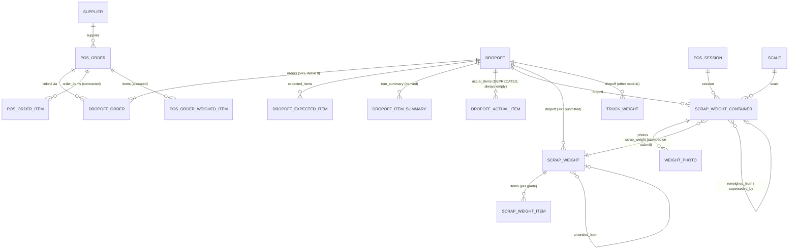
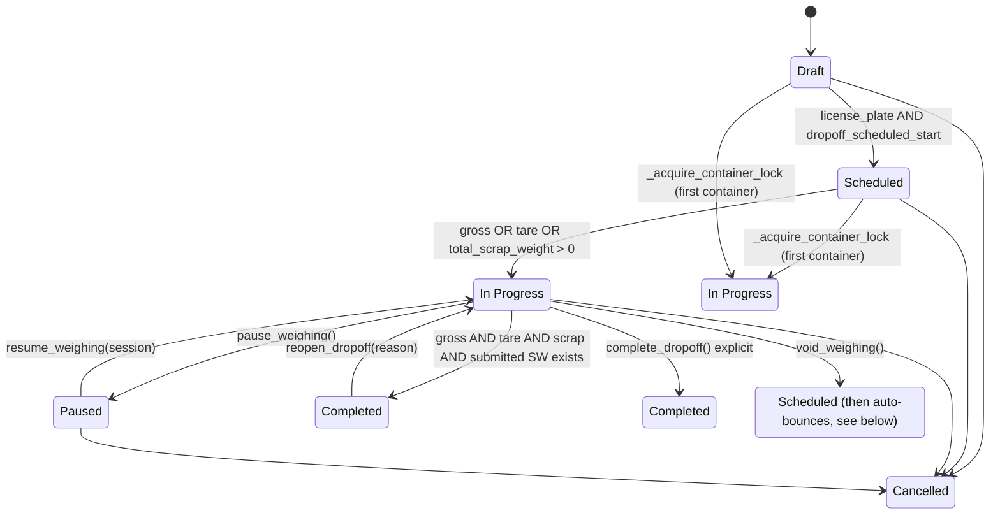
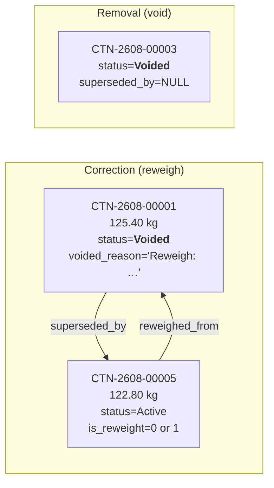
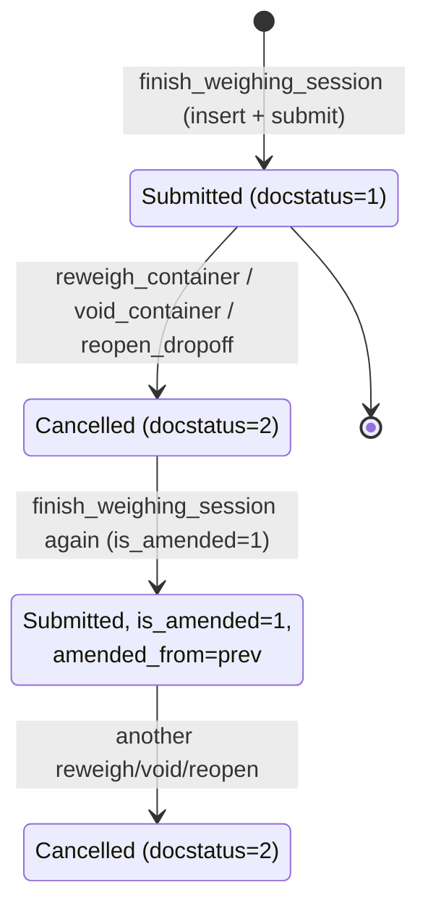

# Drop-off & Containers — Developer & Admin Reference

> **Status:** Production
> **Source:** `scrap_metal_suite/scrap_metal_suite/doctype/dropoff/dropoff.py`, `scrap_metal_suite/api/v1/dropoff.py`, `scrap_metal_suite/scrap_metal_suite/doctype/scrap_weight_container/scrap_weight_container.py`, `scrap_metal_suite/scrap_metal_suite/doctype/scrap_weight/scrap_weight.py`, `scrap_metal_suite/www/pos/terminal.html`
> **Last verified:** 2026-08-21 against `feature/container-redesign` @ `ce7a9d6` + uncommitted Wave 9–11 delta, on site `metal` (Frappe 15.74.2)

---

## 1. Purpose & scope

This subsystem owns **material receiving**: from the moment a supplier's truck is expected until a submitted `Scrap Weight` receipt exists and the weighed material has been allocated back to the POS Orders that contracted it.

**It owns:**

- The `Dropoff` document and its state machine
- Per-bag weighing via immutable `Scrap Weight Container` records
- The per-Dropoff `Scrap Weight` receipt (submittable, one active per Dropoff)
- Three-way reconciliation: truck net vs bag total, declared vs actual, grade mix
- FIFO allocation of weighed material to linked POS Orders and the fulfilment percentages that result
- The three-pane container journal UI on `/pos/terminal`

**It does not own:**

| Concern | Lives in |
|---|---|
| Weighbridge gross/tare capture, `Truck Weight` doctype, serial protocols | [11 — Truck Terminal](11-truck-terminal.md) |
| POS Session lifecycle, scale locking, POS Profile Scrap | [10 — POS Scrap Terminal](10-pos-scrap-terminal.md) |
| `SMT Price Lock` → `POS Order` creation, `SMT Purchase Order`, money | [30 — Settlement](30-settlement.md) |
| Post-receiving QA/QC grading (`Production Sorting`, `Dropoff Final`) | [20 — Production Sorting](20-production-sorting.md) |
| Print-format conventions, QR helpers, i18n layering | [40 — Printing & Bilingual](40-printing.md) |

**Design history.** The current model is the result of the "container redesign" (Waves 6–11) logged in [`docs/DROPOFF_CONTAINER_REDESIGN.md`](../../DROPOFF_CONTAINER_REDESIGN.md). That file is a **running design journal**, not a spec — parts of it describe fields and endpoints that were later removed. `docs/DROPOFF_ARCHITECTURE.md` and `docs/PHASE_8_DROPOFF_REDESIGN.md` predate the redesign entirely and are **historical**. Where any of them disagree with this document, verify against source.

---

## 2. Data model



### DocType inventory

| DocType | Type | Purpose |
|---|---|---|
| `Dropoff` | Normal (not submittable), `track_changes` | The truck-arrival job. Owns status, locks, variance, allocation. |
| `Dropoff Expected Item` | Child | What the supplier declared, per grade + kg. |
| `Dropoff Actual Item` | Child | **DEPRECATED** — intentionally left empty (`dropoff.py:371`, `dropoff.py:383`). |
| `Dropoff Item Summary` | Child | Derived per-grade rollup of Active containers. Rebuilt on every save. |
| `Dropoff Order` | Child | M:N link Dropoff ↔ POS Order + the weight allocated to that order. |
| `Dropoff Truck` | Child | **Orphan** — no Table field on `Dropoff` references it (1-truck-per-dropoff design moved the plate onto the parent). |
| `Scrap Weight Container` | Normal, `track_changes` | **One physical bag/bin/pallet, one grade, one weight. Immutable.** |
| `Scrap Weight` | **Submittable** | The customer-facing per-Dropoff receipt, aggregated per grade. |
| `Scrap Weight Item` | Child | One row per grade on the receipt: `item_code`, `container_count`, `weight`. |
| `Weight Photo` | Child | Shared photo table (Container / Truck Weight). |
| `Container Weight History` | Child | **Orphan** — no parent Table field references it anywhere. See §13. |
| `Dropoff Container Settings` | Single | **Effectively dead config.** Read only by a migration patch. See §12. |

### Fields that carry behaviour

| Field | DocType | Type | Why it matters |
|---|---|---|---|
| `status` | Dropoff | Select `Draft\nScheduled\nIn Progress\nPaused\nCompleted\nCancelled` (`dropoff.json:136`) | Drives every gate in §3 and §10. |
| `orders` | Dropoff | Table → Dropoff Order | Must be non-empty; `validate_at_least_one_order` (`dropoff.py:65-83`). |
| `weighing_session` | Dropoff | Link → POS Session (`dropoff.json:430`) | Single-session lock. Cleared by pause/reopen. |
| `weighing_scale` | Dropoff | Link → Scale (`dropoff.json:436`) | Scale pin. Survives pause; cleared only by `void_weighing`. |
| `total_actual_weight` | Dropoff | Float | Sum of Active containers, recomputed every save (`dropoff.py:418`). |
| `total_scrap_weight` | Dropoff | Float | Mirror of `total_actual_weight` (`dropoff.py:497`); consumed by the status gate. |
| `container_count` | Dropoff | Int | Count of Active containers (`dropoff.py:419`). |
| `truck_variance_threshold_percent` | Dropoff | Percent, default `0.1` | Literal percent, not a fraction. See §7. |
| `indicated_variance_threshold_percent` | Dropoff | Percent, default `0.1` | Same. |
| `grade_deviation_ok` / `grade_deviation_summary` | Dropoff | Check / Long Text | Binary grade-mix check (`dropoff.py:421-483`). |
| `verification_status` | Dropoff | Data (`Pending`/`Verified`/`Needs Review`) | Informational; never blocks (`dropoff.py:308-335`). |
| `verification_overridden` | Dropoff | Check | Sticky — forces `Verified` on every recompute (`dropoff.py:322-324`). |
| `status` | Scrap Weight Container | Select `Active\nReweighed\nVoided` (`scrap_weight_container.json:174`) | Only `Active` counts. `Reweighed` is **never written** — see §13. |
| `reweighed_from` | Scrap Weight Container | Link → self (`…json:187`) | New → old back-link. |
| `superseded_by` | Scrap Weight Container | Link → self (`…json:200`) | Old → new forward-link. |
| `is_reweight` | Scrap Weight Container | Check (`…json:180`) | 1 only when the replacement happened *after* a receipt was submitted. Drives the sticker's `↻ REWEIGHT` badge. |
| `scrap_weight` | Scrap Weight Container | Link → Scrap Weight (`…json:239`) | Stamped in `ScrapWeight.on_submit`; never cleared on cancel. |
| `entry_method` | Scrap Weight Container | Select `Scale (Auto)\nManual Entry` | Strictly validated by Frappe. See the §13 bug. |
| `docstatus` | Scrap Weight | 0/1/2 | 1 = the active receipt; 2 = superseded. Uniqueness is on `docstatus=1` only. |
| `is_amended` / `amended_from` / `amend_reason` | Scrap Weight | Check / Link / Small Text | Receipt amendment chain (`scrap_weight.json:62,77`). |
| `generated_at` / `generated_by` | Scrap Weight | Datetime / Link | **The receipt timestamp.** `posting_time` was removed in Wave 10. |

### Naming

All three headline doctypes use custom naming; the counters come from `frappe.model.naming.make_autoname` via `scrap_metal_suite/overrides/naming.py`.

| DocType | Pattern | Implementation | Example |
|---|---|---|---|
| `Dropoff` | `DO-{supplier_short}-YYMMDD-#` | `dropoff.py:25-28` → `naming.py:68-85` | `DO-SMC-260821-1` |
| `Scrap Weight` | `SW-{supplier_short}-YYMMDD-#` | `scrap_weight.py:34-42` | `SW-SMC-260821-1` |
| `Scrap Weight` (amended) | parent name + `-N` | Frappe's amended-name rule (triggered by `amended_from`) | `SW-SMC-260821-1-1` |
| `Scrap Weight Container` | `CTN-YYMM-#####` | `naming_series` `CTN-.YY.MM.-.#####` (`scrap_weight_container.json:45`) | `CTN-2608-00001` |

`YYMMDD` for `Dropoff`/`Scrap Weight` is the **scheduled-start date**, not `creation` (`dropoff.py:27`, `scrap_weight.py:41`). `supplier_short` is `Supplier.short_code` and `naming.py:39-50` throws if it is missing.

> **Property Setter gotcha.** `Scrap Weight Container.naming_series` is also pinned by a `Property Setter` row (`doc_type='Scrap Weight Container'`, `field_name='naming_series'`, `property='options'`, `value='CTN-.YY.MM.-.#####'`). If a JSON naming change appears not to take effect, check `Property Setter` first — verified live on site `metal`.

> **There is no `container_no` field.** The doc name is the only bag identifier (`scrap_weight_container.py:40-43`). The operator-facing bag count is the live Active row count rendered in the journal header (`terminal.html:3136`). The DB still carries an orphan `container_no` column from before Wave 11 — it is not in the doctype meta and is not read by any code.

---

## 3. Dropoff state machine



### Transition table

| From | To | Trigger | Guard | Source |
|---|---|---|---|---|
| Draft | Scheduled | any save | `license_plate` and `dropoff_scheduled_start` both set | `dropoff.py:289-291` |
| Scheduled | In Progress | any save | `gross_weight > 0` **or** `tare_weight > 0` **or** `total_scrap_weight > 0` | `dropoff.py:294-296` |
| Draft/Scheduled | In Progress | first `add_container` | lock acquisition mutates status in memory | `dropoff.py:809-810` |
| In Progress | **Completed** | any save | `gross AND tare AND scrap` **AND** `frappe.db.exists("Scrap Weight", {"dropoff": name, "docstatus": 1})` | `dropoff.py:303-306` |
| In Progress / Completed | Completed | `complete_dropoff` | status ∈ {In Progress, Completed}; explicit throw if Paused | `api/v1/dropoff.py:1481-1490` |
| In Progress | Paused | `pause_dropoff` | status must be exactly `In Progress`, else throw | `dropoff.py:817-826` |
| Paused | In Progress | `resume_dropoff` | status must be `Paused`; session's scale must equal `weighing_scale` | `dropoff.py:834-849` |
| Completed | In Progress | `reopen_dropoff` | status ∈ {Completed, Verified, Needs Review}; reason required; cancels the submitted SW | `api/v1/dropoff.py:1553-1577` |
| any | Scheduled | `void_weighing` | voids all Active containers, clears both locks | `dropoff.py:891-922` |
| any | Cancelled | manual `status` edit | `cancellation_reason` required | `dropoff.py:242-254` |

### The Scrap Weight gate (Wave 11)

`auto_transition_status` requires a **submitted** `Scrap Weight` before promoting In Progress → Completed:

```python
# dropoff.py:303-306
if self.status == "In Progress":
    if has_gross and has_tare and has_scrap:
        if frappe.db.exists("Scrap Weight", {"dropoff": self.name, "docstatus": 1}):
            self.status = "Completed"
```

This is what stops `reopen_dropoff` from bouncing straight back to Completed: reopen cancels the receipt, so the guard fails until the operator re-runs `finish_weighing_session`. **Verified live** — after reopen, a plain `doc.save()` leaves the status at In Progress; after re-finish, the next save promotes to Completed.

> **Consequence:** after a re-finish, *any* save of the Dropoff auto-promotes it to Completed without the operator pressing Complete. This is by design but is easy to forget when scripting.

### `void_weighing` does not actually land on Scheduled

`Dropoff.void_weighing` sets `self.status = "Scheduled"` then `self.save()` (`dropoff.py:917-918`). `before_save` → `auto_transition_status` immediately sees `status == "Scheduled"` with `has_gross`/`has_tare` still true and flips it back to `In Progress` (`dropoff.py:294-296`).

**Verified live:** `void_dropoff_weighing` on a dropoff with truck weights returns `status: "In Progress"`, not `"Scheduled"`. The lock fields *are* cleared (`weighing_session = None`, `weighing_scale = None`) and all Active containers *are* voided, so the functional intent holds — only the reported status is wrong. The docstring at `api/v1/dropoff.py:1439` says "status reverts to Scheduled"; it does not.

---

## 4. Container immutability & audit chain

A `Scrap Weight Container` is a **measurement fact**. Once written, its `net_weight` and `item_code` are never changed by any code path in this subsystem. Corrections are structural, not in-place.



### Reweigh semantics (`api/v1/dropoff.py:1166-1255`)

1. Snapshot the old container's `dropoff`, `session`, `scale`, `item_code`, `container_type` into a new payload; `operator = frappe.session.user`, `reweighed_from = old.name` (`:1192-1203`).
2. Look for a submitted `Scrap Weight` on the parent Dropoff (`:1211-1215`).
   - **Found** → `sw_doc.cancel()`, `payload["is_reweight"] = 1` (`:1216-1220`).
   - **Not found** → `payload["is_reweight"] = 0`; this is a pre-submission correction with no receipt side effects (`:1221-1222`).
3. `old.record_void("Reweigh: <reason>")` (`:1225-1229` → `scrap_weight_container.py:60-79`).
4. `new_doc.insert(ignore_permissions=True)` (`:1231-1232`).
5. `frappe.get_doc("Dropoff", …).save()` to re-aggregate (`:1235-1236`).
6. `frappe.db.set_value(old, "superseded_by", new_doc.name, update_modified=False)` (`:1239-1242`).

**The old container's status is `Voided`, not `Reweighed`** (`scrap_weight_container.py:73`). `Reweighed` exists in the Select options (`scrap_weight_container.json:174`) but no code ever writes it. Verified live by `api_test/test_finish_weighing_session.py` assertions 2c/2d.

### Void semantics (`api/v1/dropoff.py:1258-1296`)

Same receipt-invalidation logic, no replacement insert. `superseded_by` stays NULL unless the caller passes one explicitly.

```python
# scrap_weight_container.py:60-79
def record_void(self, reason, superseded_by=None):
    if not reason:
        frappe.throw(_("Void reason is required"))
    self.status = "Voided"
    self.voided_reason = reason
    self.voided_at = now_datetime()
    self.voided_by = frappe.session.user
    self.superseded_by = superseded_by
    self.save()
```

### Bulk void (`dropoff.py:891-922`)

`void_weighing` bypasses `record_void` and writes the four void fields via `frappe.db.set_value` directly (`:904-913`) — so **`superseded_by` is never set** and no controller hooks fire. Locks are cleared, then a Comment is added.

### What "Active" means to aggregation

`Dropoff._get_active_containers` (`dropoff.py:736-757`) filters `status == "Active"` and orders by `creation asc`. Voided rows are excluded from every total, from the receipt, and from allocation — but remain fully queryable for audit, and keep their `scrap_weight` stamp pointing at whichever receipt covered them.

---

## 5. Scrap Weight receipt lifecycle

`Scrap Weight` is submittable (`scrap_weight.json:7`). It is **generated, never hand-authored** — `finish_weighing_session` is the only supported writer (`scrap_weight.py:30-31`).



### One-active-per-Dropoff rule

```python
# scrap_weight.py:56-79
def _validate_one_active_per_dropoff(self):
    existing = frappe.db.get_all("Scrap Weight",
        filters={"dropoff": self.dropoff, "docstatus": 1, "name": ["!=", self.name or ""]},
        pluck="name")
    if existing:
        frappe.throw(_("Dropoff {0} already has a submitted Scrap Weight ({1}). "
                       "Cancel it before issuing a new one.")...)
```

The constraint is on `docstatus == 1` only. Cancelled receipts accumulate and are the audit chain.

### Hooks

| Hook | Behaviour | Source |
|---|---|---|
| `autoname` | `SW-{short}-YYMMDD-#`, date from the Dropoff's `dropoff_scheduled_start` | `scrap_weight.py:34-42` |
| `before_insert` | defaults `posting_date=today()`, `generated_by=session.user`, `generated_at=now()` | `scrap_weight.py:44-50` |
| `validate` | one-active check, then `_calculate_totals` (sums `items[].weight` and `items[].container_count`) | `scrap_weight.py:52-88` |
| `on_submit` | stamps `scrap_weight = self.name` on every Active container of the Dropoff, `update_modified=False` | `scrap_weight.py:90-103` |
| `on_cancel` | **intentional no-op** — container stamps are preserved so `Container.scrap_weight = SW-X` reconstructs what each receipt covered | `scrap_weight.py:105-113` |

### Fields removed in Wave 10

`posting_time`, `session`, `operator`, `pos_profile`, `scale`, `entry_method`, `photos`, `is_reweight`, `reweight_reason`, `reweight_at`, `reweight_by`, `naming_series`, `pos_order`, `supplier`, `license_plate`.

They were per-event metadata for the old non-submittable model. **The DB columns still exist as orphans** on any site migrated from the old schema — verified live on `metal`, where `frappe.get_all("Scrap Weight", fields=["posting_time","is_reweight"])` still returns data. That is why the stale API references in §13 have not blown up yet; they *will* on a fresh install.

`generated_at` is the receipt timestamp. `posting_date` remains (Date only, read-only, defaults to today).

---

## 6. Aggregation & FIFO allocation

### 6a. Container → Dropoff rollup (`dropoff.py:355-419`)

Runs in `before_save` on every Dropoff save.

```python
containers = self._get_active_containers()               # status == "Active", creation asc
expected_codes = {row.item for row in self.expected_items if row.item}
# → summary[item_code] = {item_name, weight += net, count += 1, is_expected}
self.total_actual_weight = total                          # dropoff.py:418
self.container_count = len(containers)                    # dropoff.py:419
```

- `self.actual_items` is cleared and left empty (`:383`) — deprecated.
- `self.item_summary` is fully rebuilt (`:384`, `:409-416`), one row per grade with `total_weight`, `container_count`, `is_expected`.
- `calculate_totals` then mirrors `total_actual_weight` into `total_scrap_weight` (`:497`).

This replaced the pre-redesign path that summed every `Scrap Weight` for the Dropoff and caused the 6× duplication bug (see `patches/v2_0/migrate_to_containers.py` header).

### 6b. Container → Receipt aggregation (`api/v1/dropoff.py:1620-1692`)

```python
active = frappe.get_all("Scrap Weight Container",
    filters={"dropoff": dropoff, "status": "Active"},
    fields=["name","item_code","item_name","net_weight"])          # :1621-1625
if not active: throw("no active containers on this Dropoff")       # :1626-1629
# grade_agg[item_code] = {item_name, container_count += 1, weight += net_weight}
```

Then it looks for the most recently cancelled receipt (`docstatus=2`, `order_by="modified desc"`, `:1650-1656`) and, if found, composes `amend_reason` from every container voided since that cancel:

```python
# api/v1/dropoff.py:1660-1675
voided_since = frappe.get_all("Scrap Weight Container", filters={
    "dropoff": dropoff, "status": "Voided",
    "voided_at": [">=", latest_cancelled["modified"]]}, ...)
amend_reason = "Reweighed: " + ", ".join(f"{name} ({voided_reason})" ...)
```

Finally `sw.insert(ignore_permissions=True); sw.submit()` (`:1691-1692`).

### 6c. FIFO allocation to POS Orders (`dropoff.py:532-640`)

Runs in `before_save`, **on every save while `status == "Completed"`** — not just on the transition (`:538`, and see the docstring at `:535`).

**Algorithm:**

1. Bail unless `status == "Completed"`, `self.orders`, and `self.item_summary` are all non-empty (`:538-545`).
2. Sort linked POS Orders by `POS Order.order_date` ascending, `"9999-99-99"` for NULL (`:552-559`). **This is the FIFO key** — oldest contract fills first.
3. Build `order_items_map[order][item_code] = contracted weight` from `POS Order Item` (`:564-572`).
4. For each `item_summary` row (i.e. per grade), with `available_weight = total_weight`:
   - Walk orders in FIFO order (`:599`).
   - `wanted = order_items_map[order].get(item_code, 0)`; skip if the order doesn't want this grade (`:604-606`).
   - `already_received = _get_already_received(order, item_code)` — the sum of `POS Order Weighed Item.weight` for that order/item **from other dropoffs**, excluding this one (`:642-656`).
   - `still_needed = max(0, wanted - already_received)`; skip if ≤ 0 (`:612-614`).
   - `to_allocate = min(still_needed, available_weight)`; decrement `available_weight` (`:617-632`).
5. Write `Dropoff Order.allocated_weight` per order, rounded to 2 dp (`:635-637`).
6. Stash `self._per_item_allocations` for `on_update` (`:640`).

**Allocation is per grade.** Two orders only compete when they contract the *same* `item_code`. Verified live by `api_test/test_container_multi_doc_workflow.py` Scenario B: PL1 contracts 1000 kg of `ทองแดงปอก` and PL2 contracts 500 kg of `ทองเหลือง`; a single Dropoff delivering 500 kg of each leaves PL1 at 50 % `Partial` and PL2 at 100 % `Fulfilled`.

**Surplus is dropped silently.** If `available_weight` remains after every order is satisfied, it is discarded. The `unallocated_weight` / `unallocated_items` fields exist on `Dropoff` (`dropoff.json:82-83`) but **nothing writes them** — see §13.

### 6d. Writing back to POS Orders (`dropoff.py:658-705`)

`on_update` → `update_pos_orders_if_closed`:

1. For each order with allocations, load the `POS Order`, strip existing `items` rows whose `dropoff == self.name`, append fresh ones, `flags.ignore_validate = True`, `save()` (`:679-700`).
2. Call `_recalculate_order_fulfillment(order)` for every linked order (`:702-705`).

`_recalculate_order_fulfillment` (`dropoff.py:954-1007`):

- Drops `POS Order Weighed Item` rows whose Dropoff is `Cancelled` (`:962-970`).
- Sums received weight per `item_code`, writes `POS Order Item.received_weight` and `item_fulfillment_percent` (`:980-992`).
- Writes `POS Order.total_received`, `fulfillment_percent`, `fulfillment_status`.

`_get_fulfillment_status` (`dropoff.py:1010-1022`):

| `fulfillment_percent` | Status |
|---|---|
| `== 0` | `Pending` |
| `< 98` | `Partial` |
| `98 … 102` | `Fulfilled` |
| `> 102` | `Over-delivered` |

`Dropoff.on_cancel` → `recalculate_order_fulfillment` (`:711-729`) strips this dropoff's weighed items from every linked order and recomputes.

---

## 7. Deviation & verification logic

Three independent checks, all computed in `before_save`, all purely informational.

### 7a. Truck variance (`dropoff.py:499-507`)

```python
self.total_truck_weight = flt(self.net_weight) if self.net_weight else 0     # :493
self.total_scrap_weight = flt(self.total_actual_weight)                      # :497
if self.total_truck_weight:
    self.truck_variance = self.total_truck_weight - self.total_scrap_weight
    self.truck_variance_percent = abs(self.truck_variance / self.total_truck_weight * 100)
    self.truck_variance_ok = self.truck_variance_percent <= flt(self.truck_variance_threshold_percent or 0.1)
else:
    self.truck_variance = 0; self.truck_variance_percent = 0; self.truck_variance_ok = 1
```

**No truck weights ⇒ `truck_variance_ok = 1`.** The check silently passes rather than failing; missing data is caught by the `Pending` verification state instead.

### 7b. Indicated variance (`dropoff.py:512-530`)

Same shape, comparing `total_indicated_weight` (sum of `expected_items[].indicated_weight`, `:256-265`) against `total_actual_weight`. No expected items ⇒ `indicated_variance_ok = 1`.

### 7c. Grade-mix deviation (`dropoff.py:421-483`)

Binary, **kg-agnostic** — deliberately, because kilogram gaps are already covered by 7b.

```python
expected = {row.item for row in self.expected_items if row.item}
if not expected:                       # nothing declared ⇒ cannot deviate
    self.grade_deviation_ok = 1; self.grade_deviation_summary = ""; return
actual = {row.item: {...} for row in self.item_summary}
for code in sorted(set(actual) - expected):    # Unplanned
    lines.append(f"{item_name}: ไม่ได้คาด • Unplanned ({count} bag(s))")
for code in sorted(expected - set(actual)):    # Missing
    lines.append(f"{item_name}: ขาดส่ง • Missing")
self.grade_deviation_ok = 0 if deviation else 1
```

Note that the summary lines are **hard-coded bilingual strings, not translated** (`:473`, `:480`), and interpolate `item_name` verbatim — correct per the never-translate-item-names rule.

### 7d. Verification status (`dropoff.py:308-335`)

```python
if self.verification_overridden:
    self.verification_status = "Verified"; return          # override is sticky
has_gross, has_tare, has_scrap = ...
if not (has_gross and has_tare and has_scrap):
    self.verification_status = "Pending"
elif self.truck_variance_ok and self.indicated_variance_ok and self.grade_deviation_ok:
    self.verification_status = "Verified"
else:
    self.verification_status = "Needs Review"
```

### 7e. Override (`dropoff.py:924-951`, `api/v1/dropoff.py:1710-1731`)

`verify_dropoff(dropoff, override_reason)` → `Dropoff.mark_verified`:

- Already `Verified` → no-op.
- `Needs Review` → `override_reason` is **required** (`:934-935`), then sets `verification_status="Verified"`, `verification_overridden=1`, `verification_override_{at,by,reason}`, saves, and adds a Comment (`:937-946`).
- Anything else → sets `Verified` and saves.

**Desk entry point:** `dropoff.js:75-100` renders **Mark Verified (Override)** only when `verification_status === 'Needs Review' && !verification_overridden`.

**There is no role guard.** `verify_dropoff` (like `reassign_dropoff` and `switch_scale`) is gated only by `check_pos_operator()`. The design log flags Manager-only guards as a future item (`DROPOFF_CONTAINER_REDESIGN.md:834`).

### 7f. `approve_container_deviation` no longer exists

Per-container deviation (`is_deviation`, `deviation_type`, `deviation_reason`, `deviation_approved_by/at`) and the `approve_container_deviation` endpoint were **removed in Wave 9** — deviation moved to the Dropoff level as the composition check above. Confirmed: no such symbol exists in any `.py`/`.js`/`.html` file. `docs/BILINGUAL_GUIDE.md:475` still lists it; that reference is stale.

---

## 8. API surface

All endpoints live in `scrap_metal_suite/api/v1/dropoff.py`. Auth column: **POS** = `check_pos_operator()` (`api/v1/auth.py:7-18` — requires role `POS Operator` **or** `System Manager`); **perm** = Frappe `has_permission` check only.

### Search & context

| Endpoint | Args | Returns | Auth | Notes |
|---|---|---|---|---|
| `get_items_from_orders` | `order_names` (JSON list) | `[{item_code, item_name, parent}]` | perm | Per-order `frappe.has_permission` loop (`:58-60`). Feeds the desk "populate expected items" flow (`dropoff.js:185-240`). |
| `lookup_dropoff` | `query` | `[{name, dropoff_scheduled_start, license_plate, supplier_name, status, order_count}]` | POS | Exact name → exact plate → `LIKE` within **±3 days** of today (`:117-131`). Min 2 chars. |
| `get_dropoff_by_qr` | `qr_data` | same as `get_dropoff_details`, or `{error}` | POS | Strips a `/dropoff/<id>` URL prefix (`:158-159`). |
| `get_dropoff_details` | `dropoff` | large dict: header, truck weights, orders, expected items, scrap weights, variance | POS | ⚠️ fetches removed SW fields `posting_time`, `is_reweight` (`:205`) — see §13. |
| `get_dropoff_verification` | `dropoff` | dual-variance summary + `can_complete` + `completion_blockers[]` | POS | ⚠️ same stale fields (`:795`). Consumed by the **truck** terminal (`www/pos/truck.html:1249`), not the scrap terminal. |

### Container model (v2)

| Endpoint | Args | Returns | Auth | Notes |
|---|---|---|---|---|
| `add_container` | `dropoff`, `session`, `item_code`, `net_weight`, `container_type`, `entry_method="Manual Entry"`, `remarks=None` | `{success, container, item_code, item_name, net_weight, dropoff_status, dropoff_total, container_count, grade_deviation_ok, print_urls}` | POS | Session must be `Open` and owned by the caller (`:1095-1098`). Validates lock, acquires it, checks `Scale.max_capacity_kg`, sanitises remarks to 1000 chars, inserts, then saves the Dropoff. |
| `reweigh_container` | `container`, `net_weight`, `reason`, `entry_method="Manual Entry"` | `{success, container (NEW), voided_container, net_weight, is_reweight, cancelled_scrap_weight, dropoff_total, print_urls}` | POS | Void-of-old + insert-of-new. See §4. Does **not** check Dropoff status. |
| `void_container` | `container`, `reason`, `superseded_by=None` | `{success, container, status:"Voided", cancelled_scrap_weight, dropoff_total}` | POS | Cancels the active receipt if one exists. Reason required (`scrap_weight_container.py:71`). |
| `get_container` | `name` | full doc as dict | POS | Used by the QR/scan path. |
| `list_containers` | `dropoff`, `include_voided=False` | `[{name, item_code, item_name, container_type, net_weight, status, creation, operator, photo_count}]` | POS | `creation asc`. `include_voided` coerced by `_coerce_bool` (`:1050-1067`) so `"0"` means false. Photo counts via one grouped SQL (`:1344-1357`). |
| `finish_weighing_session` | `dropoff` | `{success, scrap_weight, total_weight, container_count, is_amended, amended_from, print_url}` | POS | Rejects `Cancelled`/`Draft` Dropoffs and zero Active containers. See §6b. |
| `complete_dropoff` | `dropoff` | `{success, status, verification_status, grade_deviation_ok, grade_deviation_summary}` | POS | Throws on `Paused`; accepts In Progress/Completed. Does **not** require truck weights (Wave 9). |
| `reopen_dropoff` | `dropoff`, `reason` | `{success, status, cancelled_scrap_weight, released_session, reason}` | POS | Reason required. Cancels the submitted SW, clears `weighing_session`, keeps `weighing_scale`. |
| `get_latest_scrap_weight` | `dropoff` | `{name, is_amended, amended_from, total_weight, print_url}` or `None` | POS | Always the `docstatus=1` receipt, `creation desc`. Exists so reprint never targets a cancelled doc. |
| `verify_dropoff` | `dropoff`, `override_reason=None` | `{success, verification_status, overridden}` | POS | ⚠️ no Manager guard. |

### Locking / session control

| Endpoint | Args | Returns | Auth | Notes |
|---|---|---|---|---|
| `pause_dropoff` | `dropoff`, `reason=None` | `{success, status:"Paused", paused_at}` | POS | Throws unless status is exactly `In Progress`. Clears session lock, keeps scale. |
| `resume_dropoff` | `dropoff`, `session` | `{success, status:"In Progress", weighing_session}` | POS | Throws unless `Paused`; throws on scale mismatch. |
| `reassign_dropoff` | `dropoff`, `new_session`, `reason` | `{success, weighing_session, weighing_reassigned_at}` | POS | **No desk/terminal entry point** — deliberately removed (`dropoff.js:66-72`). Console/emergency use. |
| `switch_scale` | `dropoff`, `new_scale`, `reason` | `{success, weighing_scale, weighing_scale_changed_at}` | POS | Same — no UI path. Existing containers keep their original scale stamp. |
| `void_dropoff_weighing` | `dropoff`, `reason` | `{success, status, voided_count}` | POS | Voids all Active containers, clears both locks. ⚠️ returns `In Progress`, not `Scheduled` — see §3. |

### Photos

| Endpoint | Args | Returns | Auth | Notes |
|---|---|---|---|---|
| `save_weight_photo` | `parent_doctype`, `parent_doc`, `photo_url`, `weight_type=None`, `dropoff=None`, `session=None` | `{success, parent_doctype, parent_doc, photo_url, photo_count}` | POS | Whitelist: `Scrap Weight`, `Truck Weight`, `Scrap Weight Container` (`:898`). ⚠️ the `Scrap Weight` branch is broken — see §13. |
| `get_weight_photos` | `parent_doctype`, `parent_doc` | `[{name, photo, file_name, captured_at, weight_type}]` | POS | `idx asc`. |
| `delete_weight_photo` | `parent_doctype`, `parent_doc`, `photo_name` | `{success, photo_count}` | POS | Removes the child row and saves the parent. |

### Legacy (pre-container) — do not call

| Endpoint | Status |
|---|---|
| `record_scrap_weight` (`:604-736`) | **Legacy.** Writes `session`, `pos_profile`, `scale`, `entry_method`, `is_reweight`, `reweight_*` — all removed from the doctype. Also `insert()`s a submittable doc without submitting. Unreachable from the terminal (the legacy cart UI is Jinja-gated off). |
| `load_scrap_weight` (`:739-769`) | **Legacy.** Returns `sw.is_reweight` (removed field). Still called at `terminal.html:1310` on dropoff selection — works only because the orphan DB column exists. |

Also present: `record_truck_weight`, `mark_truck_reweighed`, `save_truck_remarks`, `save_truck_photo` (`:308-597`). Covered in [11 — Truck Terminal](11-truck-terminal.md).

---

## 9. UI surface

### Where it renders

`www/pos/terminal.py` gates the whole container UI on `context.use_container_model = bool(getattr(profile, "use_container_model", True))` (`terminal.py:111`). **`POS Profile Scrap` has no such field**, so `getattr` always returns the `True` default and the container model is always on. The legacy cart UI (`terminal.html:296-337`) is therefore permanently dead template.

`terminal.py` also redirects to `/pos/truck` when the session's scale has `usage_type != "Scrap"` (`:93-98`).

### Three-pane layout

| Pane | Container | Key children |
|---|---|---|
| LEFT — items | `#itemsPanel` (`terminal.html:79`) | `#categoryTabs`, `#fromOrderTab`, `#itemGrid`, `.item-btn[data-item-code]` |
| divider | `#panelResizer` (`:108`) | |
| MIDDLE — transaction | `.panel-transaction` (`:111`) | `#dropoffSearch` (`:125`), `#dropoffDetailsCard` (`:135`), `#containerPanel` (`:183`), `#containerWeighCard` (`:190`), `.container-action-bar` (`:265`), `#dropoffCompletedBanner` (`:287`) |
| divider | `#panelResizerJournal` (`:342`) | |
| RIGHT — journal | `#panelJournal` (`:346`) | `#containerCountBadge` (`:350`), `#containerTotalWeight` (`:352`), `#containerList` (`:354`), `#containerEmptyState` (`:355`) |

Both dividers are wired through `POS_RESIZER.init` (`terminal.html:878-889`) with `localStorage` keys `sms.pos.terminal.rightPaneWidth` and `sms.pos.terminal.journalPaneWidth`. Min 320 px, max 50 vw, double-click clears the stored width (`public/js/pos-resizer.js`).

### Weigh-card element IDs

| ID | Role |
|---|---|
| `#activeGradeEmpty` / `#activeGradePill` / `#activeGradeText` (`:195-197`) | Active-grade placeholder vs pill |
| `#btnClearActiveGrade` (`:198`) | Clears the grade |
| `#weighLiveValue` / `#weighLiveStable` / `#weighScaleDisconnected` (`:207-210`) | Live scale readout |
| `#containerNetWeight` (`:218`) | Weight input; `oninput` → `CONTAINER_UI.onWeightInput()` |
| `#containerType` (`:230`) | `Bag` / `Bin` / `Pallet` / `Other` |
| `#btnSaveActiveContainer` (`:237`) | Save & Print Sticker |
| `#btnContainerTakePhoto` + `#containerPhotoCountPill` (`:247-250`) | Photo buffer |
| `#containerRemarks` (`:257`) | Optional remarks |
| `#btnPauseDropoff` / `#btnResumeDropoff` / `#btnCompleteContainerDropoff` / `#btnReopenDropoff` (`:266-278`) | Action bar |

### `CONTAINER_UI` module (`terminal.html:3048-3954`)

IIFE assigned to `window.CONTAINER_UI`. Private state at `:3049-3058`: `dropoff`, `containers`, `voidedContainers`, `currentRowAction`, `weightFromScale`, `activeGrade`, `manualWeightOverride`, `tareOffset`.

**Public surface (`:3913-3953`):** `onDropoffSelected`, `onDropoffCleared`, `loadContainers`, `isEnabled`, `setActiveGrade`, `clearActiveGrade`, `saveActiveContainer`, `onLiveWeight`, `onWeightInput`, `openAddContainerModal`/`closeAddContainerModal`/`onContainerGradeChange`/`saveContainer` (back-compat shims for the removed modal), `openReweigh`/`closeReweigh`/`confirmReweigh`, `openVoid`/`closeVoid`/`confirmVoid`, `openPause`/`closePause`/`confirmPause`, `resumeDropoff`, `confirmComplete`, `reopenDropoff`, `printOne`, `openScanner`, `openContainerActions`, `openPhotoModal`, `viewPhotos`, `refreshPhotoPill`.

Thin global wrappers for inline `onclick` at `:3956-3977`.

**Key flows:**

| Flow | Path |
|---|---|
| Click a grade tile | `selectItem` (`:1538`) → `CONTAINER_UI.isEnabled()` → `setActiveGrade(code, name)` (`:3335-3358`); the legacy weight modal is bypassed entirely |
| Live scale tick | scale reader (`:2763-2765`) → `onLiveWeight(kg, stable)` (`:3379-3398`); auto-fills `#containerNetWeight` unless `manualWeightOverride` |
| Save a bag | `saveActiveContainer` (`:3511-3593`) → `add_container` → `fireBothPrints(print_urls)` (`:3080-3083`) → `attachContainerPhotos` (`:3474-3509`) → `resetWeighCard` → `loadContainers` |
| Render journal | `loadContainers` (`:3232-3247`) fires `list_containers` twice (with and without voided) → `renderContainerList` (`:3153-3229`) |
| Row actions | inline `onclick` on each row: `openReweigh` / `printOne` / `openVoid` (`:3202-3204`) |
| Complete | `confirmComplete` (`:3802-3850`) — **two sequential calls**: `finish_weighing_session` then `complete_dropoff`, then `window.clearDropoff()` |
| Reopen | `reopenDropoff` (`:3772-3800`) — `window.prompt` for the reason, then `reopen_dropoff` |
| Status → visible buttons | `refreshActionBar` (`:3090-3131`); `closed = Completed \| Cancelled \| Verified \| Needs Review` hides the weigh card and shows `#dropoffCompletedBanner` |

**Item names are rendered raw.** `renderContainerList` escapes but never translates `c.item_name` (`:3175`, `:3193`); `setActiveGrade` does the same (`:3341-3349`).

### Scanning (Wave 11 unified)

`POS_SCANNER.detectDoctype` (`public/js/pos-scanner.js:179-200`) resolves `/app/dropoff/…` or `^DO-|^DROP-` → `Dropoff`, and `/app/scrap-weight-container/…` or `^CTN-` → `Scrap Weight Container`.

- `unifiedScanHandler` (`terminal.html:956-982`): a CTN scan calls `get_container`, loads the **parent Dropoff** via `searchAndSelectDropoff`, then `highlightContainerRow` (`:927-945`) polls up to 3 s for the row and flashes it for 2.4 s.
- The same CTN branch exists on the search input (`searchDropoff`, `:1108-1155`) with a 300 ms debounce, so pasting or wedge-scanning `CTN-…` into the search box behaves identically.

### Translations

Terminal keys come from `POS_I18N`. Container-specific keys live in `public/js/container-translations.js` (230 lines, en + th), loaded globally via `web_include_js` in `hooks.py:38-41` — **not** by `terminal.html`'s own `head_include` block, which only lists `pos-translations.js`. If you ever strip `web_include_js`, every `t('action_reweigh')`-style key on the scrap terminal silently falls back.

### Print formats

| Format | DocType | Standard? | Trigger | Source |
|---|---|---|---|---|
| `Scrap Weight Container Sticker` | Scrap Weight Container | No (DB-only, exported to fixtures) | auto on save/reweigh when `POS Profile Scrap.enable_sticker_print` (`api/v1/dropoff.py:1039-1046`); manual via row button / desk button | `fixtures/print_format.json:241` |
| `Scrap Weight Thermal` | Scrap Weight | Yes | auto after `finish_weighing_session`; reprint via `get_latest_scrap_weight` | `fixtures/print_format.json:23` |
| `ใบคิวสองภาษา` | Dropoff | Yes | `Dropoff.default_print_format` (`dropoff.json:3`), desk print | `fixtures/print_format.json:79` |

Sticker content (50 × 80 mm): doc name, `↻ REWEIGHT • ชั่งซ้ำ` badge when `is_reweight`, QR of the container, `item_name` (canonical Thai), net weight, Drop-off, supplier, plate, operator, `creation` timestamp.

Receipt content (80 mm thermal): `ใบชั่งสินค้า` + `(ฉบับแก้ไข)` when `is_amended`, posting date, Drop-off, plate (resolved with a Jinja `frappe.db.get_value`), supplier, an AMENDED box carrying `amend_reason` and `amended_from`, **one row per grade** with bag count, total weight, total bags, `generated_by`, and two QRs (Dropoff + Scrap Weight).

---

## 10. Business rules & validations

### `Dropoff.validate` (`dropoff.py:30-41`), in order

| Rule | Behaviour | Source |
|---|---|---|
| At least one POS Order | Throws `POS Order Required` if `orders` is empty. **Wave 9 — no walk-ins.** | `:65-83` |
| Single supplier | All linked orders must resolve to the same `POS Order.supplier`. | `:85-103` |
| No duplicate orders | Same `pos_order` cannot appear twice. | `:105-114` |
| Expected items ⊆ order items | Every `expected_items[].item` must appear in some linked order, **and** every linked order must contribute ≥ 1 expected item. | `:116-161` |
| Scheduled start locked | `dropoff_scheduled_start` cannot change once status is past `Draft`/`Scheduled`. | `:163-169` |
| End after start | `dropoff_scheduled_end > dropoff_scheduled_start`. | `:171-179` |
| Completed immutability | Cannot **remove** orders from a `Completed` Dropoff (additions are allowed). | `:181-203` |
| License-plate immutability | Cannot clear or change `license_plate` once `gross_weight` or `tare_weight` exists. | `:205-228` |
| Tare < gross | Throws when both are set and `tare >= gross`. | `:230-240` |
| Cancellation reason | `Cancelled` requires `cancellation_reason`; stamps `cancelled_by`/`cancelled_at`. | `:242-254` |
| Indicated total | `total_indicated_weight = Σ expected_items[].indicated_weight`. | `:256-265` |

### `Dropoff.before_save` (`dropoff.py:43-51`), in order

`set_supplier_from_orders` → `calculate_net_weight` → `sync_actual_items` → `calculate_totals` → `calculate_grade_deviation` → `auto_transition_status` → `calculate_verification_status` → `allocate_weights_if_completed`.

The order matters: aggregation must precede variance, variance must precede the status transition, and the transition must precede allocation (which only runs when `Completed`).

`calculate_net_weight` (`:346-353`) sets `net_weight = gross - tare`, or `None` if either is missing — it never produces a partial number.

### Container lock (`dropoff.py:759-796`)

Called by `add_container` before insert (`api/v1/dropoff.py:1104`):

1. **Closed check** — `status in ("Completed", "Cancelled")` → throw `Dropoff Closed` (`:773-780`). **Verified live.**
2. **Session check** — `weighing_session` set and different → throw "locked to session X" (`:782-787`).
3. **Scale check** — the incoming session's `POS Session.scale` must equal `weighing_scale` (`:789-796`).

`_acquire_container_lock` (`:798-810`) then sets `weighing_session`/`weighing_scale` if unset, and promotes `Draft`/`Scheduled` → `In Progress`. **In-memory only** — the API is responsible for the `save()` (`api/v1/dropoff.py:1147`).

> ⚠️ **A `Paused` Dropoff still accepts bags.** `_validate_container_lock` only rejects Completed/Cancelled, and `_acquire_container_lock` only promotes from Draft/Scheduled — so `add_container` on a Paused Dropoff succeeds and leaves the status at `Paused`. **Verified live.** The UI does not hide the weigh card when Paused either (`terminal.html:3125` treats only "closed" statuses as blocking).

### Container controller (`scrap_weight_container.py`)

| Hook | Rule | Source |
|---|---|---|
| `before_insert` | back-fills `item_name` from `Item.item_name` if absent; defaults `status="Active"`, `operator=session.user` | `:31-49` |
| `before_save` | `net_weight > 0` (strict) | `:85-88` |
| `before_save` | `net_weight <= Scale.max_capacity_kg` when the scale declares one | `:90-107` |

`add_container` duplicates both checks server-side before insert (`api/v1/dropoff.py:1114-1125`) so the API returns a clean message rather than a controller throw.

### Session ownership

`add_container` requires the POS Session to be `Open` **and** `session.operator == frappe.session.user` (`api/v1/dropoff.py:1090-1098`). Every container write also refreshes `POS Session.last_activity` for the idle-timeout scheduler (`:12-15`).

---

## 11. Permissions

### Doctype permissions

| DocType | Role | r | w | c | d | submit | cancel | amend |
|---|---|---|---|---|---|---|---|---|
| `Dropoff` | System Manager | ✅ | ✅ | ✅ | ✅ | — | — | — |
| | POS Operator | ✅ | ✅ | ❌ | ❌ | — | — | — |
| | SMT Accountant | ✅ | ❌ | ❌ | ❌ | — | — | — |
| | SMT Accounting Manager | ✅ | ❌ | ❌ | ❌ | — | — | — |
| `Scrap Weight Container` | System Manager | ✅ | ✅ | ✅ | ✅ | ✅ | ✅ | ❌ |
| | Manager | ✅ | ✅ | ✅ | ✅ | ✅ | ✅ | ❌ |
| | POS Operator | ✅ | ✅ | ✅ | ❌ | ❌ | ❌ | ❌ |
| | Production Operator | ✅ | ❌ | ❌ | ❌ | ❌ | ❌ | ❌ |
| `Scrap Weight` | System Manager | ✅ | ✅ | ✅ | ✅ | ✅ | ✅ | ✅ |
| | POS Operator | ✅ | ✅ | ✅ | ❌ | ✅ | ✅ | ✅ |
| | SMT Accountant / SMT Accounting Manager | ✅ | ❌ | ❌ | ❌ | ❌ | ❌ | ❌ |
| `Dropoff Container Settings` | Manager, System Manager | ✅ | ✅ | ✅ | — | — | — | — |

Verified against the live `DocPerm` table on site `metal`.

### API layer

Every whitelisted endpoint in scope calls `check_pos_operator()` except `get_items_from_orders`, which does a per-document `frappe.has_permission("POS Order", "read", …)` loop instead (`api/v1/dropoff.py:58-60`).

`check_pos_operator` accepts **`POS Operator` or `System Manager`** (`api/v1/auth.py:16-18`). Note that `Manager` — which has full write/delete/cancel on containers at the doctype level — is *not* accepted by the API guard, so a Manager without `System Manager` can act in the desk but not through the terminal APIs.

`ignore_permissions=True` is used deliberately on `reweigh_container`'s insert (`:1232`) and `finish_weighing_session`'s insert (`:1691`) — the auth guard above has already run. This is the app's established two-layer pattern, not an oversight.

**Gap:** `reassign_dropoff`, `switch_scale`, and `verify_dropoff` are manager-grade operations behind an operator-grade guard. There is no UI path to the first two (`dropoff.js:66-72`), which limits exposure, but the endpoints are whitelisted.

---

## 12. Configuration

### `Dropoff Container Settings` (Single) — **dead config**

| Field | Type | Default | Actual effect |
|---|---|---|---|
| `weight_variance_threshold_pct` | Percent | `0.1` | **None at runtime.** Read only by `patches/v2_0/migrate_to_containers.py:126`. |
| `auto_print_sticker_default` | Check | `1` | **None.** Nothing reads it; the terminal uses `POS Profile Scrap.enable_sticker_print`. |

Live grep confirms these two fields have exactly three consumers: the migration patch, the Single's own smoke test, and its (empty) form script. Changing them today changes nothing.

### What actually configures behaviour

| Setting | Where | Effect |
|---|---|---|
| `truck_variance_threshold_percent` | per `Dropoff`, default `0.1` (`dropoff.json:339`) | Truck-vs-scrap tolerance, as a literal percent. |
| `indicated_variance_threshold_percent` | per `Dropoff`, default `0.1` (`dropoff.json:375`) | Declared-vs-actual tolerance. |
| `enable_sticker_print` | `POS Profile Scrap` (`pos_profile_scrap.json:87`) | Whether `add_container`/`reweigh_container` return a `print_urls.sticker` at all. |
| `sticker_printer_name` | `POS Profile Scrap` (`:93`) | Advisory OS printer name; **no code reads it**. |
| `POS Profile Scrap.items` | child table | Which grades render as tiles on the terminal. |
| `Scale.max_capacity_kg` | `Scale` | Hard upper bound on `net_weight`. |
| `Scale.usage_type` | `Scale` | `Scrap` keeps you on `/pos/terminal`; `Truck` redirects (`terminal.py:93-98`). |

### Threshold units — the `0.001` trap

`patches/v2_0/fix_variance_threshold_defaults.py` exists because the original schema shipped `default: "0.001"` while the controller compares against a **literal percent**. `0.001` therefore meant `0.001 %`, flagging essentially every drop-off. The patch backfills NULL/`0`/`0.001` rows to `0.1` and re-runs the variance calculation. **If you set a threshold, `1` means 1 %, not 100 %.**

### Patches

`patches.txt` (post_model_sync):

1. `scrap_metal_suite.patches.v2_0.migrate_to_containers` — converts the **latest** legacy `Scrap Weight` per Dropoff into `Scrap Weight Container` rows (older ones are stale full snapshots and are deliberately ignored, which is the fix for the 6× duplication bug). Idempotent: skips Dropoffs that already have containers.
2. `…backfill_container_snapshot_fields` — fills `supplier`, `supplier_name`, `license_plate`, `operator_name` on containers created before those `fetch_from` fields existed.
3. `…fix_variance_threshold_defaults` — the `0.001` → `0.1` backfill above.

---

## 13. Known issues & gotchas

Every item below was reproduced against site `metal` on 2026-08-21 unless marked otherwise.

### 🔴 Blocking

**1. Saving a bag fails whenever the weight came from the scale.**
`terminal.html:3547` sends `entry_method: containerState.weightFromScale ? 'Scale' : 'Manual Entry'`. `'Scale'` is not one of the doctype's Select options (`Scale (Auto)` / `Manual Entry`, `scrap_weight_container.json:156`), and Frappe's `_validate_selects` rejects it:

```
ValidationError: Entry Method cannot be "Scale". It should be one of "Scale (Auto)", "Manual Entry"
```

Verified two ways: directly via `_validate_selects()`, and end-to-end by inserting a container with each of the three values against real master data (`Manual Entry` ✅, `Scale (Auto)` ✅, `Scale` ❌). `add_container` passes the value straight through (`api/v1/dropoff.py:1141`).

No automated test catches it: every `api_test` suite uses the `"Manual Entry"` default, and the Playwright suites type weights by hand (which sets `manualWeightOverride` and therefore sends `Manual Entry`). **Fix:** send `'Scale (Auto)'`, or normalise in `add_container`. **Operator workaround:** retype the weight before saving.

### 🟠 Stale references that only work by accident

**2. Removed `Scrap Weight` fields are still queried.** Three live call sites request columns that no longer exist in the doctype meta:

| Site | Fields |
|---|---|
| `api/v1/dropoff.py:205` (`get_dropoff_details`) | `posting_time`, `is_reweight` |
| `api/v1/dropoff.py:795` (`get_dropoff_verification`) | `is_reweight`, `posting_time` |
| `fixtures/print_format.json:79` (`ใบคิวสองภาษา`) | `posting_time`, `entry_method` |

They work on `metal` only because `bench migrate` does not drop columns — the orphan columns survive (`posting_time`, `session`, `pos_profile`, `scale`, `entry_method`, `is_reweight`, `reweight_*`, `naming_series`, `pos_order`, `supplier`, `license_plate`, verified live). **On a fresh install these raise `OperationalError: Unknown column`.**

**3. `Dropoff._get_active_containers` requests removed container fields.** `dropoff.py:753-754` still asks for `is_deviation` and `deviation_approved_by`, removed in Wave 9. Same orphan-column reprieve (`is_deviation`, `deviation_type`, `deviation_reason`, `deviation_approved_by`, `deviation_approved_at`, `container_no`, `is_reweighed`, `last_reweigh_*`, `expected_item` all still exist as columns). Neither value is used by the caller. **This is on the hot path — every Dropoff save. It will break a fresh install immediately.**

**4. `save_weight_photo(parent_doctype="Scrap Weight", …)` throws.** `Scrap Weight` lost its `photos` child table in Wave 10; `parent.append("photos", …)` (`api/v1/dropoff.py:912`) raises `AttributeError: 'ScrapWeight' object has no attribute 'photos'` (verified). The whitelist at `:898` still admits it, and `terminal.html:2192-2193` still calls it — but only from the legacy `recordWeight()` path, which no rendered button reaches.

### 🟡 Print-format defects

**5. Variance percentages are 100× too large on `ใบคิวสองภาษา`.** The template renders `"{:.2f}".format((doc.truck_variance_percent or 0) * 100)` (and the same for `indicated_variance_percent`), but the controller already stores a percentage (`dropoff.py:502`, `:525`). Verified by rendering `DO-260427-00002`: stored `102.0 %` printed as **`10200.00%`**; indicated `7306.67 %` printed as `730666.67%`.

**6. The Scrap Weight row's Date-Time always prints `-`.** The Jinja `set` fetches `posting_date`/`posting_time` but the row body renders `sw.generated_at`, which was never fetched. Verified in a live render.

**7. `order.remarks` on the Linked Orders table.** `Dropoff Order` has no `remarks` field, so that column always prints `-`.

**8. `dropoff.js:104-122` prints a format that does not exist.** "Print all (thermal)" builds URLs for `Scrap Weight Container Thermal`; only `Scrap Weight Container Sticker` exists. There is no per-container thermal format by design (`scrap_weight_container.js:72-74`). Every window opened by that button 404s.

### 🟡 Behavioural surprises

**9. `add_container` succeeds on a `Paused` Dropoff and leaves it Paused.** See §10. Verified live.

**10. `void_dropoff_weighing` reports `Scheduled` but lands on `In Progress`.** See §3. Verified live.

**11. `reopen_dropoff` accepts statuses that cannot exist.** Its guard allows `Completed`, `Verified`, `Needs Review` (`api/v1/dropoff.py:1554`), but `Verified`/`Needs Review` are `verification_status` values, not `Dropoff.status` values (`dropoff.json:136`). Those two branches are unreachable. `refreshActionBar` (`terminal.html:3109-3111`) mirrors the same confusion.

**12. A save auto-completes a re-finished Dropoff.** After `reopen` → `finish_weighing_session`, the next `Dropoff.save()` from *any* source promotes it to Completed via `auto_transition_status`. Verified live.

**13. `POS Order Weighed Item.scrap_weight` is always NULL.** `allocate_weights_if_completed` sources it from `self.actual_items` (`dropoff.py:591-596`, `:624`), which `sync_actual_items` deliberately leaves empty (`:383`). The field exists and is never populated.

**14. Surplus material is silently discarded.** Weight beyond what the linked orders contracted is dropped by the allocation loop. `Dropoff.unallocated_weight` and `unallocated_items` (`dropoff.json:82-83`) are **never written by any code**.

**15. `reweigh_container` does not check Dropoff status.** A Completed or Cancelled Dropoff will still accept a reweigh (the endpoint has no status guard, unlike `add_container`). For Completed this is intentional — the throw message on `add_container` tells operators to use Reweigh. For Cancelled it is probably not.

### ⚪ Dead schema and code

| Item | Evidence |
|---|---|
| `Scrap Weight Container.status = "Reweighed"` | In the Select options (`…json:174`) and handled by `statusBadge` (`terminal.html:3142`), but never written by any code path. |
| `Container Weight History` (child doctype) | No parent declares a `weight_history` Table field. `migrate_to_containers.py:190` appends one anyway (silently discarded). |
| `Dropoff Truck` (child doctype) | No Table field on `Dropoff` references it. |
| `Dropoff Actual Item` | Explicitly deprecated and always empty (`dropoff.py:371`, `:383`). |
| `Dropoff.variance_threshold_percent` | In `field_order` (`dropoff.json:11`) with **no field definition** — a dangling entry. |
| `Dropoff.column_break_verification` | Defined (`dropoff.json:328`) but absent from `field_order`, so it never renders. |
| `POS Profile Scrap.use_container_model` | Read by `terminal.py:111` via `getattr(..., True)`; **the field does not exist**. The container model is unconditionally on and the legacy cart template (`terminal.html:296-337`) is unreachable. |
| `record_scrap_weight` / `load_scrap_weight` | Legacy endpoints writing/reading removed fields. See §8. |
| `Dropoff.dropoff_list.js` status map | Missing `Paused`, so paused rows show the `Unknown` indicator (`dropoff_list.js:5-12`). |

### 🔵 Environment gotchas

- **`bench start` / redis_cache.** Desk pages fail to bootstrap unless redis_cache (port 13001) is up: `cd ~/frappe-bench && redis-server config/redis_cache.conf &`.
- **Standard print formats reject `validate()`-path updates.** Patch them with `frappe.db.set_value("Print Format", name, "html", …)`. `api_test/_patch_print_format.py` and `_patch_sticker.py` are re-runnable helpers.
- **`Property Setter` shadows JSON.** See §2 naming.
- **`Supplier.short_code` is a hard dependency.** Any Dropoff or Scrap Weight insert for a supplier without it throws from `naming.py:43-49`.

---

## 14. Testing

### Suites that exercise this subsystem

| Suite | Kind | Command | Status 2026-08-21 |
|---|---|---|---|
| `api_test/test_container_workflow.py` | Integration — full container lifecycle | `bench --site metal execute scrap_metal_suite.api_test.test_container_workflow.run` | **13/13 pass** ✅ |
| `api_test/test_finish_weighing_session.py` | Integration — Wave 10 receipt + reweigh cycle | `…execute scrap_metal_suite.api_test.test_finish_weighing_session.run` | **20 asserts pass** ✅ |
| `api_test/test_container_multi_doc_workflow.py` | Integration — multi-PL / multi-DO allocation | `…execute scrap_metal_suite.api_test.test_container_multi_doc_workflow.run` | **14/14 pass** ✅ |
| `api_test/test_e2e_full_flow.py` | Lane B regression, whole yard flow | `…execute scrap_metal_suite.api_test.test_e2e_full_flow.run` | 24/24 as of 2026-07-18 — ⚠️ UNVERIFIED in this pass (not re-run) |
| `api_test/test_dropoff_api.py` | Endpoint smoke, includes the legacy endpoints | `…execute scrap_metal_suite.api_test.test_dropoff_api.run` | ⚠️ UNVERIFIED (not re-run) |
| `api_test/test_container_print.py` | Sticker render assertions | `…execute scrap_metal_suite.api_test.test_container_print.run` | ⚠️ UNVERIFIED; reads removed container fields `is_reweighed`, `last_reweigh_at` (`:18`, `:75`) |
| `doctype/scrap_weight_container/test_scrap_weight_container.py` | Frappe unit tests (12 cases) | `bench --site metal run-tests --module scrap_metal_suite.scrap_metal_suite.doctype.scrap_weight_container.test_scrap_weight_container` | **12/12 ERROR** ❌ — see below |
| `ui_test/test_pos_terminal.py` | Playwright — add-container happy path, Wave 11 surface | `SMT_UI_HEADLESS=1 SMT_UI_ADMIN_PWD='…' env/bin/pytest apps/scrap_metal_suite/scrap_metal_suite/ui_test/ -v` | ⚠️ UNVERIFIED in this pass |
| `ui_test/test_pos_terminal_flows.py` | Playwright — pause/resume, reweigh, CTN scan, photo viewer | same | ⚠️ UNVERIFIED in this pass |
| `ui_test/test_desk_dropoff.py` | Playwright — Mark Verified override | same | ⚠️ UNVERIFIED in this pass |
| `ui_test/test_demo_full_flow.py` | Headed watchable demo | same | ⚠️ UNVERIFIED in this pass |

### The broken unit suite

`test_scrap_weight_container.py` errors on **all 12 tests** in `_make_dropoff`:

```
ValidationError: Supplier _TEST_SWC_Supplier has no Short Code.
```

Its fixture predates the supplier-coded naming scheme (`overrides/naming.py`). Two of its assertions are additionally stale: `:232-234` and `:294-295` assert `ctn.weight_history`, a field that does not exist on the doctype. The integration suites cover the same ground and do pass.

### Writing new tests — fixture rules

1. **Every Dropoff needs a POS Order.** Build the full chain: `SMT Price Lock` → (auto) `POS Order` → `Dropoff.orders[{pos_order}]`. A bare Dropoff throws `POS Order Required`. `ui_test/fixtures.py` has `_ensure_price_lock_with_order(supplier, items)`.
2. **Suppliers need `short_code`.** Otherwise `autoname` throws.
3. **`POS Profile Scrap.items` is mandatory** — create the Items first.
4. **`add_container` requires `frappe.set_user(operator)`** to match `POS Session.operator`, or you get "This session does not belong to the current user".
5. **`POS_SCANNER` is a top-level `const`**, not on `window` — in Playwright use `typeof POS_SCANNER`. `CONTAINER_UI` *is* on `window`.
6. **`bench execute` masks exceptions.** `frappe.get_attr(method)()` failing falls through to an `eval` that raises `NameError: name 'scrap_metal_suite' is not defined` (`apps/frappe/frappe/commands/utils.py:268-272`). Wrap your entry point in `try/except` + `traceback.print_exc()` to see the real error.

### Useful diagnostic scripts

`api_test/` carries a set of underscore-prefixed one-off probes: `_inspect_ctn_chain.py`, `_verify_ctn_naming.py`, `_check_property_setter.py`, `_render_dropoff_thermal.py`, `_sync_print_formats.py`, `_release_stuck_scales.py`, `_patch_print_format.py`, `_patch_sticker.py`. They are not part of any suite.

---

## Related references

- [10 — POS Scrap Terminal](10-pos-scrap-terminal.md) — sessions, scale locking, POS Profile Scrap
- [11 — Truck Terminal](11-truck-terminal.md) — `Truck Weight`, gross/tare capture, serial protocols
- [20 — Production Sorting](20-production-sorting.md) — what consumes a completed Dropoff
- [30 — Settlement](30-settlement.md) — `SMT Price Lock` → `POS Order` → `SMT Purchase Order`
- [40 — Print Formats & Bilingual](40-printing.md) — QR helpers, thermal rules, i18n layering
- [50 — Platform, Roles & Scheduler](50-platform-roles-scheduler.md) — hooks, permissions, patches
- [user/12 — Drop-off & Container Weighing](../user/12-dropoff-receiving.md) — the operator-facing counterpart
