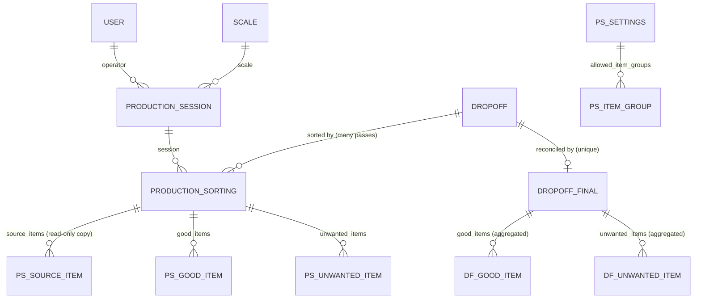
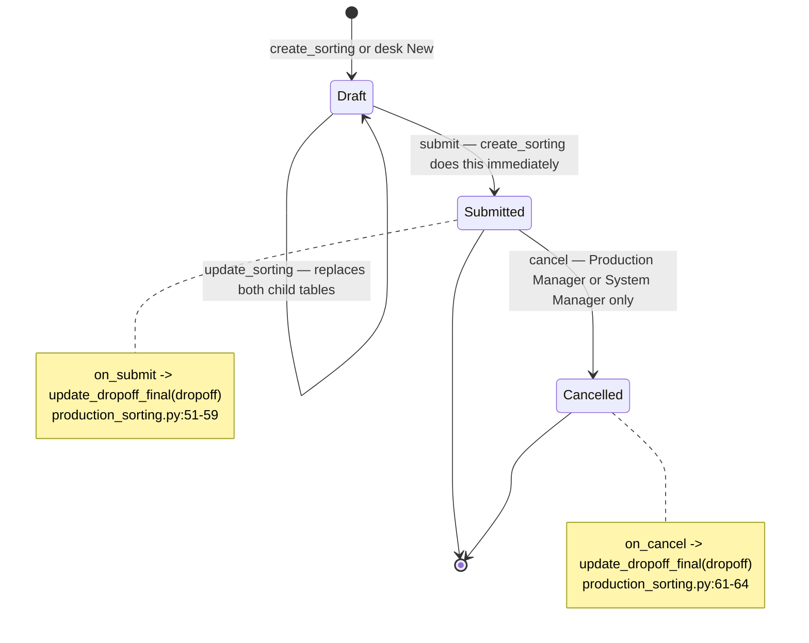
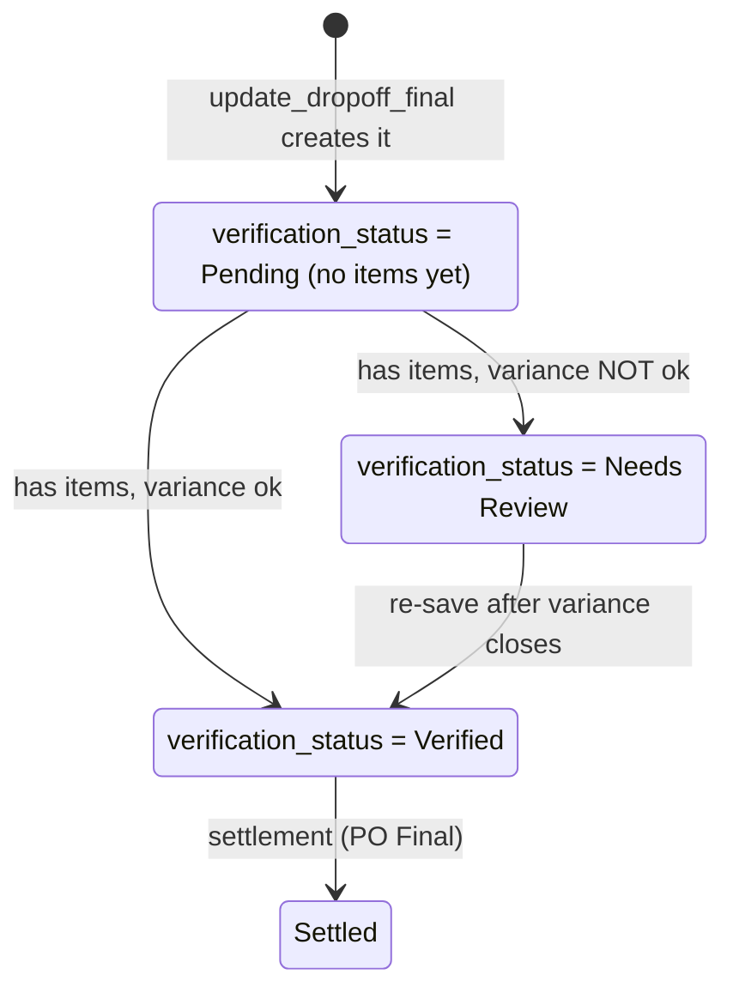
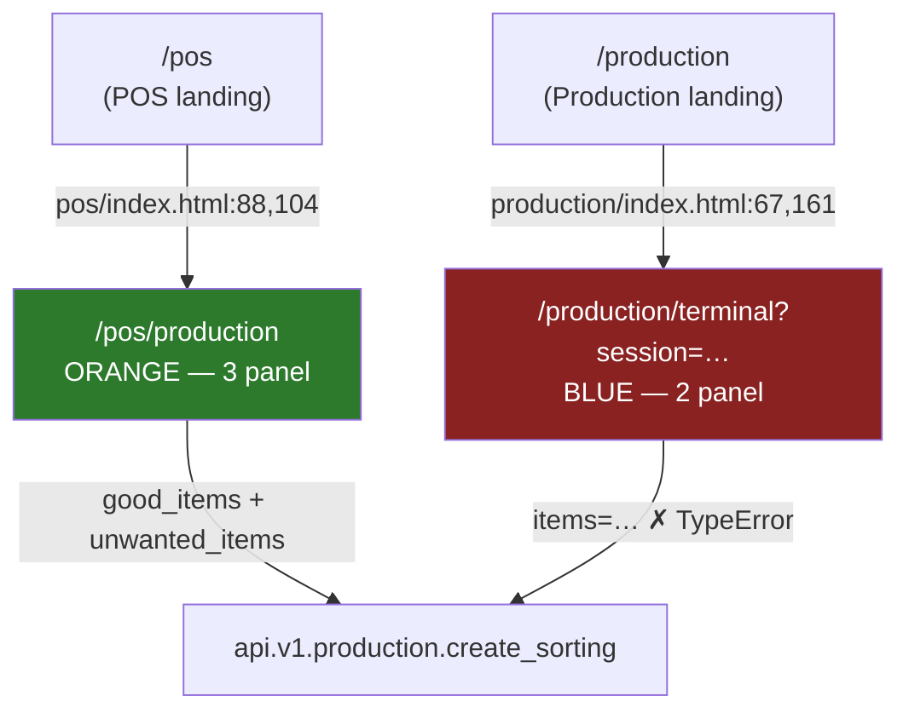

# Production Sorting — Developer & Admin Reference

> **Status:** Production — the API and the desk form are in daily use. **One of the two web terminals is broken** (see §6).
> **Source:** `api/v1/production.py`, `scrap_metal_suite/doctype/production_sorting/`, `scrap_metal_suite/doctype/production_session/`, `scrap_metal_suite/doctype/production_sorting_settings/`, `scrap_metal_suite/doctype/dropoff_final/`, `www/production/`, `www/pos/production.*`, `public/js/production-terminal.js`
> **Last verified:** 2026-08-21 against `feature/container-redesign` (`ce7a9d6` + uncommitted delta), site `metal`

---

## 1. Purpose & scope

Production Sorting is the QA/QC step that happens **after** a drop-off has been received and weighed. Receiving establishes *how much* arrived. Sorting establishes *what it actually was* — splitting the delivered mass into material the yard keeps and pays for (**good**) and material it refuses and hands back (**unwanted**).

**What this subsystem owns:**

- `Production Session` — who is sorting, on which scale, since when.
- `Production Sorting` — one submittable sorting pass against one completed `Dropoff`. Many sortings may target the same drop-off.
- `Production Sorting Settings` — the allowed Item Groups for the sorting item grid.
- The two web terminals under `/production` and `/pos/production`.

**What it does not own:**

- **Variance and verification.** Despite the field names left over in the database, `Production Sorting` computes **no variance at all**. The `Pending / Verified / Needs Review` state machine lives entirely on `Dropoff Final` (`dropoff_final.py:102-109`). See §4.
- **The drop-off itself.** Sorting reads `Dropoff` and never writes it. See [12 — Drop-off & Containers](12-dropoff-receiving.md).
- **Money.** `Dropoff Final` is the handoff object; settlement consumes it. See [30 — Settlement](30-settlement.md). This document covers only the sorting side of that boundary.

**The boundary in one sentence:** submitting a `Production Sorting` triggers `update_dropoff_final()` (`production_sorting.py:51-59`), which creates or re-saves the `Dropoff Final` for that drop-off; `Dropoff Final.before_save` then re-aggregates *every* submitted sorting for the drop-off and recomputes verification from scratch.

---

## 2. Data model



### DocTypes

| DocType | Type | Purpose |
|---|---|---|
| `Production Sorting` | **Submittable** | One sorting pass against one completed `Dropoff`. `production_sorting.json:270` |
| `Production Sorting Good Item` | Child | Material kept and payable. `item_code`, `weight`, `uom`, `remarks` |
| `Production Sorting Unwanted Item` | Child | Material returned. Adds `return_reason` (`reqd: 1`) |
| `Production Sorting Source Item` | Child | Read-only snapshot of `Dropoff.item_summary` at insert time |
| `Production Sorting Settings` | **Single** | `variance_threshold_percent`, `default_uom`, `allowed_item_groups` |
| `Production Sorting Item Group` | Child | One allowed `Item Group` row |
| `Production Session` | Normal | Operator + scale + open/closed lifecycle |
| `Production Sorting Item` | Child | **DEAD.** Legacy `sorted_items` table from the pre-good/unwanted schema. Zero rows in the DB; referenced by no other DocType and no code. See §10. |

### Fields that carry behaviour

| Field | DocType | Type | Why it matters |
|---|---|---|---|
| `dropoff` | `Production Sorting` | Link, `reqd` | The only hard input. **Not unique** — the current JSON dropped the `unique: 1` the pre-March schema had, so a drop-off can carry many sorting passes and `Dropoff Final` sums them all (`dropoff_final.py:24-28`) |
| `session` | `Production Sorting` | Link, read-only | Written by `create_sorting`; `operator` and `scale` are `fetch_from` this (`production_sorting.json:96,104`) |
| `good_items` / `unwanted_items` | `Production Sorting` | Table | The whole payload. `calculate_totals` sums both on every `validate` (`production_sorting.py:39-49`) |
| `total_weight` | `Production Sorting` | Float(3), read-only | `total_good_weight + total_unwanted_weight`. Read by `Production Session.close_session` and `get_session_summary` |
| `status` | `Production Sorting` | Select | `Draft / In Progress / Completed / Cancelled` — **never advanced past `Draft` by any code.** See §10 |
| `docstatus` | `Production Sorting` | (Frappe) | The **real** lifecycle. 0 draft → 1 submitted → 2 cancelled |
| `variance_threshold_percent` | `Dropoff Final` | Percent, default `0.1` | The only threshold that actually gates verification (`dropoff_final.json:205`) |
| `verification_status` | `Dropoff Final` | Select, read-only | `Pending / Verified / Needs Review` — the real one |
| `allowed_item_groups` | `Production Sorting Settings` | Table | Drives the item grid on `/production/terminal` **only**. `/pos/production` ignores it entirely (§6) |

### Orphaned database columns

`tabProduction Sorting` still carries columns from the schema that was replaced in March 2026 (`production_sorting.json.backup` is the old definition). Frappe does not drop columns on migrate, so they persist with their old SQL defaults but are **absent from the DocType meta**:

| Column | SQL default | Reality |
|---|---|---|
| `verification_status` | `'Pending'` | Never written by any code. Always `'Pending'` |
| `weight_variance`, `variance_percent`, `variance_ok`, `total_sorted_weight` | `0` | Never written |
| `sorted_by` | `NULL` | Never written; replaced by `operator` |

Verified: `frappe.get_meta("Production Sorting").get_field("verification_status")` returns `None`, while `SHOW COLUMNS` on the SQL table `tabProduction Sorting` still lists it. Two live endpoints read the column through raw `frappe.db.get_value`, which bypasses the meta, and therefore return a permanent `'Pending'` — see §10.

---

## 3. Lifecycle / state machine

### Production Sorting (docstatus is the real state)



| From | To | Trigger | Guard | Source |
|---|---|---|---|---|
| — | Draft | `create_sorting` | session Open + owned by caller; dropoff exists and `status == "Completed"`; ≥1 item; every weight > 0 | `production.py:330-375` |
| Draft | Submitted | `create_sorting` submits inline | none beyond the above | `production.py:386` |
| Draft | Submitted | `complete_sorting` | ≥1 item; `docstatus == 0`; caller owns it or is Production Manager / System Manager | `production.py:475-489` |
| Draft | Draft | `update_sorting` | `docstatus == 0`; ownership as above | `production.py:417-426` |
| Submitted | Cancelled | desk **Cancel** | role has `cancel` on the DocType (Production Worker does not) | `production_sorting.json:305` |

**`create_sorting` never leaves a draft behind.** It inserts and submits in the same call (`production.py:385-386`). `update_sorting` and `complete_sorting` therefore only reach documents created in the desk, or created by a client that skipped `create_sorting`. Verified against live data: every one of the 64 `Production Sorting` rows on site `metal` is `docstatus` 1 or 2 — none is 0.

### Dropoff Final (the verification state machine)



`Dropoff Final.before_save` runs the whole chain every time — aggregate, total, variance, verification, auto-complete (`dropoff_final.py:10-16`). It is idempotent by design: `update_dropoff_final` re-saves an existing record rather than patching it (`production.py:545-549`).

`auto_complete_if_done` is one-way: once `status` is `Unsettled` or `Settled` it returns immediately (`dropoff_final.py:113-114`), so a later cancelled sorting cannot pull a settled drop-off backwards.

---

## 4. Variance & verification logic

**All of it lives on `Dropoff Final`. `Production Sorting` computes none of it.**

`ProductionSorting.validate` calls exactly one method — `calculate_totals` (`production_sorting.py:11-12`), which does:

```python
total_good_weight      = Σ good_items[].weight            # production_sorting.py:41-43
total_unwanted_weight  = Σ unwanted_items[].weight        # production_sorting.py:45-47
total_weight           = total_good_weight + total_unwanted_weight   # production_sorting.py:49
```

That is the complete server-side arithmetic on the sorting document. No comparison against the drop-off, no threshold, no status change.

### The real formulas (`dropoff_final.py:85-109`)

```python
# 1. aggregate every submitted sorting for this dropoff, by item_code
#    (unwanted keyed by item_code + return_reason)          dropoff_final.py:18-77
total_good_weight     = Σ good_items[].weight               # :81
total_unwanted_weight = Σ unwanted_items[].weight           # :82
total_verified_weight = total_good_weight + total_unwanted_weight   # :83

# 2. variance — note the sign: dropoff MINUS sorted
weight_variance  = dropoff_total_weight - total_verified_weight     # :87
variance_percent = abs(weight_variance / dropoff_total_weight) * 100 if dropoff_total_weight > 0 else 0   # :89-92

# 3. threshold
threshold = flt(self.variance_threshold_percent)                    # :94
if not threshold:                                                   # :95   <-- effectively dead, see below
    threshold = flt(get_single_value("Production Sorting Settings",
                                     "variance_threshold_percent")) or 5.0   # :96-98
variance_ok = variance_percent <= threshold                         # :100

# 4. verification
if not good_items and not unwanted_items:  verification_status = "Pending"       # :104-105
elif variance_ok:                          verification_status = "Verified"      # :106-107
else:                                      verification_status = "Needs Review"  # :108-109
```

### Threshold: what the effective value actually is

| Source | Value on site `metal` | Reaches verification? |
|---|---|---|
| `Dropoff Final.variance_threshold_percent` per-document value | empty on new docs | **Yes, when set** — a per-document override |
| `Production Sorting Settings.variance_threshold_percent` | `0.1` | **Yes** — used whenever the document field is empty |
| Hardcoded final fallback | `5.0` (`dropoff_final.py:98`) | Only if the Setting is also empty (it is `reqd: 1`, so in practice never) |

**Fixed 2026-08-21.** Until then the Settings value never reached `Dropoff Final`: the field carried a JSON schema default of `0.1`, and Frappe applies schema defaults during `new_doc`/`insert`, **before** `validate()` runs. So `flt(self.variance_threshold_percent)` was always truthy and the `if not threshold` branch was unreachable. Setting the Settings value to `7.77` produced a document that still used `0.1`.

The fix was deleting `"default": "0.1"` from `dropoff_final.json`. **No code changed** — the three-tier fallback was correct as written. Behaviour was unchanged at the time of the fix, because both defaults were `0.1`; only the ability to change it took effect.

Verified after the fix (rolled back):

```
Settings=0.1  ->  threshold used 0.1,  variance 1.00%  ->  variance_ok=False
Settings=7.5  ->  threshold used 7.5,  variance 1.00%  ->  variance_ok=True
```

Guarded by `api_test/test_variance_threshold.py`, which asserts the field never regains a default — confirmed to fail 4 of its 5 checks when the default is reintroduced.

### Where the Settings threshold *is* used

Only for the blue terminal's live preview badge: `terminal.py:48` reads it into `context.variance_threshold`, which becomes `state.varianceThreshold` (`terminal.html:202`) and drives the client-side badge at `terminal.html:436`. It is advisory only — nothing server-side consults it.

`www/pos/production.py:102-116` also builds a `context.settings` dict containing the threshold, but **neither `production.html` nor `production-terminal.js` references `settings`**. It is computed and discarded.

### Client-side previews differ from the server

| | Formula | Threshold used | Source |
|---|---|---|---|
| Server (`Dropoff Final`) | `dropoff − sorted` | `Dropoff Final.variance_threshold_percent` (0.1) | `dropoff_final.py:87,100` |
| Blue terminal | `sorted − dropoff`, `abs(pct) <= threshold` | `Production Sorting Settings` (0.1) | `terminal.html:432-436` |
| Orange terminal | `sorted − dropoff`, **displayed only, never compared** | none | `production-terminal.js:579-586` |

The sign convention is inverted between the terminals and the server. Magnitudes agree; the displayed `+/−` does not.

---

## 5. API surface

All 16 whitelisted endpoints live in `scrap_metal_suite/api/v1/production.py`. Every one calls `check_production_operator()` as its first statement — which admits **`Production Worker`, `Production Manager`, or `System Manager`** and rejects `Guest` (`auth.py:21-32`). Note the role is `Production Worker`, not "Production Operator"; a `Production Operator` role does exist on the site but is used only by `Scrap Weight Container` (`scrap_weight_container.json:319`) and grants nothing here.

| # | Endpoint (`…api.v1.production.`) | Args | Returns | Auth | Notes |
|---|---|---|---|---|---|
| 1 | `open_session` | `scale=None` | `{session, operator, opening_time}` | `check_production_operator` :15 | Throws if the caller already has an Open session (:17-24). Uses plain `session.insert()` (:31) — works because Production Worker has `create` on the DocType. **Does not lock the scale**: sets `Production Session.scale` but never writes `Scale.in_use`. See §10 |
| 2 | `close_session` | `session` | `{total_sortings, total_weight_sorted}` | :43 + ownership :46-50 | Non-owners need Production Manager or System Manager. Delegates to `ProductionSession.close_session` (`production_session.py:39-61`), which recounts from `tabProduction Sorting` and releases the scale via `on_update` (`production_session.py:63-71`) |
| 3 | `get_active_session` | — | session dict, or `None` | :57 | Enriches with the scale's full serial config (`baud_rate`, `parity`, `unit_conversion_factor`, …) when a scale is set (:66-86). This is how the orange terminal gets its serial parameters |
| 4 | `update_session_activity` | `session` | `{success: bool}` | :94 + ownership :103-104 | Heartbeat. Returns `{success: False}` (no throw) when the session is not Open (:101-102). Writes `last_activity` with `update_modified=False` (:106-109) so it does not churn `modified` |
| 5 | `get_session_summary` | `session` | `{session, totals:{sorting_count, total_weight}}` | :116 | `totals` is a **live** `SUM` over `tabProduction Sorting` (:127-133), independent of the denormalised session fields. Counts cancelled sortings too — no `docstatus` filter |
| 6 | `set_session_scale` | `session, scale` | `{session, scale, scale_name, scale_type}` | :119 + ownership :148-151 | The only place a scale is locked (`in_use`, `in_use_by_session` :173-176). Throws if the session already has a scale (:153-154), if the scale is inactive (:164-165), or if it is held by another session (:166-168). Non-owner override here is **System Manager only** — Production Manager is not accepted (:150) |
| 7 | `lookup_dropoff` | `query` | `[dropoff dict]` (max 10) | :189 | `[]` for queries under 2 chars (:191-192). Exact-name match short-circuits (:200-207); otherwise `LIKE %q%` across `name`, `license_plate`, `supplier_name` (:210-222). Filters `status = 'Completed'`. Adds `has_sorting` per row (:224-227). **LIKE wildcards in `query` are not escaped** — `%` matches everything |
| 8 | `search_dropoff` | `query` | same | via `lookup_dropoff` | One-line alias (:231-234). Used by the orange terminal; the blue one calls `lookup_dropoff` directly |
| 9 | `get_dropoff_for_sorting` | `dropoff` | `{name, supplier, supplier_name, license_plate, total_actual_weight, status, source_items[], existing_sorting}` | :240 | Loads the full `Dropoff` doc (:242) — `frappe.get_doc` does no permission check, which is why it works for a Production Worker who has **no read permission on `Dropoff`**. Raises `DoesNotExistError` for an unknown name. `existing_sorting` reads the orphan `verification_status` column (:255) and returns only **one** row even when several sortings exist |
| 10 | `get_allowed_items` | — | `{items[], groups{}, group_names[]}` | :273 | Reads `Production Sorting Settings.allowed_item_groups` (:275-279); returns a bare `[]` (not a dict) when none are configured (:276-277) — an inconsistent shape callers must handle. Filters `Item.disabled = 0` (:281-289) |
| 11 | `create_sorting` | `session, dropoff, good_items=None, unwanted_items=None` | `{name, status, total_good_weight, total_unwanted_weight, total_weight}` | :309 | Accepts lists or JSON strings (:311-321). Throws when both lists are empty (:326-327), when the session is not Open or not the caller's (:330-337), when the dropoff is missing or not `Completed` (:340-344), and when any weight ≤ 0 (:349-352, :366-368). `remarks` and `return_reason` are `sanitize_html`-ed and truncated to 1000 / 500 chars. **Inserts and submits** (:385-386) |
| 12 | `update_sorting` | `sorting_name, good_items=None, unwanted_items=None` | same shape | :398 + ownership :422-426 | Throws on `docstatus` 1 or 2 (:417-420). **Replaces both tables wholesale** — passing only `good_items` silently wipes `unwanted_items` (:429, :444). Rarely reachable in practice, since `create_sorting` submits |
| 13 | `complete_sorting` | `sorting_name` | same shape | :471 + ownership :483-487 | Throws on empty (:475-476) or already-submitted/cancelled (:478-481). Returns **no** `verification_status` or `variance_ok`, though the blue terminal reads both (§6) |
| 14 | `get_sorting_for_dropoff` | `dropoff` | `{name, status, verification_status, total_weight}` or `None` | :501 | `verification_status` is the orphan column — always `'Pending'` (:506) |
| 15 | `get_scales` | `usage_type=None` | `[scale dict]` | :515 | Returns full serial config. **No `is_active` filter** — inactive scales are returned and must be filtered client-side |
| 16 | `get_dropoff_final_status` | `dropoff` | `Dropoff Final` fields + `sorting_count`, or `None` | :563 | The only endpoint exposing real verification data. `sorting_count` counts `docstatus = 1` only (:575-578) |

**Internal helper (correctly not whitelisted):** `update_dropoff_final(dropoff)` (`production.py:534-557`) — creates a `Dropoff Final` if none exists, otherwise re-saves the existing one to force recomputation. Called from `ProductionSorting.on_submit` and `on_cancel`.

---

## 6. UI surface

### Two terminals exist. Both are routable. Only one works.



**Canonical: `/pos/production` — the orange terminal.** It is the only one whose calls match the current API contract.

**`/production/terminal` (blue) is broken.** Its save path passes an obsolete `items` argument:

```javascript
// www/production/terminal.html:473-474
method: 'scrap_metal_suite.api.v1.production.create_sorting',
args: { session: state.session, dropoff: state.dropoff, items: JSON.stringify(items) }
```

but the endpoint signature is `create_sorting(session, dropoff, good_items=None, unwanted_items=None)` (`production.py:307`). Verified directly:

```
create_sorting(session="X", dropoff="Y", items="[…]")
  -> TypeError: create_sorting() got an unexpected keyword argument 'items'
```

`update_sorting` has the same defect (`terminal.html:469`). **Every save from the blue terminal fails.** It cannot produce a `Production Sorting`.

> ⚠️ This contradicts `docs/UI_TERMINAL_UNIFORMITY_PLAN.md:90-96` ("Keep Blue Production Terminal … Delete `pos/production.html`") and `docs/guide/admin/00-architecture.md`, which lists `/production/terminal` as the Production Sorting entry point. Both statements describe the *intended* architecture, which is a defensible target — the blue terminal is genuinely the better-structured page. They do not describe what currently works. Deleting the orange terminal today would remove the only functional sorting UI.

### Feature comparison (verified by fetching both pages as Administrator)

| | Blue — `/production/terminal` | Orange — `/pos/production` |
|---|---|---|
| Context builder | `www/production/terminal.py` | `www/pos/production.py` |
| Template | `www/production/terminal.html` (606 lines, ~425 inline JS) | `www/pos/production.html` (371 lines) + `public/js/production-terminal.js` (658 lines) |
| CSS | `production.css` (`.prod-*`, 1226 lines) | `pos.css` + `production-theme.css` (`.production-*`, 1128 lines) |
| Layout | 2-panel, right pane fixed 460px | 3-panel (dropoff / weighing / sorting) |
| **Saves successfully** | ❌ `TypeError` | ✅ `good_items` + `unwanted_items` (`production-terminal.js:614-620`) |
| **Good / unwanted split** | ❌ single cart, no split | ✅ tab switch (`production.html:185-192`, `production-terminal.js:373-377,493-497`) |
| **Live scale reading** | ❌ `scale_reader.js` never loaded (`terminal.html:5-10`); the weight modal is manual entry only | ✅ WebSerial via `scale_reader.js` (`production.html:9`), with `unit_conversion_factor` applied (`production-terminal.js:203`) |
| Scale locking | ✅ `set_session_scale` (`terminal.html:548-562`) marks `Scale.in_use` | ❌ `open_session(scale=…)` only (`production-terminal.js:49-70`) — never locks |
| Item grid source | `Production Sorting Settings.allowed_item_groups` → 5 items, tabs `Scrap Metal` / `Bag and wastage` | **First** `POS Profile Scrap` (`production.py:58-62`) → 3 items, no categories |
| POS_CORE (theme/clock/i18n) | ✅ (`terminal.html:9,207-223`) | ❌ hand-rolled `prodToggleLanguage` (`production.html:163-168`) |
| `data-i18n` attributes | ✅ | ❌ imperative `updateProdText()` (`production.html:170-240`) |
| Theme toggle | ✅ | ❌ |
| Session heartbeat | ✅ 60 s (`terminal.html:220-222`) | ✅ 60 s (`production-terminal.js:107-116`) |
| Return reason UI | ❌ (no unwanted split at all) | ❌ **missing markup** — see §10 |
| Print button | ❌ | ❌ |

### Landing pages

| Route | File | Behaviour |
|---|---|---|
| `/production` | `www/production/index.py` + `index.html` | Guest → `/login?redirect-to=/production` (:12-14). Requires Production Worker / Manager / System Manager (:16-18, :29-35). No open session → card calls `open_session()` **without a scale** (`index.html:155-166`), then redirects to the blue terminal |
| `/production/terminal` | `www/production/terminal.py` | Requires `?session=` (:17-20); renders `context.error` for session-not-found, closed, or belonging to another operator (:28-38). Loads allowed items (:47-65) |
| `/pos/production` | `www/pos/production.py` | Guest → `/login?redirect-to=/pos/production` (:12-14). Same role gate (:37-39). Renders the scale picker when no session is open, the sorting UI when one is |

All three return HTTP 301 → `/login?…` when unauthenticated and HTTP 200 when authenticated (verified with `curl` against `localhost:8000`).

### Desk surfaces

| Surface | File | Notes |
|---|---|---|
| `Production Sorting` form | `production_sorting.js` | Live variance headline at >0.1% (`:131-144`) — hardcoded, ignores all settings. Child-table totals recomputed client-side (`:111-128`) |
| — "View Dropoff Final" button | `production_sorting.js:7` | Gated on `status === 'Completed'`, which never happens. **The button never renders** |
| — `dropoff` fetch handler | `production_sorting.js:30-74` | Calls `frappe.client.get('Dropoff', …)`, which **does** enforce permissions. Verified: a `Production Worker` gets `PermissionError` (they have no read on `Dropoff`). Server-side `fetch_from` still fills the fields on save, so the failure is silent, not fatal |
| `Dropoff Final` form | `dropoff_final.js` | `frm.disable_save()` (`:51`) — fully derived. "View Sorting Sessions" routes to the filtered list (`:14-20`) |
| Workspace **SMT Production** | `workspace/smt_production/smt_production.json` | Shortcuts to `Production Sorting` and `Production Sorting Settings` |

### Print format `ใบคัดแยก`

**It is attached to `Dropoff Final`, not to `Production Sorting`.**

| Property | Value |
|---|---|
| Name | `ใบคัดแยก` (title renders as `ใบคัดแยก / Sorting Report`) |
| `doc_type` | `Dropoff Final` |
| `module` / `standard` / type | Scrap Metal Suite / Yes / Jinja |
| Default for its DocType | Yes — `dropoff_final.json:5` (`default_print_format`) |
| Shipped as | Fixture — `hooks.py:264-267` exports all Scrap Metal Suite print formats |

Sections: bilingual header with status badge · General Information (drop-off, supplier, plate, verification badge, PO Final if set) · Good Items table with total · Unwanted Items table with `return_reason` column and total · Variance Summary (drop-off weight, verified total, variance kg + %, Pass/Fail) · two signature blocks (ผู้คัดแยก / ผู้ตรวจสอบ) · printed-at footer. Item cells render `item.item_name or item.item_code` verbatim — Thai names pass through untranslated, per `docs/BILINGUAL_GUIDE.md`.

**There is no print format on `Production Sorting`** — verified: `frappe.get_all("Print Format", {"doc_type": "Production Sorting"})` returns `[]`. Printing one falls back to Frappe's Standard format. `test_full_workflow.py:1016` probes for one and records a *skip*, not a failure.

---

## 7. Business rules & validations

**Session rules**

- **One open session per operator.** Enforced twice: at the API (`production.py:17-24`) and in the controller's `validate` (`production_session.py:18-37`). The controller check is the backstop for desk-created sessions.
- **You may only close, modify, or heartbeat your own session.** `close_session` allows Production Manager and System Manager to override (`production.py:46-50`); `set_session_scale` allows **only** System Manager (`production.py:148-151`) — an asymmetry, probably unintentional.
- **A scale is held by one session at a time.** `set_session_scale` refuses a scale that is inactive or already `in_use` (`production.py:164-168`) and writes the lock (`:173-176`). Released on close by `ProductionSession.on_update` (`production_session.py:63-71`) and by the idle-session cron (`scheduler.py:80-84`).
- **Sessions auto-close after 10 minutes idle.** `close_idle_production_sessions` runs every 5 minutes (`hooks.py:165-168`, `scheduler.py:54-98`) and only touches sessions with a non-null `last_activity` — a session that never sent a heartbeat is never auto-closed (`scheduler.py:66`).

**Sorting rules**

- **The drop-off must be `Completed`.** Sorting a drop-off still being weighed would compare against a moving total (`production.py:343-344`).
- **At least one item.** Both on create (`production.py:326-327`) and on submit (`production.py:475-476`).
- **Every weight must be > 0.** Enforced per row in all three write paths (`production.py:349-352`, `:366-368`, `:432-434`, `:446-449`).
- **Free text is sanitised and capped.** `remarks` → `sanitize_html` + 1000 chars; `return_reason` → `sanitize_html` + 500 chars (`production.py:358`, `:373-374`).
- **Source items are snapshotted once.** `populate_source_items` copies `Dropoff.item_summary` at `before_insert` and returns early if `source_items` is already populated (`production_sorting.py:21-37`). The snapshot is deliberate: a later re-weigh of the drop-off must not silently rewrite history on a submitted sorting.
- **`posting_time` and `operator` default at insert.** `nowtime()` and `frappe.session.user` (`production_sorting.py:14-18`).
- **A submitted sorting cannot be edited.** `update_sorting` refuses `docstatus` 1 or 2 (`production.py:417-420`), backed by Frappe's own submit semantics.
- **Multiple sortings per drop-off are allowed.** No uniqueness constraint. `Dropoff Final` sums them (`dropoff_final.py:24-28`). Live example on site `metal`: `DO-260427-00002` carries four submitted sortings, all aggregated into `DFL-260427-00001`.
- **Submit and cancel both refresh `Dropoff Final`.** `production_sorting.py:51-64`. Cancel does not delete anything — it re-runs the aggregation.

**Aggregation rules (`dropoff_final.py:18-77`)**

- Good items are merged by `item_code`; unwanted items by `item_code + return_reason` (`:47`, `:58`) — so the same grade rejected for two different reasons stays as two rows on the report.
- Only `docstatus = 1` sortings are aggregated (`:26`).
- `sorting_sessions` is a comma-joined list of contributing sorting names (`:77`).

---

## 8. Permissions

Roles on the site: `Production Worker`, `Production Manager` (plus an unrelated `Production Operator` used only by `Scrap Weight Container`).

| DocType | Production Worker | Production Manager | SMT Accountant / Accounting Manager |
|---|---|---|---|
| `Production Sorting` | read, write, create, **submit** — no cancel, no delete | read, write, create, submit, cancel, delete | read / report / export / print / email only |
| `Production Session` | read, write, create — no delete | read, write, create, delete | read-only |
| `Dropoff Final` | read, write, create — no delete | read, write, create, delete | read-only |
| `Scale` | read, write | *(no explicit grant)* | read-only |
| `Dropoff` | **none** | *(no explicit grant)* | read-only |
| `Production Sorting Settings` | none | none | none — System Manager only (`production_sorting_settings.json:60-70`) |

`System Manager` holds everything.

**The two-layer pattern.** API endpoints authorise via `check_production_operator()` and then use unguarded `frappe.get_doc` / `frappe.db.sql`, which do not consult DocType permissions. This is intentional and correct — the guard has already run. It has one visible consequence: a `Production Worker` can sort a drop-off through the terminal but **cannot open that drop-off in the desk**, because they have no `read` on `Dropoff`. Verified: `lookup_dropoff`, `get_dropoff_for_sorting`, `get_allowed_items` and `get_scales` all succeed for a fresh Production Worker, while `frappe.client.get("Dropoff", …)` raises `PermissionError` and `frappe.has_permission("Dropoff", "read")` returns `False`.

Neither `Production Worker` nor `Production Manager` can edit `Production Sorting Settings`. Changing the allowed Item Groups requires System Manager.

---

## 9. Configuration

### Production Sorting Settings (Single)

| Field | Type | Default | Effect |
|---|---|---|---|
| `variance_threshold_percent` | Percent, `reqd` | `0.1` (JSON), `0.1` live | **Only** the blue terminal's client-side badge (`terminal.py:48` → `terminal.html:436`). Does **not** gate verification — see §4 |
| `default_uom` | Link → UOM | `Kg` | ⚠️ Declared but read by no code. Every write path hardcodes `item.get("uom", "Kg")` (`production.py:355`, `:371`) |
| `allowed_item_groups` | Table | — | Item grid for `/production/terminal` and `get_allowed_items`. Live value: `Scrap Metal`, `Bag and wastage` |

### Where the item grid really comes from

The two terminals disagree, and only one honours the Settings:

| Terminal | Source | Live result on `metal` |
|---|---|---|
| Blue `/production/terminal` | `Production Sorting Settings.allowed_item_groups` → `Item` where `item_group IN (…) AND disabled = 0` (`terminal.py:50-65`) | 5 items; tabs `Scrap Metal`, `Bag and wastage` |
| Orange `/pos/production` | `frappe.get_all("POS Profile Scrap", limit=1)` — **the first profile the database happens to return**, no `order_by` (`www/pos/production.py:58-62`) | 3 items from `_TEST_CTNWF_Profile`; category tabs empty because that profile's `category` values are `NULL` |

Practical consequence: to change what the **working** terminal shows, edit a POS Profile Scrap, not Production Sorting Settings. And because the profile is picked without ordering, adding or deleting a profile can change the item grid without anyone touching sorting configuration.

### Scales

Both terminals filter for `usage_type = "Production"` (`terminal.html:528`, `www/pos/production.py:95`). Site `metal` has `Prod-1` and `Prod-2`. The orange page's landing query also filters `is_active = 1`; the `get_scales` endpoint does not.

### Scheduler

| Job | Schedule | Effect |
|---|---|---|
| `scrap_metal_suite.scheduler.close_idle_production_sessions` | `*/5 * * * *` (`hooks.py:165-168`) | Closes Open sessions whose `last_activity` is older than 10 minutes and releases their scales (`scheduler.py:54-98`) |

### Naming series

`Production Sorting` → `SORT-.YY.MM.DD.-`; `Production Session` → `PSORT-SES-.YY.MM.DD.-`. Both are additionally pinned by a `Property Setter` row. **A change to the JSON `options` will be silently overridden by the Property Setter** — check `frappe.get_all("Property Setter", {"doc_type": "Production Sorting", "field_name": "naming_series"})` if an edit appears not to take.

---

## 10. Known issues & gotchas

**Blocking**

- **The blue terminal cannot save.** `www/production/terminal.html:469,474` pass `items=` to `create_sorting` / `update_sorting`, which take `good_items` / `unwanted_items`. Every save raises `TypeError`. The page also has no good/unwanted split, so even with the argument name fixed it could only ever write good items. Reproduce: open `/production`, start a session, pick a drop-off, add an item, press **Save**.
- **The blue terminal's completion alert reads fields the API does not return.** `terminal.html:497-498` reads `d.verification_status` and `d.variance_ok` from the `complete_sorting` response, which returns neither (`production.py:491-497`). Renders `undefined` and always picks the green indicator.
- **Missing i18n key.** `terminal.html:260` calls `POS_I18N.t('noCompletedDropoffs')`, defined in neither `pos-translations.js` nor `production-translations.js`. `t()` falls back to the raw key (`pos-translations.js:737`), so the empty-search state renders the literal string `noCompletedDropoffs`.

**Data-correctness**

- **`Production Sorting.verification_status` is an orphan column and always `'Pending'`.** It exists in `tabProduction Sorting` with SQL default `'Pending'` but not in the DocType meta, so nothing writes it. `get_dropoff_for_sorting` (`production.py:255`) and `get_sorting_for_dropoff` (`production.py:506`) still read it and hand a permanently meaningless value to callers. Verified across all 64 live rows. **Use `get_dropoff_final_status` for real verification state.** Same applies to the columns `weight_variance`, `variance_percent`, `variance_ok`, `total_sorted_weight`, `sorted_by`.
- **`Production Sorting.status` never leaves `Draft`.** `create_sorting` writes `"Draft"` (`production.py:381`) and no code advances it, so `Completed` / `In Progress` / `Cancelled` are unreachable. All 64 live rows read `Draft` regardless of `docstatus`. Two consequences: the desk button gated on `status === 'Completed'` never renders (`production_sorting.js:7`), and the `status` column in a list view is worthless — filter on `docstatus` instead.
- ~~**`Production Sorting Settings.variance_threshold_percent` does not affect verification.**~~ **FIXED 2026-08-21** — the `Dropoff Final` schema default `0.1` was making the fallback at `dropoff_final.py:95-99` unreachable. Default removed; the Setting is now honoured and covered by `api_test/test_variance_threshold.py`. See §4.
- **A drop-off with zero total weight always verifies.** `dropoff_final.py:89-92` sets `variance_percent = 0` when `dropoff_total_weight <= 0`, so `variance_ok` is true and `auto_complete_if_done` promotes the record to `Unsettled` / `Verified` with no comparison at all. Live example: `DFL-260427-00001` — `dropoff_total_weight = 0.0`, `total_verified_weight = 15.001`, `verification_status = "Verified"`.
- **Cancelling the last sorting leaves stale aggregates.** `aggregate_from_sortings` returns early when no submitted sortings remain (`dropoff_final.py:30-31`) — *before* clearing `good_items` / `unwanted_items` (`:34-35`). The `Dropoff Final` keeps the items and totals from the now-cancelled pass. Live example: `DFL-260415-00075` has `total_verified_weight = 2.5` and `sorting_sessions = NULL`. Fix would be to move the clear above the early return.
- **`get_dropoff_for_sorting` returns only one `existing_sorting`.** `frappe.db.get_value` (`production.py:253-256`) picks a single row even when a drop-off has several. The blue terminal assigns it to `state.sortingName` (`terminal.html:343-345`) and would edit an arbitrary pass.
- **`get_session_summary` counts cancelled sortings.** The live `SUM` at `production.py:127-133` has no `docstatus` filter, so a cancelled pass still inflates `sorting_count` and `total_weight`. `Production Session.close_session` has the same gap (`production_session.py:45-49`), while `get_dropoff_final_status` correctly filters `docstatus = 1` (`production.py:575-578`).

**Operational**

- **The orange terminal never records a return reason.** `production-terminal.js:485-491` builds unwanted rows without `return_reason`, so `create_sorting` applies its `"Other"` default (`production.py:373`). The translation code at `production.html:327-328` looks for a `.return-reason-section label` that **does not exist in the markup** — the selector matches nothing and the `if` guard swallows it. Every unwanted item recorded through the working terminal prints as "Other" on `ใบคัดแยก`. Live data reflects this: the only `Other` rows came from the terminal; `Contamination` and `Wrong Material` rows all came from tests that call the API directly.
- **The orange terminal does not lock its scale.** It calls `open_session(scale=…)` (`production-terminal.js:49-70`), which sets `Production Session.scale` but never writes `Scale.in_use` (`production.py:26-31`). Two operators can pick the same physical scale. Worse, `set_session_scale` then refuses to help — it throws "Scale already set for this session" (`production.py:153-154`).
- **The orange terminal's item grid depends on an unordered query.** `frappe.get_all("POS Profile Scrap", limit=1)` (`www/pos/production.py:58`) — whichever profile the database returns first. Adding, renaming, or deleting a POS profile can silently change what sorters see. On site `metal` this currently resolves to a test profile with three items and no categories.
- **`context.settings` on the orange terminal is dead.** Computed at `www/pos/production.py:102-116`, referenced by neither `production.html` nor `production-terminal.js`.
- **A session that never heartbeats is never auto-closed.** `scheduler.py:66` requires `last_activity IS NOT NULL`. A session opened and abandoned before the first 60-second beat holds its scale lock indefinitely.
- **A Production Worker cannot open a `Dropoff` in the desk.** No read permission. The terminal works; the desk link does not, and `production_sorting.js:33-44` fails silently with `PermissionError`.

**Dead code**

- `Production Sorting Item` — the pre-March `sorted_items` child table. Zero rows; referenced by no DocType JSON and no code. Safe to delete.
- `production_sorting.json.backup` — the old schema, still on disk beside the live JSON. Useful as history, confusing as a sibling file.
- `manager_override`, `manager_override_by`, `cancelled_by`, `cancelled_at` on `Production Sorting` — read-only fields no code ever writes. `cancellation_reason` is editable but consumed by nothing.
- `public/css/production-theme-fix.css` — referenced by no template. Confirmed in the 2026-04-14 audit as W17; still present.
- `production-terminal.js` declares 12 module-level `let` globals (`:18-29`), all leaked to `window`.
- `dropoff_final.js:25` branches on `status === 'Completed'`, which is not one of the `Dropoff Final` status options (`Draft / In Progress / Unsettled / Settled / Cancelled`). That headline never fires.
- `Production Sorting Settings.default_uom` — never read.

**Security / robustness**

- **LIKE wildcards are not escaped** in `lookup_dropoff` (`production.py:210-222`). A query of `%` returns the 10 most recent completed drop-offs. Read-only and parameterised, so not injection — but not the intended search behaviour.
- `get_allowed_items` returns `[]` when no groups are configured but a `dict` otherwise (`production.py:276-277` vs `:299-303`). Callers must handle both.
- `item_code` values are not validated against the `Item` table before insert; the Link field catches it at save, but the error surfaces as a Frappe link validation rather than a useful message.
- No maximum-weight validation against the scale's `max_capacity_kg`, unlike the POS path.

---

## 11. Testing

| Suite | Covers | Run |
|---|---|---|
| `api_test/test_e2e_full_flow.py` (Stage 5, `:313-351`) | Gate on non-Completed drop-off, empty-items error, zero-weight error, happy path, `Dropoff Final` auto-creation | `bench --site metal execute scrap_metal_suite.api_test.test_e2e_full_flow.run` |
| `api_test/test_full_workflow.py` | Session open/duplicate/heartbeat/close (`:679-911`), sorting creation and edge cases (`:763-851`, `:1219-1307`), cross-user security (`:1372-1432`), role/permission matrix (`:1028-1108`), idle-session cron (`:949`), sorting variance → `Dropoff Final` (`:1691-1781`) | `bench --site metal execute scrap_metal_suite.api_test.test_full_workflow.run` |
| `api_test/test_full_loop.py` | Longer receiving → sorting → settlement loop | `bench --site metal execute scrap_metal_suite.api_test.test_full_loop.run` |
| `api_test/_e2e_walkthrough.py` | Lane A observational walkthrough (prints, does not assert) | `bench --site metal execute scrap_metal_suite.api_test._e2e_walkthrough.run` |
| `ui_test/test_demo_full_flow.py` | Playwright headed demo — drives the **desk** form at `/app/production-sorting/new` (`:248`), not either terminal | `SMT_UI_HEADLESS=1 SMT_UI_ADMIN_PWD='…' env/bin/pytest apps/scrap_metal_suite/scrap_metal_suite/ui_test/ -v` |

**Last run (2026-08-21):** `test_e2e_full_flow.run` → **24 passed, 0 failed, 0 skipped**.

**Not covered — what a green run does not prove:**

- **Neither web terminal is exercised by any test.** Every suite calls `api/v1/production.py` directly with correctly-named `good_items` / `unwanted_items`. This is exactly why the blue terminal's broken argument name survived: the API contract is tested, the caller is not. The Playwright test uses the desk form.
- No test asserts `Production Sorting.status`, so its permanent `Draft` is invisible to CI.
- No test asserts `Production Sorting.verification_status`, so the orphan column is invisible too.
- No test covers cancelling a sorting and re-checking `Dropoff Final` — which is where the stale-aggregate bug lives.
- No test covers a zero-weight drop-off reaching verification.
- No test covers the scale-locking asymmetry between `open_session` and `set_session_scale`.
- `test_full_workflow.py:1016` probes for a `Production Sorting` print format and records a **skip** when absent — so the missing format never fails a run.
