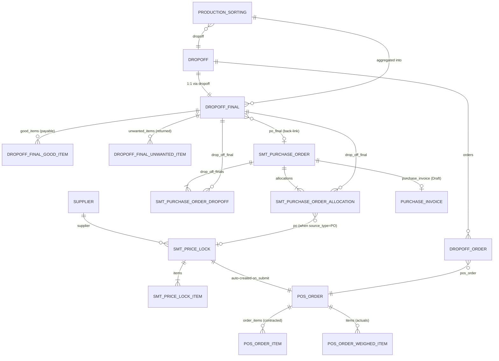
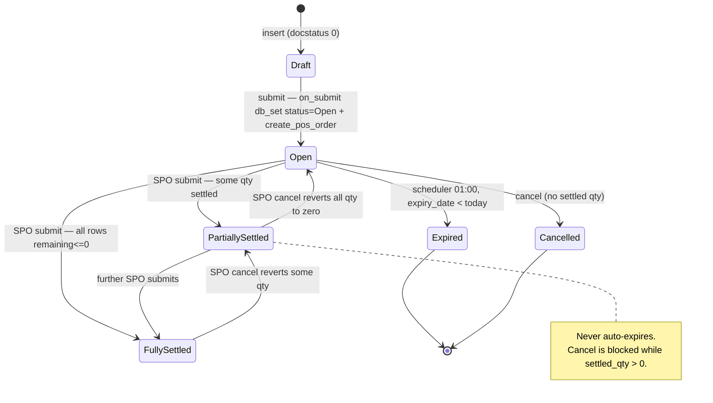
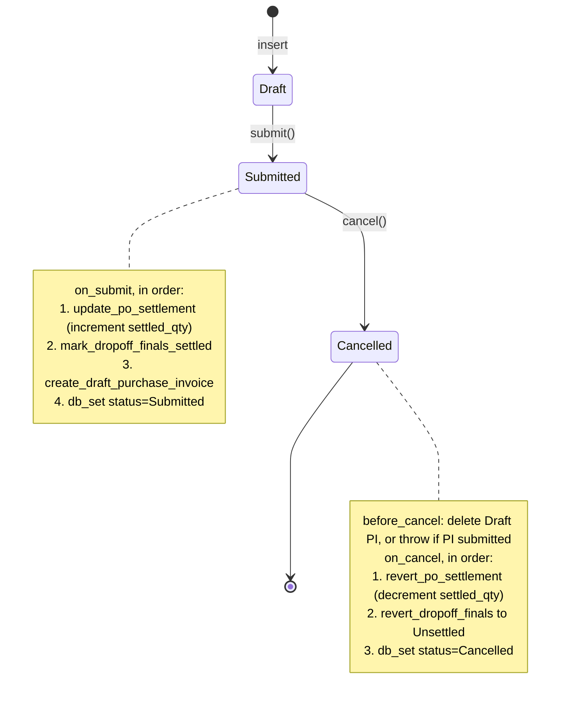
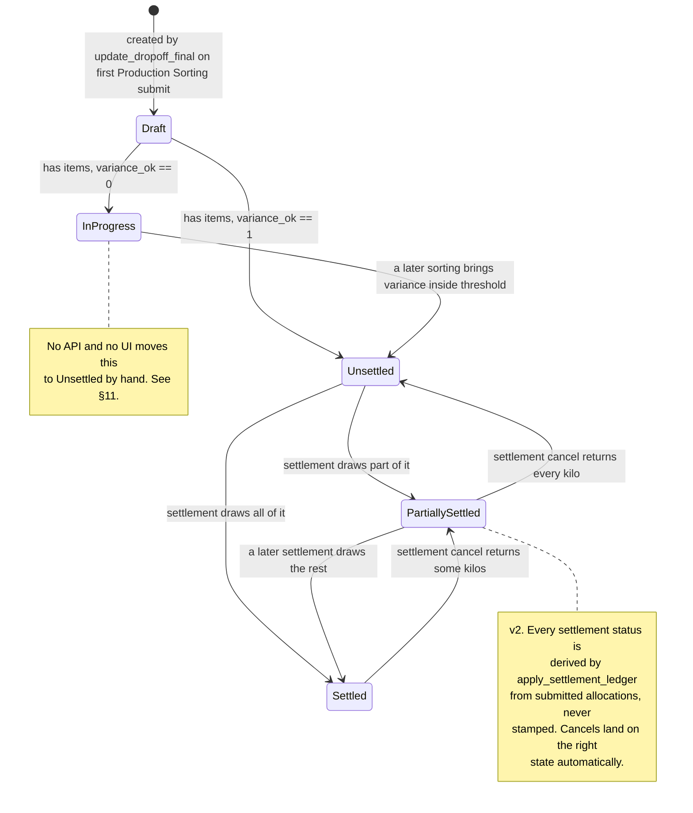

# Settlement — Developer & Admin Reference

> **Status:** Production — the money path is live and carries real documents, but three confirmed defects are listed in §11 and the module's own test suite is currently red (§12).
> **Source:** `scrap_metal_suite/doctype/smt_price_lock/smt_price_lock.py`, `scrap_metal_suite/doctype/smt_purchase_order/smt_purchase_order.py`, `scrap_metal_suite/doctype/dropoff_final/dropoff_final.py`, `scrap_metal_suite/doctype/pos_order/pos_order.py`, `scrap_metal_suite/doctype/dropoff/dropoff.py` (allocation), `scheduler.py`, `overrides/naming.py`, `fixtures/print_format.json`
> **Last verified:** 2026-08-21 against `feature/container-redesign` (HEAD `ce7a9d6`), live site `metal`

---

## 1. Purpose & scope

Settlement owns everything between **"we agreed a price"** and **"a Purchase Invoice exists"**. Concretely:

- Recording a locked buying rate per supplier per item grade (`SMT Price Lock`)
- Spawning the yard-facing delivery order from that lock (`POS Order`)
- Tracking how much contracted material has actually turned up (fulfilment)
- Converting accepted post-sorting weight into money against the lock (`SMT Purchase Order`)
- Handing off to ERPNext accounting via a Draft `Purchase Invoice`

**It does not own:** truck/bag weighing (see [12](12-dropoff-receiving.md)), grading and QA (see [20](20-production-sorting.md)), or anything after the Draft PI — no payment entries, no GL logic, no tax handling.

### Naming trap

The doctypes were renamed in commit `889fb12` ("Rename SMT PO → SMT Price Lock, SMT PO Final → SMT Purchase Order") but **the code, variables, error strings and design doc were not**. Throughout the source:

| Reads as | Actually means |
|---|---|
| `po`, `PO`, "the PO", `po_qty`, `po_rate`, `po_amount`, `total_po_value`, `expire_open_pos` | `SMT Price Lock` |
| `po_final`, "PO Final" | `SMT Purchase Order` |

`SMT Purchase Order` *also* has a `total_po_value` field, which there means "the portion of this settlement sourced from price locks" — a third sense of the same two letters. Read every `po` in this module with the doctype in hand.

---

## 2. Data model



| DocType | Type | Submittable | Purpose |
|---|---|---|---|
| `SMT Price Lock` | Parent | **Yes** | The agreed buying rate. Quantity + rate per item grade, optional expiry. |
| `SMT Price Lock Item` | Child | — | One locked grade. Carries the running `settled_qty` / `remaining_qty` ledger. |
| `SMT Purchase Order` | Parent | **Yes** | The settlement. Maps accepted weight to locks (or Spot) and drafts a PI. |
| `SMT Purchase Order Dropoff` | Child | — | Which Dropoff Finals this settlement closes. |
| `SMT Purchase Order Allocation` | Child | — | One line of money: qty × rate, sourced from a lock or Spot. |
| `Dropoff Final` | Parent | No | Post-sorting reconciliation per Drop-off. The settlement's input. |
| `Dropoff Final Good Item` | Child | — | Accepted weight per grade. **This is what gets paid for.** |
| `Dropoff Final Unwanted Item` | Child | — | Rejected weight per grade + reason. Never paid, never consumes a lock. |
| `POS Order` | Parent | No | The yard's delivery order. Auto-created from a lock. Carries no money at all. |
| `POS Order Item` | Child | — | Contracted weight per grade, plus running received/percent. |
| `POS Order Weighed Item` | Child | — | Actual allocated weight, one row per (dropoff, grade). |
| `Scrap Purchase` | Parent | No | **Legacy, unused.** See §10. |
| `Scrap Purchase Item` | Child | — | **Legacy, unused.** See §10. |

### Fields that carry behaviour

| Field | DocType | Type | Why it matters |
|---|---|---|---|
| `status` | `SMT Price Lock` | Select | `Open` / `Partially Settled` / `Fully Settled` / `Expired` / `Cancelled`. Gates allocation (`smt_purchase_order.py:80`) and expiry (`scheduler.py:110`). Read-only in the UI; every write is a `db_set`. |
| `expiry_date` | `SMT Price Lock` | Date | Optional. Blank ⇒ never auto-expires. Only consulted for `Open` locks. |
| `settled_qty` / `remaining_qty` | `SMT Price Lock Item` | Float(3) | The ledger. Mutated **only** by raw SQL in `update_settled_qty` (`smt_price_lock.py:98-103`). |
| `po_rate` | `SMT Price Lock Item` | Currency | The locked rate. Force-copied onto allocations, never read from the allocation row. |
| `source_type` | `SMT Purchase Order Allocation` | Select | `PO` ⇒ rate forced from the lock and quota consumed. `Spot` ⇒ operator-entered rate, no lock touched. |
| `po_item_row` | `SMT Purchase Order Allocation` | Data (hidden) | The `name` of the target `SMT Price Lock Item` row. Set server-side during validate; the settlement→lock write targets this, not `item_code`. |
| `custom_reference` | `SMT Purchase Order` | Data | If set, **becomes the docname** (`smt_purchase_order.py:15-17`). No uniqueness pre-check — a collision surfaces as a raw `DuplicateEntryError`. |
| `total_good_weight` | `Dropoff Final` | Float(3) | Fetched into `SMT Purchase Order Dropoff.total_weight`. Display only; coverage validation reads the child rows directly. |
| `status` | `Dropoff Final` | Select | `Unsettled` is the only value the settlement UI offers. Server-side the guard is weaker — see §8. |
| `contracted_weight` / `total_received` | `POS Order` | Float | Drive `fulfillment_percent` and `fulfillment_status`. Both written by the Drop-off allocator, not by the POS Order itself. |

**Precision.** Verified on site `metal`: `System Settings.float_precision = 3`, `currency_precision` unset (⇒ Frappe default 2), `Global Defaults.default_currency = THB`. Quantity fields declare `precision: 3`; money fields are `Currency` and rounded explicitly with `flt(..., 2)` in the controllers.

---

## 3. Document lifecycles

### 3.1 SMT Price Lock



| From | To | Trigger | Guard | Source |
|---|---|---|---|---|
| Draft | Open | `submit()` | validate passes | `smt_price_lock.py:38-40` |
| Open | Partially/Fully Settled | `SMT Purchase Order.on_submit` | — | `smt_price_lock.py:117-132` via `smt_purchase_order.py:197-202` |
| Open | Expired | cron `0 1 * * *` | `status == "Open"` **and** `expiry_date` set **and** `expiry_date < today()` **and** `docstatus == 1` | `scheduler.py:107-116` |
| any | Cancelled | `cancel()` | every row `settled_qty <= 0` | `smt_price_lock.py:68-78` |

`recompute_status` (`smt_price_lock.py:119-132`) is a pure function of the child rows, run after every ledger mutation:

```python
all_settled = all(flt(r.remaining_qty, 3) <= 0 for r in self.items)
any_settled = any(flt(r.settled_qty, 3) > 0 for r in self.items)
```

`Fully Settled` if `all_settled`, else `Partially Settled` if `any_settled`, else `Open`. Note this can walk **backwards** — a settlement cancel that zeroes everything returns the lock to `Open`, including a lock that was previously `Expired`. `Expired` is not sticky.

### 3.2 SMT Purchase Order



`before_cancel` runs **before** Frappe's link check and sets `self.flags.ignore_links = True` after deleting the draft PI (`smt_purchase_order.py:231-235`) — otherwise the just-deleted PI would trip `LinkExistsError`.

### 3.3 Dropoff Final

Not submittable. Purely system-maintained: `frm.disable_save()` at `dropoff_final.js:51` means the desk form cannot be saved by a human at all.



`auto_complete_if_done` (`dropoff_final.py:111-122`) early-returns once `status in ("Unsettled", "Settled")`, so the transition is one-way in practice: a doc that reached `Unsettled` and is later re-aggregated out of tolerance keeps `status = Unsettled` while `verification_status` flips to `Needs Review`. Two such rows exist live.

Creation and re-aggregation are driven from Production Sorting: `production_sorting.py:51-64` calls `update_dropoff_final` (`api/v1/production.py:534-557`) on both `on_submit` and `on_cancel`; that helper simply `insert()`s or re-`save()`s, and `before_save` (`dropoff_final.py:10-16`) rebuilds the child tables from every submitted `Production Sorting` for the drop-off.

### 3.4 POS Order

Not submittable; `status` is advisory. `update_status` (`pos_order.py:69-97`) maps `total_received` vs `contracted_weight` to `Pending` / `Processing` / `Processed`, but it lives in `validate()` and the allocator bypasses validate — see §11.1.

---

## 4. Allocation algorithm

There are **two independent allocation mechanisms**. Conflating them is the single easiest way to misread this module.

| | §4.1 Weight allocation | §4.2 Money allocation |
|---|---|---|
| Edge | `Dropoff` → `POS Order` | `Dropoff Final` → `SMT Price Lock` |
| Automatic? | Yes, FIFO | **No.** Operator picks every row |
| Input | Raw weighed `item_summary` | Sorted `Dropoff Final Good Item` |
| Output | `POS Order Weighed Item`, fulfilment % | `SMT Purchase Order Allocation`, money |
| Money involved | None | All of it |

Design doc §10 explicitly lists *"Automatic FIFO allocation"* as **out of scope** — that refers to §4.2 only. §4.1's FIFO is real and shipped.

### 4.1 Weight → POS Order (automatic, FIFO)

`Dropoff.allocate_weights_if_completed` (`dropoff.py:532-640`), called from `before_save` at `dropoff.py:51`, then materialised in `on_update` → `update_pos_orders_if_closed` (`dropoff.py:658-705`).

```
if self.status != "Completed": return           # dropoff.py:538
if not self.orders: return                      # 541
if not self.item_summary: return                # 544

order_names   = [o.pos_order for o in self.orders if o.pos_order]
orders_dates  = [(n, POS Order.order_date) for n in order_names]
orders_dates.sort(key=lambda x: x[1] or "9999-99-99")     # 558  ← FIFO key
sorted_order_names = [...]

for item_row in self.item_summary:                        # 582
    item_code        = item_row.item
    available_weight = flt(item_row.total_weight)
    if not available_weight: continue

    for order_name in sorted_order_names:                 # 599
        if available_weight <= 0: break
        wanted = order_items_map[order_name].get(item_code, 0)   # 604
        if not wanted: continue
        already_received = self._get_already_received(order_name, item_code)  # 609
        still_needed = max(0, wanted - already_received)  # 612
        if still_needed <= 0: continue
        to_allocate = min(still_needed, available_weight) # 617
        ...
        available_weight -= to_allocate                   # 632
```

Properties worth knowing:

- **FIFO key is `POS Order.order_date`** — a *date*, not a datetime, and not the docname. Ties are broken by whatever order Python's stable sort received them in, i.e. the `Dropoff.orders` child-table order. Two same-day orders have no deterministic priority.
- **`order_date` is copied from `SMT Price Lock.po_date`** (`smt_price_lock.py:46`), so FIFO is by lock date, not by delivery date.
- **`_get_already_received`** (`dropoff.py:642-656`) sums `POS Order Weighed Item.weight` for the same parent and item **excluding the current dropoff** (`"dropoff": ["!=", self.name]`). That makes re-saving a Completed drop-off idempotent — the allocator runs on *every* save while Completed (`dropoff.py:535`), not only on the transition.
- **Allocation is capped at the contract.** Surplus beyond `wanted` is simply never allocated to any order; `available_weight` is left over and silently dropped. The material still exists in the Drop-off and still flows to sorting — it just has no order behind it and must be settled as `Spot`.
- **Traceability is approximate.** `source_sw = source_scrap_weights[0]["scrap_weight"] if source_scrap_weights else None` (`dropoff.py:624`) — the comment says *"use first source for simplicity"*. The `scrap_weight` stamped on a `POS Order Weighed Item` is the **first** Scrap Weight for that grade, not the one the allocated kilos actually came from. Do not treat that link as forensic.
- **Cancelled drop-offs are pruned** by `_recalculate_order_fulfillment` (`dropoff.py:961-970`) and by `recalculate_order_fulfillment` on `Dropoff.on_cancel` (`dropoff.py:711-729`).

Fulfilment roll-up, `dropoff.py:972-1007`:

```
order_item.received_weight          = Σ POS Order Weighed Item.weight for that item_code
order_item.item_fulfillment_percent = received / order_item.weight * 100        # 990
order.total_received                = Σ received over order_items                # 994
order.fulfillment_percent           = total_received / contracted_weight * 100   # 999
order.fulfillment_status            = _get_fulfillment_status(percent)           # 1004
```

Both percentage divisions are guarded (`if contracted > 0`, `dropoff.py:989, 998`).

`_get_fulfillment_status` (`dropoff.py:1010-1022`):

| Condition | Status |
|---|---|
| `percent == 0` | `Pending` |
| `percent < 98` | `Partial` |
| `percent <= 102` | `Fulfilled` |
| else | `Over-delivered` |

The 98/102 band is hardcoded — no setting, no doctype field.

#### Worked example (§4.1)

Lock `PLO-ACME-2608-001` for 1,000.000 kg of `ทองแดงปอก` spawns `PDR-ACME-2608-001` (`order_date = 2026-08-21`, `contracted_weight = 1000.000`).

**Trip 1** — `DO-ACME-260822-1`, `item_summary` shows `ทองแดงปอก` = 940.000 kg.

```
available = 940.000
order PDR-ACME-2608-001: wanted 1000.000, already_received 0.000
  still_needed = 1000.000
  to_allocate  = min(1000.000, 940.000) = 940.000
  available   -> 0.000
```
⇒ `total_received = 940.000`, `fulfillment_percent = 94.00`, `fulfillment_status = Partial`.

**Trip 2** — `DO-ACME-260824-1`, `item_summary` shows 60.000 kg.

```
available = 60.000
order PDR-ACME-2608-001: wanted 1000.000, already_received 940.000 (from DO-…260822-1)
  still_needed = 60.000
  to_allocate  = min(60.000, 60.000) = 60.000
```
⇒ `total_received = 1000.000`, `fulfillment_percent = 100.00`, `fulfillment_status = Fulfilled`.

Had trip 2 carried 80.000 kg, `to_allocate` would still be 60.000 and 20.000 kg would end unallocated.

### 4.2 Dropoff Final → Price Lock (manual, validated)

`SMTPurchaseOrder.validate_allocations` (`smt_purchase_order.py:53-115`). The operator picks every row; the controller's job is to make an invalid pick impossible.

Per allocation row:

1. `qty > 0` (`:62-63`)
2. `drop_off_final` must appear in the parent's `drop_off_finals` table (`:66-70`)
3. If `source_type == "PO"`:
   - `po` is set (`:73-76`)
   - lock status ∈ {`Open`, `Partially Settled`} (`:79-84`)
   - resolve the target child row via `_get_po_item_row` (`:87`, defined `:117-135`) — filters `SMT Price Lock Item` by `parent = row.po` **and** `item_code = row.item_code`; throws if no match. Honours an existing `po_item_row` hint when a lock has duplicate item rows, else takes `po_items[0]`.
   - `row.po_item_row = po_item.name` (`:88`)
   - **`row.rate = po_item.po_rate`** (`:92`) — an unconditional overwrite, not a comparison. Whatever the operator typed is discarded. (The design doc at `PRICE_LOCK_SETTLEMENT_DESIGN.md:180` specifies validating equality; the implementation is stricter.)
   - accumulate per target row and enforce `Σ qty <= po_item.remaining_qty` **across all rows in this settlement** (`:94-106`)
4. If `source_type == "Spot"`: `rate > 0` (`:108-112`)
5. `row.amount = flt(qty * rate, 2)` (`:115`)

Then `validate_dropoff_coverage` enforces an **upper bound** per Dropoff Final:

- Build `dof_item_map` by summing `Dropoff Final Good Item.weight` per `item_code`
- Build `alloc_map` from this settlement's allocation rows for that DOF
- **Nothing may be listed and not drawn:** an empty `alloc_map` for a listed DOF ⇒ throw. Under an upper bound zero is arithmetically valid, but the row would assert a relationship the document does not have — and it would print on ใบสั่งซื้อ as though the delivery were part of this settlement.
- **No phantom items:** any `item_code` in `alloc_map` absent from `dof_item_map` ⇒ throw
- **May not exceed what remains:** `this document's draw + Σ(other submitted settlements' draws) > weight` ⇒ throw. `get_settled_elsewhere()` sums submitted `SMT Purchase Order Allocation` rows for that DOF, excluding this document by name. A cancelled settlement has `docstatus = 2` and drops out automatically, which is what returns its share to the pool.

> **⚠️ Changed in v2 (2026-08-26).** This was previously an **equality** test at 3 dp — every good item had to be allocated exactly, so a Dropoff Final settled *in full or not at all*. It is now `<=`, which is what lets one delivery be paid for in instalments across several settlements. See `PRICE_LOCK_SETTLEMENT_DESIGN.md` §16.4.
>
> A useful side effect: a **partially allocated settlement is now a valid draft**. Under the equality rule `validate()` threw on every save until the last row was filled in, so an accountant halfway through allocating could not save their work at all.

Unwanted items are excluded from `dof_item_map` entirely and therefore must never be allocated.

`validate_supplier_consistency` additionally requires every referenced Dropoff Final and every referenced lock to belong to `self.supplier`, and rejects any DOF already `Settled`. Note it rejects only `Settled` — `Partially Settled` is deliberately still selectable, which is the whole point of v2.

#### The Dropoff Final ledger (v2)

`Dropoff Final Good Item` gained `settled_qty` / `remaining_qty`, mirroring `SMT Price Lock Item`. **They are derived, never stored-and-incremented**, and the distinction is load-bearing:

`DropoffFinal.before_save` calls `aggregate_from_sortings()`, which **clears and rebuilds** `good_items` from the submitted sorting records — on every save, for the life of the document, because Dropoff Final is not submittable. A stored ledger on those rows would be silently destroyed the next time production submitted another sorting session for the same dropoff.

So `apply_settlement_ledger()` recomputes both fields from submitted allocations and **runs last in `before_save`**. The wipe stops being a hazard and becomes the mechanism — rows and their ledger values are always regenerated together. The Price Lock's atomic-increment pattern is correct *there* only because `SMT Price Lock Item` rows are frozen on a submitted document; it is not transplanted here.

Consequences: the ledger cannot drift, live records needed no backfill patch, and `SMTPurchaseOrder.on_submit` / `on_cancel` both reduce to one idempotent `sync_dropoff_finals()` call that merely saves each DOF. That also closed a double-payment hole — the old `revert_dropoff_finals` stamped the whole delivery back to `Unsettled`, so cancelling one of two settlements returned material the other still held a submitted, invoiced claim on.

`SMT Purchase Order Dropoff` also gained `drawn_weight`, computed by `calculate_drawn_weights()`: what **this** document draws, as opposed to the fetched `total_weight`, which is the delivery's entire good weight.

#### Worked example (§4.2)

Continuing above. `DFL-260822-00001` holds Good `ทองแดงปอก` 938.000 kg, Unwanted `ทองแดงปอก` 2.000 kg.

`SPO-ACME-2608-001`:

| drop_off_final | item_code | qty | source_type | po | rate | amount |
|---|---|---|---|---|---|---|
| `DFL-260822-00001` | `ทองแดงปอก` | 938.000 | `PO` | `PLO-ACME-2608-001` | 50.00 *(forced)* | 46,900.00 |

Coverage check: `dof_item_map = {ทองแดงปอก: 938.0}`, `alloc_map = {ทองแดงปอก: 938.0}` — equal, passes. The 2.000 kg unwanted is invisible to this check by construction.

Over-allocation check: `po_item_allocations = {<row>: 938.0}` vs `remaining_qty = 1000.0` — passes.

Totals (`:182-189`): `total_po_value = 46,900.00`, `total_spot_value = 0.00`, `total_amount = 46,900.00`.

On submit, `update_settled_qty(<row>, 938.0)` ⇒ `settled_qty 938.000`, `remaining_qty 62.000`, lock → `Partially Settled`.

Second settlement `SPO-ACME-2608-002` allocates 60.000 kg ⇒ `settled_qty 998.000`, `remaining_qty 2.000`, still `Partially Settled`. **The lock never reaches `Fully Settled`**, because the 2.000 kg rejected at sorting can never consume quota. Total paid 49,900.00 against a 50,000.00 lock. This is correct behaviour, not a defect, but it is surprising and worth stating in any reporting built on `status`.

### 4.3 The ledger write

`SMTPriceLock.update_settled_qty` (`smt_price_lock.py:93-117`) is the only mutator of the ledger:

```sql
UPDATE `tabSMT Price Lock Item`
SET settled_qty = settled_qty + %s,
    remaining_qty = po_qty - settled_qty
WHERE name = %s
```

MySQL evaluates `SET` clauses left to right, so `settled_qty` in the second expression already holds the incremented value — the comment at `:96-97` documents this deliberately. **Verified empirically:** a `+940` against a 1,000 kg row yields `settled_qty 940.0, remaining_qty 60.0`.

A post-write read-back throws on over-allocation (`:105-115`) as a backstop to the validate-time check. Then `recompute_status()` reloads and re-derives status.

Reversal is the same call with a negative delta (`smt_purchase_order.py:247`).

**Why raw SQL:** it makes the increment atomic against concurrent settlements. The cost is that it bypasses `validate()` entirely, which is the direct cause of the `total_settled_value` defect (§11.2).

---

## 5. Pricing & rounding rules

| Quantity | Formula | Precision | Source |
|---|---|---|---|
| `SMT Price Lock Item.po_amount` | `flt(po_qty * po_rate, 2)` | 2 | `smt_price_lock.py:29` |
| `SMT Price Lock Item.remaining_qty` (validate path) | `flt(po_qty) - flt(settled_qty)` | field precision 3 | `smt_price_lock.py:30` |
| `SMT Price Lock Item.remaining_qty` (settlement path) | `po_qty - settled_qty` in SQL | column precision | `smt_price_lock.py:101` |
| `SMT Price Lock.total_po_value` | `flt(Σ po_amount, 2)` | 2 | `smt_price_lock.py:33` |
| `SMT Price Lock.total_settled_value` | `flt(Σ settled_qty * po_rate, 2)` | 2 | `smt_price_lock.py:34-36` — **never recomputed after settlement, see §11.2** |
| `SMT Purchase Order Allocation.amount` | `flt(qty * rate, 2)` | 2 | `smt_purchase_order.py:115` |
| `SMT Purchase Order.total_po_value` | `flt(Σ amount where source_type == "PO", 2)` | 2 | `smt_purchase_order.py:183-185` |
| `SMT Purchase Order.total_spot_value` | `flt(Σ amount where source_type == "Spot", 2)` | 2 | `smt_purchase_order.py:186-188` |
| `SMT Purchase Order.total_amount` | `flt(total_po_value + total_spot_value, 2)` | 2 | `smt_purchase_order.py:189` |
| `Dropoff Final.total_verified_weight` | `total_good_weight + total_unwanted_weight` | unrounded float | `dropoff_final.py:79-83` |
| `Dropoff Final.weight_variance` | `dropoff_total_weight - total_verified_weight` | unrounded float | `dropoff_final.py:87` |
| `Dropoff Final.variance_percent` | `abs(variance / dropoff_total_weight) * 100` | unrounded, guarded | `dropoff_final.py:89-92` |
| `POS Order.fulfillment_percent` | `total_received / contracted_weight * 100` | unrounded, guarded | `dropoff.py:996-1001` |

**Rate authority.** A `PO`-sourced allocation's rate is **always** overwritten from `SMT Price Lock Item.po_rate` on every validate (`smt_purchase_order.py:92`). There is no override path, no authority-code mechanism, no approval step. `Spot` is the only route to an arbitrary rate, and it is unbounded — any positive number is accepted (`:108-112`).

**Currency.** Single-currency by design (`PRICE_LOCK_SETTLEMENT_DESIGN.md:422` — "THB only"). No `currency` field exists on any settlement doctype; every `Currency` field inherits company default (verified `THB` on site `metal`). The `ใบสั่งซื้อ` print format hardcodes the `฿` glyph, so a company on another currency would print the wrong symbol.

**No tax logic.** The Draft PI inherits whatever tax template the supplier/company defaults supply. Settlement adds nothing.

**Client-side mirrors.** `smt_price_lock.js:20-38` and `smt_purchase_order.js:89-110` recompute the same totals in JS for live feedback. They are duplicates of the server logic and can drift; the server value always wins on save.

---

## 6. Expiry job

**Registration:** `hooks.py:159-174`

```python
scheduler_events = {
    "cron": {
        "*/15 * * * *": ["scrap_metal_suite.scheduler.close_idle_sessions"],
        "*/5 * * * *":  ["scrap_metal_suite.scheduler.close_idle_production_sessions"],
        "0 1 * * *":    ["scrap_metal_suite.scheduler.expire_open_pos"],
    }
}
```

Confirmed live as `Scheduled Job Type` `scheduler.expire_open_pos`, frequency `Cron`, `cron_format = "0 1 * * *"`, `stopped = 0`.

**Implementation:** `scheduler.py:101-132`

```python
expired_pos = frappe.get_all("SMT Price Lock", filters=[
    ["status", "=", "Open"],
    ["expiry_date", "is", "set"],
    ["expiry_date", "<", today()],
    ["docstatus", "=", 1],
], pluck="name")

for po_name in expired_pos:
    frappe.db.set_value("SMT Price Lock", po_name, {
        "status": "Expired", "status_date": now_datetime()
    })
```

**What it mutates:** exactly two columns, `status` and `status_date`, via `db_set` — no `validate`, no `on_update`, no version row, no document hooks. The paired `POS Order` is **not** touched: it stays `Pending` and remains a legal target for a Drop-off. Expiring a lock therefore does not stop the yard receiving against it; it only stops the accountant *settling* against it.

**Boundary.** `expiry_date < today()` is strict. A lock expiring `2026-08-25` is still `Open` when the job runs at 01:00 on `2026-08-25` and flips at 01:00 on `2026-08-26`. **The expiry date is the last valid day.**

**Deliberate exclusions:**
- `Partially Settled` is never auto-expired — the supplier has already performed in part (`scheduler.py:104`, matching `PRICE_LOCK_SETTLEMENT_DESIGN.md:167`).
- Blank `expiry_date` ⇒ open-ended, forever.
- Draft (`docstatus 0`) and cancelled (`docstatus 2`) locks are skipped.

**Reversibility.** `Expired` is not terminal. If a settlement referencing the lock is later cancelled, `recompute_status` (`smt_price_lock.py:119-132`) can push it back to `Open` — and the next 01:00 run will re-expire it. There is no "was expired" flag.

**Error handling:** each iteration is individually try/excepted and logged (`scheduler.py:118-126`), so one bad row does not abort the batch. Failures land in `frappe.logger()` only — no email, no Error Log document, no alert. A silent failure here is invisible.

**Manual run:**
```bash
bench --site metal execute scrap_metal_suite.scheduler.expire_open_pos
```
Returns the count of locks expired.

---

## 7. API / server-side surface

**There are no whitelisted endpoints for settlement.** Verified: `grep -rn 'SMT Price Lock\|SMT Purchase Order\|smt_price_lock' scrap_metal_suite/api/` returns nothing. The module is 100% Frappe desk — forms, `frappe.client.*`, and the standard `/api/resource` REST surface governed by the DocType permissions in §9.

The only whitelisted method that touches an adjacent settlement doctype:

| Endpoint | Args | Returns | Auth guard | Notes |
|---|---|---|---|---|
| `scrap_metal_suite.api.v1.production.get_dropoff_final_status` | `dropoff` | dict: `name`, `status`, `total_good_weight`, `total_unwanted_weight`, `total_verified_weight`, `weight_variance`, `variance_ok`, `verification_status`, `sorting_count` | `check_production_operator()` | Read-only. `api/v1/production.py:560-579` |

### Controller hooks

| DocType | Hook | Does | Source |
|---|---|---|---|
| `SMT Price Lock` | `autoname` | `supplier_monthly_name("PLO", supplier)` | `smt_price_lock.py:13-15` |
| | `validate` | `validate_items` + `calculate_totals` | `:17-20` |
| | `on_submit` | `db_set(status=Open, status_date)` then `create_pos_order` | `:38-40` |
| | `on_cancel` | throw if any `settled_qty > 0`; cancel `Pending` POS Orders; `db_set(status=Cancelled)` | `:68-91` |
| `SMT Purchase Order` | `autoname` | `custom_reference` if set, else `supplier_monthly_name("SPO", supplier)` | `smt_purchase_order.py:13-18` |
| | `validate` | supplier consistency → allocations → dropoff coverage → totals | `:20-24` |
| | `on_submit` | settle locks → mark DOFs Settled → draft PI → `db_set(status=Submitted)` | `:191-195` |
| | `before_cancel` | delete Draft PI or throw; set `flags.ignore_links` | `:231-235` |
| | `on_cancel` | revert lock qty → revert DOFs to Unsettled → `db_set(status=Cancelled)` | `:237-240` |
| `Dropoff Final` | `before_save` | aggregate from sortings → totals → variance → verification → auto-status | `dropoff_final.py:10-16` |
| `POS Order` | `autoname` | `derive_pdr_from_plo(smt_price_lock)` or `supplier_monthly_name("PDR", supplier)` | `pos_order.py:27-31` |
| | `validate` | `calculate_contracted_weight` + `update_status` | `:33-35` |
| | `before_cancel` | block if any linked Drop-off is not `Cancelled`/`Closed` | `:37-59` |
| `Dropoff` | `before_save` | …, `allocate_weights_if_completed` (last) | `dropoff.py:43-51` |
| | `on_update` | `update_pos_orders_if_closed` | `:53-55` |
| | `on_cancel` | `recalculate_order_fulfillment` | `:57-59` |
| `Production Sorting` | `on_submit` / `on_cancel` | `update_dropoff_final(self.dropoff)` | `production_sorting.py:51-64` |

### Naming

`overrides/naming.py`. All four docnames embed `Supplier.short_code` so a paper document identifies who and when at a glance.

| Pattern | DocType | Builder | Source |
|---|---|---|---|
| `PLO-{short}-YYMM-###` | `SMT Price Lock` | `supplier_monthly_name` | `naming.py:61-65` |
| `PDR-{short}-YYMM-###` | `POS Order` | `derive_pdr_from_plo` (prefix swap) or `supplier_monthly_name` | `naming.py:88-102` |
| `SPO-{short}-YYMM-###` | `SMT Purchase Order` | `supplier_monthly_name` | `naming.py:61-65` |
| `DO-{short}-YYMMDD-#` | `Dropoff` | `supplier_daily_name` | `naming.py:68-85` |
| `DFL-.YY.MM.DD.-` | `Dropoff Final` | standard `naming_series` | `dropoff_final.json` |

`derive_pdr_from_plo` assumes strict 1:1 PLO→PDR and throws on any name not matching `PLO-*`. A second POS Order from the same lock would collide on the unique-name constraint — the docstring calls that "the right safety net" (`naming.py:93-95`).

`supplier_short` throws `Supplier Short Code Missing` if the supplier has no `short_code` (`naming.py:30-50`). The field is a `Custom Field` on `Supplier` with `reqd: 1`, backed by `overrides/supplier.populate_short_code` on `before_insert`/`before_save` (`hooks.py:272-280`).

**Verified live** (rolled back): a lock created today named itself `PLO-TEST3-2608-001` and its auto-POS-Order `PDR-TEST3-2608-001`. Historical rows on site `metal` still carry the pre-rename series `PL-2026-000NN` / `SMTPL-2026-000NN` / `ORD-YYMMDD-000NN` — those predate `naming.py` and are not migrated.

---

## 8. Business rules & validations

Each rule with its enforcement point.

**SMT Price Lock**

- **At least one item row.** Prevents a lock that promises nothing. (`smt_price_lock.py:22-23`)
- **`po_qty > 0` and `po_rate > 0` per row.** A zero rate would silently produce free material; a zero qty would produce an unusable lock. (`:25-28`)
- **Cancel is blocked while any row has `settled_qty > 0`.** Cancelling a lock that has already paid out would orphan the money. The message names the row and tells the user to cancel the settlements first. (`:68-76`)
- **Submitting spawns exactly one POS Order.** Without it a Drop-off could never be opened for this supplier (Wave 9). Inserted with `ignore_permissions=True` and an explicit `frappe.db.commit()`. (`:42-66`)
- **Cancelling cancels only `Pending` POS Orders.** An order already receiving material is left alone rather than being torn out from under the yard. (`:80-91`)
- **Over-allocation backstop after the ledger write.** Belt-and-braces against a race that slips past validate. (`:105-115`)

**SMT Purchase Order**

- **Every referenced Dropoff Final and lock must belong to `self.supplier`.** Stops cross-supplier settlement, which would pay the wrong party. (`smt_purchase_order.py:26-51`)
- **A Dropoff Final that is already `Settled` is rejected.** Prevents double payment. (`:38-42`)
- **Allocation `qty > 0`.** (`:62-63`)
- **An allocation's Dropoff Final must be listed in `drop_off_finals`.** Keeps the two child tables consistent so `validate_dropoff_coverage` has a complete picture. (`:66-70`)
- **Lock status must be `Open` or `Partially Settled`.** This is what makes `Expired` and `Fully Settled` locks unusable. (`:79-84`)
- **The item must exist in the lock.** `_get_po_item_row` throws otherwise. (`:124-129`)
- **Rate is force-copied from the lock.** The whole point of a price lock; an override would defeat it. (`:92`)
- **Cumulative allocation ≤ `remaining_qty`, counted across all rows in this settlement.** Catches the case where three rows each individually fit but together overdraw. (`:94-106`)
- **`Spot` requires `rate > 0`.** (`:108-112`)
- **Exact coverage: `Σ allocations == Dropoff Final good weight`, per item, at 3 dp.** No partial closure of a Dropoff Final. (`:161-170`)
- **No allocation may name an item absent from the Dropoff Final.** Blocks invented lines. (`:172-180`)
- **A submitted Purchase Invoice blocks cancel.** Frappe's own PE→PI cascade then protects paid invoices. (`:265-269`)
- **A draft Purchase Invoice is deleted on cancel**, link cleared first to avoid `LinkExistsError`. (`:270-274`)

**POS Order**

- **Cannot cancel while a linked Drop-off is active** (status not `Cancelled`/`Closed`). Edge case 13.11. (`pos_order.py:37-59`)

**Dropoff (settlement-relevant)**

- **Every Drop-off must link at least one POS Order** — Wave 9, "no walk-ins". This is the rule that forces the whole chain PL → POS Order → Dropoff. (`dropoff.py:65-83`)

### Known validation gaps

- **`validate_supplier_consistency` only rejects `status == "Settled"`** (`smt_purchase_order.py:38`), while the JS picker filters to `status == "Unsettled"` (`smt_purchase_order.js:13, 25`). A Dropoff Final in `Draft` or `In Progress` — i.e. one whose sorting variance failed — is therefore **settleable via the REST API or a script**, bypassing verification entirely. The UI is the only thing stopping it.
- **`verification_status` is never checked.** A `Dropoff Final` with `status = Unsettled` but `verification_status = Needs Review` (2 such rows exist live) passes every server-side guard.
- **`dof = frappe.db.get_value(...)` is not null-checked** (`smt_purchase_order.py:29-33`). A dangling `drop_off_final` link yields `AttributeError: 'NoneType' object has no attribute 'supplier'` rather than a clean message.

---

## 9. Permissions

Two custom roles exist on site `metal`: **`SMT Accountant`** and **`SMT Accounting Manager`**. They are **functionally identical** today; the split exists for future differentiation (approvals, rate thresholds) — `PRICE_LOCK_SETTLEMENT_DESIGN.md:695`.

Neither role is defined in `fixtures/` — both exist on site `metal` yet appear in no fixture, so they are created implicitly by Frappe when the DocType JSONs referencing them are synced. There is no `install.py` and no role fixture anywhere in the app.

⚠️ **UNVERIFIED** — *that a fresh `bench install-app` reproduces both roles was inferred from their presence on `metal` plus their absence from `fixtures/`, not tested on a clean site.* What **is** certain either way: nothing in this app assigns the roles to any user, so on any new site **role assignment is a manual post-install step**.

### Live DocPerm matrix (verified on site `metal`)

| DocType | Role | read | write | create | delete | submit | cancel | amend |
|---|---|---|---|---|---|---|---|---|
| `SMT Price Lock` | System Manager | ✓ | ✓ | ✓ | ✓ | ✓ | ✓ | ✗ |
| | SMT Accountant | ✓ | ✓ | ✓ | ✗ | ✓ | ✓ | ✗ |
| | SMT Accounting Manager | ✓ | ✓ | ✓ | ✗ | ✓ | ✓ | ✗ |
| `SMT Purchase Order` | System Manager | ✓ | ✓ | ✓ | ✓ | ✓ | ✓ | ✗ |
| | SMT Accountant | ✓ | ✓ | ✓ | ✗ | ✓ | ✓ | ✗ |
| | SMT Accounting Manager | ✓ | ✓ | ✓ | ✗ | ✓ | ✓ | ✗ |
| `Dropoff Final` | System Manager | ✓ | ✓ | ✓ | ✓ | — | — | — |
| | Production Manager | ✓ | ✓ | ✓ | ✓ | — | — | — |
| | Production Worker | ✓ | ✓ | ✓ | ✗ | — | — | — |
| | SMT Accountant | ✓ | ✗ | ✗ | ✗ | — | — | — |
| | SMT Accounting Manager | ✓ | ✗ | ✗ | ✗ | — | — | — |
| `POS Order` | System Manager | ✓ | ✓ | ✓ | ✓ | — | — | — |
| | POS Operator | ✓ | ✓ | ✗ | ✗ | — | — | — |
| | SMT Accountant | ✓ | ✗ | ✗ | ✗ | — | — | — |
| | SMT Accounting Manager | ✓ | ✗ | ✗ | ✗ | — | — | — |
| `Scrap Purchase` | System Manager | ✓ | ✓ | ✓ | ✓ | — | — | — |
| | POS Operator | ✓ | ✓ | ✓ | ✗ | — | — | — |
| | SMT Accountant / Manager | ✓ | ✗ | ✗ | ✗ | — | — | — |

No `Custom DocPerm` rows exist for any settlement doctype — the JSON permissions are authoritative.

**`amend = 0` for every role on both submittables, System Manager included.** Design doc §10 (`PRICE_LOCK_SETTLEMENT_DESIGN.md:419`) states v1 "relies on Frappe's cancel → amend flow" — **that flow is not available**. The `amended_from` field exists on both doctypes but nothing can populate it. Correction means cancel + create fresh. Whether this is deliberate or an oversight is undetermined; treat it as a decision point, not a bug to blind-fix — enabling amend would let a corrected settlement re-run `update_settled_qty` against an already-reverted ledger.

**Accountants cannot delete.** `delete = 0` on both submittables for both accounting roles, so a mistaken Draft can be cancelled but not removed by its author.

**Workspace:** `SMT Accounting` (`scrap_metal_suite/workspace/smt_accounting/smt_accounting.json`), public, restricted to `SMT Accountant`, `SMT Accounting Manager`, `System Manager`. Two shortcuts (SMT Price Lock — green, SMT Purchase Order — blue) and link cards for Settlement and Reference (Dropoff Final, Dropoff, Production Sorting, **Scrap Purchase**, Truck Weight).

---

## 10. Legacy / unused

### `Scrap Purchase` / `Scrap Purchase Item` — **dead**

Verdict: **legacy, superseded, and safe to consider dormant.** It predates the whole Price Lock design and was the original single-document "POS sale" concept from `POS_DESIGN.md` Phase 1.

Evidence:

| Check | Result |
|---|---|
| Live record count on site `metal` | **`Scrap Purchase` = 0, `Scrap Purchase Item` = 0** |
| Referenced by any settlement controller | No |
| Referenced by any API endpoint | No |
| Referenced by any web page / terminal JS | No |
| Referenced by any print format | No — no print format exists for it |
| Non-test code references | **Exactly two:** `pos_session.py:44-53` and the `SMT Accounting` workspace link card |
| Test references | Permission-matrix assertions only (`test_full_workflow.py:1039`, `test_settlement.py:940`) — no test creates one |

It also carries a **broken schema reference**: `Scrap Purchase.license_plate` declares `fetch_from = "pos_order.license_plate"`, but `POS Order` has no `license_plate` field. The fetch silently yields nothing.

**Its emptiness has one live consequence.** `POSSession.close_session` computes the session's takings by querying `Scrap Purchase` (`pos_session.py:44-53`):

```python
purchases = frappe.db.get_all("Scrap Purchase",
    filters={"session": self.name}, fields=["total_amount", "total_weight"])
self.total_purchases = len(purchases)
self.total_amount    = sum(flt(p.total_amount) for p in purchases)
```

Since nothing ever creates a `Scrap Purchase`, **every closed POS Session reports `total_purchases = 0` and `total_amount = 0`.** Those fields are not a settlement figure and must not be used as one — the real money lives in `SMT Purchase Order.total_amount`.

Its controller (`scrap_purchase.py`) is functional — session auto-fill, per-item `amount = weight × rate`, totals — and notably it is the **only** doctype in the app besides settlement that stores a rate. It also has an unused rate-override audit trio (`is_rate_overridden`, `original_rate`, `override_authorized_by`) that no code writes.

**Recommendation:** leave the doctype in place (removal would need a migration and it costs nothing), but remove the workspace link card so accountants are not offered a document that does nothing. Do **not** build on it.

### `Dropoff Final` — **partially built**

Verdict: **wired end-to-end for the happy path, with one real dead end and several dead client-side branches.**

**What is wired:**
- Auto-created and re-aggregated from `Production Sorting` submit/cancel (`production_sorting.py:51-64` → `api/v1/production.py:534-557`)
- Full aggregation, totals, variance, verification, auto-status in `before_save` (`dropoff_final.py:10-122`)
- Consumed correctly by settlement (`smt_purchase_order.py:137-180`)
- Status round-trips on settlement submit/cancel (`:204-212`, `:249-257`)
- Has a working print format (`ใบคัดแยก`) and a dashboard (`dropoff_final_dashboard.py`)
- 41 live records; 8 successfully `Settled` with populated `po_final` / `settled_by` / `settled_at`

**What is not:**
1. ~~**No escape from `In Progress`.**~~ **FIXED 2026-08-21** — if sorting variance exceeds the threshold, `auto_complete_if_done` still leaves `status = "In Progress"`, but `DropoffFinal.accept_variance()` now provides the reasoned manager override (API + desk button), mirroring `Dropoff.mark_verified`. See §11.3.
2. **One-way status latch.** `auto_complete_if_done` early-returns on `Unsettled`/`Settled` (`:112-113`), so a doc that once passed and later fails keeps `status = Unsettled` while `verification_status` becomes `Needs Review`. 2 live records.
3. **`dropoff_final.js` references three fields that do not exist** on the doctype: `dropoff_date` (`:69`), `purchase_order` (`:72-73`), and a `status === 'Completed'` branch (`:25`) for a value absent from the Select options (`Draft`/`In Progress`/`Unsettled`/`Settled`/`Cancelled`). All are silently inert.
4. **`show_summary_stats` divides without a guard** (`dropoff_final.js:117`): `(total_good_weight / dropoff_total_weight) * 100` → `NaN%` or `Infinity%` when `dropoff_total_weight` is 0. Same at `:36`.
5. **`SMT Purchase Order Dropoff.drop_off_date` fetches `drop_off_final.creation`** — a Datetime into a Date field. It renders, but it is the row's *creation* timestamp, not the drop-off's business date.

### Stale Property Setters

Four `Property Setter` rows override `naming_series.options` on doctypes that **no longer have a `naming_series` field**:

| doc_type | value | Status |
|---|---|---|
| `SMT Price Lock` | `PL-.YYYY.-` | dead — controller `autoname` |
| `SMT Purchase Order` | `SMTPL-.YYYY.-` | dead — controller `autoname` |
| `POS Order` | `ORD-.YY.MM.DD.-` | dead — controller `autoname` |
| `Dropoff Final` | `DFL-.YY.MM.DD.-` | live — matches the JSON |

The first three are harmless leftovers from before `naming.py`. Per the project memory note, Property Setters on `naming_series` have previously caused invisible overrides — worth deleting to avoid confusing the next person:

```python
frappe.db.delete("Property Setter", {
    "doc_type": ["in", ["SMT Price Lock", "SMT Purchase Order", "POS Order"]],
    "field_name": "naming_series",
})
```

---

## 11. Known issues & gotchas

### 11.1 ~~`POS Order.status` never advances during allocation~~ — **FIXED 2026-08-21**

> **Resolved.** `_recalculate_order_fulfillment` now calls `order.update_status()` explicitly before the flagged save (`dropoff.py`). The `ignore_validate` flag was **kept deliberately**: this runs inside `Dropoff.before_save` during bulk allocation, and a future validation that threw would abort the entire Dropoff save. Calling the one method we want is safer than re-opening the whole validate path.
>
> Verified safe first — `calculate_contracted_weight()` was checked against live data and is idempotent (`stored == recomputed` on every sampled order), so it was never the reason for the flag.
>
> **Backfill:** `patches/v2_0/backfill_pos_order_status.py` corrected 10 stale records; re-run reports `0 corrected, 65 already correct, 128 cancelled (skipped)`. Cancelled orders are deliberately untouched.
>
> **Guarded by** `api_test/test_pos_order_status.py` (8 checks) — drives the real Price Lock → POS Order → two Drop-offs path rather than calling `update_status()` directly, since a direct call would pass even with the bug present. Negative-tested: removing the fix reproduces the exact production symptom (`Pending` / `Fulfilled`) and fails 4 of 8 checks.
>
> **Residual behaviour to know about:** `update_status()` never moves a `Cancelled` order and never moves backwards out of `Processed`. If weight is later voided, an order stays `Processed` at reduced fulfilment — status is a high-water mark, not current state. Unchanged by this fix.

### 11.1a What was wrong (retained for context)

`_recalculate_order_fulfillment` (`dropoff.py:1006`) and `update_pos_orders_if_closed` (`dropoff.py:699`) both set `order.flags.ignore_validate = True` before `save()`. In `frappe/model/document.py:1132`, `if self.flags.ignore_validate: return` short-circuits **before** `run_method("validate")` — so `POSOrder.validate` → `update_status` (`pos_order.py:69-97`) and `calculate_contracted_weight` never run.

Result: `fulfillment_status` is maintained correctly (it is written directly), but `status` stays wherever it was, usually `Pending`. Live evidence on site `metal`:

| POS Order | `status` | `fulfillment_status` | `fulfillment_percent` |
|---|---|---|---|
| `ORD-260415-00048` | `Pending` | `Fulfilled` | 100.00 |
| `ORD-260115-00001` | `Pending` | `Fulfilled` | 100.00 |
| `ORD-251228-00001` | `Pending` | `Fulfilled` | 100.00 |
| `ORD-2025-00005` | `Processed` | `Pending` | 0.00 |

**Impact at the time:** any report, list-view filter or dashboard keyed on `POS Order.status` was wrong; `fulfillment_status` was the reliable column. The fix sketch originally recorded here — "replace the blanket flag with an explicit `order.update_status()` call before the flagged save" — is what was implemented.

### 11.2 `SMT Price Lock.total_settled_value` is permanently `0.00` — **confirmed**

`calculate_totals` (`smt_price_lock.py:32-36`) computes `Σ settled_qty × po_rate` — but it only runs inside `validate()`, and the ledger is mutated by raw SQL in `update_settled_qty` (`:98-103`) followed by `db_set` of `status` only (`:132`). `validate()` never runs again after submit.

**Verified empirically** (transaction rolled back): after settling 940 then 60 kg of a 1,000 kg × 50 THB lock, `settled_qty = 1000.0`, `remaining_qty = 0.0`, `status = Fully Settled` — and `total_settled_value = 0.0`, where 50,000.00 was expected.

**All 13 live `SMT Price Lock` rows have `total_settled_value = 0.0`, including 5 `Fully Settled` ones.**

**Impact:** the field is displayed on the form *and printed on `ใบยืนยันราคา`*. Any supplier statement built from it reports zero settled value.

**Fix sketch:** in `update_settled_qty`, after `recompute_status()`, add a `db_set` of the recomputed total — e.g. re-read the child rows and `self.db_set("total_settled_value", flt(sum(flt(r.settled_qty) * flt(r.po_rate) for r in self.items), 2))`. Do not simply call `self.save()`; the document is submitted.

### 11.3 ~~`Dropoff Final` stuck in `In Progress` has no exit~~ — **FIXED 2026-08-21**

> **Resolved.** `DropoffFinal.accept_variance(override_reason)` is the manager override, exposed as `scrap_metal_suite.api.v1.production.accept_dropoff_final_variance` and as an **Accept Variance & Release** button on the desk form. It sets `status = Unsettled` and `verification_status = Verified`, and records `variance_overridden` / `_by` / `_at` / `_reason` plus a timeline comment. Deliberately mirrors `Dropoff.mark_verified`.
>
> **The variance itself is not altered** — `variance_percent` and `variance_ok` keep their real values. The discrepancy is accepted, not hidden.
>
> **The subtle half:** `set_verification_status` runs on every save and would have dragged an overridden record back to "Needs Review", silently undoing the override. It now returns early when `variance_overridden` is set. Negative-tested — removing that guard reverts the record and fails 2 of 15 checks.
>
> **Guarded by** `api_test/test_dropoff_final_override.py` (15 checks): that a record genuinely gets stuck, that a reason is mandatory, that the override releases it, that it survives later saves, that it is idempotent, and that it is refused once Settled.
>
> **The 5 live stuck records were NOT auto-cleared.** Each needs a human reason — that is the point of the override. Two are real (`DFL-260415-00015`, `DFL-260427-00002`, both 5% variance); three are `_TEST_` fixtures at 30%. Clear one with:
> ```bash
> bench --site <site> execute scrap_metal_suite.api.v1.production.accept_dropoff_final_variance \n>   --kwargs '{"dropoff_final": "DFL-260415-00015", "override_reason": "..."}'
> ```

### 11.3a What was wrong (retained for context)

See §10. 5 live records. No API, no button, no workflow. Only a System Manager with a script can move them.

**Fix sketch:** mirror `Dropoff.mark_verified` (`dropoff.py:924-951`) — a whitelisted `force_unsettled(reason)` guarded by `Production Manager`, writing an audit reason. The audit fields would need adding to the doctype.

### 11.4 Print format defects

Three settlement-facing print formats carry bugs (full analysis in [40 — Print Formats](40-printing.md)):

- **`ใบสรุปการส่งมอบ` (POS Order): the grand-total row always prints `0.00 / 0.00 / +0.00`.** `` is rebound *inside* a `` block; Jinja2 loop scoping discards it each iteration. Needs ``. Per-item rows are correct.
- **`ใบสรุปการส่งมอบ` references `doc.purchase_order`**, which does not exist on `POS Order` (the field is `smt_price_lock`). The "เลขที่ PO / PO Ref" row silently never renders.
- **`ใบสรุปการส่งมอบ` has an unguarded ``** — a `None` raises `TypeError` and kills the whole render. The very next line uses `or 0`.
- **`ใบยืนยันราคา` prints `total_settled_value` (THB) under the `ชำระแล้ว / Settled` column**, whose item rows are kg. Compounded by 11.2, that cell shows a baht total that is always `0.00` sitting under a kilogram column.
- **`ใบสั่งซื้อ` hardcodes the `฿` glyph** rather than formatting the currency field.
- **`ใบสรุปการส่งมอบ` runs `frappe.get_all` + a per-row `frappe.get_doc('Dropoff', …)` inline** — N+1 queries during PDF render, and the `Dropoff Order` child query is unfiltered by `parenttype`.

### 11.5 Smaller traps

- **`create_pos_order` commits mid-transaction.** `frappe.db.commit()` at `smt_price_lock.py:59` inside `on_submit`. A later failure in the same request cannot be rolled back cleanly, and it breaks any wrapping test transaction.
- **`custom_reference` has no uniqueness pre-check.** A duplicate surfaces as a raw `DuplicateEntryError` from `autoname` (`smt_purchase_order.py:15-17`), not a friendly message.
- **`create_draft_purchase_invoice` hardcodes `uom: "Kg"`** (`smt_purchase_order.py:225`) regardless of the Item's `stock_uom`. A live lock exists on an item whose `stock_uom` is `Nos` (`PL-2026-00012` / `TEST paper`), which would require a UOM conversion factor on the PI. Also sets no `company` or `currency` — defaults apply.
- **`_get_po_item_row` falls back to `po_items[0]`** when a lock has several rows for the same `item_code` and `po_item_row` is unset (`smt_purchase_order.py:135`). Two rows of the same grade at different rates in one lock will silently settle against the first.
- **FIFO ties are non-deterministic.** Two POS Orders with the same `order_date` are ordered by child-table position (`dropoff.py:558`).
- **`POS Order Weighed Item.scrap_weight` is approximate**, always the first source for that grade (`dropoff.py:624`).
- **`POS Order.processed_by` / `processed_time` are never written** by any code. Dead fields.
- **`Expired` is reversible.** A settlement cancel can return an expired lock to `Open`; the next 01:00 run re-expires it.
- **Data anomaly:** `PL-2026-00001` on site `metal` has `docstatus = 2` (cancelled) but `status = "Fully Settled"` with `settled_qty = 0`. Current `on_cancel` (`smt_price_lock.py:78`) always writes `status = "Cancelled"`, so this row predates the current controller. Harmless, but do not treat `docstatus`/`status` as guaranteed consistent in historical data.

---

## 12. Testing

| Suite | Covers | Run |
|---|---|---|
| `scrap_metal_suite/api_test/test_settlement.py` | The settlement module specifically — lock create/validate/expiry, settlement allocation, cancel cascade, over-allocation, cross-supplier, rate locking, coverage, Spot, expired-lock blocking. 19 test functions, 37 assertions. | `bench --site metal execute scrap_metal_suite.api_test.test_settlement.run` |
| `scrap_metal_suite/api_test/test_full_loop.py` | End-to-end including settlement (`test_493_cannot_allocate_against_fully_settled`) | `bench --site metal execute scrap_metal_suite.api_test.test_full_loop.run` |
| `scrap_metal_suite/api_test/test_e2e_full_flow.py` | Lane B regression across the whole flow | `bench --site metal execute scrap_metal_suite.api_test.test_e2e_full_flow.run` |
| `scrap_metal_suite/api_test/test_container_multi_doc_workflow.py` | Scenario A explicitly exercises "One Price Lock → 3 Dropoffs across days (FIFO partial fulfillment)" | `bench --site metal execute scrap_metal_suite.api_test.test_container_multi_doc_workflow.run` |

### ⚠️ `test_settlement.py` is currently RED

Run 2026-08-21 on site `metal`: **28 passed, 5 failed, 4 skipped.**

Every failure and skip has the same root cause — the Wave 9 rule "no walk-ins" (`dropoff.py:65-83`), added after this suite was written. `create_test_dropoff_final` (`test_settlement.py:163-210`) builds a bare `Dropoff` with no `orders` rows, which now throws:

> *A Dropoff must be linked to at least one POS Order. Create a Price Lock first (it auto-creates the POS Order), then add it to this Dropoff's Linked Orders table.*

| Failed | Skipped (cascading) |
|---|---|
| `create_dropoff_final`, `complete_settlement`, `multi_po`, `over_delivery`, `rate_locked` | `po_final_simple`, `po_final_cancel`, `partial_settlement`, `po_cancel_blocked` |

**Worse: four tests report PASS for the wrong reason.** They assert only that *something* threw, and what actually throws is the POS-Order-required error, never the validation under test:

- `test_270_over_allocation_blocked`
- `test_280_cross_supplier_blocked`
- `test_320_dropoff_coverage`
- `test_340_expired_po_blocked`

A green line from any of these is meaningless today. **Treat the effective settlement coverage as: nothing that requires a Dropoff Final is currently tested.**

**Fix:** the pattern already exists — `ui_test/fixtures.py` has `_ensure_price_lock_with_order(supplier, items)`, which builds the PL → POS Order → Dropoff chain. Port it into `test_settlement.create_test_dropoff_final`. Additionally, tighten the four false-positive tests to assert on the *expected* message, not merely that an exception occurred.

### What a fully green run still would not prove

- **Coverage added 2026-08-21.** `POS Order.status` vs `fulfillment_status` is now asserted by `api_test/test_pos_order_status.py` (8 checks, negative-tested). `total_settled_value` after settlement is still unasserted — the §11.2 fix has a backfill patch but no test.
- **The FIFO allocator (§4.1) has no dedicated unit test.** `test_container_multi_doc_workflow.py` exercises it as a scenario, but nothing asserts the tie-break, the contract cap, or `_get_already_received` idempotency directly.
- **The expiry job is tested only for the `Open` and no-expiry cases** (`test_203_po_expiry`). The `Partially Settled`-never-expires rule and the `expiry_date == today` boundary are unasserted.
- **No print format renders in any suite.** All the §11.4 defects would survive a fully green run — they were found by reading the templates, not by testing them.
- **The `In Progress` dead end (§11.3) is now covered** by `api_test/test_dropoff_final_override.py` — it builds a genuinely stuck record (10% variance against a 0.1% threshold) and exercises the full override path.
- **No concurrency test.** The atomic SQL in `update_settled_qty` is never exercised under parallel settlements.

---

**See also:** [12 — Drop-off & Containers](12-dropoff-receiving.md) (the allocator's upstream) · [20 — Production Sorting](20-production-sorting.md) (Dropoff Final's producer) · [40 — Print Formats](40-printing.md) · [50 — Platform, Roles & Scheduler](50-platform-roles-scheduler.md) · user-facing: [user/30-settlement.md](../user/30-settlement.md) · design history: [PRICE_LOCK_SETTLEMENT_DESIGN.md](../../PRICE_LOCK_SETTLEMENT_DESIGN.md) (a design record, **not** an accurate description of what shipped)
