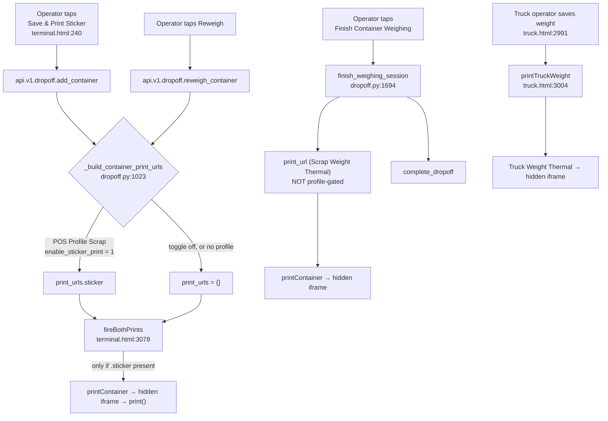
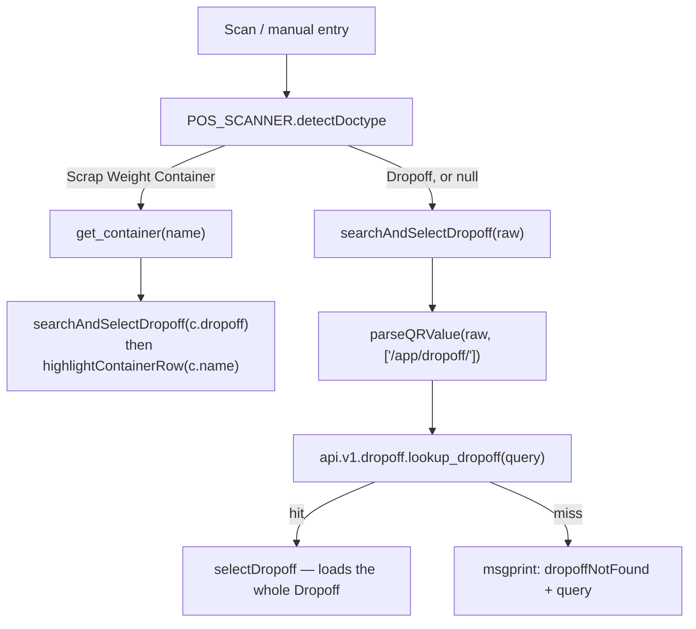
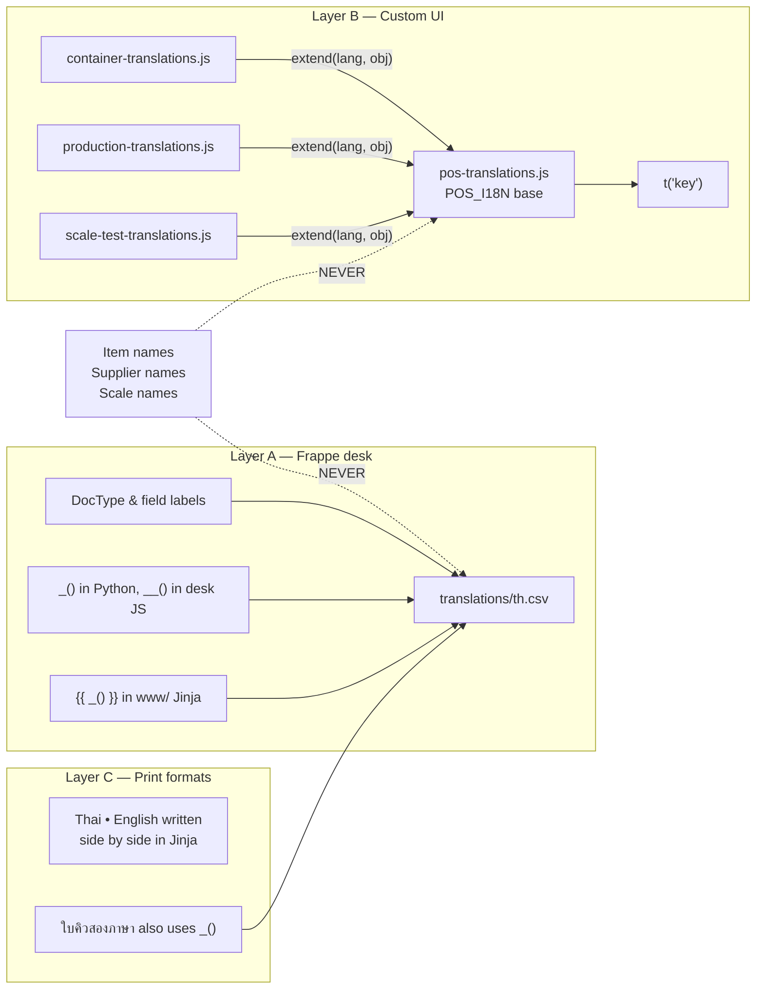

# Print Formats & Bilingual System — Developer & Admin Reference

> **Status:** Production
> **Source:** `scrap_metal_suite/fixtures/print_format.json`, `scrap_metal_suite/api/v1/dropoff.py`, `scrap_metal_suite/www/pos/terminal.html`, `scrap_metal_suite/www/pos/truck.html`, `scrap_metal_suite/public/js/pos-translations.js`, `scrap_metal_suite/public/js/pos-scanner.js`, `scrap_metal_suite/public/js/pos-core.js`, `scrap_metal_suite/translations/th.csv`, `apps/qr_foundry/qr_foundry/print_helpers.py`
> **Last verified:** 2026-08-21 against `feature/container-redesign` (`ce7a9d6` + uncommitted delta), rendered live on site `metal`

---

## 1. Purpose & scope

This subsystem owns everything between "a document exists" and "paper comes out of a printer", plus the translation machinery that decides which language the words are in.

**In scope:**

- The eight print formats shipped in `scrap_metal_suite/fixtures/print_format.json`
- The auto-print path from the POS and truck terminals (hidden-iframe printing)
- QR payload encoding and the scanner's routing rules back to a DocType
- Thermal-hardware rendering constraints (1-bit print head)
- The two-layer bilingual system: desk (`th.csv`) and custom UI (`POS_I18N`)

**Out of scope** — owned elsewhere:

| Concern | Owner |
|---|---|
| What the printed documents *mean* (Dropoff, Container lifecycle) | [12-dropoff-receiving](12-dropoff-receiving.md) |
| Price Lock / Purchase Order semantics | [30-settlement](30-settlement.md) |
| Sorting semantics | [20-production-sorting](20-production-sorting.md) |
| Scale serial protocols | [11-truck-terminal](11-truck-terminal.md) |
| QR image generation internals, QR List doctype | the separate `qr_foundry` app |

### 1.1 Hard dependency: `qr_foundry`

Every thermal and sticker format calls `qr_data_uri()` or `qr_src()`. **These are not Frappe builtins and they are not defined in this app.** They are Jinja globals contributed by a separate installed app:

```python
# apps/qr_foundry/qr_foundry/hooks.py:80-86
jinja = {
    "methods": [
        "qr_foundry.print_helpers.qr_src",
        "qr_foundry.print_helpers.qr_data_uri",
        "qr_foundry.print_helpers.embed_file",
    ]
}
```

This app's own `jinja` hook is **commented out** (`scrap_metal_suite/hooks.py:84-88`). `qr_foundry` is present in `sites/apps.txt` on both `metal` and production.

> **If `qr_foundry` is not installed, `Scrap Weight Thermal`, `Truck Weight Thermal`, and `Scrap Weight Container Sticker` all fail to render** with an undefined-callable error. This is the single most likely cause of "printing broke after a site rebuild". Check `bench --site <site> list-apps` first.

`BILINGUAL_GUIDE.md` §11 describes `qr_src` as a "Frappe built-in Jinja filter that generates inline SVG QR". **That is wrong on three counts** — it is not built-in, it is a method not a filter, and it returns a PNG data URI (or a file URL), not SVG. See §9.

---

## 2. Format inventory

All eight live in one fixture array: `scrap_metal_suite/fixtures/print_format.json` (252 lines). All eight are installed and byte-current on `metal` as of 2026-08-21 (`_sync_print_formats.run` → `patched=0 already_current=8 skipped=0`).

| Format | DocType | Trigger | Paper (`@page`) | Printer | `standard` | Fixture line |
|---|---|---|---|---|---|---|
| `Scrap Weight Thermal` | `Scrap Weight` | **Auto** on Finish Weighing; manual reprint | `80mm auto`, margin `2mm` | Thermal receipt | `Yes` (locked) | `:23` |
| `Truck Weight Thermal` | `Truck Weight` | **Auto** on truck weight save; manual reprint | `80mm auto`, margin `2mm` | Thermal receipt | `Yes` (locked) | `:55` |
| `Scrap Weight Container Sticker` | `Scrap Weight Container` | **Auto** on add/reweigh container (profile-gated); manual per row | `50mm 80mm`, margin `0` | Sticker / label | `No` (editable) | `:241` |
| `ใบคิวสองภาษา` | `Dropoff` | Manual (desk default format) | `A4`, margin `15mm` | Office A4 | `Yes` (locked) | `:87` |
| `ใบสรุปการส่งมอบ` | `POS Order` | Manual (desk default format) | `A4`, margin `15mm` | Office A4 | `No` (editable) | `:99` |
| `ใบยืนยันราคา` | `SMT Price Lock` | Manual (desk default format) | `A4`, margin `15mm` | Office A4 | `Yes` (locked) | `:145` |
| `ใบสั่งซื้อ` | `SMT Purchase Order` | Manual (desk default format) | `A4`, margin `15mm` | Office A4 | `Yes` (locked) | `:177` |
| `ใบคัดแยก` | `Dropoff Final` | Manual (desk default format) | `A4`, margin `15mm` | Office A4 | `Yes` (locked) | `:209` |

All eight set `default_print_language: "th"` and `custom_format: 1`, `print_format_type: "Jinja"`.

### 2.1 Which are wired into application code

Only **three** are referenced by anything other than test scripts:

```
Scrap Weight Thermal            → terminal.html:2209, dropoff.py:1526, dropoff.py:1694
Truck Weight Thermal            → truck.html:3005
Scrap Weight Container Sticker  → dropoff.py:1043, terminal.html:3858
```

The five Thai-named A4 formats are **manual-print only**. They are reached by opening the document in the desk and pressing Print. They are pre-selected because `default_print_format` is set on the DocType itself:

| DocType | `default_print_format` | Source |
|---|---|---|
| `Scrap Weight` | `Scrap Weight Thermal` | `scrap_weight.json:4` |
| `Truck Weight` | `Truck Weight Thermal` | `truck_weight.json:4` |
| `Dropoff` | `ใบคิวสองภาษา` | `dropoff.json:3` |
| `POS Order` | `ใบสรุปการส่งมอบ` | `pos_order.json:4` |
| `SMT Price Lock` | `ใบยืนยันราคา` | `smt_price_lock.json:4` |
| `SMT Purchase Order` | `ใบสั่งซื้อ` | `smt_purchase_order.json:4` |
| `Dropoff Final` | `ใบคัดแยก` | `dropoff_final.json:4` |
| `Scrap Weight Container` | *(none)* | — see §9 |

### 2.2 Standard vs custom, and why it matters

Frappe write-locks standard formats:

```python
# apps/frappe/frappe/printing/doctype/print_format/print_format.py:68-76
def validate(self):
    if (
        self.standard == "Yes"
        and not frappe.local.conf.get("developer_mode")
        and not frappe.flags.in_migrate
        and not frappe.flags.in_install
        and not frappe.flags.in_test
    ):
        frappe.throw(frappe._("Standard Print Format cannot be updated"))
```

So six of the eight cannot be edited through the desk UI or the document API on a normal site. `Scrap Weight Container Sticker` and `ใบสรุปการส่งมอบ` (both `standard: "No"`) **can** — which is a footgun, because a desk edit to those two is silently overwritten by the next fixture re-import. See §8.

---

## 3. Each format in detail

> **Item names in every example below are canonical Thai and appear exactly as stored.** `ทองแดงปอก` is not "stripped copper wire" with a Thai label — the Thai string *is* the identifier. See §7.4.

### 3.1 `Scrap Weight Thermal` — the customer's receipt

**DocType:** `Scrap Weight` (submittable). **Paper:** 80 mm roll, auto length, 76 mm content width.

This is the per-Dropoff, customer-facing receipt handed to the supplier when weighing finishes. Wave 10 rebound it from per-bag rows to **per-grade aggregates** — one line per Item, with a bag count.

**Data sources:**

| Element | Expression |
|---|---|
| Doc number | `doc.name` |
| Amended marker | `doc.is_amended`, `doc.amend_reason`, `doc.amended_from` |
| Date | `frappe.utils.formatdate(doc.posting_date, 'dd/MM/yyyy')` |
| Licence plate | `frappe.db.get_value('Dropoff', doc.dropoff, 'license_plate')` — a `` at template top |
| Item rows | `doc.items` → `item.item_name or item.item_code`, `item.container_count`, `item.weight` |
| Totals | `doc.total_weight`, `doc.total_container_count` |
| Operator | `frappe.db.get_value('User', doc.generated_by, 'full_name')` |
| QR ×2 | `qr_data_uri('Dropoff', doc.dropoff)`, `qr_data_uri('Scrap Weight', doc.name)` |

**Jinja specifics:**

- The plate is fetched with a template-level `` rather than a fetch-from field, because `Scrap Weight` has no `license_plate` field of its own.
- Weights use `"%.2f"|format(...)` (Jinja filter), not the `"{:,.2f}".format(...)` style used by the A4 formats. **No thousands separator** — a 1,234 kg load prints `1234.00 kg`.
- The amended badge reuses `.reweight-badge` (2px solid black box), which is the sanctioned way to emphasise on thermal paper.

**ASCII mock-up** (derived from the rendered HTML of `WGT-260427-00005`, with realistic item names substituted):

```
        ← 76 mm content, 80 mm paper →
╔══════════════════════════════════════╗
║          Scrap Metal Trading         ║  16px bold
║ 88/88 หมู่ 1 ต.ท่าไม้ อ.ลาดหลุมแก้ว จ.ปทุมธานี ║  10px
║             ใบชั่งสินค้า              ║  14px bold
║        เลขที่: WGT-260427-00005       ║  11px
╟ ─ ─ ─ ─ ─ ─ ─ ─ ─ ─ ─ ─ ─ ─ ─ ─ ─ ─ ╢  dashed #000
║ วันที่:                    27/04/2026 ║
║ Drop-off:           DO-260427-00006  ║
║ ทะเบียนรถ:                  70-1234  ║
╟ ─ ─ ─ ─ ─ ─ ─ ─ ─ ─ ─ ─ ─ ─ ─ ─ ─ ─ ╢
║ ผู้ขาย:              ร้านรับซื้อของเก่า ║
╟ ─ ─ ─ ─ ─ ─ ─ ─ ─ ─ ─ ─ ─ ─ ─ ─ ─ ─ ╢
║ ┌──────────────────────────────────┐ ║  ← only if is_amended
║ │    ** ฉบับแก้ไข • AMENDED **     │ ║    2px solid box
║ │  แทนที่ฉบับ WGT-260427-00004     │ ║
║ └──────────────────────────────────┘ ║
║                                      ║
║ รายการสินค้า • Items                  ║  bold, solid rule under
║ ─────────────────────────────────────║
║ ทองแดงปอก (3 ภาชนะ)         95.00 kg ║  dotted #000 separator
║ อลูมิเนียมฉาก (2 ภาชนะ)      41.50 kg ║
║ ══════════════════════════════════════║  2px solid
║ น้ำหนักรวม / Total:        136.50 kg ║  14px bold / 18px value
║ จำนวนภาชนะรวม / Bags:              5 ║  10px
╟ ─ ─ ─ ─ ─ ─ ─ ─ ─ ─ ─ ─ ─ ─ ─ ─ ─ ─ ╢
║ หมายเหตุ: <remarks, if any>          ║
╟ ─ ─ ─ ─ ─ ─ ─ ─ ─ ─ ─ ─ ─ ─ ─ ─ ─ ─ ╢
║        ผู้ชั่ง: สมชาย ใจดี             ║  10px, centred
║   พิมพ์เมื่อ: 21/08/2026 18:39:44     ║
║        ขอบคุณที่ใช้บริการ              ║  11px bold
╟ ─ ─ ─ ─ ─ ─ ─ ─ ─ ─ ─ ─ ─ ─ ─ ─ ─ ─ ╢
║          ┌──────────────┐            ║
║          │ ▄▄▀█▄ QR ▀█▄ │  28×28 mm  ║
║          └──────────────┘            ║
║              Drop-off                ║  10px bold
║           DO-260427-00006            ║  9px (ASCII only)
║          ┌──────────────┐            ║
║          │ ▄▀█▄▄ QR █▀▄ │  28×28 mm  ║
║          └──────────────┘            ║
║        ใบชั่งสินค้า / Scrap           ║
║          WGT-260427-00005            ║
╟ ─ ─ ─ ─ ─ ─ ─ ─ ─ ─ ─ ─ ─ ─ ─ ─ ─ ─ ╢
║      - - - - - - - - - - - - -       ║  cut line, 9px
╚══════════════════════════════════════╝
```

**Gotchas:**

- **Hard-fails if the linked Dropoff was deleted.** `` guards on the *link value*, not on the target existing. `qr_data_uri('Dropoff', <deleted>)` calls `generate_for_doc`, which does `frappe.throw(_("Document not found"))` (`qr_foundry/api.py:47`). The whole print aborts. Verified live — see §9.1.
- `doc.generated_by` is frequently empty on older records, printing `ผู้ชั่ง: -`.

### 3.2 `Truck Weight Thermal` — the weighbridge ticket

**DocType:** `Truck Weight`. **Paper:** 80 mm roll, auto length. Shares its stylesheet with §3.1 almost verbatim (the thermal fix of 2026-08-21 was applied to both together).

The defining feature is a **36 px weight number** — this ticket is read at arm's length by a driver, so the payload is one huge figure plus a checkbox pair showing direction.

**Data sources:** `doc.weight`, `doc.weight_type` (`Gross`/`Tare`), `doc.weighed_at`, `doc.license_plate`, `doc.dropoff`, `doc.supplier_name`, `doc.entry_method`, `doc.photos | length`, `doc.is_reweight`, `doc.reweight_reason`, `doc.scale` → `Scale.scale_name`, `doc.operator` → `User.full_name`.

**ASCII mock-up** (from the rendered HTML of `TW-260427-00008`):

```
╔══════════════════════════════════════╗
║          Scrap Metal Trading         ║
║ 88/88 หมู่ 1 ต.ท่าไม้ อ.ลาดหลุมแก้ว จ.ปทุมธานี ║
║              ใบชั่งรถ                 ║  + " (ชั่งซ้ำ)" if is_reweight
║        เลขที่: TW-260427-00008        ║
╟ ─ ─ ─ ─ ─ ─ ─ ─ ─ ─ ─ ─ ─ ─ ─ ─ ─ ─ ╢
║                                      ║
║             900.00                   ║  ← 36px bold
║               Kg                     ║  ← 14px bold
║                                      ║
║    ┌──────────┐   ┏━━━━━━━━━━┓       ║  checked = 2px border
║    │ [ ] ขาเข้า│   ┃ [X] ขาออก┃       ║  10px labels
║    │     Gross│   ┃      Tare┃       ║
║    └──────────┘   ┗━━━━━━━━━━┛       ║
╟ ─ ─ ─ ─ ─ ─ ─ ─ ─ ─ ─ ─ ─ ─ ─ ─ ─ ─ ╢
║ วันที่/เวลา:         27/04/2026 13:10 ║
║ ทะเบียนรถ:                  70-1234  ║
║ Drop-off:           DO-260427-00006  ║
╟ ─ ─ ─ ─ ─ ─ ─ ─ ─ ─ ─ ─ ─ ─ ─ ─ ─ ─ ╢
║ ผู้ขาย:              ร้านรับซื้อของเก่า ║
║ ┌──────────────────┬─────────────────┐║  1px solid box
║ │ วิธีบันทึก:       │ รูปภาพ:         │║  10px labels
║ │ [M] Manual       │ ไม่มี            │║  [A] Scale when auto
║ └──────────────────┴─────────────────┘║
║ ┌──────────────────────────────────┐ ║  ← only if is_reweight
║ │         ** ชั่งซ้ำ **             │ ║
║ │       <reweight_reason>          │ ║
║ └──────────────────────────────────┘ ║
╟ ─ ─ ─ ─ ─ ─ ─ ─ ─ ─ ─ ─ ─ ─ ─ ─ ─ ─ ╢
║       ผู้ชั่ง: สมชาย ใจดี              ║
║      เครื่องชั่ง: ตราชั่งรถ 01          ║  only if doc.scale
║   พิมพ์เมื่อ: 21/08/2026 18:39:27     ║
║        ขอบคุณที่ใช้บริการ              ║
╟ ─ ─ ─ ─ ─ ─ ─ ─ ─ ─ ─ ─ ─ ─ ─ ─ ─ ─ ╢
║      [QR 28mm] Drop-off              ║
║               DO-260427-00006        ║
║      [QR 28mm] ใบชั่งรถ / Truck       ║
║               TW-260427-00008        ║
╟ ─ ─ ─ ─ ─ ─ ─ ─ ─ ─ ─ ─ ─ ─ ─ ─ ─ ─ ╢
║      - - - - - - - - - - - - -       ║
╚══════════════════════════════════════╝
```

**Gotcha — inconsistent QR helper.** This is the only format that calls `qr_src(...)` instead of `qr_data_uri(...)`:

```jinja
      {# line ~328 of the template #}

```

`qr_src` returns the **attached file URL** if a `QR List` row for that target already carries `absolute_file_url`, and only falls back to an inline data URI otherwise (`qr_foundry/print_helpers.py:8-27`). On `metal` no `QR List` row has an `absolute_file_url`, so it currently always falls back and renders `data:image/png;base64,…` — verified. But on a site where QR images *are* attached, this format would emit an `` into a hidden print iframe. If that File is private, the print job renders a broken image where the QR should be, while the other two formats are unaffected. Standardising on `qr_data_uri` would remove the divergence. See §9.

### 3.3 `Scrap Weight Container Sticker` — the bag label

**DocType:** `Scrap Weight Container`. **Paper:** `50mm × 80mm` label stock, margin `0`. `font_size: 10` on the Print Format record itself; `css` field carries the `@page` rule as well as the inline `<style>`.

This is the internal bag tag. It is the only per-container print; there is no per-container thermal receipt (`api/v1/dropoff.py:1023-1029` says so explicitly, and `api_test/drop_container_thermal_pf.py` exists to remove an earlier one).

The whole template is 37 lines — it is the simplest format in the app and the one most exposed to thermal legibility problems, since a 50 mm label leaves no room to recover from a bad font-size choice.

**The six required fields** (asserted by `api_test/smoke_test_sticker_render.py:122-129`): Drop-off ID, supplier name, date, item name, operator name, licence plate.

**ASCII mock-up** (from the rendered HTML of `CTN-2608-00003`):

```
   ← 50 mm →
┌──────────────────┐
│  CTN-2608-00003  │ 11px bold, solid rule under
│ ↻ REWEIGHT•ชั่งซ้ำ│ 10px BOLD BLACK, only if is_reweight
├──────────────────┤
│    ┌──────────┐  │
│    │ ▄▀█▄ QR  │  │  25 × 25 mm
│    │ █▄▄▀ ▄█▀ │  │
│    └──────────┘  │
│                  │
│    ทองแดงปอก      │ 12px bold — canonical Thai item name
├══════════════════┤ 1px solid top
│      275.0  kg   │ 22px bold + 11px unit
├══════════════════┤ 1px solid bottom
│ Drop-off         │
│    DO-260821-013 │ bold, right-aligned
│ ผู้ขาย • Supplier │
│  ร้านรับซื้อของเก่า │
│ ทะเบียน • Plate   │
│          70-1234 │
│ ผู้ชั่ง • Operator │
│      สมชาย ใจดี   │
│ วันที่ • Date     │
│ 2026-08-21 18:39 │
└──────────────────┘
   all rows 10px / line-height 1.4
```

**Jinja specifics:**

- QR is `qr_data_uri(doc.doctype, doc.name)` — note `doc.doctype`, not a literal. Encodes the **container itself**, not its parent.
- Date is `frappe.utils.format_datetime(doc.creation, "yyyy-MM-dd HH:mm")` — creation, not a reweigh timestamp. (The two smoke tests compute an expected date as "`last_reweigh_at` if reweighed else `creation`", but no such field exists on the DocType; the expression degrades to `creation`, so the assertion still passes. Cosmetic dead logic in the tests, not the template.)
- Weight is `"{:,.1f}".format(doc.net_weight)` — **one** decimal, with thousands separator. Deliberately different from the receipts' two decimals: a bag label wants a big legible number, not precision.
- Meta rows are `<td>`, never `<th>` — see §6.3.

**Gotchas:**

- **Immune to the dangling-Dropoff crash** (§3.1) because its only QR targets the container itself. It prints `doc.dropoff` as plain text. Verified: `CTN-2608-00003` renders fine even though `DO-TEST-260821-13` no longer exists.
- `container_no` was removed from the DocType entirely — the document name (`CTN-YYMM-#####`) is the only canonical bag identifier. `_patch_sticker.py` exists to strip the old "Bag" row. Stale diagnostic scripts (`_inspect_ctn_chain.py`, `_quick_dump_ctns.py`, `_diag_two_issues.py`) still `SELECT container_no` and will error if run.
- `standard: "No"` — editable in the desk, and therefore silently clobbered by fixture re-import. Edit the fixture, not the record.

### 3.4 `ใบคิวสองภาษา` — Drop-off receipt (A4)

**DocType:** `Dropoff`. **Paper:** A4, 15 mm margins. Despite the name ("bilingual queue slip") this is a full A4 drop-off summary with signature blocks, not a queue ticket. It is the `Dropoff` default print format.

**Structure:** letterhead (logo left, bilingual address right) → title/status header → reweigh notice → General Information → Linked Orders (PO) → Truck Weight (gross/tare/net) → Item Summary (per grade, with unplanned-grade flags) → Weight Verification (two variance checks) → Related Documents → Remarks → signatures → footer.

**Jinja specifics:**

- Two template-level `` queries at the top pull sibling documents:
  ```jinja
  
  
  ```
  Both of these are buggy — see §9.2 and §9.3.
- This is the **only** format that calls `_()` for translation rather than hard-coding both languages: `_("Unplanned")`, `_("Total")`, `_("Grade mix deviation")`, `_("Verification overridden")`, `_("by")`, `_("at")`. Combined with `default_print_language: "th"`, these resolve through `th.csv`. This contradicts `BILINGUAL_GUIDE.md` §4 ("Print format Jinja — inline bilingual, no translation file") — the guide describes the majority pattern, not this file.
- Status badge class is derived: `status-{{ doc.status|lower|replace(' ', '-') }}`.
- Uses grey (`#666`, `#333`, `#ccc`) freely. **Correct** — this is A4 laser/inkjet output, where the thermal rules of §6 do not apply.

**ASCII mock-up:**

```
┌──────────────────────────────────────────────────────────────┐
│ [LOGO]                        88/88 ถนน บางบัวทอง – สุพรรณบุรี │
│                               ตำบล หน้าไม้ อำเภอลาดหลุมแก้ว     │
│                               ปทุมธานี 12140                  │
│                               88/88 Bang Bua Thong … (8pt)   │
├──────────────────────────────────────────────────────────────┤
│ ใบส่งสินค้า / Drop-off Receipt          DO-260427-00006      │
│                                          ─── Completed ───   │
├──────────────────────────────────────────────────────────────┤
│ ** ชั่งซ้ำ / REWEIGHED ** — <reason>          (only if flagged)│
├──────────────────────────────────────────────────────────────┤
│ ข้อมูลทั่วไป / General Information                            │
│ วันที่นัดหมาย / Scheduled  27/04/2026 09:00 │ ทะเบียนรถ 70-1234 │
│ ผู้ขาย / Supplier ร้านรับซื้อของเก่า        │ Verification Pending│
├──────────────────────────────────────────────────────────────┤
│ ใบสั่งซื้อที่เชื่อมโยง / Linked Orders (PO)                    │
│ #  เลขที่/Order No.   หมายเหตุ/Remarks   น้ำหนักที่จัดสรร (kg) │
│ 1  ORD-260427-00002   -                            1,000.00  │
├──────────────────────────────────────────────────────────────┤
│ น้ำหนักรถ / Truck Weight                                      │
│ รายการ/Item   น้ำหนัก(kg)   เวลา/Time    เครื่องชั่ง/Scale      │
│ ขาเข้า/Gross   123,213.00   27/04 13:10  ตราชั่งรถ 01          │
│ ขาออก/Tare     123,100.00   27/04 13:55  ตราชั่งรถ 01          │
│ น้ำหนักสุทธิ/Net    113.00                                     │
├──────────────────────────────────────────────────────────────┤
│ สรุปรายการสินค้า / Item Summary                                │
│ เกรด•Grade    จำนวน•Bags  น้ำหนัก(kg)•Weight  สถานะ•Status    │
│ ทองแดงปอก           3          95.0                OK        │
│ อลูมิเนียมฉาก        2          41.5           ⚠ นอกแผน       │
│ รวม                 5         136.5                 ⚠        │
│ ┌──────────────────────────────────────────────────────────┐ │
│ │ ⚠ Grade mix deviation      (amber box, only when not ok) │ │
│ │ <grade_deviation_summary, pre-wrapped>                   │ │
│ └──────────────────────────────────────────────────────────┘ │
├──────────────────────────────────────────────────────────────┤
│ การตรวจสอบน้ำหนัก / Weight Verification                       │
│ 1. น้ำหนักรถสุทธิ vs น้ำหนักสินค้า │ 2. น้ำหนักที่แจ้ง vs จริง    │
│    Truck Net vs Scrap            │    Indicated vs Actual   │
│    -23.50 kg (-1.20%) ✓ ผ่าน     │    3.00 kg (2.20%) ✗ ไม่ผ่าน│
│    113.00 vs 136.50 kg  (8pt)    │    133.50 vs 136.50 kg   │
├──────────────────────────────────────────────────────────────┤
│ เอกสารที่เกี่ยวข้อง / Related Documents                        │
│ ประเภท/Type      เลขที่/ID       น้ำหนัก(kg)  วันที่-เวลา  วิธี │
│ ชั่งรถ (ขาเข้า)   TW-…-00003     123,213.00  27/12 18:22  [M] │
│ ชั่งสินค้า/Scrap  WGT-251227-1        12.00       -  ← BUG §9.2│
├──────────────────────────────────────────────────────────────┤
│ หมายเหตุ / Remarks                                            │
├──────────────────────────────────────────────────────────────┤
│  ______________________        ______________________        │
│  ผู้ส่งสินค้า / Supplier         ผู้รับสินค้า / Receiver         │
│                                                              │
│ พิมพ์เมื่อ / Printed: 21/08/2026 18:39        Administrator   │
└──────────────────────────────────────────────────────────────┘
```

### 3.5 `ใบสรุปการส่งมอบ` — Fulfilment summary (A4)

**DocType:** `POS Order`. **Paper:** A4, 15 mm. `standard: "No"`.

Compares what was *ordered* against what was *received*, per item and in total, then lists the Dropoffs that fulfilled it.

**Jinja specifics:**

- Builds the linked-Dropoff list by querying the child table directly and then loading each parent:
  ```jinja
  
  
      
      
  
  ```
  One `get_doc` per linked Dropoff — fine at yard scale, but it is an N+1 and it will `DoesNotExistError` if a parent Dropoff was deleted.
- Aggregates received weight in-template with the `` idiom over `doc.items` (child table `POS Order Weighed Item`), then joins against `doc.order_items` (`POS Order Item`).
- A four-cell summary box (Ordered / Received / Variance / Percent) colour-codes with `.ok` / `.warning` / `.error` classes.

**ASCII mock-up:**

```
┌──────────────────────────────────────────────────────────────┐
│ [LOGO]                                   88/88 … ปทุมธานี 12140│
├──────────────────────────────────────────────────────────────┤
│ ใบสรุปการส่งมอบ / Fulfillment Summary   ORD-260427-00002     │
│                                          ─── Partial ───     │
├──────────────────────────────────────────────────────────────┤
│ ข้อมูลคำสั่งซื้อ / Order Information                          │
│ ผู้ขาย/Supplier: ร้านรับซื้อของเก่า  │ วันที่สั่ง/Order Date 27/04/26│
│ สถานะ/Status: Open                                           │
├──────────────────────────────────────────────────────────────┤
│ ┌────────────┬────────────┬────────────┬────────────┐        │
│ │ น้ำหนักสั่งซื้อ│ น้ำหนักที่รับ │ ผลต่าง      │ เปอร์เซ็นต์  │        │
│ │ / Ordered  │ / Received │ / Variance │ / Percent  │        │
│ │ 1,000.00kg │  136.50 kg │ -863.50 kg │     13.7%  │        │
│ └────────────┴────────────┴────────────┴────────────┘        │
├──────────────────────────────────────────────────────────────┤
│ รายการเปรียบเทียบ / Items Comparison                          │
│ รายการ/Item     สั่งซื้อ(kg)   รับจริง(kg)   ผลต่าง/Variance   │
│ ทองแดงปอก          600.00        95.00          -505.00      │
│ อลูมิเนียมฉาก       400.00        41.50          -358.50      │
│ รวม / Total      1,000.00       136.50          -863.50      │
├──────────────────────────────────────────────────────────────┤
│ การส่งมอบที่เกี่ยวข้อง / Related Dropoffs                       │
│ เลขที่/Dropoff ID   วันที่/Date      น้ำหนัก(kg)  สถานะ/Status  │
│ DO-260427-00006    27/04/26 09:00     136.50   Completed     │
├──────────────────────────────────────────────────────────────┤
│ หมายเหตุ / Notes                                              │
│  ______________________        ______________________        │
│  ผู้ส่ง / Supplier               ผู้รับ / Receiver               │
│ พิมพ์เมื่อ / Printed: 21/08/2026 18:39                        │
└──────────────────────────────────────────────────────────────┘
```

**Gotcha:** the `` block (PO Ref row) is dead — `POS Order` has no `purchase_order` field and no Custom Field supplies one. Verified against `pos_order.json` and `fixtures/custom_field.json`. Harmless (guarded), but misleading.

### 3.6 `ใบยืนยันราคา` — Price confirmation (A4)

**DocType:** `SMT Price Lock`. **Paper:** A4, 15 mm. Shares the `.smt-receipt` stylesheet with §3.7 and §3.8.

The supplier-facing quote: which items are locked, at what rate, for how long, and how much has been settled against the lock so far.

**Data:** `doc.supplier_name`, `doc.po_date`, `doc.expiry_date` (falls back to `ไม่กำหนด / No expiry`), `doc.status_date`, and `doc.items` → `item_name or item_code`, `po_qty`, `po_rate`, `po_amount`, `settled_qty`, `remaining_qty`; totals `doc.total_po_value`, `doc.total_settled_value`.

**Number formats:** quantities `{:,.3f}` (3 dp — kilogram precision matters for money), money `{:,.2f}`.

```
┌──────────────────────────────────────────────────────────────┐
│ [LOGO]                                   88/88 … ปทุมธานี 12140│
├──────────────────────────────────────────────────────────────┤
│ ใบยืนยันราคา / Price Lock                 PL-2026-00013      │
│                                            ─── Active ───    │
├──────────────────────────────────────────────────────────────┤
│ ข้อมูลทั่วไป / General Information                            │
│ ผู้ขาย/Supplier ร้านรับซื้อของเก่า │ วันที่/PO Date  15/04/2026  │
│ วันหมดอายุ/Expiry 30/04/2026     │ สถานะอัปเดต 15/04/26 18:00 │
├──────────────────────────────────────────────────────────────┤
│ รายการสินค้า / Locked Items                                   │
│ # รายการ/Item  ปริมาณ/Qty ราคา/Rate มูลค่า/Amt ชำระแล้ว คงเหลือ│
│ 1 ทองแดงปอก     600.000    285.00  171,000.00  95.000 505.000│
│ 2 อลูมิเนียมฉาก  400.000     42.50   17,000.00  41.500 358.500│
│              รวม / Total   188,000.00   40,282.50           │
├──────────────────────────────────────────────────────────────┤
│ หมายเหตุ / Notes                                              │
│  ______________________        ______________________        │
│  ผู้ขาย / Supplier               ผู้รับซื้อ / Buyer              │
│ พิมพ์เมื่อ / Printed: 21/08/2026 18:39      Administrator     │
└──────────────────────────────────────────────────────────────┘
```

### 3.7 `ใบสั่งซื้อ` — Purchase order (A4)

**DocType:** `SMT Purchase Order`. **Paper:** A4, 15 mm.

The accounting document: which Dropoff Finals it covers, and how each allocated quantity was priced — against a Price Lock (`PO`) or at spot (`Spot`).

**Data:** `doc.custom_reference or doc.name` as the displayed number; `doc.final_date`; `doc.purchase_invoice` (optional row); `doc.drop_off_finals` → `drop_off_final`, `drop_off_date`, `total_weight`; `doc.allocations` → `item_name or item_code`, `qty`, `source_type`, `po`, `rate`, `amount`; totals `total_po_value`, `total_spot_value` (row shown only when truthy), `total_amount`.

**Jinja specific:** source type is rendered bilingually inline —
`{{ 'ล็อคราคา / PO' if row.source_type == 'PO' else 'ตลาด / Spot' }}`.
The grand-total row carries an inline `border-top:2px solid #000` and 11 pt text, and prefixes `฿`.

```
┌──────────────────────────────────────────────────────────────┐
│ ใบสั่งซื้อ / Purchase Order              SMTPL-2026-00010     │
│                                          ─── Submitted ───   │
├──────────────────────────────────────────────────────────────┤
│ ข้อมูลทั่วไป / General Information                            │
│ ผู้ขาย/Supplier ร้านรับซื้อของเก่า │ วันที่/Final Date 18/07/2026│
│ เลขที่อ้างอิง/Reference SMTPL-2026-00010                      │
├──────────────────────────────────────────────────────────────┤
│ ใบส่งมอบ / Dropoff Finals                                     │
│ # เลขที่/Dropoff Final   วันที่/Date    น้ำหนัก/Weight (kg)     │
│ 1 DFL-260718-00003      18/07/2026            136.500        │
├──────────────────────────────────────────────────────────────┤
│ รายการจัดสรร / Allocations                                    │
│ # รายการ/Item  ปริมาณ  แหล่ง/Source  ใบยืนยันราคา  ราคา  มูลค่า │
│ 1 ทองแดงปอก    95.000  ล็อคราคา/PO  PL-2026-00013 285.00 27,075│
│ 2 อลูมิเนียมฉาก 41.500  ตลาด/Spot    -              40.00  1,660│
│                          ยอดรวม PO / PO Total      27,075.00 │
│                          ยอดรวม Spot / Spot Total   1,660.00 │
│ ══════════════════════════════════════════════════════════════│
│                     ยอดรวมทั้งหมด / Grand Total  ฿ 28,735.00 │
├──────────────────────────────────────────────────────────────┤
│  ______________________        ______________________        │
│  ผู้ขาย / Supplier               พนักงานบัญชี / Accountant       │
│ พิมพ์เมื่อ / Printed: 21/08/2026 18:39      Administrator     │
└──────────────────────────────────────────────────────────────┘
```

### 3.8 `ใบคัดแยก` — Sorting report (A4)

**DocType:** `Dropoff Final`. **Paper:** A4, 15 mm.

The QA/QC output: what survived sorting as good material, what was rejected and why, and whether the sorted total reconciles with the Dropoff total.

**Data:** `doc.dropoff`, `doc.supplier_name`, `doc.license_plate`, `doc.verification_status`, `doc.po_final` (optional); `doc.good_items` → `item_name or item_code`, `uom`, `weight`; `doc.unwanted_items` → adds `return_reason`; totals `total_good_weight`, `total_unwanted_weight`; variance block `dropoff_total_weight`, `total_verified_weight`, `weight_variance`, `variance_percent`, `variance_ok`.

**Jinja specific:** the verification status is itself wrapped in a nested `.status-badge` span, so it renders as a badge inside an info row — the only format that does this.

```
┌──────────────────────────────────────────────────────────────┐
│ ใบคัดแยก / Sorting Report                DFL-260718-00003    │
│                                          ─── Completed ───   │
├──────────────────────────────────────────────────────────────┤
│ ข้อมูลทั่วไป / General Information                            │
│ ใบส่งมอบ/Dropoff DO-260718-00012 │ ผู้ขาย ร้านรับซื้อของเก่า    │
│ ทะเบียนรถ/Plate 70-1234          │ Verification ─Verified─   │
├──────────────────────────────────────────────────────────────┤
│ สินค้าดี / Good Items                                         │
│ # รายการ/Item      หน่วย/UOM   น้ำหนัก/Weight (kg)            │
│ 1 ทองแดงปอก           Kg                  92.300             │
│ 2 อลูมิเนียมฉาก        Kg                  38.700             │
│           รวมสินค้าดี / Good Total        131.000             │
├──────────────────────────────────────────────────────────────┤
│ ของที่ไม่ต้องการ / Unwanted Items                              │
│ # รายการ/Item  เหตุผล/Reason  หน่วย  น้ำหนัก/Weight (kg)       │
│ 1 ทองแดงปอก    ปนเปื้อน        Kg              5.500          │
│      รวมของที่ไม่ต้องการ / Unwanted Total       5.500          │
├──────────────────────────────────────────────────────────────┤
│ สรุปค่าเบี่ยงเบน / Variance Summary                            │
│ น้ำหนักจาก Dropoff          136.500 kg                        │
│ น้ำหนักตรวจสอบรวม/Verified   136.500 kg                        │
│ ค่าเบี่ยงเบน / Variance        0.000 kg (0.00%)               │
│ ผลการตรวจ / Result          ✓ ผ่าน / Pass                     │
├──────────────────────────────────────────────────────────────┤
│  ______________________        ______________________        │
│  ผู้คัดแยก / Sorter              ผู้ตรวจสอบ / Reviewer           │
│ พิมพ์เมื่อ / Printed: 21/08/2026 18:39      Administrator     │
└──────────────────────────────────────────────────────────────┘
```

---

## 4. Auto-print mechanism

### 4.1 The print URL

Every automatic print is a plain Frappe `printview` URL. There is no PDF generation, no raw ESC/POS, no print server:

```
/printview?doctype=<urlencoded>&name=<urlencoded>&format=<urlencoded>&no_letterhead=1
```

Built in four places:

| Built at | Format | Notes |
|---|---|---|
| `api/v1/dropoff.py:1043-1046` | `Scrap Weight Container Sticker` | gated by `enable_sticker_print` |
| `api/v1/dropoff.py:1694-1697` | `Scrap Weight Thermal` | returned by `finish_weighing_session` |
| `api/v1/dropoff.py:1526-1529` | `Scrap Weight Thermal` | returned by `get_latest_scrap_weight` (reprint) |
| `www/pos/terminal.html:3858`, `www/pos/truck.html:3005`, `www/pos/terminal.html:2209` | all three | client-side construction |

`no_letterhead=1` is set on every one — thermal paper has no room for a letterhead, and the A4 letterhead block is ``-guarded anyway.

### 4.2 The hidden-iframe mechanism

The terminals never navigate away and never open a print preview tab in the happy path. They inject an off-screen zero-size iframe, let it load the printview URL, then call `print()` on its content window:

```javascript
// www/pos/terminal.html:3064-3075 (CONTAINER_UI.printContainer)
function printContainer(printUrl) {
    if (!printUrl) return;
    const iframe = document.createElement('iframe');
    iframe.style.cssText = 'position:fixed;right:0;bottom:0;width:0;height:0;border:0;';
    iframe.src = printUrl;
    iframe.onload = function () {
        try { iframe.contentWindow.print(); }
        catch (e) { window.open(printUrl + '&trigger_print=1', '_blank'); }
        setTimeout(function () { iframe.remove(); }, 10000);
    };
    document.body.appendChild(iframe);
}
```

Three identical copies of this pattern exist: `terminal.html:3064` (containers), `terminal.html:2208` (`printScrapWeight`), `truck.html:3004` (`printTruckWeight`).

Properties worth knowing:

- **The browser print dialog is what actually selects the printer.** Nothing in this app routes a job to a named device. In production the operator's browser is configured to print silently to a default device (e.g. Chrome `--kiosk-printing`), which is why the two-printer setup in §4.4 is a *browser/OS* configuration, not an app setting.
- **The `catch` fallback opens a real tab** with `&trigger_print=1`, which makes Frappe's printview fire `window.print()` itself. This is the cross-origin / blocked-iframe escape hatch.
- **The iframe is removed after 10 s**, unconditionally. If the print dialog is still open at 10 s the job has already been handed to the browser, so removal is safe; but a user who leaves the dialog open and *then* cancels gets nothing and no error.
- `iframe.onload` fires once the printview HTML has loaded. Because every QR is an inline `data:` URI in the two formats that use `qr_data_uri`, there is no second network round-trip for images. This is a real argument for standardising on `qr_data_uri` (§3.2): a `qr_src` file URL could still be in flight when `print()` is called.

### 4.3 What fires what



| Action | Endpoint | Format printed | Gated by |
|---|---|---|---|
| Save & Print Sticker | `add_container` | Container Sticker | `enable_sticker_print` |
| Reweigh container | `reweigh_container` | Container Sticker | `enable_sticker_print` |
| Finish Container Weighing | `finish_weighing_session` | Scrap Weight Thermal | *nothing* — always prints |
| Truck weight saved | (truck save path) | Truck Weight Thermal | *nothing* — always prints |
| Header 🖶 Print button | `get_latest_scrap_weight` | Scrap Weight Thermal | needs a submitted SW |
| Journal row "Print Sticker" | *(client-only)* | Container Sticker | *nothing* — always prints |
| Scan CTN → action menu | *(client-only)* | Container Sticker | *nothing* — always prints |

Note the asymmetry: **`enable_sticker_print` gates only the two auto-print paths.** The manual per-row reprint button (`terminal.html:3203` → `printOneImpl` at `:3855`) builds its URL client-side and ignores the profile entirely. Turning the toggle off stops automatic stickers but leaves manual reprint working — which is arguably the right behaviour, but it is not documented anywhere in the code.

### 4.4 Per-profile toggles

`POS Profile Scrap` has a **Container Printing** section with exactly two fields (`pos_profile_scrap.json`, field order `section_break_container_printing, enable_sticker_print, sticker_printer_name`):

| Field | Type | Default | Effect |
|---|---|---|---|
| `enable_sticker_print` | Check | `1` | Server includes `print_urls.sticker` in `add_container` / `reweigh_container` responses |
| `sticker_printer_name` | Data | — | **Nothing. Completely unused.** Zero references in any `.py`, `.js`, or `.html`. See §9. |

The description on `enable_sticker_print` is accurate and worth keeping: *"Auto-print sticker label on container save (the only per-container print; the per-Dropoff thermal receipt is generated separately)."*

`www/pos/terminal.py:112` copies the flag into the template context:

```python
context.enable_sticker_print = bool(getattr(profile, "enable_sticker_print", 0))
```

…but `terminal.html` never reads `enable_sticker_print`. The variable is dead; all gating is server-side. See §9.

### 4.5 The two printers

There is no printer abstraction in the codebase. "Two printers" is a physical and OS-level arrangement that the paper sizes imply:

| Printer | Paper | Formats | `@page` |
|---|---|---|---|
| **Thermal receipt** | 80 mm continuous roll | `Scrap Weight Thermal`, `Truck Weight Thermal` | `size: 80mm auto; margin: 2mm` |
| **Sticker / label** | 50 × 80 mm die-cut labels | `Scrap Weight Container Sticker` | `size: 50mm 80mm; margin: 0` |
| *(office)* | A4 sheet | the five Thai-named formats | `size: A4; margin: 15mm` |

Because routing is the browser's job, the practical production setup is: one browser profile/kiosk per station, whose default printer matches the paper that station produces. A container terminal that also needs to emit the finish-of-weighing thermal receipt therefore needs *both* devices reachable, and the operator picks in the dialog — or the site runs two browser profiles.

> ⚠️ UNVERIFIED — the actual production printer models, driver settings, and whether kiosk-printing is enabled. Nothing in this repository records them, and no hardware print test has been run (see §6.5 and `THERMAL_PRINT_GUIDE.md` §6).

---

## 5. QR encoding & scanning

### 5.1 Generation

```mermaid
sequenceDiagram
    participant T as Print template
    participant H as qr_foundry.print_helpers
    participant A as qr_foundry.api
    participant Q as QR List (DocType)

    T->>H: qr_data_uri("Dropoff", "DO-260427-00006")
    H->>A: generate_for_doc(doctype, name)
    A->>A: ensure_doctype_is_enabled(doctype)
    A->>A: frappe.db.exists → else throw "Document not found"
    A->>Q: find-or-create row<br/>(qr_mode=URL, link_type from QR Rule, default Direct)
    H->>H: compute_and_persist_encoded(qr)
    Note over H: Direct → _build_route → get_url_to_form(doctype, name)
    H->>A: preview_qr_list → PNG
    A-->>T: "data:image/png;base64,iVBORw0KGgo…"
```

**What each QR actually encodes** — verified by reading `encoded_url` off live `QR List` rows on `metal`:

| Target DocType | Encoded payload |
|---|---|
| `Dropoff` | `http://localhost:8000/app/dropoff/DO-TEST-260718-29` |
| `Scrap Weight Container` | `http://localhost:8000/app/scrap-weight-container/CTN-2608-00003` |
| `Scrap Weight` | `http://localhost:8000/app/scrap-weight/SW-TEST-260718-15` |
| `Truck Weight` | `http://localhost:8000/app/truck-weight/TW-260427-00001` |

All rows are `qr_mode="URL"`, `link_type="Direct"`. Direct mode resolves through `_build_route` (`qr_foundry/services/qr_ops.py:66-93`), whose default branch is `get_url_to_form(doctype, name)` — hence the slugged desk path. **The host is baked into the image**: the QR encodes an absolute URL built from the site's configured `host_name`. QRs generated on `metal` (`localhost:8000`) are meaningless on a phone; production stickers encode the production host.

`QR Rule` rows on `metal` set `Direct`/`view` for `Scrap Weight Container`, `Container Weight History`, `Dropoff`, `POS Order`, `Warehouse`, and `Token`/`print` for `Item` (`qr_foundry/api.py:50-54`). `Scrap Weight` and `Truck Weight` have no rule and fall through to the `Direct`/`view` default.

### 5.2 `qr_data_uri` vs `qr_src`

| | `qr_data_uri` | `qr_src` |
|---|---|---|
| Source | `print_helpers.py:29-35` | `print_helpers.py:8-27` |
| Returns | always a fresh `data:image/png;base64,…` | attached `absolute_file_url` if the `QR List` row has one, else falls back to `qr_data_uri` |
| Used by | Scrap Weight Thermal, Container Sticker | **Truck Weight Thermal only** |
| Self-contained in the print HTML | yes | no, when a file URL is returned |

Both ultimately raise if the target document does not exist — `qr_src`'s `except Exception` catches the `QR List` lookup failure and then calls `qr_data_uri`, which throws uncaught.

### 5.3 Scanning: `detectDoctype`

`public/js/pos-scanner.js:179-200`. Three-stage classifier:

```javascript
detectDoctype: function(rawValue) {
    if (rawValue == null) return { doctype: null, name: rawValue };
    var url_patterns = [
        { pattern: '/app/dropoff/', doctype: 'Dropoff' },
        { pattern: '/app/scrap-weight-container/', doctype: 'Scrap Weight Container' }
    ];
    for (var i = 0; i < url_patterns.length; i++) { … }        // 1. URL path
    var trimmed = String(rawValue).trim();
    if (/^(DO-|DROP-)/i.test(trimmed)) return { doctype: 'Dropoff', name: trimmed };   // 2. bare prefix
    if (/^CTN-/i.test(trimmed))        return { doctype: 'Scrap Weight Container', name: trimmed };
    return { doctype: null, name: trimmed };                    // 3. give up
}
```

| Scanned / typed value | Detected doctype | Extracted name |
|---|---|---|
| `https://…/app/dropoff/DO-260427-00006` | `Dropoff` | `DO-260427-00006` |
| `https://…/app/scrap-weight-container/CTN-2608-00003` | `Scrap Weight Container` | `CTN-2608-00003` |
| `DO-260427-00006` (typed) | `Dropoff` | `DO-260427-00006` |
| `CTN-2608-00003` (typed) | `Scrap Weight Container` | `CTN-2608-00003` |
| `https://…/app/scrap-weight/SW-…` | **`null`** | the full URL string |
| `https://…/app/truck-weight/TW-…` | **`null`** | the full URL string |
| `70-1234` (a plate) | `null` | `70-1234` |

Stage 1 extraction delegates to `parseQRValue(rawValue, [pattern])` (`pos-scanner.js:127-158`), which regex-captures everything after the pattern up to `/`, `?`, or `#`, then `decodeURIComponent`s it.

**Ordering note:** the URL patterns are checked before the bare-prefix regexes, and `/app/scrap-weight-container/` does not collide with `/app/dropoff/`, so there is no ambiguity between the two supported types.

### 5.4 Routing a detected scan

`unifiedScanHandler` (`www/pos/terminal.html:956-983`) is the single entry point for both the header Scan button and the container action-bar Scan button:



A container scan therefore does **not** open a bare container — it loads the parent Dropoff with its full journal and flashes the matching row (Wave 11 behaviour; the same path is used when a `CTN-` value is typed into the dropoff search bar, `terminal.html:1108-1154`).

The `CONTAINER_UI` action-bar scanner has a fallback handler (`terminal.html:3900-3909`) used only if `window.unifiedScanHandler` is missing, which routes containers to `openContainerActionsImpl` — a `window.prompt` menu offering Reweigh / Print Sticker / Void (`terminal.html:3873-3878`).

**The `null` branch is a lossy fallback.** Scanning a *Scrap Weight* or *Truck Weight* receipt QR into the terminal falls to `searchAndSelectDropoff(raw)`; `parseQRValue` fails its `/app/dropoff/` pattern, falls into its generic-URL branch, and returns the last path segment (`SW-…` / `TW-…`). `lookup_dropoff` then misses and the operator sees "Dropoff not found: SW-…". That is a reasonable outcome, but it is accidental rather than designed — those two QRs exist for desk lookup on a phone, not for terminal routing.

---

## 6. Thermal rendering rules

Everything in this section applies **only** to the three formats printed on thermal hardware. The five A4 formats deliberately use greys and 8–9 pt text and are correct as they are.

`docs/THERMAL_PRINT_GUIDE.md` (written 2026-08-21, current and accurate) is the authority. Summarised and re-verified here.

### 6.1 Why the constraint exists

A thermal print head is **1-bit**: each dot is burned black or left blank. There is no grey. Ask for `color: #666` and the renderer **dithers** — scattering black dots at roughly 40 % density to fake it. At body-text size that reads washed out. At 7–9 px it stops being text and becomes noise, because dot spacing is a meaningful fraction of the glyph.

**Thai makes it strictly worse.** Sarabun stacks tone and vowel marks above and below the baseline (◌่ ◌้ ◌ั ◌ิ ◌ู). Those marks are only a few pixels tall to begin with. At 8 px on a 203 dpi head — about 1.6 mm per line — dithering merges them into the glyph body: `ผู้ขาย` and `ผขาย` become hard to tell apart. A squeezed `line-height` then clips the marks against the line above.

The pre-2026-08-21 templates made both mistakes at once: greys at `#333`/`#666`/`#999`/`#ccc`, and Thai at 7–9 px.

### 6.2 The rules

| Rule | Value | Why |
|---|---|---|
| Text colour | `#000` **only** | anything else dithers |
| Minimum size, Thai | **10 px** | below this, tone/vowel marks merge |
| Minimum size, ASCII | 9 px | doc IDs, cut lines — no diacritics to lose |
| Line height with Thai | ≥ `1.4` | marks need vertical room |
| Rules / separators | `#000`, solid or dashed | `#ccc` dotted prints as nothing |
| Emphasis | weight, size, borders, `[X]` boxes | never colour |
| Backgrounds | avoid | a filled block eats paper and smears |

**Colour is not available as a design tool on this hardware.** Hierarchy comes from size, weight, and rules. To make a warning stand out, box it (`border: 2px solid #000`) and bold it — that is what `.reweight-badge` does and it prints well.

### 6.3 Frappe's wrapper CSS is grey

`frappe.get_print()` wraps every format in framework boilerplate that sets grey on:

```css
.print-format label   { color: #4C5A67 }
.print-format .value  { color: #192734 }
.print-format th      { color: #74808b }
.print-heading small  { color: #4c5a67 }
```

Our formats dodge this by using their own class names (`.info-label`, `.info-value`) and `<td>` rather than `<th>`. **A new thermal template that uses a bare `<label>`, `<th>`, or `.value` will silently inherit grey and print faint even though the template specifies no colour.** Greys *outside* `.thermal-receipt` in rendered output are expected — that is the wrapper, not our CSS.

### 6.4 Current compliance — re-verified 2026-08-21

Parsed every `color:` and `font-size:*px` declaration out of the three thermal templates in the fixture:

| Format | Colours declared | `px` sizes present | Sub-10 px |
|---|---|---|---|
| `Scrap Weight Thermal` | `#000` only | 9, 10, 11, 12, 14, 16, 18 | `9` |
| `Truck Weight Thermal` | `#000` only | 9, 10, 11, 12, 14, 16, 36 | `9` |
| `Scrap Weight Container Sticker` | `#000` only | 10, 11, 12, 22 | *(none)* |

The two 9 px users are `.qr-doc-id` and `.cut-line` — both ASCII-only (a document ID and a row of dashes), so they sit exactly on the ASCII floor, not below it. **Compliant.**

What changed on 2026-08-21 (27 edits across the three formats; the two receipts share a stylesheet so most fixes applied to both):

- Greys → black: `.doc-number` `#333`→`#000`, `.info-label` `#333`→`#000`, `.receipt-footer` 9 px `#666`→10 px `#000`, `.qr-doc-id` 7 px `#666`→9 px `#000`, `.cut-line` 8 px `#999`→9 px `#000`, `.item-row` separator `1px dotted #ccc`→`#000`, container-count and bags-total inline greys → black.
- Sub-10 px Thai → 10 px: `.company-address`, `.box-label`, `.qr-label`, `.option-label` (ขาเข้า/ขาออก), `amend_reason`, `แทนที่ฉบับ {amended_from}`.
- `.thermal-receipt` gained `line-height: 1.45`.
- Sticker: `↻ REWEIGHT • ชั่งซ้ำ` was `color: #b00` — **red on a monochrome head dithers to a pale smudge**, so the one marker that most needed to be noticed was the faintest thing on the label. Now bold black at 10 px. Meta table went 8 px/`1.25` → 10 px/`1.4`. Root div sets `color: #000` explicitly rather than inheriting.

Label fit was checked: at 10 px the sticker content occupies roughly 69 mm of the 50 × 80 mm label, leaving ~11 mm margin. No overflow.

### 6.5 What is still owed

**A real print test.** Everything above was verified in rendered HTML, not on paper. Thermal output depends on print-head density, paper sensitivity, and printer darkness settings, none of which HTML can predict. `THERMAL_PRINT_GUIDE.md` §6 flags this as outstanding and folds it into the pending hardware walkthrough.

Applied to `metal` on 2026-08-21 (3 patched, 0 skipped). **Not yet applied to `smt` production** — ships with the next release.

---

## 7. Bilingual architecture

### 7.1 Two layers, one rule



### 7.2 Layer A — desk (`translations/th.csv`)

123 lines, CSV with a `source,translation,context` header and `#` comment lines. Covers DocType/field labels, `_()`-wrapped Python strings, `__()`-wrapped desk JS, and `{{ _("…") }}` in `www/` templates.

Workflow: write English sources → wrap → `bench update-translations scrap_metal_suite th` → fill column 2 → `bench --site <site> clear-cache`.

Conventions that matter: full sentences (never concatenate fragments), `{0}`/`{1}` interpolation, one `context` per row when the same English maps to different Thai, and byte-identical sources (a trailing space is a different key).

### 7.3 Layer B — custom UI (`POS_I18N`)

Base singleton in `public/js/pos-translations.js` (~44 KB), exposing (`:808-820`):

```javascript
return { init, t, setLanguage, getLanguage, toggleLanguage,
         getAvailableLanguages, extend, getAll };
```

**`extend` takes two positional arguments** (`pos-translations.js:788-793`):

```javascript
function extend(lang, newTranslations) {
    if (translations[lang]) {
        Object.assign(translations[lang], newTranslations);
    }
}
```

All four real callers use that signature — `container-translations.js:13,122`, `production-translations.js:12,83`, `scale-test-translations.js:174-175`. `BILINGUAL_GUIDE.md` §3.2 documents a **single-object** call (`POS_I18N.extend({en: {...}, th: {...}})`), which would evaluate `translations[{object}]` → `undefined` → falsy → **silent no-op**. See §9.

Module files guard on load order and fail loudly:

```javascript
// container-translations.js:7-11
if (!window.POS_I18N) {
    console.error('POS_I18N not loaded. Load pos-translations.js first.');
    return;
}
```

`t(key, params)` falls back `current language → en → the key itself`, so a missing key renders as its own name rather than blank — helpful when hunting gaps.

### 7.4 `data-i18n` attributes

The DOM applier lives in `pos-core.js:68-77`, not in `POS_I18N`:

```javascript
document.querySelectorAll('[data-i18n]').forEach(function(el) {
    el.textContent = POS_I18N.t(el.getAttribute('data-i18n'));
});
document.querySelectorAll('[data-i18n-placeholder]').forEach(function(el) {
    el.placeholder = POS_I18N.t(el.getAttribute('data-i18n-placeholder'));
});
```

It runs from `POS_CORE.applyLanguage(lang)`, which is called by `POS_CORE.toggleLanguage(state)`. Attribute counts: `terminal.html` 131, `truck.html` 79, `production.html` 3, `index.html` 0.

Because the applier sets `textContent`, a `data-i18n` element must contain **only** the translatable text — any child markup is destroyed on language toggle. `terminal.html:240` handles a mixed string correctly by wrapping each half:

```html
<span data-i18n="save">Save</span> &amp; <span data-i18n="action_print_sticker">Print Sticker</span>
```

### 7.5 Print formats

Print formats are **bilingual side-by-side** — both languages render simultaneously, with no language switching, because a receipt is handed to a Thai supplier and filed by a bilingual office. The house pattern is `Thai • English` (bullet separator) for sticker/thermal small print, and `Thai / English` (slash) for A4 section headers and table columns.

`ใบคิวสองภาษา` is the exception that also uses `_()` for six strings (§3.4). `"Grade mix deviation"` has **no row in `th.csv`**, so it renders English even under `default_print_language: "th"` (`"Unplanned"`, `"Total"`, `"Verification overridden"`, `"by"`, `"at"` all resolve correctly at `th.csv:81,12,84,85,86`).

### 7.6 The cardinal rule: never translate item names

**Item names are canonical Thai and must never be translated.** `ทองแดงปอก` is not a Thai label attached to an English concept — the Thai string *is* the identifier. There is no English Item record under any other name.

This holds in:

| Context | Rule |
|---|---|
| UI dropdowns | render `item.item_name` exactly as stored |
| Print formats | render the raw Thai **once**; do not add an English gloss beside it |
| Validation messages | quote `item.item_name` verbatim — translate the *sentence*, not the interpolated value |
| `th.csv`, `pos-translations.js` | must not contain Item names as keys |
| **Documentation, including every example in this file** | same rule |

```python
# ❌ runs the item name through translation
frappe.throw(_("Container is for grade {0}").format(_(item_name)))
# ✅ message translated, item name verbatim
frappe.throw(_("Container is for grade {0}").format(item_name))
```

The same applies to `Item.item_code`, `Supplier.supplier_name`, `Scale.scale_name`, and `Item Group.item_group_name` — all master data.

**Why:** inventing an English equivalent ("Old Stripped Copper Wire" for `ทองแดงปอก`) creates an alias that exists nowhere else in the system. It breaks search, splits reporting, confuses operators reading a sticker against a screen, and risks the wrong grade being paid out. The code enforces this by convention and comment — `api/v1/dropoff.py:1504-1505` carries an explicit reminder:

```python
# IMPORTANT: item_name is canonical Thai master data — never wrap with `_()`.
# See docs/BILINGUAL_GUIDE.md §2.
```

There is no automated check. A reviewer catching `_(item_name)` is the only defence.

### 7.7 Script load order

`hooks.py:38-41` injects two files on **every** website page:

```python
web_include_js = [
    "/assets/scrap_metal_suite/js/pos-translations.js",
    "/assets/scrap_metal_suite/js/container-translations.js",
]
```

Frappe emits `web_include_js` near the end of `<body>` (`frappe/templates/base.html:101-102`), while `` lands in `<head>` (`base.html:27-28`). Both terminals *also* list their scripts in `head_include` (`terminal.html:8-13`, `truck.html:8-14`), so ordering is: head scripts first, `web_include_js` last. `container-translations.js` therefore extends `POS_I18N` before `DOMContentLoaded`, which is when terminal code first calls `t()` — correct, but by a narrow margin.

`truck.html:9` lists `container-translations.js` explicitly *and* gets it from `web_include_js`; `terminal.html` relies on `web_include_js` alone. `production-translations.js` is in neither hook — it must be loaded per page. Both terminals double-load `pos-translations.js` (§9).

---

## 8. Editing & deploying a format

### 8.1 The fixture is the source of truth

`scrap_metal_suite/fixtures/print_format.json` is authoritative. `hooks.py:264-267` registers the doctype as a fixture, filtered by module:

```python
{
    "dt": "Print Format",
    "filters": [["module", "=", "Scrap Metal Suite"]]
}
```

Never edit a format through the desk. For the six `standard: "Yes"` formats Frappe refuses anyway (§2.2); for the two `standard: "No"` ones the edit *succeeds* and is then silently reverted by the next fixture import.

### 8.2 The `modified` trap

**Frappe re-imports a fixture record only when the fixture's `modified` timestamp is newer than the installed record's.** Edit the HTML without bumping `modified` and `bench migrate` will do nothing, on every site, forever — with no warning.

So the edit procedure is two steps, not one:

1. Edit `html` in `print_format.json`.
2. Bump that record's `modified` to now.

### 8.3 `_sync_print_formats.py` — the reliable path

Because step 2 is easy to forget and standard formats are write-locked against the document API, use the sync script rather than trusting migrate:

```bash
bench --site <site> execute scrap_metal_suite.api_test._sync_print_formats.run
```

It reads the fixture, compares `html` byte-for-byte with the DB, and pushes differences with `frappe.db.set_value` — bypassing `validate()` entirely (`_sync_print_formats.py:69`). It then clears the Print Format cache and commits. Idempotent: a second run reports `already_current` and writes nothing.

Optional `only=` argument limits it to named formats:

```bash
bench --site metal execute scrap_metal_suite.api_test._sync_print_formats.run --kwargs "{'only': 'Scrap Weight Thermal'}"
```

Output shape:

```
  = current  Scrap Weight Thermal
  + patched  Truck Weight Thermal
  ! skipped  <name>: not installed on this site

patched=1 already_current=7 skipped=0
```

Related one-shot scripts, all bypassing `validate()` the same way: `_patch_print_format.py`, `_patch_sticker.py`, `update_container_pf.py`, `update_scrap_weight_thermal.py`, `drop_container_thermal_pf.py`. `_sync_print_formats.py` supersedes them — it is fixture-driven rather than hardcoded find/replace, so it stays correct as templates change.

### 8.4 Adding a new format

1. Add the object to `print_format.json` with `module: "Scrap Metal Suite"`, `custom_format: 1`, `print_format_type: "Jinja"`, `standard: "Yes"`, `default_print_language: "th"`, and a current `modified`.
2. If it should be the desk default, set `default_print_format` in the target DocType's `.json`.
3. Thermal or sticker? Re-read §6 **before** writing CSS. Use your own class names, never bare `<label>`/`<th>`/`.value`.
4. Bilingual labels inline (`Thai • English`). Item names once, canonical Thai.
5. `bench --site <site> execute scrap_metal_suite.api_test._sync_print_formats.run`
6. Render it and assert (§10).

### 8.5 Property Setter gotcha

Unrelated to `html`, but it bites in this area: a `Property Setter` row can invisibly override a value set in a DocType's JSON. This was hit on `naming_series` for `Scrap Weight Container` (fresh bags kept getting `CTN-2026-…` instead of `CTN-2605-…`). If a JSON change is not taking effect, check:

```python
frappe.get_all("Property Setter", filters={"doc_type": "<DocType>", "field_name": "<field>"})
```

No `Property Setter` rows for `default_print_format` exist on `metal` — verified.

---

## 9. Known issues & gotchas

### 9.1 Thermal receipts hard-fail when the linked Dropoff was deleted — **confirmed live**

`Scrap Weight Thermal` and `Truck Weight Thermal` both embed a Dropoff QR guarded only by `` — a check on the link *value*, not on the target existing. When the Dropoff has been deleted (routine after test-fixture cleanup, possible in production after a cancellation):

```
File ".../qr_foundry/print_helpers.py", line 31, in qr_data_uri
    info = _self.generate_for_doc(doctype, name)
File ".../qr_foundry/api.py", line 47, in generate_for_doc
    frappe.throw(_("Document not found"))
```

The **entire print aborts** — no receipt, and the operator sees a Frappe traceback, not a friendly message. Reproduced on `metal` with `SW-TEST-260821-5` → `DO-TEST-260821-13` (deleted). Current dangling-link count on `metal`: 1 Scrap Weight, **8 Truck Weights**.

`Scrap Weight Container Sticker` is immune — its only QR targets the container itself.

**Fix:** guard on existence, e.g. ``. `smoke_test_scrap_weight_thermal.py:19` already works around it by filtering candidates, which is why the suite stays green while the bug is live.

### 9.2 `ใบคิวสองภาษา` Related Documents always shows `-` for Scrap Weight timestamps — **confirmed live**

The query fetches one set of fields and the loop reads a different one:

```jinja

...
<td>{{ frappe.utils.format_datetime(sw.generated_at, 'dd/MM/yy HH:mm') if sw.generated_at else '-' }}</td>
```

`generated_at` is never selected, so on a `frappe._dict` it is always `None` and the cell always renders `-`. Verified by rendering `DO-251226-00001`: the Truck Weight rows show real timestamps, the Scrap Weight row shows `-`.

This is the **incomplete half** of the fix `_sync_print_formats.py:16-18` claims to have made ("`posting_date ~ posting_time` replaced with `generated_at`"). The output expression was changed; the `fields` list was not. **Fix:** add `generated_at` to the `fields` list (and drop the two unused entries — see §9.3).

### 9.3 `ใบคิวสองภาษา` selects columns that are no longer DocType fields — latent, breaks on a fresh install

The same query requests `posting_time` and `entry_method`. Neither is a field on `Scrap Weight` any more:

```
frappe.get_meta("Scrap Weight").has_field("posting_time")  → False
frappe.get_meta("Scrap Weight").has_field("entry_method")  → False
```

It works today only because both are **orphan DB columns** — Wave 10 removed them from `scrap_weight.json`, and `bench migrate` does not drop columns. `frappe.get_all` goes straight to SQL without validating against meta, so the select succeeds on any migrated site.

On a site installed fresh from the current DocType JSON those columns will not exist and the query will raise `Unknown column`, taking the whole Dropoff print with it. Also note `entry_method` *is* fetched and used (`{{ '[A]' if sw.entry_method == 'Scale (Auto)' else '[M]' }}`), so the Method column silently reads a field the DocType no longer declares.

### 9.4 A ninth print format exists on `metal` but is not in the fixture

```
Weight Receipt | POS Order | standard=Yes | lang=en | modified 2026-05-01
```

It carries `module = "Scrap Metal Suite"`, so `bench export-fixtures` **will** pick it up and add it to `print_format.json` on the next export — an accidental commit waiting to happen. It is referenced by no application code. Decide deliberately: delete it, or add it to the fixture on purpose.

### 9.5 `sticker_printer_name` is entirely unused

`POS Profile Scrap.sticker_printer_name` ("OS-level printer name (optional, for routing)") has **zero references** in any `.py`, `.js`, or `.html` in the app. Printer routing is done by the browser (§4.5). The field promises configuration the system does not perform — an admin who fills it in will reasonably expect stickers to route, and nothing will happen.

### 9.6 `context.enable_sticker_print` is dead

`www/pos/terminal.py:112` sets it; `terminal.html` never reads it. All gating is server-side in `_build_container_print_urls`. Harmless, but it invites someone to "fix" client-side gating that was never there.

### 9.7 `Truck Weight Thermal` uses `qr_src`, the other two use `qr_data_uri`

Detailed in §3.2/§5.2. Currently benign on `metal` (no `QR List` row has `absolute_file_url`, so it always falls back to a data URI) but it is an unnecessary divergence that could produce a broken QR image inside a hidden print iframe on a site where QR images are attached as Files.

### 9.8 `Scrap Weight Container` has no `default_print_format`

Every other printable DocType in the app sets one (§2.1). Opening a container in the desk and pressing Print offers the Standard format, not the sticker. Operators reprinting from the desk rather than the terminal will get the wrong document unless they change the dropdown.

### 9.9 Dead `` block in `ใบสรุปการส่งมอบ`

`POS Order` has no `purchase_order` field and no Custom Field provides one. The "เลขที่ PO / PO Ref" row can never render.

### 9.10 `pos-translations.js` is loaded twice on every terminal page

It is listed both in `hooks.py:38-41` (`web_include_js`, end of `<body>`) and in each terminal's `head_include` (`terminal.html:8`, `truck.html:8`). Confirmed on the live site: fetching `/pos` returns two `<script src=".../pos-translations.js">` tags plus one `container-translations.js`.

Because the file declares `const POS_I18N` at top level of a classic script, the second execution re-declares a binding already in the global lexical environment. The app keeps working — `window.POS_I18N` was assigned by the first execution and `container-translations.js` reads that — so the practical cost is a console error and a wasted 44 KB parse.

> ⚠️ UNVERIFIED — the exact browser console message (`SyntaxError: Identifier 'POS_I18N' has already been declared`) is inferred from the ES semantics of top-level `const` in classic scripts; the duplicate `<script>` tags are confirmed, but no browser console was captured.

**Fix:** drop the `head_include` line from both terminals, or drop it from `web_include_js`. Note that removing it from `head_include` moves `POS_I18N` to end-of-body, so verify no inline script in `page_content` calls `t()` synchronously.

### 9.11 `BILINGUAL_GUIDE.md` has three stale claims

Otherwise current and worth reading, but:

| Section | Claim | Reality |
|---|---|---|
| §3.2 | `POS_I18N.extend({en: {...}, th: {...}})` | Signature is `extend(lang, obj)` (`pos-translations.js:788`). The documented form is a silent no-op. |
| §4.4 | Sticker example for a format named `Scrap Weight Container Thermal`, using `{{ doc.container_no }}` and `{{ qr_src(...) }}` | The format is `Scrap Weight Container Sticker`; `container_no` was removed from the DocType entirely; the sticker uses `qr_data_uri`. |
| §11 | "Frappe `qr_src` Jinja filter: built-in, generates inline SVG QR" | Not built-in (it comes from the `qr_foundry` app), not a filter (a global method), not SVG (PNG data URI or file URL). |

### 9.12 Cosmetic: untranslated header button and a botched string

- `terminal.html:70` — `<button class="btn-header" onclick="reprintLastScrapWeight()" title="Reprint last ticket">🖶 Print</button>` has no `data-i18n`, unlike its siblings on lines 71-72. It stays English when the terminal is switched to Thai. `truck.html:69` has the same problem.
- `pos-translations.js:23` and `:368` — `posTitle: 'SMT Price LockS by X-DESK'` / `'SMT Price LockS โดย X-DESK'`. This is a find-and-replace accident: "POS" was globally replaced with "SMT Price Lock", turning `POSS`/`POS` into `SMT Price LockS`. The landing page title is wrong in both languages.

### 9.13 Stale code comments about `ใบคิวสองภาษา`

`terminal.html:3079-3080` and `:3853-3854` both say the per-Dropoff thermal receipt "is generated separately from the parent Dropoff (`ใบคิวสองภาษา`)". It is not. The per-Dropoff receipt is `Scrap Weight Thermal`, printed from the `Scrap Weight` document created by `finish_weighing_session`. `ใบคิวสองภาษา` is an A4 desk format that no terminal code path touches.

---

## 10. Testing

| Suite | Covers | Run |
|---|---|---|
| `api_test/smoke_test_sticker_render.py` | Builds a Supplier/Item/Scale/Dropoff/Session/Container, renders the sticker, asserts ``, a `data:image/png;base64` QR, no unrendered Jinja, and all six required fields; deletes the container afterwards | `bench --site metal execute scrap_metal_suite.api_test.smoke_test_sticker_render.run` |
| `api_test/smoke_test_scrap_weight_thermal.py` | Renders the newest **submitted** `Scrap Weight` whose Dropoff still exists; asserts name, dropoff link, supplier, ≥1 QR data URI, no `{{`/`{%` leakage, and the amended watermark when `is_amended` | `bench --site metal execute scrap_metal_suite.api_test.smoke_test_scrap_weight_thermal.run` |
| `api_test/test_container_print.py` | Same six-field sticker assertions against an existing container, no fixture setup or cleanup | `bench --site metal execute scrap_metal_suite.api_test.test_container_print.run` |
| `api_test/_sync_print_formats.py` | Not a test, but the fastest drift check — reports `already_current` per format | `bench --site metal execute scrap_metal_suite.api_test._sync_print_formats.run` |
| `api_test/_render_dropoff_thermal.py` | Renders `ใบคิวสองภาษา` for a named Dropoff | `bench --site metal execute scrap_metal_suite.api_test._render_dropoff_thermal.run` |

Results as of 2026-08-21 on `metal`: sticker smoke test **PASS** (all six fields, real QR data URI); `_sync_print_formats` **8/8 already current**; all eight formats render without error against a real document, with the §9.1 exception.

**Not covered — what a green run does not prove:**

- **Nothing has ever been printed on paper.** Every assertion is against rendered HTML. Print-head density, paper sensitivity, and printer darkness settings are invisible to these tests. §6 is verified as CSS, not as output.
- **No test renders the five A4 formats.** `ใบคิวสองภาษา`, `ใบสรุปการส่งมอบ`, `ใบยืนยันราคา`, `ใบสั่งซื้อ`, `ใบคัดแยก` have no smoke test at all. §9.2 and §9.3 survived precisely because nothing exercises them. A `_doc_render_check`-style loop over all eight formats would have caught both.
- **No test asserts the thermal rules.** Nothing fails when a new `color: #666` or a 7 px Thai label is added. The §6.4 audit was done by hand. A regression test that parses each thermal template and asserts "no colour but `#000`, no Thai below 10 px" is cheap and currently missing.
- **No test covers the dangling-Dropoff path** (§9.1) — the one smoke test that could hit it explicitly filters those documents out.
- **No test covers `detectDoctype` routing.** The Playwright suite in `ui_test/` drives the terminal but does not assert scan classification.
- **No check enforces the never-translate-item-names rule.** A `_(item_name)` slipping into a controller would pass every suite.

---

## Related

- [`docs/THERMAL_PRINT_GUIDE.md`](../THERMAL_PRINT_GUIDE.md) — the thermal legibility rules in full, with the 2026-08-21 change log and the release note for the team
- [`docs/BILINGUAL_GUIDE.md`](../BILINGUAL_GUIDE.md) — translation workflow and the curated EN→TH terminology dictionary (see §9.11 for its three stale claims)
- [`docs/DROPOFF_CONTAINER_REDESIGN.md`](../DROPOFF_CONTAINER_REDESIGN.md) — why the Scrap Weight receipt became a per-grade aggregate (Wave 10) and where the sticker came from
- [user/40-printing.md](../user/40-printing.md) — the operator-facing version of this material
