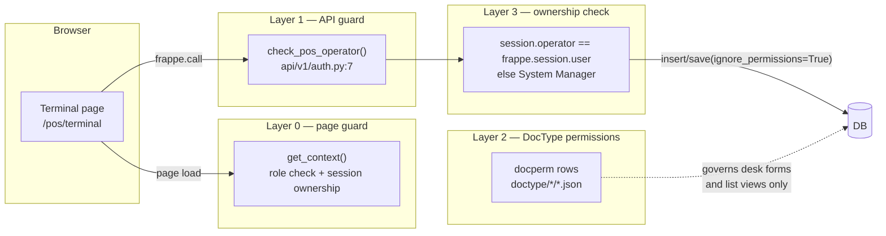

# Platform — Hooks, Roles, Auth, Scheduler, Overrides, Fixtures, Patches

> **Status:** Production
> **Source:** `scrap_metal_suite/hooks.py`, `scrap_metal_suite/scheduler.py`, `scrap_metal_suite/overrides/{supplier,reportview,naming}.py`, `scrap_metal_suite/patches.txt`, `scrap_metal_suite/patches/v2_0/*`, `scrap_metal_suite/fixtures/*.json`, `scrap_metal_suite/api/v1/auth.py`, every `doctype/*/*.json` `permissions` block
> **Last verified:** 2026-08-21 against `feature/container-redesign` @ `d598a9b`, live site `metal`
> **App version:** `1.1.0` (`scrap_metal_suite/__init__.py:1`)

This is the layer nobody looks at until something breaks at 6am. Everything here is derived from source and, where possible, checked against the running dev site.

Related: [00 Architecture](00-architecture.md) · [60 Deployment & Operations](60-deployment-operations.md) · [70 Testing](70-testing.md) · [90 Extending This App](90-extending-this-app.md)

---

## 1. `hooks.py` in full

`scrap_metal_suite/hooks.py` is 300 lines, ~85% of which is the commented-out boilerplate `bench new-app` generates. Only nine assignments are live.

### 1.1 App metadata — `hooks.py:1-6`

| Key | Value |
|---|---|
| `app_name` | `scrap_metal_suite` |
| `app_title` | `Scrap Metal Suite` |
| `app_publisher` | `Chotiputsilp.r@gmail.com` |
| `app_description` | `Scrap Metal Management` |
| `app_email` | `Chotiputsilp.r@gmail.com` |
| `app_license` | `mit` |

> Do not "improve" `app_description`. It is deliberately terse and has been changed back more than once.

**`required_apps` is commented out** (`hooks.py:11`). This is wrong in practice: the app has no `import erpnext` anywhere, but its DocTypes carry hard `Link` fields to ERPNext masters — `Item` (63 references), `Supplier` (106), `UOM` (22), `Purchase Invoice` (19), `Price List` (8), `Item Group` (5), `Item Price`, `Warehouse`, `Company`. Installing `scrap_metal_suite` on a bench without `erpnext` will fail at DocType sync. Declaring `required_apps = ["erpnext"]` would make that explicit; today it is tribal knowledge.

### 1.2 `web_include_css` / `web_include_js` — `hooks.py:32-41`

Injected into the `<head>` of **every** Frappe website (`www/`) page, including pages this app does not own.

```python
web_include_css = [
    "/assets/scrap_metal_suite/css/supplier_registration.css",
    "/assets/scrap_metal_suite/css/supplier_portal.css",
    "/assets/scrap_metal_suite/css/manager_portal.css",
    "/assets/scrap_metal_suite/css/pos.css",
]
web_include_js = [
    "/assets/scrap_metal_suite/js/pos-translations.js",
    "/assets/scrap_metal_suite/js/container-translations.js",
]
```

Two consequences worth knowing:

- `pos.css` is 147 KB and loads on every web page on the site, including other apps' portals. On a multi-app bench (`metal` has 5 apps installed, production has 11) that is a shared cost.
- Terminal pages **also** hand-link the same files with `<link>`/`<script>` tags (see [§1.9](#19-what-hooks-does-not-do) and [60 §4](60-deployment-operations.md)), so `pos.css` and `pos-translations.js` are requested twice on `/pos/terminal`. Harmless (browser dedupes on URL) but only as long as the two URLs match — and since `terminal.html` now appends `?v={{ asset_v }}` and the hook does not, they no longer match. `/pos/terminal` downloads `pos.css` twice.

### 1.3 `role_home_page` — `hooks.py:71-73`

```python
role_home_page = {"Supplier": "supplier"}
```

Only one entry. A user whose highest-priority role is `Supplier` lands on `/supplier` after login. Everyone else falls through to Frappe's default (`/app` for desk users). POS Operators are **not** routed to `/pos` by this hook — they get there by bookmark, or via the redirect chain in `www/supplier/utils.py:45-47`, which only fires if they hit `/supplier` first.

### 1.4 `doc_events` — `hooks.py:272-280`

```python
doc_events = {
    "Supplier": {
        "before_insert": [
            "scrap_metal_suite.overrides.supplier.set_source_on_manual_create",
            "scrap_metal_suite.overrides.supplier.populate_short_code",
        ],
        "before_save": "scrap_metal_suite.overrides.supplier.populate_short_code",
    }
}
```

Exactly one DocType is hooked. Everything else in the app uses controller methods on its own DocTypes rather than cross-app hooks. See [§5.1](#51-overridessupplierpy) for what these two functions do.

### 1.5 `fixtures` — `hooks.py:256-269`

```python
fixtures = [
    {"dt": "Custom Field", "filters": [["module", "=", "Scrap Metal Suite"]]},
    {"dt": "Scale"},
    {"dt": "Print Format", "filters": [["module", "=", "Scrap Metal Suite"]]},
]
```

See [§6](#6-fixtures) — including why the unfiltered `Scale` entry is a live hazard.

### 1.6 `scheduler_events` — `hooks.py:159-173`

Three cron entries, no `daily`/`hourly` shorthands. Detail in [§4](#4-scheduler-jobs).

### 1.7 `override_whitelisted_methods` — `hooks.py:185-187`

```python
override_whitelisted_methods = {
    "frappe.desk.reportview.get_count": "scrap_metal_suite.overrides.reportview.get_count"
}
```

This is the "drop" bug. **Verified mechanism, end to end:**

1. Frappe's list view and workspace-card badges call `frappe.desk.reportview.get_count`.
2. With no `limit` argument, that function builds the field list itself — `frappe/desk/reportview.py:73`:
   ```python
   args.fields = [f"count({fieldname}) as total_count"]
   ```
   For the `Dropoff` doctype `fieldname` is `` `tabDropoff`.name ``, so the field string is `` count(`tabDropoff`.name) as total_count ``.
3. `DatabaseQuery.sanitize_fields()` (`frappe/model/db_query.py:373-431`) treats any field containing `(` as a possible sub-query (`SUB_QUERY_PATTERN = re.compile("^.*[,();@].*")`, `db_query.py:39`). It slices everything after the first `(`, takes the first whitespace-delimited token — `` `tabdropoff`.name) `` — and tests it against a keyword blacklist (`db_query.py:383`):
   ```python
   blacklisted_keywords = ["select", "create", "insert", "delete", "drop", "update", "case", "show"]
   ```
4. `"drop" in "`tabdropoff`.name)"` is **True**, because the table name `tabDropoff` literally contains the substring `drop`. The check is substring containment, not tokenisation.
5. `_raise_exception()` fires: `frappe.throw(_("Use of sub-query or function is restricted"), frappe.DataError)`.

So a Dropoff count blows up purely because of how the doctype is spelled. The override (`overrides/reportview.py:20-44`) intercepts only the workspace-badge shape — `doctype == "Dropoff"` **and** the caller sent no `fields` — and answers with `frappe.db.count("Dropoff", filters=filters)`, which does not go through `sanitize_fields`. Everything else falls through to `rv.get_count()` unchanged.

This is a global override: it replaces `get_count` for **every** doctype on the site, for every installed app. The fallback path is faithful, but it is worth knowing that uninstalling this app changes list-view counting behaviour bench-wide.

> ⚠️ The same substring collision will bite any *other* code path that puts `tabDropoff` inside a function call in a `fields` list — e.g. `frappe.get_all("Dropoff", fields=["count(name)"])` or a report using `SUM(...)` over the Dropoff table. Only `get_count` is patched.

### 1.8 Hooks that are conspicuously absent

| Hook | Status | Why it matters |
|---|---|---|
| `required_apps` | commented out (`hooks.py:11`) | ERPNext dependency is undeclared — see [§1.1](#11-app-metadata--hookspy1-6) |
| `before_install` / `after_install` | commented out (`hooks.py:97-100`) | No role creation, no default settings, no seed data on install. A fresh install has no POS Profile, no Scale, no Settings singles configured. |
| `permission_query_conditions` / `has_permission` | commented out (`hooks.py:119-126`) | There is **no row-level permission filtering anywhere**. A Supplier-role desk user with read on `Dropoff` would see every supplier's dropoffs. Today that is only survivable because `Supplier` has `desk_access = 0` on the live site. |
| `before_migrate` / `after_migrate` | not set | Nothing runs around a deploy. |
| `auth_hooks` | commented out (`hooks.py:243`) | All authorisation is in-function — see [§3](#3-the-two-layer-auth-pattern). |
| `override_doctype_class` | commented out (`hooks.py:131-133`) | `overrides/__init__.py` documents the pattern but nothing uses it. |

### 1.9 What `hooks.py` does *not* do

Asset cache-busting for the terminal pages is **not** a hook. It is a per-page Python function, `get_asset_version()` in `www/pos/terminal.py:24-53`, and only `/pos/terminal` uses it. Full write-up in [60 §4](60-deployment-operations.md).

---

## 2. Roles

### 2.1 Where roles come from

**The app ships no `Role` fixtures.** There is no `Role` entry in `hooks.py:256` `fixtures`, and no `.json` in the repo with `"doctype": "Role"`. Roles appear on a site by one of two routes:

1. **Auto-created by DocType sync.** `frappe/core/doctype/doctype/doctype.py:1847-1855` collects every `role` named in a doctype's `permissions` block and inserts any that do not exist, with `desk_access = 1`:
   ```python
   roles = [p.role for p in doc.get("permissions") or []] + list(AUTOMATIC_ROLES)
   for role in list(set(roles)):
       if frappe.db.table_exists("Role", cached=False) and not frappe.db.exists("Role", role):
           r = frappe.new_doc("Role"); r.role_name = role; r.desk_access = 1
           r.flags.ignore_mandatory = r.flags.ignore_permissions = True
           r.insert()
   ```
   Verified empirically on `metal`: `Manager` and `Production Operator` were both created at `2026-04-27 13:02:3x`, seconds before the `migrate_to_containers` patch logged at `13:02:40` — i.e. by the sync of `scrap_weight_container.json`, which is the only file naming them.
2. **Typed in by hand in the desk.** `POS Manager` (created `2025-12-01 23:14:46`) appears in no doctype JSON at all. Somebody made it.

Neither route is reproducible from the repo. **A fresh install produces the roles, but no user is assigned to any of them, and nothing documents which combination is correct.** That is a real onboarding gap.

### 2.2 Every role the app touches

Live on `metal` (`Role.disabled = 0` for all):

| Role | Origin | `desk_access` | Real? |
|---|---|---|---|
| `System Manager` | Frappe core | 1 | yes — full access everywhere |
| `Supplier` | ERPNext core | **0** | yes — portal only, no desk |
| `POS Operator` | hand-created 2025-12-01 | 1 | yes — the floor role |
| `POS Manager` | hand-created 2025-12-01 | 1 | **⚠️ half-wired — see §2.4** |
| `Production Worker` | doctype sync 2026-04-14 | 1 | yes |
| `Production Manager` | doctype sync 2026-04-14 | 1 | yes |
| `Production Operator` | doctype sync 2026-04-27 | 1 | **⚠️ dead — see §2.4** |
| `SMT Accountant` | doctype sync 2026-04-15 | 1 | yes |
| `SMT Accounting Manager` | doctype sync 2026-04-15 | 1 | yes |
| `Manager` | doctype sync 2026-04-27 | 1 | **⚠️ ambiguous — see §2.4** |
| `Purchase Manager` / `Purchase User` | ERPNext core | 1 | used only by `Supplier Registration Request` |

### 2.3 DocType permission matrix

Derived directly from the `permissions` block of each `doctype/*/*.json`. Child tables (`istable: 1`) carry no permissions of their own — they inherit the parent's, which is why `Dropoff Actual Item`, `POS Order Item`, `Container Weight History` etc. are absent below.

Legend: **R**ead **W**rite **C**reate **D**elete **S**ubmit **X**cancel **A**mend **P**rint/report/export/share/email grouped as *reporting*.

| DocType | System Manager | POS Operator | Production Worker | Production Manager | SMT Accountant | SMT Accounting Manager | Other |
|---|---|---|---|---|---|---|---|
| `Dropoff` | R W C D + reporting | R W + report/print | — | — | R + reporting | R + reporting | — |
| `POS Order` | R W C D + reporting | R W + report/print | — | — | R + reporting | R + reporting | — |
| `POS Session` | R W C D + reporting | **R W C** + report/print/email | — | — | R + reporting | R + reporting | — |
| `POS Profile Scrap` | R W C D + reporting | **R only** | — | — | — | — | — |
| `POS Authority Code` | R W C D + reporting | — | — | — | — | — | — |
| `Scale` | R W C D + reporting | **R W** | **R W** | — | R + reporting | R + reporting | — |
| `Scrap Weight` | R W C D S X A + reporting | R W C **S X A** + report/print/email | — | — | R + reporting | R + reporting | — |
| `Scrap Weight Container` | R W C D S X + reporting | R W C + report/export/share | — | — | — | — | `Manager`: R W C D S X + reporting; `Production Operator`: R + report/export/share |
| `Truck Weight` | R W C D + reporting | R W C + report/print/email | — | — | R + reporting | R + reporting | — |
| `Scrap Purchase` | R W C D + reporting | R W C + report/print/email | — | — | R + reporting | R + reporting | — |
| `Production Session` | R W C D + reporting | — | R W C + reporting | R W C D + reporting | R + reporting | R + reporting | — |
| `Production Sorting` | R W C D S X + reporting | — | R W C **S** + reporting | R W C D S X + reporting | R + reporting | R + reporting | — |
| `Dropoff Final` | R W C D + reporting | — | R W C + report/print/email | R W C D + reporting | R + reporting | R + reporting | — |
| `SMT Price Lock` | R W C D S X + reporting | — | — | — | **R W C S X** + reporting | **R W C S X** + reporting | — |
| `SMT Purchase Order` | R W C D S X + reporting | — | — | — | **R W C S X** + reporting | **R W C S X** + reporting | — |
| `Dropoff Container Settings` | R W C + print/email | — | — | — | — | — | `Manager`: R W C |
| `Production Sorting Settings` | R W C D + share/print/email | — | — | — | — | — | — |
| `Supplier Registration Request` | R W C D S + reporting | — | — | — | — | — | `Purchase Manager`: R W C D S + reporting; `Purchase User`: R + reporting |

Notable asymmetries, all verified:

- **POS Operator cannot `create` a `Dropoff` or a `POS Order`** — only read and write existing ones. Correct: the office schedules dropoffs, the floor fills them in.
- **POS Operator *can* `cancel` and `amend` `Scrap Weight`.** That is the widest privilege the floor role holds, and it exists because `finish_weighing_session` → reweigh → re-finish cancels and amends the receipt (`api/v1/dropoff.py:1589`). It is legitimate, but it means an operator can invalidate a signed receipt from the desk with no second pair of eyes.
- **Nobody but System Manager can touch `POS Authority Code`.**
- **`Production Sorting Settings` has no Production Manager permission** — a Production Manager cannot change the sorting variance threshold. `Dropoff Container Settings`, by contrast, gives it to the ambiguous `Manager` role. The two settings singles are governed inconsistently.

### 2.4 Roles that do not do what their name suggests

**`POS Manager` — half-wired.** It is checked in exactly two places, both page guards:

```python
# www/pos/index.py:34  and  www/pos/truck.py:73
return "POS Operator" in roles or "POS Manager" in roles or "System Manager" in roles
```

It appears in **zero** doctype permission blocks and is not accepted by `check_pos_operator()` (`api/v1/auth.py:17`). So a user holding only `POS Manager` can load `/pos` and `/pos/truck`, see the shell render, and then have **every single API call fail** with *"Access denied. POS Operator role required."* The page loads; nothing works. If you have assigned this role to a supervisor, they are getting a broken screen.

**`Production Operator` — dead.** Referenced once, at `doctype/scrap_weight_container/scrap_weight_container.json:319`, granting read/report/export/share on containers. The production auth guard checks `Production Worker` / `Production Manager` / `System Manager` (`api/v1/auth.py:31`) and never `Production Operator`; no page guard mentions it. It is a typo that became a Role row via doctype sync (see [§2.1](#21-where-roles-come-from)). Almost certainly meant to be `Production Worker`.

**`Manager` — ambiguous.** Created by the same 2026-04-27 sync. It carries real power (`Scrap Weight Container`: R W C D S X + reporting; `Dropoff Container Settings`: R W C) and it is the role `www/supplier/utils.py:40` uses to bounce a user to `/manager`. But its name collides conceptually with `POS Manager` and `Production Manager`, and nothing states who should hold it. Rename or retire.

### 2.5 Page reachability by role

Every `www/` page and what actually gates it. **`/manager` and `/scale-test` are unauthenticated** — verified by `curl` against the running dev site.

| Route | Guard in code | Guest HTTP | Notes |
|---|---|---|---|
| `/pos` | `www/pos/index.py:31-34` — POS Operator ∪ POS Manager ∪ System Manager | 301 → login | |
| `/pos/terminal` | **none beyond login + session ownership** (`www/pos/terminal.py:61-90`) | 301 → login | No role check at all. Gated only by owning an Open POS Session, which in practice requires POS Operator to have created. Defence-in-depth is missing. |
| `/pos/truck` | `www/pos/truck.py:70-73` — POS Operator ∪ POS Manager ∪ System Manager | 301 → login | |
| `/pos/production` | `www/pos/production.py:37-39` — Production Worker ∪ Production Manager ∪ System Manager | 301 → login | |
| `/production` | `www/production/index.py:29-35` — same three | 301 → login | |
| `/production/terminal` | **none beyond login + session ownership** (`www/production/terminal.py:15-41`) | 301 → login | Same gap as `/pos/terminal`. |
| `/supplier`, `/supplier/*` | `www/supplier/utils.py:27-52` — redirect chain, then requires `Supplier` + a linked Contact→Supplier | 301 → login | |
| `/supplier-registration-form` | deliberately public | **200** | Intended. Reads `Country` with `ignore_permissions=True` (`www/supplier-registration-form.py:14-19`). |
| `/manager`, `/manager/price`, `/manager/world-price` | **NONE** | **200** | 🔴 See below. |
| `/scale-test` | **NONE** (`www/scale-test/index.py:3-14`) | **200** | Hardware test page, publicly reachable. Low data risk, but it is a WebSerial page anyone can load. |

🔴 **`/manager` leaks business data to anonymous visitors.** `www/manager/index.py:9-43` has no login check and no role check. Verified on the running dev site:

```
$ curl -s -o /dev/null -w '%{http_code}' http://localhost:8000/manager
200
$ curl -s http://localhost:8000/manager | grep -A1 'kpi-value'
    <div class="kpi-value">19</div>
    <div class="kpi-label">Total Suppliers</div>
```

The page also renders `recent_registrations` — company names and registration dates — straight from the DB (`www/manager/index.py:30-36`). `/manager/price` and `/manager/world-price` are equally open. **On the internet-facing production host this is an unauthenticated information disclosure.** The manager portal is documented elsewhere as "NOT TESTED / not production-ready"; that is not a mitigation while the routes are live. Either add a guard mirroring `www/pos/index.py:31`, or delete `www/manager/` until it is finished.

### 2.6 Desk workspaces

| Workspace | File | `roles` | Effect |
|---|---|---|---|
| SMT Accounting | `scrap_metal_suite/workspace/smt_accounting/smt_accounting.json` | `SMT Accountant`, `SMT Accounting Manager`, `System Manager` | correctly restricted |
| SMT Production | `scrap_metal_suite/workspace/smt_production/smt_production.json` | **`[]`** | visible to every user with desk access, including Suppliers if anyone ever gives that role `desk_access = 1` |

---

## 3. The two-layer auth pattern



### 3.1 The guards

`api/v1/auth.py` is 32 lines and defines exactly two functions.

```python
def check_pos_operator():                                     # auth.py:7
    if frappe.session.user == "Guest":
        frappe.throw(_("Please login to access POS"), frappe.AuthenticationError)
    user_roles = frappe.get_roles(frappe.session.user)
    if "POS Operator" not in user_roles and "System Manager" not in user_roles:
        frappe.throw(_("Access denied. POS Operator role required."), frappe.PermissionError)

def check_production_operator():                              # auth.py:21
    if frappe.session.user == "Guest":
        frappe.throw(_("Please login to access Production"), frappe.AuthenticationError)
    user_roles = frappe.get_roles(frappe.session.user)
    if ("Production Worker" not in user_roles
            and "Production Manager" not in user_roles
            and "System Manager" not in user_roles):
        frappe.throw(_("Access denied. Production Worker role required."), frappe.PermissionError)
```

### 3.2 Guard coverage — audited endpoint by endpoint

66 whitelisted endpoints across four modules. **63 carry a guard as their first statement.** The three that do not are all defensible:

| Endpoint | Guard | Verdict |
|---|---|---|
| `pos.create_scrap_weight` (`api/v1/pos.py:406`) | none | ✅ Deprecated stub — the whole body is a single `frappe.throw` naming `finish_weighing_session` (`pos.py:428-435`). Nothing to protect. |
| `dropoff.get_items_from_orders` (`api/v1/dropoff.py:39`) | none | ✅ Uses the DocType layer instead: `frappe.has_permission("POS Order", "read", order_name)` per row (`dropoff.py:58-60`). |
| `production.search_dropoff` (`api/v1/production.py:232`) | none | ✅ One-line alias — `return lookup_dropoff(query)`, and `lookup_dropoff` guards (`production.py:187`). |
| `api.v1.get_countries` (`api/v1/__init__.py:11`) | `allow_guest=True` | ✅ Intentional — the public registration form needs it. |
| `api.v1.debug_supplier_link` (`api/v1/__init__.py:22`) | none, but self-scoped | ⚠️ Returns only `frappe.session.user`'s own Contact→Supplier chain, so no cross-tenant leak. Still a debug endpoint sitting in the production API surface with no role check. Delete it. |

Beyond the role guard, every session-scoped endpoint adds an **ownership** check:

```python
# api/v1/pos.py:455-457 (get_session_weights), same shape at pos.py:806-811,
# production.py:47-50, production.py:149-152, production.py:424-427, production.py:485-488
user_roles = frappe.get_roles(frappe.session.user)
if session_operator != frappe.session.user and "System Manager" not in user_roles:
    frappe.throw(_("You can only view your own session data"), frappe.PermissionError)
```

Production escalates to `Production Manager` rather than `System Manager` for close/edit/submit (`production.py:48`, `:425`, `:486`), which is the correct shape for a shift supervisor.

### 3.3 Why `ignore_permissions=True` on insert/save is correct here

This pattern appears throughout and is **deliberate, not a bug.** The canonical example, `api/v1/pos.py:107-137`:

```python
@frappe.whitelist()
def open_session(pos_profile):
    check_pos_operator()                       # ← Layer 1: role verified
    ...
    session = frappe.get_doc({"doctype": "POS Session", "pos_profile": pos_profile, "status": "Open"})
    # check_pos_operator() above already authorised this caller; a pure POS
    # Operator has no create permission on POS Session, so a plain insert()
    # would raise for exactly the role this endpoint exists to serve.
    session.insert(ignore_permissions=True)    # ← Layer 2 deliberately bypassed
```

The reasoning:

1. **The API guard is the authorisation boundary for terminal traffic.** Terminals do not use the desk. They call a small, curated set of whitelisted endpoints, each of which validates the role, the session ownership, and the document state before touching anything.
2. **DocType permissions govern a different surface** — desk forms, list views, the REST `/api/resource` endpoints, report builder. Those are for managers and accounting, and there the docperm rows are the real control.
3. **Deliberately narrowing the docperm rows is a feature.** A POS Operator is not supposed to be able to open the desk and hand-create a `Scrap Weight Container` outside a session. Granting `create` at the DocType layer to make `ignore_permissions` unnecessary would *widen* the attack surface, not narrow it.
4. Therefore `ignore_permissions=True` after a guard means "this code path has already done the authorisation that matters", not "skip authorisation".

> **Do not "fix" these by removing the flag.** It has been flagged as a bug before and reverted. If you are adding a new endpoint, the rule is: guard first, then `ignore_permissions=True` on the write. If you cannot state which guard authorised the write, you have a real bug.

**One stale comment.** The comment at `api/v1/pos.py:135-136` claims *"a pure POS Operator has no create permission on POS Session"*. That is no longer true — `doctype/pos_session/pos_session.json` grants POS Operator `create`. The flag is still harmless and still correct as defence-in-depth, but the justification in the comment is out of date.

**Counts of `ignore_permissions` in production code** (excluding tests):

| File | Uses |
|---|---|
| `scheduler.py` | 4 (`:31`, `:37`, `:78`, `:84`) |
| `api/v1/dropoff.py` | 3 |
| `patches/v2_0/migrate_to_containers.py` | 3 |
| `doctype/supplier_registration_request/supplier_registration_request.py` | 6 |
| `doctype/smt_purchase_order/smt_purchase_order.py` | 2 |
| `doctype/smt_price_lock/smt_price_lock.py` | 2 |
| `www/supplier-registration-form.py` | 1 |
| `api/v1/pos.py` | 1 |
| `api/v1/__init__.py` | 1 |

---

## 4. Scheduler jobs

`hooks.py:159-173` registers three cron jobs. All three are implemented in `scrap_metal_suite/scheduler.py` (132 lines, no imports beyond `frappe` and `frappe.utils`).

| Job | Cron | Threshold | Reads | Writes | Returns |
|---|---|---|---|---|---|
| `close_idle_sessions` | `*/15 * * * *` | idle > **90 min** | `tabPOS Session` where `status='Open'` | `POS Session.status/closing_time/closed_by`, `Scale.in_use/in_use_by_session` | count closed |
| `close_idle_production_sessions` | `*/5 * * * *` | idle > **10 min** | `tabProduction Session` where `status='Open'` **and `last_activity IS NOT NULL`** | same shape | count closed |
| `expire_open_pos` | `0 1 * * *` | `expiry_date < today()` | `SMT Price Lock` `status='Open'`, `docstatus=1`, `expiry_date` set | `status='Expired'`, `status_date` | count expired |

### 4.1 `close_idle_sessions` — `scheduler.py:8-51`

```python
idle_threshold = add_to_date(now_datetime(), minutes=-90)
idle_sessions = frappe.db.sql("""
    SELECT name, operator, scale, last_activity, opening_time
    FROM `tabPOS Session`
    WHERE status = 'Open'
      AND COALESCE(last_activity, opening_time) < %(threshold)s
""", {"threshold": idle_threshold}, as_dict=True)
```

Per session (`scheduler.py:26-43`): `get_doc` → `status = "Closed"`, `closing_time = now`, `closed_by = "Administrator"`, `save(ignore_permissions=True)`; then if the session held a scale, `Scale.in_use = 0` and `in_use_by_session = None`, saved the same way. The whole loop is wrapped per-session in `try/except` that logs and continues (`:44-45`), so one bad row cannot abort the sweep. A single `frappe.db.commit()` fires only if at least one session closed (`:47-49`).

`COALESCE(last_activity, opening_time)` is the important detail: a session that never recorded activity still ages out from its open time.

**Failure modes:**

- `closed_by = "Administrator"` is hardcoded (`:30`). The audit trail cannot distinguish a scheduler close from a real admin close. Grep `frappe.logger()` output for `Auto-closed idle session` to tell them apart.
- The scale release is inside the same `try` as the session close (`:33-37`). If `Scale.save()` throws — e.g. a validation added later — the session is already saved but the exception is swallowed, leaving the **scale stuck `in_use = 1` pointing at a Closed session**. That is the exact condition `api_test/_release_stuck_scales.py` exists to repair. This is a real, reachable bug.
- `Document.save()` runs the POS Session controller's `validate`/`on_update`. Any future validation that rejects a Closed transition silently kills the sweep for that row.

### 4.2 `close_idle_production_sessions` — `scheduler.py:54-98`

Structurally identical, with two differences:

- 10-minute threshold, 5-minute cadence — aggressive, because a production scale is a shared bay and a forgotten session locks it.
- The query requires `last_activity IS NOT NULL` (`scheduler.py:66`). **There is no `COALESCE` fallback to `opening_time`.** A Production Session that is opened and never touched has `last_activity = NULL` and will therefore **never be auto-closed**, holding its scale lock indefinitely. This is an inconsistency with the POS job and a genuine defect.

### 4.3 `expire_open_pos` — `scheduler.py:101-132`

Despite the name, this operates on `SMT Price Lock`, not `SMT Purchase Order`. ("PO" here is legacy vocabulary from before the Price Lock rename.)

```python
expired_pos = frappe.get_all("SMT Price Lock", filters=[
    ["status", "=", "Open"], ["expiry_date", "is", "set"],
    ["expiry_date", "<", today()], ["docstatus", "=", 1],
], pluck="name")
for po_name in expired_pos:
    frappe.db.set_value("SMT Price Lock", po_name, {"status": "Expired", "status_date": now_datetime()})
```

Uses `frappe.db.set_value`, **not** the document API — so no controller hooks, no version history, no `modified_by` change. Deliberate (an expiry is a system fact, not a user edit) but it means the Price Lock's own `validate` never sees the transition.

Only `status = "Open"` is touched. `Partially Settled` locks are never auto-expired (`scheduler.py:104`) — correct, since money has already moved against them.

### 4.4 Running them manually

```bash
cd ~/frappe-bench
bench --site metal execute scrap_metal_suite.scheduler.close_idle_sessions
bench --site metal execute scrap_metal_suite.scheduler.close_idle_production_sessions
bench --site metal execute scrap_metal_suite.scheduler.expire_open_pos
```

Each prints its return value (the count). Production: swap `metal` for `smt.x-desk.tech` and run as `taynaja`.

### 4.5 🔴 The scheduler is **disabled** on the dev site

```
$ bench --site metal doctor
Scheduler disabled for metal
Scheduler inactive for metal
Workers online: 2
```

The three jobs are correctly registered as `Scheduled Job Type` rows and none is `stopped`, but their `last_execution` is frozen:

| Job | `cron_format` | `stopped` | `last_execution` |
|---|---|---|---|
| `scheduler.close_idle_production_sessions` | `*/5 * * * *` | 0 | 2026-05-01 00:40:15 |
| `scheduler.close_idle_sessions` | `*/15 * * * *` | 0 | 2026-05-01 00:30:12 |
| `scheduler.expire_open_pos` | `0 1 * * *` | 0 | 2026-04-30 13:51:09 |

Nothing has auto-closed on `metal` since 1 May. Consequences for local work: idle POS sessions accumulate and block `open_session` ("You already have an open session"), and stale scale locks are never released. Re-enable with:

```bash
bench --site metal enable-scheduler       # then restart `bench start`
```

`sites/common_site_config.json` has `"pause_scheduler": 0`, so the block is per-site, not bench-wide.

> ⚠️ **UNVERIFIED — scheduler state on production.** I did not connect to `smt.x-desk.tech`. If the same flag is off there, price locks are not expiring and terminals are not being released. Check `bench --site smt.x-desk.tech doctor` before assuming the jobs run.

---

## 5. `overrides/`

Three modules. `overrides/__init__.py` is documentation only — it describes the `override_doctype_class` pattern, which nothing in this app uses.

### 5.1 `overrides/supplier.py`

Hooked on `Supplier` `before_insert` and `before_save` (`hooks.py:272-280`). 94 lines.

| Function | Line | What it does |
|---|---|---|
| `set_source_on_manual_create` | `:14` | If `custom_source` is empty, set it to `"Manual"`. Distinguishes desk-created suppliers from portal registrations. `before_insert` only. |
| `populate_short_code` | `:20` | Auto-derives and validates `Supplier.short_code`. Runs on both `before_insert` and `before_save`. |
| `_validate_short_code_format` | `:57` | Enforces `^[A-Z0-9]{2,8}$`. |
| `_derive_default` | `:65` | Strips non-ASCII-alphanumerics, uppercases, takes the first 4 chars. Returns `""` if fewer than 2 survive. |
| `_free_short_code` | `:73` | Appends `2`…`99` on collision, capped at 8 chars total. |
| `_is_taken` | `:90` | `frappe.db.exists("Supplier", {"short_code": …, "name": ["!=", self]})`. |

Why it exists: `short_code` is embedded in every supplier-scoped docname (see [§5.3](#53-overridesnamingpy)), so it must be ASCII, short, unique, and always present. The Custom Field is `reqd: 1, unique: 1`.

The Thai edge case is handled explicitly: a supplier named `บริษัท เศษเหล็ก จำกัด` yields no ASCII characters, so `_derive_default` returns `""` and the hook throws a targeted message (`supplier.py:45-52`) instead of letting Frappe emit a generic "missing mandatory field". Operators must type a code by hand.

### 5.2 `overrides/reportview.py`

44 lines. Overrides `frappe.desk.reportview.get_count` — full mechanism in [§1.7](#17-override_whitelisted_methods--hookspy185-187).

Implementation notes:

- Decorated `@frappe.whitelist()` **and** `@frappe.read_only()` (`:18-19`), matching the upstream signature.
- Reads `frappe.local.form_dict` directly (`:28`) because `reportview.get_count()` takes no arguments.
- Normalises `filters`/`fields` from JSON strings (`:32-35`) since REST callers send them serialised.
- Special-cases only `doctype == "Dropoff" and not args.get("fields")` (`:38`), then `return frappe.db.count("Dropoff", filters=filters)` (`:41`).
- Everything else: `return rv.get_count()` (`:44`).

### 5.3 `overrides/naming.py`

102 lines. Not hooked — imported directly by five DocType controllers. It is the single source of truth for the supplier-coded docname family.

| Pattern | Used by | Call site |
|---|---|---|
| `PLO-{short}-YYMM-###` | `SMT Price Lock` | `smt_price_lock.py:15` → `supplier_monthly_name("PLO", …)` |
| `PDR-{short}-YYMM-###` | `POS Order` | `pos_order.py:31` → `supplier_monthly_name("PDR", …)` |
| `SPO-{short}-YYMM-###` | `SMT Purchase Order` | `smt_purchase_order.py:18` → `supplier_monthly_name("SPO", …)` |
| `DO-{short}-YYMMDD-#` | `Dropoff` | `dropoff.py:28` → `supplier_daily_name("DO", …, on_date=dropoff_scheduled_start)` |
| `SW-{short}-YYMMDD-#` | `Scrap Weight` | `scrap_weight.py:42` → `supplier_daily_name("SW", …)` |

| Function | Line | Behaviour |
|---|---|---|
| `supplier_short(supplier)` | `:30` | Reads `Supplier.short_code`; throws a named error if missing or if `supplier` is falsy. This is the guard that makes every docname deterministic. |
| `supplier_monthly_name(prefix, supplier, padding=3)` | `:61` | `make_autoname(f"{prefix}-{short}-{YYMM}-.###")` |
| `supplier_daily_name(prefix, supplier, on_date=None, padding=1)` | `:68` | `make_autoname(f"{prefix}-{short}-{YYMMDD}-.#")`; coerces a `date` to `datetime` (`:83-84`) |
| `derive_pdr_from_plo(plo_name)` | `:88` | `PLO-ACME-2604-001` → `PDR-ACME-2604-001` by prefix swap; throws if the input is not `PLO-*` |

Two design consequences you will meet:

- **Counters are per-prefix**, because `make_autoname` scopes its series on the literal prefix string. Every (supplier × period) pair therefore gets its own counter starting at 1. `.#` is a *minimum* pad, not a maximum — a supplier doing 12 dropoffs in a day gets `…-10`, `…-11`, `…-12` without breaking.
- **`derive_pdr_from_plo` assumes 1:1 PLO→PDR.** A second POS Order from the same Price Lock would collide on the unique name constraint. That is the intended safety net, not an oversight (`naming.py:93-95`).
- **A supplier with no `short_code` cannot have any document created against it.** Verified live — this is exactly how the E2E regression suite fails when it inherits a pre-`short_code` supplier row (see [70 §6](70-testing.md)).

---

## 6. Fixtures

`hooks.py:256-269`. Three entries, exported to `scrap_metal_suite/fixtures/*.json`.

### 6.1 `Custom Field` — filtered on `module = "Scrap Metal Suite"`

`fixtures/custom_field.json`, 3 fields, all on `Supplier`:

| Fieldname | Type | Label | `reqd` | `unique` | `insert_after` | Fixture `modified` |
|---|---|---|---|---|---|---|
| `custom_source` | Select | Source | 0 | 0 | `supplier_name` | 2025-12-16 00:53:00 |
| `custom_registration_request` | Link | Registration Request | 0 | 0 | `custom_source` | 2025-12-16 00:53:00 |
| `short_code` | Data | Short Code | **1** | **1** | `supplier_name` | 2026-05-01 00:00:00 |

`short_code` is load-bearing for all five naming patterns in [§5.3](#53-overridesnamingpy). Note it does **not** carry the `custom_` prefix, unlike its two siblings.

### 6.2 `Scale` — **no filter** 🔴

```python
{"dt": "Scale"}
```

`bench export-fixtures --app scrap_metal_suite` will dump **every `Scale` row on the site** into `fixtures/scale.json`, and the next `bench migrate` on any site will create them all.

The committed fixture holds 5 clean records — `SCALE-001`, `SCALE-002`, `SCALE-003` (inactive), `TRUCK-001`, `TRUCK-002`. The **dev site right now holds 12**:

```
_TEST_LOOP_Scale-01   _TEST_PR_Scale-01   _TEST_SWC_Scale-01
_TEST_SWC_Scale-02    _TEST_WF_Scale-01   Prod-1   Prod-2
SCALE-001  SCALE-002  SCALE-003  TRUCK-001  TRUCK-002
```

Running `bench export-fixtures` on this machine today would commit five `_TEST_*` scales plus two undocumented `Prod-*` scales into the repo, and the next production migrate would create them on `smt.x-desk.tech`. **Add a filter** — e.g. `[["scale_name", "not like", "_TEST_%"]]` — or stop shipping `Scale` as a fixture and treat scales as per-site configuration, which is what they actually are (they encode physical serial hardware).

### 6.3 `Print Format` — filtered on `module = "Scrap Metal Suite"`

`fixtures/print_format.json`, 85 KB, 8 formats:

| Name | DocType | `standard` | HTML bytes | Fixture `modified` |
|---|---|---|---|---|
| `Scrap Weight Thermal` | Scrap Weight | Yes | 7 385 | 2026-08-21 16:44 |
| `Truck Weight Thermal` | Truck Weight | Yes | 8 022 | 2026-08-21 16:44 |
| `ใบคิวสองภาษา` | Dropoff | Yes | 16 302 | 2026-08-21 17:54 |
| `ใบสรุปการส่งมอบ` | POS Order | No | 12 231 | 2026-01-15 15:00 |
| `ใบยืนยันราคา` | SMT Price Lock | Yes | 8 137 | 2026-04-15 18:00 |
| `ใบสั่งซื้อ` | SMT Purchase Order | Yes | 9 429 | 2026-04-15 18:00 |
| `ใบคัดแยก` | Dropoff Final | Yes | 10 190 | 2026-04-15 18:00 |
| `Scrap Weight Container Sticker` | Scrap Weight Container | No | 2 096 | 2026-08-21 16:44 |

A ninth format, `weight_receipt`, lives as a module file at `scrap_metal_suite/print_format/weight_receipt/` rather than in the fixture.

### 6.4 🔴 The `modified`-timestamp rule does **not** apply to fixtures

This is widely believed in this project's own notes and in `api_test/_sync_print_formats.py:8-11`, and it is **wrong**. Traced through Frappe 15.74:

1. `bench migrate` → `SiteMigration.post_schema_updates()` → `sync_fixtures()` (`frappe/migrate.py:140`).
2. `sync_fixtures` → `import_fixtures(app)` → for each `fixtures/*.json`, `import_doc(file_path)` (`frappe/utils/fixtures.py:41`).
3. That calls `import_file_by_path(f, data_import=True, **force=True**, pre_process=…, reset_permissions=True)` (`frappe/core/doctype/data_import/data_import.py:274-276`).
4. Inside `import_file_by_path`, the entire timestamp/hash short-circuit is gated on `if not force and db_modified_timestamp:` (`frappe/modules/import_file.py:130`). With `force=True` it is skipped.

**Fixtures are unconditionally deleted and re-inserted on every `bench migrate`**, regardless of the `modified` value in the JSON. `delete_old_doc()` runs (`import_file.py:230-231`), then `doc.insert()` (`:239`).

Two follow-on facts:

- Because `data_import=True`, `ignore_validate` is **not** set (`import_file.py:234-237`), so `PrintFormat.validate()` does run. It throws *"Standard Print Format cannot be updated"* — but only when `not frappe.flags.in_migrate` (`frappe/printing/doctype/print_format/print_format.py:68-75`). During `bench migrate` that flag is `True` (`frappe/migrate.py:85`, cleared at `:104`), so **standard print formats import cleanly on migrate.**
- The write-lock is real **outside** migrate. That is why `_sync_print_formats.py:69` uses `frappe.db.set_value` — you cannot patch a standard format through the document API on a non-`developer_mode` site.

> **The `modified`-timestamp rule *does* apply** to module-folder JSON — `doctype/*/*.json`, `workspace/*/*.json`, `print_format/weight_receipt/weight_receipt.json` — which `frappe.model.sync.sync_all()` imports with `force=False`. That is where the "bump `modified` to force a re-import" folklore comes from. It just does not apply to `fixtures/`.

### 6.5 Fixture commands

```bash
bench export-fixtures --app scrap_metal_suite     # DB → repo   ⚠️ read §6.2 first
bench --site metal migrate                        # repo → DB   (unconditional re-import)

# Patch print formats without a full migrate (idempotent, re-runnable):
bench --site metal execute scrap_metal_suite.api_test._sync_print_formats.run
bench --site metal execute scrap_metal_suite.api_test._sync_print_formats.run \
    --kwargs '{"only":"ใบคิวสองภาษา"}'
```

---

## 7. Patches

`scrap_metal_suite/patches.txt`:

```
[pre_model_sync]
# (empty)

[post_model_sync]
scrap_metal_suite.patches.v2_0.migrate_to_containers
scrap_metal_suite.patches.v2_0.backfill_container_snapshot_fields
scrap_metal_suite.patches.v2_0.fix_variance_threshold_defaults
```

All three are `post_model_sync`, i.e. they run after `frappe.model.sync.sync_all()` has created the new columns they depend on (`frappe/migrate.py:114-121`). Order matters: containers must exist before their snapshot fields can be backfilled.

**All three have already run on the dev site `metal`** (`Patch Log`):

| Patch | Ran at |
|---|---|
| `migrate_to_containers` | 2026-04-27 13:02:40 |
| `backfill_container_snapshot_fields` | 2026-05-01 00:36:41 |
| `fix_variance_threshold_defaults` | 2026-05-01 01:17:23 |

> ⚠️ **UNVERIFIED — none of these have run on production.** `smt.x-desk.tech` is on `develop` @ `9bad181` (v1.1.0), which predates the container redesign entirely. All three will fire on the first production migrate of this branch, against a year of real data. That is the deploy gate — see [60 §6](60-deployment-operations.md) and `docs/DROPOFF_CONTAINER_REDESIGN.md` §10, §11.4.

### 7.1 `migrate_to_containers` — the breaking one

`patches/v2_0/migrate_to_containers.py`, 249 lines.

Converts legacy `Scrap Weight` + `Scrap Weight Item` rows into per-bag `Scrap Weight Container` documents.

**The bug it works around:** before the redesign, saving a new Scrap Weight wrote a *full snapshot* of the dropoff's items rather than appending. `DO-260320-00002` ended up with six Scrap Weight records for the same physical scrap. So the migration takes **only the latest** SW per dropoff (`creation desc, limit 1`, `:147-153`) and ignores the rest as stale snapshots. Summing them would multiply the yard's tonnage by six.

Algorithm per Dropoff:

| Step | Line | Action |
|---|---|---|
| 0 | `:76-77` | Bail out entirely if the `Scrap Weight Container` DocType does not exist yet (defers to the next migrate) |
| 1 | `:143-145` | Skip if the dropoff already has any container — **this is the idempotence guard** |
| 2 | `:147-158` | Fetch the newest `Scrap Weight` only |
| 3 | `:174-205` | One `Scrap Weight Container` per `Scrap Weight Item`, in `idx` order: `container_type="Bag"`, `entry_method="Manual Entry"`, `status="Active"`, `legacy_scrap_weight=<SW name>` for audit, plus one `Container Weight History` row with `event="Initial"` |
| 4 | `:209-211` | `Dropoff.save()` so `sync_actual_items` + `calculate_net_weight` recompute aggregates |
| 5 | `:213-227` | Compare `total_actual_weight` against truck `net_weight`; log a warning above **1.0 %** (`MIGRATION_WARN_PCT`, `:67`) — **does not fail the migration** |

`item_name` is copied verbatim (`:184`) — item names are canonical Thai and must never be translated.

**Pre-flight report** (`:79-120`) logs, via `frappe.log_error`, before touching anything: total dropoffs, how many have >1 Scrap Weight (duplication candidates), total items in the latest-SW set, and estimated containers to create. **Read this in `Error Log` before you accept a production run.**

**Final summary** (`:238-248`) logs `migrated / skipped / no_scrap_weight / no_items / warned / errored`.

Safety: every dropoff is individually `try/except`'d (`:230-235`), so one bad row cannot abort the whole run — but it also means **failures are silent unless you read `Error Log`**. A production run that "succeeds" with `errored=40` looks identical at the console to one with `errored=0`.

### 7.2 `backfill_container_snapshot_fields`

`patches/v2_0/backfill_container_snapshot_fields.py`, 86 lines.

The container redesign added four denormalised fields so the printed sticker does not need to join back to `Dropoff` or `User`: `supplier`, `supplier_name`, `license_plate` (all `fetch_from` `dropoff.*`) and `operator_name` (`fetch_from` `operator.full_name`).

`fetch_from` only populates on insert/save, so rows created before the schema change have them `NULL`. This patch fills them, with per-dropoff and per-user caches (`:37-38`) to avoid N queries, and writes with `update_modified=False` (`:74-80`) so it does not disturb audit timestamps.

Idempotent — it only writes where the target column is currently empty (`:44`, `:56-61`, `:63`).

### 7.3 `fix_variance_threshold_defaults`

`patches/v2_0/fix_variance_threshold_defaults.py`, 109 lines.

A units bug. `Dropoff.truck_variance_threshold_percent` and `indicated_variance_threshold_percent` are Frappe `Percent` fields — stored as the percent number itself, so `1.0` means 1 %. The original schema shipped `default: "0.001"` with the description "default 0.1 %", i.e. the author wrote the value as a *fraction*. Read as a literal percent, `0.001` means **0.001 %** — a near-zero threshold that flags essentially every dropoff as a variance breach.

The patch (`:37-105`):

1. Backfills any Dropoff whose threshold is `NULL`, `0`, or `0.001` to `NEW_DEFAULT = 0.1` (`:34`, `:58-62`).
2. Re-runs `doc.calculate_truck_variance()` and persists the seven recomputed fields directly (`:78-99`) — deliberately **not** `doc.save()`, to avoid re-validating a whole legacy document on stale data.
3. Logs a traceback per failed row and continues (`:100-104`).

Idempotent — it only touches rows still matching a stale-default shape.

The schema defaults and the controller fallbacks (`or 0.001` → `or 0.1`) were fixed separately; this patch only repairs existing rows.

### 7.4 Working with patches

```bash
# Which of ours have run?
bench --site metal execute frappe.client.get_list --kwargs \
  '{"doctype":"Patch Log","filters":{"patch":["like","%scrap_metal_suite%"]},
    "fields":["patch","creation"],"limit_page_length":50}'

# Re-run a specific patch (all three are idempotent):
bench --site metal execute scrap_metal_suite.patches.v2_0.fix_variance_threshold_defaults.execute

# Force a re-run through the patch machinery:
bench --site metal run-patch scrap_metal_suite.patches.v2_0.migrate_to_containers --force
```

Note that `migrate_to_containers` re-run is a no-op for dropoffs that already have containers ([§7.1](#71-migrate_to_containers--the-breaking-one) step 1) — that is what makes repeated `bench migrate` safe, but it also means **it cannot repair a partially-migrated dropoff**. If a dropoff got some containers and then errored, re-running skips it.

---

## 8. Known issues & gotchas

Ordered by how much damage they can do.

| # | Severity | Issue | Evidence | Fix |
|---|---|---|---|---|
| 1 | 🔴 **HIGH** | `/manager`, `/manager/price`, `/manager/world-price` and `/scale-test` are reachable by **unauthenticated Guests** and render live supplier counts and recent registrations. | `www/manager/index.py:9-43` has no guard; `curl` returns `200` with `<div class="kpi-value">19</div>` | Add the guard from `www/pos/index.py:31-34`, or delete `www/manager/` until it is finished. |
| 2 | 🔴 **HIGH** | `{"dt": "Scale"}` in `hooks.py:262` has no filter. `bench export-fixtures` today would commit 5 `_TEST_*` scales and 2 undocumented `Prod-*` scales, and the next production migrate would create them. | fixture holds 5 rows, dev site holds 12 | Add a `not like "_TEST_%"` filter, or drop `Scale` from `fixtures` entirely. |
| 3 | 🟠 MED | `close_idle_production_sessions` requires `last_activity IS NOT NULL` and has no `COALESCE(…, opening_time)` fallback. A Production Session opened and never touched **never auto-closes** and holds its scale lock forever. | `scheduler.py:66` vs `scheduler.py:20` | Mirror the POS query. |
| 4 | 🟠 MED | Scale release lives inside the same `try` as the session close in both idle jobs. If `Scale.save()` throws, the session is Closed but the scale stays `in_use = 1` pointing at it. | `scheduler.py:33-45`, `:80-92` | Split into two `try` blocks. Repair tool: `api_test/_release_stuck_scales.run`. |
| 5 | 🟠 MED | The scheduler is **disabled** on `metal`; no job has run since 2026-05-01. Production state unverified. | `bench --site metal doctor`; `Scheduled Job Type.last_execution` | `bench --site metal enable-scheduler`; check production. |
| 6 | 🟠 MED | `POS Manager` role loads `/pos` and `/pos/truck` but is rejected by `check_pos_operator()`, so every API call on those pages fails. | `www/pos/index.py:34` vs `api/v1/auth.py:17` | Add `POS Manager` to `check_pos_operator`, or stop accepting it in the page guards. |
| 7 | 🟠 MED | `required_apps` is not declared, yet ERPNext is a hard dependency (Link fields to `Item`, `Supplier`, `Price List`, `UOM`, `Purchase Invoice`, …). | `hooks.py:11`; 63 `"Item"` refs, 106 `"Supplier"` refs | `required_apps = ["erpnext"]`. |
| 8 | 🟡 LOW | `Production Operator` role exists and holds container read perms, but no guard anywhere accepts it. Almost certainly a typo for `Production Worker`. | `scrap_weight_container.json:319` vs `api/v1/auth.py:31` | Rename in the JSON, re-migrate, delete the stray Role. |
| 9 | 🟡 LOW | `Manager` role was invented by a doctype-sync side effect and now holds delete/cancel on `Scrap Weight Container` plus write on `Dropoff Container Settings`, with a name that collides with `POS Manager` / `Production Manager`. | `scrap_weight_container.json:295`, `dropoff_container_settings.json:50`, `www/supplier/utils.py:40` | Rename to something unambiguous, or retire it. |
| 10 | 🟡 LOW | `SMT Production` workspace has `roles: []` — visible to every desk user. `SMT Accounting` is correctly restricted. | `workspace/smt_production/smt_production.json` | Add roles. |
| 11 | 🟡 LOW | `api.v1.debug_supplier_link` is a whitelisted debug endpoint with no role guard. Self-scoped, so no cross-user leak, but it should not be in a shipped API. | `api/v1/__init__.py:22-66` | Delete. |
| 12 | 🟡 LOW | The `modified`-timestamp fixture rule is documented wrongly in `_sync_print_formats.py:8-11` and repeated in project notes. Fixtures are **always** force-re-imported. | `data_import.py:274-276` + `import_file.py:130` | Correct the docstring. Behaviour is fine. |
| 13 | 🟡 LOW | The comment at `api/v1/pos.py:135-136` claims POS Operator has no `create` on POS Session. The doctype grants it. Flag still harmless. | `pos_session.json` permissions | Update the comment. |
| 14 | 🟡 LOW | `/pos/terminal` and `/production/terminal` have **no role check** — only login plus session ownership. | `www/pos/terminal.py:56-99`, `www/production/terminal.py:9-41` | Add the same `has_pos_access()` / `has_production_access()` call the sibling pages use. |
| 15 | 🟡 LOW | `pos.css` (147 KB) loads on **every** website page on the bench via `web_include_css`, and is fetched twice on `/pos/terminal` because the hook URL and the `?v=` URL differ. | `hooks.py:35`, `www/pos/terminal.html:6` | Scope the include, or drop the duplicate `<link>`. |
| 16 | 🟡 LOW | `migrate_to_containers` swallows per-dropoff failures into `Error Log`. A run with 40 failures looks the same at the console as a clean one. | `migrate_to_containers.py:230-235` | Read `Error Log` for `Container migration failure` after every production run. |
| 17 | ℹ️ INFO | `override_whitelisted_methods` replaces `get_count` **bench-wide**, for every app on the site. | `hooks.py:185-187` | Nothing to do; be aware. |
| 18 | ℹ️ INFO | No `permission_query_conditions` / `has_permission` hooks anywhere — there is no row-level filtering. Safe only because `Supplier` has `desk_access = 0`. | `hooks.py:119-126` | Revisit before granting any external party desk access. |
