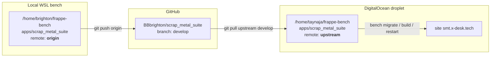

# Deployment & Operations

> **Status:** Production
> **Source:** `docs/stocktake/STOCKTAKE_2026-08-21.md`, `sites/common_site_config.json`, `Procfile`, `README.md`, `pyproject.toml`, `www/pos/terminal.py`, `frappe/build.py`, `frappe/migrate.py`, live `bench` on the dev machine
> **Last verified:** 2026-08-21 on the local WSL bench (`metal`) and against the stock-take. **Production facts are second-hand — see the ⚠️ markers.**
> **App version:** `2.0.0` (`scrap_metal_suite/__init__.py:1`)

Related: [00 Architecture](00-architecture.md) · [50 Platform](50-platform-roles-scheduler.md) · [70 Testing](70-testing.md)

> **No production server was contacted while writing this.** Everything about `smt.x-desk.tech` comes from `docs/stocktake/STOCKTAKE_2026-08-21.md` (read-only survey, 2026-08-21) and the project's own deploy notes. Anything I could not corroborate from the repo or the local bench is marked ⚠️ **UNVERIFIED**.

---

## 1. Environment matrix

### 1.1 Local dev — verified 2026-08-21

| Component | Version | How checked |
|---|---|---|
| bench CLI | `5.25.9` | `bench --version` |
| Python | `3.12.3` | `python3 --version` |
| Node | `v18.19.1` | `node --version` |
| Yarn | `1.22.22` | `yarn --version` |
| Redis | `7.0.15` | `redis-server --version` |
| MariaDB | `10.11.13` | `mysql --version` |
| Bench root | `/home/brighton/frappe-bench` | |
| Default site | `metal` | `sites/common_site_config.json` |
| Site URL | `http://localhost:8000` | `sites/metal/site_config.json` |
| Admin | `Administrator` / (see your local credential store) | |
| Process manager | `pm2` (`Procfile`) | `common_site_config.json` |

Apps installed on `metal` (`bench --site metal list-apps`):

```
frappe             15.74.2   version-15
erpnext            15.54.3   version-15-hotfix
scrap_metal_suite  1.1.0     feature/container-redesign
qr_foundry         2.1.0     develop
document_foundry   1.0.0     develop
```

The bench itself carries more apps than the site does (`sites/apps.txt`): `frappe, erpnext, hrms, tub_suite, erpnext_thailand, document_foundry, huahin_suite, md_booking_suite, scrap_metal_suite, payments, qr_foundry`. Nine other sites share this bench (`huahin`, `localhost`, `md-metal`, `salon`, `tub`, `vp`, `worldcontainer`, …) — **always pass `--site metal` explicitly.**

### 1.2 Production — ⚠️ from the stock-take, not verified here

| Item | Value |
|---|---|
| Host | `178.128.84.100` — DigitalOcean `ubuntu-s-2vcpu-4gb-sgp1-01`, Singapore |
| OS | Ubuntu 24.04.2 LTS |
| Memory | 3.8 GB total, **~1.4 GB available** |
| Disk | 39 GB / 77 GB used (51 %) |
| Bench | `/home/taynaja/frappe-bench` — **7 sites** |
| Site | `smt.x-desk.tech` (full FQDN, not `smt`) |
| SSH | user `taynaja`; the saved PuTTY key authenticates **`root` only**, so bench work goes through `sudo -u taynaja` |
| Git remote | **`upstream`** → `https://github.com/BBbrighton/scrap_metal_suite` |
| Deploy branch | `develop` |
| Deployed commit | `9bad181` = `v1.1.0-8-g9bad181` |

Installed app versions on `smt.x-desk.tech` (stock-take): `frappe 15.74.1`, `erpnext 15.70.2`, `erpnext_thailand 1.0.1`, `hrms 16.0.0-dev`, `document_foundry 1.0.0`, `payments 0.0.1`, `scrap_metal_suite 1.1.0`, `qr_foundry 2.1.0`, `tub_suite 2.1.19`, `builder 2.0.0-dev`, `huahin_suite 0.0.1`.

> Note the **ERPNext skew**: production runs `15.70.2`, dev runs `15.54.3`. Dev is *behind* production. Anything you validate locally is validated against an older ERPNext.

### 1.3 The remote-name trap

The same GitHub repository has a different remote name at each end:

| Location | Remote name | URL |
|---|---|---|
| Local WSL bench | **`origin`** | `https://github.com/BBbrighton/scrap_metal_suite.git` |
| Production server | **`upstream`** | `https://github.com/BBbrighton/scrap_metal_suite` |

`git pull upstream develop` on the server; `git push origin <branch>` locally. Muscle memory from one machine is wrong on the other.

---

## 2. Install on a fresh bench

### 2.1 Dependencies

`pyproject.toml` declares `requires-python = ">=3.10"` and **no runtime dependencies** — the `dependencies` list is empty and `frappe~=15.0.0` is commented out because bench manages it.

`hooks.py:11` leaves `required_apps` commented out, but **ERPNext is a hard dependency in practice.** The app never does `import erpnext`, yet its DocTypes carry `Link` fields to `Item`, `Supplier`, `Item Price`, `Price List`, `Item Group`, `UOM`, `Warehouse`, `Company` and `Purchase Invoice`. Installing without ERPNext fails at DocType sync. Install ERPNext first.

There is **no `package.json`, no `*.bundle.js`, and no Node build step** for this app (see [§4.1](#41-bench-build-is-a-no-op-for-this-app)).

### 2.2 Install

```bash
cd ~/frappe-bench

# ERPNext first — hard dependency, undeclared
bench get-app --branch version-15 erpnext
bench --site <site> install-app erpnext

bench get-app https://github.com/BBbrighton/scrap_metal_suite.git --branch develop
bench --site <site> install-app scrap_metal_suite

bench --site <site> migrate       # runs the three v2_0 patches + imports fixtures
bench build --app scrap_metal_suite
bench --site <site> clear-cache
```

### 2.3 What install does *not* do

There is no `after_install` hook (`hooks.py:97-100` is commented out). A fresh site therefore has:

- roles created (as a side effect of DocType sync — see [50 §2.1](50-platform-roles-scheduler.md)) but **nobody assigned to them**;
- `Dropoff Container Settings` and `Production Sorting Settings` singles at their schema defaults;
- **no `POS Profile Scrap`** — without one, `/pos` shows an empty profile list and no session can be opened;
- the five fixture `Scale` records (`SCALE-001/002/003`, `TRUCK-001/002`), which are placeholders, not your hardware;
- the 8 fixture print formats.

Post-install checklist:

1. Create a `POS Profile Scrap`, add the item rows, set `price_list` and `enable_sticker_print`.
2. Create real `Scale` records matching your serial hardware (and read [50 §6.2](50-platform-roles-scheduler.md) before ever running `bench export-fixtures`).
3. Assign roles: `POS Operator` to floor staff, `Production Worker` / `Production Manager` to sorting, `SMT Accountant` / `SMT Accounting Manager` to the office. Do **not** hand out `POS Manager` — it is half-wired ([50 §2.4](50-platform-roles-scheduler.md)).
4. Give every existing `Supplier` a `short_code`, or nothing can be created against them.
5. `bench --site <site> enable-scheduler`.

---

## 3. Local dev loop

### 3.1 `bench start`

`Procfile` (verified) runs six processes:

```
redis_cache:   redis-server config/redis_cache.conf        # 127.0.0.1:13001
redis_queue:   redis-server config/redis_queue.conf        # 127.0.0.1:11001
web:           bench serve --port 8000
socketio:      /usr/bin/node apps/frappe/socketio.js       # :9000
watch:         bench watch
schedule:      bench schedule
worker:        bench worker
```

`sites/common_site_config.json` points **both** `redis_cache` and `redis_socketio` at `redis://127.0.0.1:13001`, and `redis_queue` at `11001`.

Verified listening state on the dev box:

```
127.0.0.1:13001   redis-server
127.0.0.1:11001   redis-server
0.0.0.0:8000      python (bench serve)
*:9000            node (socketio)
```

### 3.2 🔴 The redis_cache gotcha

**If redis_cache (port 13001) is not running, desk pages will not bootstrap and `bench migrate` refuses to start.** This is not a soft failure — `frappe/migrate.py:161-169` explicitly checks it:

```python
service_status = check_connection(redis_services=["redis_cache"])
...
print(BENCH_START_MESSAGE)   # "Cannot run bench migrate without the services running."
```

If you have killed `bench start` and only restarted the web process, bring redis back manually:

```bash
cd ~/frappe-bench && redis-server config/redis_cache.conf &
```

Website (`www/`) pages tend to keep rendering without it; the *desk* is what dies. That asymmetry makes the symptom confusing — `/pos/terminal` looks fine while `/app/dropoff` spins forever.

### 3.3 The `sites/assets` symlink — CSS/JS edits are live

Verified on the dev bench:

```
$ ls -la sites/assets/ | grep scrap
lrwxrwxrwx 1 brighton brighton 75 May  1 19:42 scrap_metal_suite ->
    /home/brighton/frappe-bench/apps/scrap_metal_suite/scrap_metal_suite/public
```

`sites/assets/<app>` is a **symlink to the app's `public/` directory**, created by `frappe/build.py:309-341` (`generate_assets_map`) and `:365-388` (`make_asset_dirs`). So:

- Editing `public/css/pos.css` or `public/js/pos-core.js` changes what the server serves **immediately**. No `bench build`, no copy step, no restart.
- Only a browser reload is needed — modulo the cache trap in [§4](#4-the-asset-caching-trap).
- ⚠️ **Unless the bench was built with `bench build --hard-link`**, which *copies* instead of symlinking (`frappe/build.py:398-403`). On such a bench, `public/` edits are invisible until the next build. Check with `ls -la sites/assets/` — if `scrap_metal_suite` is a directory rather than a symlink, you are on a hard-linked bench. The local dev bench is symlinked; production is ⚠️ **UNVERIFIED**.

---

## 4. The asset caching trap

This is the single most likely way a deploy of this app goes wrong on the floor.

### 4.1 `bench build` is a no-op for this app

Frappe's esbuild pipeline only picks up files matching `**/public/**/*.bundle.{js,ts,css,sass,scss,less,styl,jsx}` (`apps/frappe/esbuild/esbuild.js:192`). Verified:

- `scrap_metal_suite` contains **zero** `*.bundle.*` files and no `package.json`.
- `sites/assets/assets.json` contains **zero** `scrap_metal_suite` entries.

So `bench build --app scrap_metal_suite` compiles nothing for this app. Its only effect is re-creating the `sites/assets/scrap_metal_suite` symlink. Every CSS and JS file this app ships is a **plain, unhashed, unversioned static file**.

That is why the standard Frappe cache-busting story — hashed bundle filenames recorded in `assets.json` — does not apply here.

### 4.2 What the browser actually does

Verified against the running dev server:

```
$ curl -sI http://localhost:8000/assets/scrap_metal_suite/css/pos.css
HTTP/1.1 200 OK
Cache-Control: max-age=43200, public
Expires: Fri, 21 Aug 2026 23:38:23 GMT
Etag: "wzsdm-1787310178.368698-147472-187302602"
Content-Length: 147472
```

**`max-age=43200` is 12 hours.** Within that window the browser does not revalidate — no conditional request, no `ETag` check, nothing reaches the server. Consequences:

- `bench clear-cache` clears **server-side** caches (redis, Jinja, doctype meta). It cannot touch a browser's HTTP cache.
- `bench build` does not change the URL, so it cannot either.
- `bench restart` does not either.
- **The only thing that evicts it is a different URL.**

After a deploy, a floor terminal that loaded the page earlier in the shift can run **up-to-12-hour-old JavaScript against a freshly migrated API**. That is a far worse failure than a wrong colour: the client will call endpoints with removed parameters, read fields that no longer exist, and silently mis-post weights.

### 4.3 The fix, and where it has been applied

`www/pos/terminal.py:24-53` defines `get_asset_version()`:

```python
_LINKED_ASSETS = ("css/pos.css", "css/pos-fullscreen.css", "js/pos-translations.js",
                  "js/pos-core.js", "js/html5-qrcode.min.js", "js/pos-scanner.js",
                  "js/scale_reader.js", "js/pos-resizer.js")

def get_asset_version():
    base = frappe.get_app_path("scrap_metal_suite", "public")
    newest = 0
    for rel in _LINKED_ASSETS:
        try:
            newest = max(newest, os.path.getmtime(os.path.join(base, rel)))
        except OSError:
            continue
    return str(int(newest)) if newest else frappe.utils.get_build_version()
```

It stamps the **newest mtime of the files the page actually links**, and `get_context` puts it in `context.asset_v` (`terminal.py:58`). `terminal.html:6-13` appends `?v={{ asset_v }}` to all eight tags.

Why mtime rather than `frappe.utils.get_build_version()`: `get_build_version()` is the mtime of `sites/assets/assets.json`, which only moves on `bench build` — and since `public/` is symlinked, editing `pos.css` never touches `assets.json`. The token would not move and the stale copy would survive. mtime is correct in both directions: it moves when you edit locally, and it moves on deploy because `git pull` rewrites the files.

### 4.4 Coverage — six pages are still exposed

Verified by grepping every `www/**/*.html` for `/assets/scrap_metal_suite`:

| Page | Hand-linked assets | `?v=` applied |
|---|---|---|
| `www/pos/terminal.html:6-13` | 8 | ✅ yes |
| `www/pos/truck.html:6-14` | 9 | ❌ **no** |
| `www/pos/index.html:6-7` | 2 | ❌ **no** |
| `www/pos/production.html:6-9, 369` | 5 | ❌ **no** |
| `www/production/terminal.html:6-9` | 4 | ❌ **no** |
| `www/production/index.html:6-9` | 4 | ❌ **no** |
| `www/scale-test/index.html:6-8` | 3 | ❌ **no** |

`/pos/truck` is the worst of these — it is a live weighbridge terminal that posts gross/tare/net.

`docs/DROPOFF_CONTAINER_REDESIGN.md` §14.23 records why the remaining six were deferred: the pending `cam_integration_v0` merge substantially rewrites `truck.html`'s `<head>`, and editing that region now would create a conflict in the one file already flagged as moderate-risk. **The plan is to promote `get_asset_version()` into a shared util and apply it to all seven pages at the merge session.** That is a release blocker, not a nice-to-have.

### 4.5 Operational workaround until then

There is no server-side lever. Options, in order of reliability:

1. **Ctrl-Shift-R / hard reload** on every terminal after a deploy. Requires someone to walk the floor.
2. Deploy at the start of a shift so the 12-hour window has already elapsed for terminals idle overnight.
3. Clear site data in the terminal browser's settings.

⚠️ **UNVERIFIED — nginx caching on production.** The `Cache-Control: max-age=43200` header above came from the Werkzeug dev server. Production serves `/assets/` through nginx, which may add its own headers or its own `proxy_cache`. I did not read the production nginx config. Check `/home/taynaja/frappe-bench/config/nginx.conf` before assuming the header is identical.

---

## 5. Deploy to production

### 5.1 Pipeline



### 5.2 The deploy command

Run **as `taynaja`, never as root** — running bench as root scrambles file ownership across the whole bench and breaks all seven sites, not just this one. The saved SSH key authenticates `root`, so in practice:

```bash
# from the Windows box
plink -load 'X-desk_DigitalOcean' -l root -batch "sudo -u taynaja bash -lc '<command>'"
```

The deploy itself, in order:

```bash
cd ~/frappe-bench

# 1. BACKUP FIRST — with files. Non-negotiable for this release.
bench --site smt.x-desk.tech backup --with-files

# 2. PULL
cd ~/frappe-bench/apps/scrap_metal_suite
git fetch upstream
git pull upstream develop
cd ~/frappe-bench

# 3. MIGRATE — runs patches.txt + re-imports fixtures
bench --site smt.x-desk.tech migrate

# 4. BUILD — a no-op for this app (§4.1) but keeps the symlink honest
bench build --app scrap_metal_suite

# 5. CLEAR SERVER CACHES
bench --site smt.x-desk.tech clear-cache

# 6. RESTART
bench restart
```

Then, and only then:

```bash
# 7. If the Print Format fixtures did not land (§7.3), force them:
bench --site smt.x-desk.tech execute scrap_metal_suite.api_test._sync_print_formats.run

# 8. Read the migration's own report:
#    Error Log → titles "Container migration pre-flight",
#    "Container migration summary", "Container migration failure"
```

### 5.3 Constraints specific to this box

- **1.4 GB RAM available across 7 sites.** `bench migrate` on a year of real data plus `bench build` (which *does* compile bundles for frappe/erpnext/hrms/builder) will contend. Pick a quiet window; do not run this mid-shift.
- `bench restart` bounces supervisor for the **whole bench** — all seven sites blink. ⚠️ **UNVERIFIED** whether the droplet uses supervisor or systemd; `common_site_config.json` on the *dev* box sets `restart_supervisor_on_update: false` and `restart_systemd_on_update: false`, which suggests supervisor is expected in production but I did not confirm.

### 5.4 🔴 This particular release is not a routine deploy

`smt.x-desk.tech` runs `develop @ 9bad181` (v1.1.0), which predates the container redesign entirely. The branch waiting to ship (`feature/container-redesign`, currently `d598a9b`, **8 commits ahead of develop**, `v1.1.0-16-gd598a9b`) carries:

- a breaking data-model change (`Scrap Weight` → per-bag `Scrap Weight Container`);
- three migration patches that have **never run against production data** ([50 §7](50-platform-roles-scheduler.md));
- the six un-cache-busted terminal pages ([§4.4](#44-coverage--six-pages-are-still-exposed)).

And a second unmerged branch, `cam_integration_v0` (GitHub only, `4803c08`, 2026-08-17), adds CCTV camera integration. The agreed plan (stock-take §7) is **one release containing both**, because running a breaking migration twice doubles the risk for no benefit.

**The deploy gate is not the test suites.** Local suites run against synthetic fixtures. `migrate_to_containers` will meet a year of real `Scrap Weight` rows that have drifted into shapes no fixture has ever produced. The three PENDING items are:

- [ ] Dry-run the migration on a restored production snapshot ([§6.3](#63-restore-a-production-snapshot-locally))
- [ ] Verify post-migration aggregate kg matches pre-migration truck net **per supplier**
- [ ] Spot-check 20+ dropoffs by hand

Only after those pass should the version be bumped (`2.0.0` is the honest number for a breaking model change) and tagged.

### 5.5 Repo hygiene that affects deploys

| Issue | State | Impact |
|---|---|---|
| GitHub default branch is `master` | `8154680`, 2025-12-05, 72 commits behind, still declares `0.0.1` | The repo is **public**; anyone landing on it sees an eight-month-old snapshot. `develop` is the real trunk. |
| Local `master` tracks `origin/develop` | verified `git branch -vv` | A `git pull` while sitting on `master` drags `develop` into it. |
| `feature/container-redesign` has never been pushed | verified — no upstream | 8 commits and ~14 k lines exist on **one disk**. A machine failure loses months. Fix with one `git push`. |
| Local last fetched 2026-07-18 | stock-take | This machine has never seen `cam_integration_v0`. |
| `.gitignore` swallows `*_DESIGN.md` and `FUTURE_ENHANCEMENTS.md` | `.gitignore:16-19` | `docs/DOCUMENT_SHARE_DESIGN.md` and `FUTURE_ENHANCEMENTS.md` exist locally and are **not tracked**. `docs/PRICE_LOCK_SETTLEMENT_DESIGN.md` was force-added and is tracked. Inconsistent. |
| `.gitattributes` forces `eol=lf` | `.gitattributes:4` | Correct — the repo lives in WSL and is edited from Windows. Do not remove. |

---

## 6. Backup and restore

### 6.1 Backup

```bash
bench --site smt.x-desk.tech backup --with-files
```

Writes four files to `sites/<site>/private/backups/`:

| File | Contents |
|---|---|
| `<ts>-<site>-database.sql.gz` | the database |
| `<ts>-<site>-files.tar` | `public/files` (attachments, container photos) |
| `<ts>-<site>-private-files.tar` | `private/files` |
| `<ts>-<site>-site_config_backup.json` | site config **including the encryption key** |

Useful flags (`bench backup --help`): `--compress`, `--backup-path`, `--exclude <DocTypes>`, `--ignore-backup-conf`.

The dev site's last backup was 2026-05-24 and is tiny (1.8 MB db.gz, 5 MB files). ⚠️ Production will be substantially larger; the droplet has 38 GB free, so size is not the constraint — the 1.4 GB of free RAM during `mysqldump` is.

> **The `site_config_backup.json` contains `encryption_key`.** Without it you cannot decrypt stored passwords after a restore. Keep it with the dump; do not commit it anywhere.

### 6.2 Restore

```bash
bench --site <site> restore <path>/<ts>-<site>-database.sql.gz \
  --with-public-files  <path>/<ts>-<site>-files.tar \
  --with-private-files <path>/<ts>-<site>-private-files.tar
```

Other options (`bench restore --help`): `--db-root-password`, `--db-name`, `--admin-password`, `--force` (ignores downgrade warnings — you will need it if the snapshot's app versions are ahead of the local ones), `--encryption-key`.

### 6.3 Restore a production snapshot locally — the migration test

This is the gate for the container release. Do it on a **throwaway site**, never on `metal`.

```bash
cd ~/frappe-bench

# 1. Pull the production backup down (from the Windows box, via plink/pscp,
#    or scp directly if you have a key for taynaja).

# 2. New empty site
bench new-site smt-staging --admin-password "$ADMIN_PWD" \
     --db-root-password <mariadb-root-pw>

# 3. Install the same apps the snapshot expects, in dependency order
bench --site smt-staging install-app erpnext
bench --site smt-staging install-app scrap_metal_suite
#    ...plus any other app the production site has installed that the
#       snapshot's tables reference (see §1.2)

# 4. Restore — --force because local app versions differ from production's
bench --site smt-staging --force restore <path>/<ts>-smt.x-desk.tech-database.sql.gz \
  --with-public-files  <path>/<ts>-smt.x-desk.tech-files.tar \
  --with-private-files <path>/<ts>-smt.x-desk.tech-private-files.tar

# 5. BASELINE BEFORE MIGRATING — capture per-supplier truck net weight now
bench --site smt-staging execute frappe.client.get_list --kwargs \
  '{"doctype":"Dropoff","fields":["supplier","sum(net_weight) as kg"],
    "group_by":"supplier","limit_page_length":0}'

# 6. Run the migration
bench --site smt-staging migrate

# 7. Compare aggregate kg per supplier against step 5, then read the
#    migration's own log:
#      Error Log → "Container migration pre-flight"
#                  "Container migration summary"
#                  "Container migration failure"     ← must be empty

# 8. Spot-check 20+ dropoffs by hand in the desk.
```

Point 7 matters more than it looks: `migrate_to_containers` catches per-dropoff exceptions and logs them (`patches/v2_0/migrate_to_containers.py:230-235`). A run with 40 failures prints the same thing at the console as a clean one. **Read the Error Log or you have not tested the migration.**

Rollback path if the migration is wrong: `docs/DROPOFF_CONTAINER_REDESIGN.md` §10.4 (the `use_container_model` flag) — note that flag is currently **not a real field** on `POS Profile Scrap`, so the rollback is theoretical until it is added.

---

## 7. Monitoring

### 7.1 Logs

| Path | What |
|---|---|
| `logs/bench.log` | bench CLI operations |
| `logs/worker.log` / `logs/worker.error.log` | background job workers |
| `logs/scheduler.log` | scheduler ticks |
| `logs/frappe.log` | app-level `frappe.logger()` output — **this is where the scheduler's "Auto-closed idle session …" lines land** |
| `logs/database.log` | slow/failed queries |
| `logs/backup.log` | backup runs |
| `sites/<site>/logs/*` | per-site copies of the above |
| Desk → **Error Log** | `frappe.log_error()` — the container migration writes its pre-flight, summary and per-failure reports here |

Rotation is aggressive: `logs/database.log.1` … `.20` exist locally, each capped at ~100 KB.

### 7.2 Process supervision

**Local:** `bench start` reads `Procfile` and runs everything under `pm2` (`common_site_config.json: "process_manager": "pm2"`).

**Production:** ⚠️ **UNVERIFIED.** `bench restart` is the documented command. `restart_supervisor_on_update` and `restart_systemd_on_update` are both `false` in the dev `common_site_config.json`, so an update does not bounce services automatically. If production uses supervisor, `sudo supervisorctl status` under the bench's group name is the direct check; if systemd, `systemctl status 'frappe-bench-*'`.

### 7.3 Redis

Three logical services, two processes:

| Service | Local URL | Process |
|---|---|---|
| `redis_cache` | `redis://127.0.0.1:13001` | `redis-server config/redis_cache.conf` |
| `redis_socketio` | `redis://127.0.0.1:13001` | **same process as cache** |
| `redis_queue` | `redis://127.0.0.1:11001` | `redis-server config/redis_queue.conf` |

Health check:

```bash
redis-cli -p 13001 ping     # cache + socketio
redis-cli -p 11001 ping     # queue
```

See [§3.2](#32--the-redis_cache-gotcha) for why cache being down is the loudest failure.

### 7.4 Scheduler

```bash
bench --site <site> doctor
```

On the dev box this currently reports **`Scheduler disabled for metal`** — the three app cron jobs have not fired since 2026-05-01. Details and consequences in [50 §4.5](50-platform-roles-scheduler.md). Re-enable with `bench --site <site> enable-scheduler`.

```bash
# What is registered and when did it last run?
bench --site <site> execute frappe.client.get_list --kwargs \
  '{"doctype":"Scheduled Job Type","filters":{"method":["like","%scrap_metal_suite%"]},
    "fields":["name","cron_format","stopped","last_execution"],"limit_page_length":20}'
```

### 7.5 What is worth alerting on

There is no monitoring stack configured. If you add one, these are the app-specific signals:

| Signal | Query | Why |
|---|---|---|
| Open POS Sessions older than 2 h | `POS Session` `status='Open'`, `last_activity < now-2h` | scheduler not running, or a terminal stuck |
| Scales with `in_use=1` pointing at a non-Open session | `Scale.in_use=1` join `POS Session.status != 'Open'` | the [50 §4.1](50-platform-roles-scheduler.md) leak; repair with `_release_stuck_scales.run` |
| `Error Log` rows titled `Container migration failure` | | silent per-dropoff migration failures |
| Dropoffs stuck in `Needs Review` | `verification_status='Needs Review'` older than a day | variance nobody resolved |
| `SMT Price Lock` past `expiry_date` still `Open` | | `expire_open_pos` not running |

---

## 8. Troubleshooting runbook

| Symptom | Most likely cause | Check | Fix |
|---|---|---|---|
| Desk (`/app/*`) hangs or 500s; website pages fine | redis_cache down | `redis-cli -p 13001 ping` | `cd ~/frappe-bench && redis-server config/redis_cache.conf &` |
| `bench migrate` prints "Cannot run bench migrate without the services running" | same | as above | as above (`frappe/migrate.py:161-169`) |
| Terminal behaves like the old version after a deploy | 12-hour asset cache | DevTools → Network → `pos.css` served `(from disk cache)` | Hard reload. Root fix: [§4.4](#44-coverage--six-pages-are-still-exposed) |
| CSS/JS edit has no effect locally | either the browser cache above, or a hard-linked assets dir | `ls -la sites/assets/scrap_metal_suite` — symlink or directory? | Hard reload; if it is a directory, `bench build` |
| "You already have an open session. Please close it first." | scheduler disabled, sessions never auto-close | `bench --site <site> doctor` | `bench --site <site> execute scrap_metal_suite.scheduler.close_idle_sessions`, then `enable-scheduler` |
| Scale shows in-use but no session is open | scale-release leak ([50 §4.1](50-platform-roles-scheduler.md)) | `Scale.in_use`, `in_use_by_session` | `bench --site <site> execute scrap_metal_suite.api_test._release_stuck_scales.run` |
| "Use of sub-query or function is restricted" on a Dropoff list/badge | Frappe's SQL sanitiser tripping on `tabDropoff` | | The `get_count` override handles the badge case ([50 §1.7](50-platform-roles-scheduler.md)). Any *other* query putting `tabDropoff` inside a function call needs `frappe.db.count` instead. |
| "Supplier X has no Short Code" when creating anything | supplier predates the `short_code` Custom Field | `Supplier.short_code` | Set one (2–8 chars, `A-Z0-9`). See [50 §5.1](50-platform-roles-scheduler.md). |
| "A Dropoff must be linked to at least one POS Order" | Wave 9 — no walk-ins | `Dropoff.orders` empty | Create a Price Lock (auto-creates the POS Order), then link it. |
| Print format shows old content after a migrate | fixture didn't reach the DB, or the DB row was hand-patched | compare `Print Format.html` with `fixtures/print_format.json` | `bench --site <site> execute scrap_metal_suite.api_test._sync_print_formats.run` |
| "Standard Print Format cannot be updated" | editing a standard format outside migrate on a non-`developer_mode` site | `frappe/printing/doctype/print_format/print_format.py:68-75` | Use `_sync_print_formats.run`, which writes via `frappe.db.set_value` |
| `/pos/terminal?session=…` returns 417 / `UndefinedError` | fixed 2026-08-21 — the `<script>` block dereferenced `session` outside the `` guard | | Should now render "Session not found" with HTTP 200. If it recurs, the guard was dropped. |
| Naming series produces the wrong prefix (e.g. `CTN-2026-…` instead of `CTN-2605-…`) | a `Property Setter` row overriding the doctype JSON | `frappe.get_all("Property Setter", filters={"doc_type": …, "field_name": "naming_series"})` | Update the Property Setter directly; the JSON change alone will not take. |
| Guest can see `/manager` | no auth guard on that page | `curl -s -o /dev/null -w '%{http_code}' <host>/manager` | 🔴 [50 §2.5](50-platform-roles-scheduler.md) — add a guard or remove the routes |
| Something is wrong on production and you want to poke bench | you are logged in as `root` | `whoami` | `sudo -u taynaja bash -lc '<bench command>'`. **Never run bench as root.** |

---

## 9. Known issues & gotchas

| # | Severity | Issue |
|---|---|---|
| 1 | 🔴 HIGH | **Six terminal pages have no asset cache-busting.** `/pos/truck`, `/pos/index`, `/pos/production`, `/production/terminal`, `/production/index`, `/scale-test` hand-link unversioned `/assets/...` served `max-age=43200`. After a deploy they can run 12-hour-stale JS against a migrated API, and no server-side command can dislodge it. Only `/pos/terminal` is fixed (`www/pos/terminal.py:24-53`). Deliberately deferred to the cam merge — but it is a release blocker. |
| 2 | 🔴 HIGH | **`feature/container-redesign` exists on exactly one disk.** 8 commits, ~14 k lines, never pushed. One `git push origin feature/container-redesign` fixes it and merges nothing. |
| 3 | 🔴 HIGH | **The container migration has never run against real data.** Three patches will fire on the first production migrate. The gate is a restored-snapshot dry-run ([§6.3](#63-restore-a-production-snapshot-locally)), not the local test suites. |
| 4 | 🟠 MED | **`required_apps` undeclared** — ERPNext is a hard dependency via Link fields but nothing enforces it (`hooks.py:11`). |
| 5 | 🟠 MED | **No `after_install` hook.** A fresh site has no POS Profile, no role assignments, no supplier short codes. Install is not self-sufficient; follow [§2.3](#23-what-install-does-not-do). |
| 6 | 🟠 MED | **Scheduler disabled on `metal`**, last run 2026-05-01. Production state ⚠️ UNVERIFIED. |
| 7 | 🟠 MED | **The public GitHub default branch is `master`**, 72 commits and eight months behind, still declaring version `0.0.1`. |
| 8 | 🟠 MED | **Production has ~1.4 GB RAM free across 7 sites.** `migrate` + `build` of this size needs a quiet window and a verified backup first. |
| 9 | 🟡 LOW | **Dev runs older ERPNext than production** (`15.54.3` vs `15.70.2`). Local validation is against an older dependency. |
| 10 | 🟡 LOW | **Same repo, two remote names** — `origin` locally, `upstream` on the server. |
| 11 | 🟡 LOW | **Local `master` tracks `origin/develop`.** A `git pull` on `master` merges `develop` into it. |
| 12 | 🟡 LOW | `bench build --app scrap_metal_suite` compiles nothing (no bundles, no `assets.json` entries). Harmless, but do not expect it to fix a stale asset. |
| 13 | 🟡 LOW | `bench restart` on production bounces **all seven sites**, not just `smt.x-desk.tech`. |
| 14 | 🟡 LOW | `.gitignore` swallows `*_DESIGN.md` — some design docs are tracked (force-added), some are not. Easy to lose work. |
| 15 | ℹ️ UNVERIFIED | Production nginx config, its `/assets/` cache headers, and whether supervisor or systemd supervises the bench. Read `/home/taynaja/frappe-bench/config/nginx.conf` before assuming. |
| 16 | ℹ️ UNVERIFIED | Whether the production bench was built with `--hard-link` (which would break the "edits are live" assumption and change how a hotfix must be applied). |
