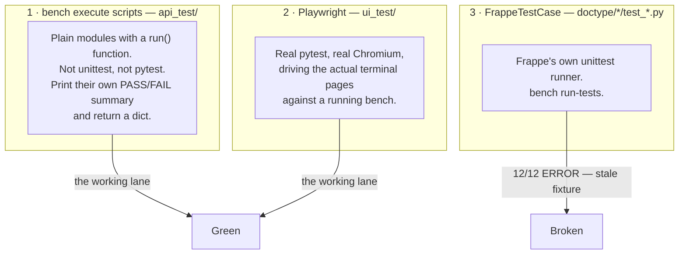

# Testing

> **Status:** Production
> **Source:** `scrap_metal_suite/api_test/*.py` (38 files), `scrap_metal_suite/ui_test/*.py` (7 files), `scrap_metal_suite/doctype/*/test_*.py` (3 files), `docs/E2E_TESTING_OVERVIEW.md`, `docs/E2E_MANUAL_TEST_SCRIPT.md`
> **Last verified:** 2026-08-21 — **every suite below was executed on the live `metal` site while writing this page.** Results are observed, not quoted.
> **App version:** `1.1.0`

Related: [00 Architecture](00-architecture.md) · [50 Platform](50-platform-roles-scheduler.md) · [60 Deployment & Operations](60-deployment-operations.md) · [90 Extending This App](90-extending-this-app.md)

---

## 1. The shape of testing in this repo

Three mechanisms, only one of which is a conventional test runner.



**Why `api_test/` is not pytest.** These scripts need a live Frappe app context — a site connection, `frappe.session.user`, real background hooks, the naming series, the scheduler. `bench execute` gives that for free. The trade-off is that there is no discovery, no aggregate runner, and no exit code you can gate CI on: a script returns `{"passed": 24, "failed": 0}` and `bench` exits `0` whether or not `failed` is zero.

> `api_test/__init__.py:2` says *"Run with: `bench execute scrap_metal_suite.api_test.run_tests`"*. **There is no `run_tests` module.** Stale comment; there is no aggregate runner.

---

## 2. Verified status — everything run on 2026-08-21

| Suite | Command | Result observed |
|---|---|---|
| **E2E full flow (Lane B)** | `bench --site metal execute scrap_metal_suite.api_test.test_e2e_full_flow.run` | **24 / 24 PASS** ✅ (see [§6.1](#61-the-first-run-after-a-dirty-db-fails-the-second-passes)) |
| Container workflow | `…test_container_workflow.run` | **13 / 13 PASS** ✅ |
| Container multi-doc workflow | `…test_container_multi_doc_workflow.run` | **14 / 14 PASS** ✅ |
| Finish weighing session | `…test_finish_weighing_session.run` | **PASS** ✅ (`{"passed": 1, "failed": 0}`, 20 internal checks) |
| Sticker render smoke | `…smoke_test_sticker_render.run` | **PASS** ✅ — but only because a leftover fixture exists ([§6.4](#64-smoke_test_sticker_render-passes-here-and-would-fail-on-a-clean-site)) |
| Container photos smoke | `…smoke_test_container_photos.run` | **7 / 7 PASS** ✅ |
| POS Order status regression | `…test_pos_order_status.run` | **8 / 8 PASS** ✅ — drives the real Price Lock → POS Order → 2 Drop-offs path so it cannot pass with the bug present. Negative-tested: removing the fix reproduces `Pending`/`Fulfilled` and fails 4/8. |
| Dropoff Final override regression | `…test_dropoff_final_override.run` | **15 / 15 PASS** ✅ — builds a genuinely stuck out-of-tolerance record and exercises the override. Negative-tested: removing the `variance_overridden` guard re-strands it and fails 2/15. |
| Variance threshold regression | `…test_variance_threshold.run` | **5 / 5 PASS** ✅ — guards a Settings knob that was silently dead for months. Asserts `Dropoff Final.variance_threshold_percent` never regains a JSON default (a default makes the Settings fallback unreachable) and that the Setting reaches a new document. Negative-tested: reintroducing the default fails 4 of 5 checks. |
| No-walk-in guard | `…verify_no_walkin.run` | **PASS** ✅ |
| CTN naming | `…_verify_ctn_naming.run` | **PASS** ✅ (`CTN-2608-00000`) |
| Container print smoke | `…test_container_print.run` | **SKIP** — needs a container in the DB |
| Scrap Weight thermal smoke | `…smoke_test_scrap_weight_thermal.run` | **SKIP** — needs a submitted SW in the DB |
| **Playwright UI** | `SMT_UI_HEADLESS=1 SMT_UI_ADMIN_PWD="$SMT_UI_ADMIN_PWD" env/bin/pytest apps/scrap_metal_suite/scrap_metal_suite/ui_test/ -q` | **7 passed, 1 skipped in 37 s** ✅ |
| **DocType unit tests** | `bench --site metal run-tests --module …test_scrap_weight_container` | 🔴 **12 / 12 ERROR** — see [§5](#5-doctype-level-tests) |
| Legacy full workflow | `…test_full_workflow.run` | 🔴 **BROKEN** — not run; see [§3.3](#33-the-legacy-suites--broken-by-wave-9) |
| Settlement | `…test_settlement.run` | **37 / 37 PASS** ✅ — repaired 2026-08-21 (was 28/5/4 with 4 false passes) |
| Legacy full loop | `…test_full_loop.run` | 🟠 partially stale — not run |
| Legacy dropoff API | `…test_dropoff_api.run` | 🔴 **BROKEN** — not run |

**Working regression coverage today = 5 `bench execute` suites + 7 Playwright tests.** That is real and it is green. Everything predating the container redesign is not.

---

## 3. `api_test/` — the `bench execute` lane

38 tracked files. Base command:

```bash
cd ~/frappe-bench
bench --site metal execute scrap_metal_suite.api_test.<module>.<function>

# with kwargs:
bench --site metal execute scrap_metal_suite.api_test.test_container_workflow.run \
  --kwargs '{"cleanup_first": true, "cleanup_after": false}'
```

> ⚠️ **`--kwargs` is evaluated as Python, not JSON.** The example above uses
> `true`, which raises `NameError: name 'true' is not defined`. Write
> `"{'cleanup_first': True}"`. Note also that some suites reject `cleanup_after`
> and fail with a confusing `NameError` naming the module rather than the kwarg.

> 🔴 **Fixed 2026-08-25 — these suites used to delete every container in the
> database.** `test_container_workflow`, `test_container_multi_doc_workflow` and
> `test_finish_weighing_session` cleaned up containers with
> `{"name": ["like", "CTN-%"]}` — the global naming series, not a test prefix —
> so any run with `cleanup_first=True` wiped every `Scrap Weight Container` on
> the site, including migrated production data. Observed: all 360 containers
> from `migrate_to_containers` destroyed, and the suites still reported PASS.
> They now resolve containers through the test's own dropoffs.
>
> **This matters for the deploy gate.** The agreed gate is a migration dry-run
> on a restored production backup, and running these suites there is the obvious
> next step — it would have destroyed the data being validated. If you are on a
> branch predating that fix, do not run them against real data.

### 3.1 The permanent regression lane — keep these green

| Module | Entry | kwargs | Checks | Cleans up after? |
|---|---|---|---|---|
| `test_e2e_full_flow` | `.run` | `cleanup_first=True, cleanup_after=True` | **24** (incl. 15 exact-message error assertions) | ✅ yes |
| `test_container_workflow` | `.run` | `cleanup_first=True, cleanup_after=True` | **13** | ✅ yes, in `finally` (`:647-658`) |
| `test_container_multi_doc_workflow` | `.run` | `cleanup_first=True` | **14** | ✅ yes, unconditional `finally` (`:845-852`) |
| `test_finish_weighing_session` | `.run` | `cleanup_first=True, cleanup_after=True` | 20 internal, reported as 1 pass/fail | ✅ yes, `finally` (`:269-275`) |

**`test_e2e_full_flow.py` is the one that matters.** 360 lines, entry at `:101`. It reuses `test_container_workflow`'s fixture library (imported as `wf`), so a break in that library breaks both.

Structure:

| Stage | Line | Covers |
|---|---|---|
| masters | `:118-126` | operator user + 3 Thai items + supplier + 2 scales + POS profile |
| Stage 1 — Price Lock | `:128` | create, validate, submit → auto POS Order |
| Stage 3 — Dropoff | `:155` | scheduling, order binding, expected items |
| Stage 4 — weighing | `:193` | containers, reweigh, void, pause/resume, `finish_weighing_session`, `complete_dropoff` |
| verify override | `:295` | Needs Review → `verify_dropoff(override_reason=…)` |
| Stage 5 — sorting | `:313` | Production Sorting → Dropoff Final |

Its distinguishing feature is `assert_error()` (`:33`), which asserts on the **exact error message substring**, not just that something threw. Fifteen of the 24 checks are error assertions — this suite mostly tests that the app refuses the right things:

```python
assert_error(results, "err_sort_not_completed", "not in Completed status",
             lambda: papi.create_sorting(session=psess, dropoff=do_gate.name,
                                         good_items=[{"item_code": ia, "weight": 50}]))
```

That is deliberate. The receiving flow's value is in what it *blocks* — an unlinked dropoff, a zero-weight bag, a sort against an incomplete dropoff, a re-finish that doesn't amend.

### 3.2 The observational lane

`_e2e_walkthrough.py` (396 lines, entry `:118`) — **Lane A**. It walks the same path as Lane B, printing 23 `_stage()` observations and 15 `expect_error()` probes, then a findings report (`:375-396`). It **never asserts** — it reports. It is for exploring, not gating, and it **leaves its fixtures in the DB on purpose** so you can inspect them afterwards.

Use it when you want to see what the system actually does. Use Lane B when you want to know whether it still does it.

### 3.3 The legacy suites — broken by Wave 9

Three large pre-container suites are still in the repo and **cannot pass**. All three fail for the same reason: they build a `Dropoff` with no `orders` child rows, and `Dropoff.validate_at_least_one_order()` (`doctype/dropoff/dropoff.py:65-83`) unconditionally throws *"A Dropoff must be linked to at least one POS Order."*

| Module | Size | Entry | Checks | Break |
|---|---|---|---|---|
| `test_full_workflow.py` | 1 908 L | `.run` `:1855` | 158 `results.add()` across 25 functions | `:473-481` bare Dropoff. Also `:579-586` sets `POS Order.dropoff`, not a field; `:602-613` inserts `Scrap Weight` with a `session` field removed in Wave 10 |
| `test_settlement.py` | 1 202 L | `.run` | 66 across 19 functions | ✅ **repaired 2026-08-21** — `create_test_dropoff_final` now builds the full Price Lock → POS Order → Dropoff chain. Docstring `:8` still claims it "cleans up after itself"; it only cleans up pre-run |
| `test_dropoff_api.py` | 512 L | `.run` `:39` | 54 | `:132-139` Dropoff with `supplier: None`, no `orders`, and a nonexistent field `scheduled_date` (real name: `dropoff_scheduled_start`). Also depends on a `TEST_POS_PROFILE` that exists nowhere. Oldest file in the tree (Jan 2026) |
| `test_full_loop.py` | 1 210 L | `.run` `:1166` | 64 across 18 functions | Mostly intact; phase 440 (`:578-587`) inserts `Scrap Weight` directly with a `session` field, bypassing `finish_weighing_session`, which `scrap_weight.py:30-31` explicitly forbids |

These are not dead weight. `test_settlement.py` — the only coverage the Price Lock → SMT Purchase Order → settlement path has — **was repaired on 2026-08-21 and is now 37/37**. `test_full_workflow.py`, the only place the role/permission matrix is exercised, still needs the same repair. The repair in each case is the same: route Dropoff creation through the Price Lock → POS Order chain, exactly as `test_container_workflow.make_dropoff()` (`:320-349`) does.

None of them cleans up after a run, so a failed run leaves `_TEST_WF_*`, `_TEST_SETTLE_*`, `_TEST_LOOP_*` rows behind — which is how the schema-drift trap in [§6](#6-known-test-gotchas) gets primed.

### 3.4 Smoke tests

| Module | Entry | Read-only? | What it proves |
|---|---|---|---|
| `smoke_test_sticker_render.py` | `.run` `:139` | no — creates and deletes a container (`:189-190`) | The `Scrap Weight Container Sticker` renders with all 6 required fields: Drop-off ID, supplier name, date, item name, operator, plate. **Also the shared fixture library** for two other scripts (`_ensure_supplier :13`, `_ensure_item :31`, `_ensure_scale :48`, `_ensure_dropoff :62`, `_ensure_session :81`, `PREFIX = "_TEST_PR_"` `:10`) |
| `smoke_test_container_photos.py` | `.run` `:64` | no — deletes its container in `finally` (`:147-153`) | The Wave 11 photo path: `photos` Table field, `save_weight_photo` accepts a container parent, `get_weight_photos`, `list_containers.photo_count`, `delete_weight_photo`, and rejection of an unknown `parent_doctype` |
| `smoke_test_scrap_weight_thermal.py` | `.run` `:9` | **yes** | Newest submitted Scrap Weight renders in `Scrap Weight Thermal`. Skips cleanly if none exists |
| `test_container_print.py` | `.run` `:57` | **yes** | Newest container renders in the sticker format. **Contains stale field names** — `is_reweighed` and `last_reweigh_at` (`:18`, `:22`, `:76-77`) do not exist on `Scrap Weight Container`; the real field is `is_reweight` and there is no reweigh timestamp. Currently masked because the script `SKIP`s when the DB has no container |
| `verify_no_walkin.py` | `.run` `:6` | no — self-cleaning `finally` (`:42-48`) | Wave 9: an orderless Dropoff insert is blocked |
| `_verify_ctn_naming.py` | `.run` `:13` | no — deletes its container (`:56-60`) | `CTN-YYMM-#####` naming series produces a valid year+month segment |

### 3.5 The `_*.py` convention

The leading underscore means **"scratch: a script written to answer one question."** 14 of them are tracked. They are not tests; nothing runs them automatically; some are permanently useful and some are archaeology.

**Re-runnable tools — keep these.** Idempotent, safe to run whenever:

| Script | Entry | kwargs | Purpose |
|---|---|---|---|
| `_sync_print_formats.py` | `.run` `:37` | `only=<name or comma-list>` | Push every print format from `fixtures/print_format.json` into the DB via `frappe.db.set_value`, bypassing the standard-format write lock. **The canonical tool** — supersedes the four ad-hoc patchers below. |
| `_release_stuck_scales.py` | `.run` `:9` | — | Release `Scale.in_use = 1` rows pointing at deleted or non-Open sessions. Repairs the scheduler leak ([50 §4.1](50-platform-roles-scheduler.md)). |
| `_force_reload_dt.py` | `.run` `:8` | — | Force-reload `Scrap Weight Container` from its JSON. |
| `_render_dropoff_thermal.py` | `.run` `:9` | `name=<dropoff>` | Render the bilingual queue slip for a named Dropoff and print the traceback if it fails. |
| `_check_property_setter.py` | `.run` `:4` | — | Show `Property Setter` / `Custom Field` / `DocField` overrides on `Scrap Weight Container.naming_series`. Answers "why is my naming series being ignored?" |
| `_inspect_naming_series.py` | `.run` `:4` | — | Meta options + `tabSeries` counters for the `CTN-` prefix. |

**Superseded by `_sync_print_formats`** — harmless, redundant: `_patch_print_format.py` `:19`, `_patch_sticker.py` `:25`, `update_container_pf.py` `:11`, `update_scrap_weight_thermal.py` `:15`, `drop_container_thermal_pf.py` `:13`.

**Throwaway diagnostics — safe to delete.** Written for one past incident, several now broken against the current schema:

| Script | Why it is dead |
|---|---|
| `_quick_dump_ctns.py` | Requests `container_no` (`:19-20`, `:25`) — **field removed in Wave 11**; also 5 hardcoded dead dropoff names |
| `_inspect_ctn_chain.py` | `container_no` in `get_all` and `MAX(container_no)` SQL (`:11`, `:21`, `:30-34`) |
| `_diag_two_issues.py` | `container_no` in `get_value` (`:19`); two named user incidents from May |
| `dump_test_state.py` | Raw SQL selecting and ordering by `container_no` (`:74`, `:81`, `:91`) — hard SQL error. Its prefix list (`:13`) also omits four suites' prefixes |
| `_dump_pf.py` | Dumps "line 478" of a template that has since changed |
| `verify_variance_fix.py` | Simulates the old JS threshold bug against hardcoded `DO-260427-00004` |
| `debug_short_code_hook.py` | One-shot: does `populate_short_code` fire on a fresh Supplier insert? (It does.) |
| `inspect_dropoff_variance.py` | Hardcoded `DO-260427-00004` |

**Mildly reusable inspectors:** `inspect_threshold_distribution.py` `.run` `:7` (threshold distribution after the variance patch), `inspect_dropoff_workspaces.py` `.run` `:6` (workspace links + latest dropoffs).

> ⚠️ The `_*.py` set churns. Several transient probes existed in this directory earlier today and have since been removed. If a `_*.py` you read about is gone, it was scratch and it did its job. The six under "re-runnable tools" are the ones worth protecting.

### 3.6 Seeding for hand-testing

`setup_inprogress_dropoff.py`, entry `.run` `:11`. Cleans `_TEST_CTNWF_*` data, then builds a full Price Lock → POS Order → Dropoff chain and leaves it In Progress so you can open `/pos/terminal` and weigh bags by hand. It delegates to `test_container_workflow`'s helpers, so it stays correct as those evolve.

```bash
bench --site metal execute scrap_metal_suite.api_test.setup_inprogress_dropoff.run
```

---

## 4. `ui_test/` — Playwright

Real pytest. Seven files, ~1 300 lines.

### 4.1 Running it

```bash
cd ~/frappe-bench

# prerequisites, once
env/bin/pip install playwright pytest pytest-playwright
env/bin/playwright install chromium

# bench must be up — conftest hard-exits (rc=2) if the port is closed
bench start &

SMT_UI_HEADLESS=1 SMT_UI_ADMIN_PWD="$SMT_UI_ADMIN_PWD" \
  env/bin/pytest apps/scrap_metal_suite/scrap_metal_suite/ui_test/ -v
```

Verified 2026-08-21: **`7 passed, 1 skipped in 37.29s`**.

### 4.2 Environment variables

All read at import time in `ui_test/conftest.py`.

| Var | Line | Default | Exact semantics |
|---|---|---|---|
| `SMT_UI_SITE` | `:25` | `metal` | site passed to `bench --site` for seeding |
| `SMT_UI_BASE_URL` | `:26` | `http://localhost:8000` | every `page.goto` and the login POST |
| `SMT_UI_ADMIN_USER` | `:27` | `Administrator` | |
| `SMT_UI_ADMIN_PWD` | `:28` | **`admin`** | 🔴 wrong for this site — you must pass the real admin password or the login assert at `:104` fails |
| `SMT_UI_HEADLESS` | `:29` | `0` | `HEADLESS = value != "0"`. **Headed by default.** Any value other than the literal `"0"` — including `""`, `"false"`, `"no"` — is truthy and means headless |
| `SMT_UI_SLOW_MO` | `:88` | `250` (ms) | Read lazily and **only when headed**. Ignored entirely in headless runs |
| `SMT_UI_KEEP_DATA` | `:33` | `0` | Same `!= "0"` rule. When true, per-test `seeded` fixtures skip their cleanup call |
| `SMT_DEMO` | `test_demo_full_flow.py:30` | `0` | Must be `1` or the demo module is skipped wholesale |
| `SMT_DEMO_BEAT` | `test_demo_full_flow.py:35` | `1600` (ms) | Narration pacing |

### 4.3 Fixtures and plumbing

`conftest.py`:

| Fixture | Line | Scope | What |
|---|---|---|---|
| `_bench_server_alive` | `:40` | session, **autouse** | Raw TCP connect to the base URL, 3 s timeout. `pytest.exit(returncode=2)` if closed — you get a clear failure instead of 40 timeouts |
| `base_url` / `site` | `:58` / `:63` | session | plain strings |
| `browser_context_args` | `:68` | session | viewport 1400×900, `locale="en-US"`, `ignore_https_errors=True` |
| `browser_type_launch_args` | `:79` | session | `headless=HEADLESS`; `slow_mo` added only when headed (`:87-88`) |
| `authed_page` | `:92` | function | POSTs `{usr, pwd}` to `/api/method/login` through `page.context.request` (sets the `sid` cookie), asserts `response.ok` (`:104`), attaches `console`/`pageerror` listeners. On failure dumps a full-page screenshot and a `.console.log` to `/tmp/smt-ui-test-failures/` (`:117-126`) |
| `seeder` | `:167` | function | returns `bench_execute` |

`bench_execute` (`:142`) shells out: `subprocess.run(["bench", "--site", SITE, "execute", <path>, "--kwargs", json.dumps(kwargs)], cwd="~/frappe-bench", timeout=120)`. **All seeding goes through `bench execute` — no REST, no direct DB.** Every seeder in `fixtures.py` prints a `SEED_RESULT:<json>` line that the test parses.

There is **no `pytest.ini`** and no `[tool.pytest]` section in `pyproject.toml`, so there are no registered markers and no video/trace/screenshot defaults. `pytest_runtest_makereport` (`:130-134`) stashes the report so `authed_page` can tell whether the test failed.

### 4.4 `ui_test/fixtures.py`

Runs **inside** the Frappe process. `TEST_PREFIX = "_TEST_UI_"` (`:13`), applied to Supplier (`:41`), Scale (`:62`), POS Profile (`:88`) and license plates (`:205`, `:316`). Items use canonical Thai names with **no prefix** (`:16-17` — `ทองแดงปอก`, `ทองแดงเล็ก`) and are **never cleaned up**.

**The chain helper.** `_ensure_price_lock_with_order(supplier, items_with_prices)` at `:150` is the piece every Dropoff fixture needs:

```python
# items_with_prices: list of (item_code, qty_kg, rate)
pl = frappe.get_doc({"doctype": "SMT Price Lock", "supplier": supplier,
                     "items": [{"item_code": c, "po_qty": q, "po_rate": r} for c, q, r in items]})
pl.insert(); pl.submit()                      # on_submit auto-creates the POS Order
po = frappe.db.get_value("POS Order", {"smt_price_lock": pl.name}, "name")   # :169
if not po: frappe.throw(...)                                                  # :171
return pl.name, po                                                            # (price_lock, pos_order)
```

Public seeders:

| Function | Line | Builds |
|---|---|---|
| `seed_pos_truck_scenario()` | `:175` | cleanup → 2 Items → Supplier → Scale (`usage_type="Scrap"`, deliberate — a Truck scale would redirect to `/pos/truck`, `terminal.py:93-98`) → POS Profile (`enable_sticker_print: 1`, `:104`) → POS Session → Price Lock chain → **Dropoff** with `orders=[{"pos_order": po_name}]` and both variance thresholds at `100.0` |
| `seed_demo_masters()` | `:230` | masters + open session only — the demo creates PL/PO/Dropoff live in the browser |
| `demo_finish_and_complete(dropoff)` | `:252` | server-side settle for the demo: finish → gross 3500 / tare 2400 → complete → verify override if Needs Review |
| `seed_desk_dropoff_needs_review()` | `:280` | drives a Dropoff to `verification_status="Needs Review"` through legitimate transitions only (500 kg expected, one 480 kg bag, gross 1500 / tare 1000) |
| `cleanup_ui_test_data()` | `:350` | FK-safe teardown: containers → dropoffs → POS Orders → Price Locks (cancelling submitted docs first) → **all** Administrator POS Sessions → profile/scale/supplier |

### 4.5 The tests

| File | Test | Line | Exercises |
|---|---|---|---|
| `test_pos_terminal.py` | `test_add_container_happy_path` | `:48` | Full weigh: select dropoff → set grade → enter 246.7 kg → `saveActiveContainer()` → badge goes to `1` → item name + weight in the journal → a **sticker-only** print iframe whose URL matches `CTN-\d{4}-\d+` |
| | `test_wave11_surface` | `:157` | `POS_SCANNER.detectDoctype` over 6 input shapes; three panes visible; both resizers report `cursor: col-resize`; photo button disabled before a grade is picked and enabled after; photo pill hidden |
| `test_pos_terminal_flows.py` | `test_pause_resume_cycle` | `:135` | Pause → `Dropoff.status == "Paused"` → resume → `In Progress`, badge restored, journal intact, second bag weighs. Regression guard for the Wave 11 session-lock bug |
| | `test_reweigh_flow` | `:195` | The void-and-reinsert contract: default `list_containers` shows one Active bag at 155.75 with a **new** name; `include_voided=True` shows the original at `Voided`/100.0; `reweighed_from` back-link present; badge stays `1` |
| | `test_ctn_scan_loads_parent_dropoff` | `:259` | `unifiedScanHandler(<CTN name>)` loads the parent Dropoff and highlights the row (polled — the class is removed after 2.4 s) |
| | `test_container_photo_viewer_surface` | `:313` | `CONTAINER_UI.viewPhotos` exists; a fresh bag has `photo_count == 0`; the viewer does not open a modal for zero photos; view-only teardown restores `photoModal.dataset.viewOnly` and the save button |
| `test_desk_dropoff.py` | `test_mark_verified_override` | `:37` | The **desk** form: click "Mark Verified (Override)", fill the reason prompt, then assert `verification_status`, `verification_overridden`, reason text and `verification_override_by` server-side |
| `test_demo_full_flow.py` | `test_full_receiving_demo` | `:86` | **Skipped unless `SMT_DEMO=1`.** A narrated, headed walkthrough of the whole receiving flow. **Zero assertions by design** (`:11`) and **no teardown** (`:18`) — it is a demo, not a test |

`test_pos_terminal_flows.py` deliberately reads server truth through `frappe.call` → `api.v1.dropoff.list_containers` (`:110-131`) rather than poking browser state — see [§6.3](#63-containerstate-is-unreachable-from-pageevaluate).

---

## 5. DocType-level tests

Three files under `scrap_metal_suite/doctype/*/test_*.py`, using Frappe's `FrappeTestCase`.

```bash
bench --site metal run-tests \
  --module scrap_metal_suite.scrap_metal_suite.doctype.scrap_weight_container.test_scrap_weight_container
```

(`sites/metal/site_config.json` has `"allow_tests": true`, which `run-tests` requires.)

| File | Tests | Status |
|---|---|---|
| `scrap_weight_container/test_scrap_weight_container.py` | 12 | 🔴 **12 / 12 ERROR** |
| `dropoff_container_settings/test_dropoff_container_settings.py` | 1 | not run — trivial (`get_single` exposes two documented fields) |
| `container_weight_history/test_container_weight_history.py` | 0 | empty `class TestContainerWeightHistory(FrappeTestCase): pass` |

### 🔴 The container unit tests cannot pass

Verified by running them. Two stacked breaks, both real:

**Break 1 — stale fixture, schema drift.** `_ensure_supplier()` (`:41-52`) is an idempotent factory: if `_TEST_SWC_Supplier` already exists it returns it untouched. On this site that row was created `2026-04-27 13:04`, and the `short_code` Custom Field fixture is dated `2026-05-01`. So the supplier predates the field and has `short_code = NULL`. Every `Dropoff` insert then dies in `autoname`:

```
ValidationError: Supplier _TEST_SWC_Supplier has no Short Code.
  dropoff.py:28  → supplier_daily_name("DO", self.supplier, …)
  naming.py:79   → supplier_short(supplier)
  naming.py:43   → frappe.throw(...)
```

**Break 2 — Wave 9, structural.** After repairing the supplier the tests still fail 12/12, one layer deeper:

```
ValidationError: A Dropoff must be linked to at least one POS Order.
  dropoff.py:31 → validate_at_least_one_order()
  dropoff.py:76 → frappe.throw(...)
```

`_make_dropoff()` at `test_scrap_weight_container.py:128-149` builds a Dropoff with `expected_items` but **no `orders` rows**. It was never updated for Wave 9. Every test errors in `setUp`.

The twelve tests it is hiding are genuinely valuable — lock acquisition, cross-session blocking, reweigh history, void semantics, aggregation excluding voided bags, pause/resume scale matching, grade-mix deviation, and the Needs-Review override gate. **Repair `_make_dropoff` to route through a Price Lock, the way `test_container_workflow.make_dropoff()` (`:320-349`) and `ui_test/fixtures._ensure_price_lock_with_order()` (`:150`) already do.**

---

## 6. Known test gotchas

Each of the following was checked against source, and the top four against a live run.

### 6.1 The first run after a dirty DB fails; the second passes

Observed, twice, on `test_e2e_full_flow.run`:

```
run 1:  Total: 20  |  Passed: 19  |  Failed: 1
        ✗ happy_production_sorting: Supplier _TEST_CTNWF_Supplier has no Short Code.
run 2:  Total: 24  |  Passed: 24  |  Failed: 0
```

Run 1 inherited a `_TEST_CTNWF_Supplier` row left by an older session, from before `short_code` existed. It aborted Stage 5 mid-way, which is why only 20 of the 24 checks were even reached. Its `cleanup_after` then removed the bad row, and run 2 was clean.

**If a suite fails on a stale-fixture error, run it again before you debug it.** And if that does not help, delete the offending `_TEST_*` masters by hand.

The underlying design flaw: every fixture factory in this repo is "idempotent" by reusing an existing row keyed on name. That makes reruns fast and makes the suites **permanently vulnerable to schema drift in leftover data**. A factory that validated the row it found — or that deleted and recreated it — would not have this problem.

### 6.2 `POS_SCANNER` is a top-level `const`, not on `window`

`public/js/pos-scanner.js:9`:

```js
const POS_SCANNER = (function() {
```

The file contains **zero** `window.` assignments. Loaded as a classic script (`www/pos/terminal.html:11`), so the binding lives in the global *lexical* environment: reachable by bare name, invisible as a `window` property.

```python
# ✅ works
page.wait_for_function("typeof POS_SCANNER !== 'undefined'")      # test_pos_terminal.py:179
# ❌ hangs until timeout
page.wait_for_function("typeof window.POS_SCANNER !== 'undefined'")
```

🔴 **This is also a live product bug.** `www/pos/terminal.html:3896`:

```js
if (!window.POS_SCANNER) { frappe.msgprint(t('action_scan')); return; }
```

`window.POS_SCANNER` is always `undefined`, so `CONTAINER_UI.openScanner()` **always short-circuits into a msgprint and never opens the scanner.** The next lines (`:3900-3910`) use the bare name correctly, so the fix is deleting `window.` on `:3896`. No test covers `openScanner`, which is why it went unnoticed.

### 6.3 `CONTAINER_UI` *is* on `window`; `containerState` is not reachable

`www/pos/terminal.html:3048`:

```js
window.CONTAINER_UI = (function () {
    const containerState = { … };        // :3049 — closure-private
    …
    return { setActiveGrade, onWeightInput, saveActiveContainer, openReweigh,
             confirmReweigh, openPause, confirmPause, resumeDropoff,
             openScanner, viewPhotos, refreshPhotoPill, … };   // :3913-3953
})();
```

- `window.CONTAINER_UI` works from `page.evaluate` — used at `test_pos_terminal.py:72`, `:175`, `test_demo_full_flow.py:195`.
- The whole block is gated by `` (`terminal.html:3047`).
- **`containerState` is declared inside the IIFE and never returned.** ~30 internal references, zero external ones. `page.evaluate("containerState")` throws `ReferenceError`.

Consequence: UI tests must assert against the **DOM** (badge text, journal rows, computed styles) or against **server truth** via `frappe.call`. `test_pos_terminal_flows.py:8-10` documents this, and its `_containers()` helper (`:108`) calls `api.v1.dropoff.list_containers` for exactly this reason.

> A related note in `test_demo_full_flow.py:227-229` and `fixtures.py:255-256` claims the terminal page has no `frappe.call` client API. That is **wrong** — `frappe.call` ships in the web bundle and `test_pos_terminal_flows.py:110-131` uses it successfully. Only `frappe.db` is desk-only.

### 6.4 Dropoff fixtures must carry `orders=[{"pos_order": …}]`

Wave 9 removed walk-ins. `Dropoff.validate_at_least_one_order()` (`doctype/dropoff/dropoff.py:65-83`) throws *"A Dropoff must be linked to at least one POS Order"* on any orderless insert.

Every Dropoff fixture must build the chain: **SMT Price Lock → (auto) POS Order → Dropoff**. Working implementations:

- `ui_test/fixtures.py:150` `_ensure_price_lock_with_order(supplier, items_with_prices)` → `(price_lock, pos_order)`
- `api_test/test_container_workflow.py:320` `make_dropoff(supplier, expected, pos_order_name)`

Fixtures still missing it, and therefore broken on a clean site: `test_full_workflow.py:473-481`, `test_dropoff_api.py:132-139`, `smoke_test_sticker_render.py:70-77`, `doctype/scrap_weight_container/test_scrap_weight_container.py:128-149`.

#### `smoke_test_sticker_render` passes here and would fail on a clean site

Its `_ensure_dropoff()` (`:62-78`) first looks for **any** existing Scheduled/In-Progress Dropoff for the supplier and reuses it; only if none exists does it insert a bare, orderless one. On this dev box `DO-TESTPR-260501-1` (status `Scheduled`, supplier `_TEST_PR_Supplier`) has survived since May, so the insert path never runs and the test passes. Delete that row, or run on a fresh site, and it throws. Two other scripts import this helper and inherit the same fragility: `smoke_test_container_photos.run` and `_verify_ctn_naming.run`.

### 6.5 POS sessions auto-close and get force-closed between runs

Three separate mechanisms fight over POS Session state:

1. **The scheduler** closes POS sessions idle > 90 min and Production sessions idle > 10 min ([50 §4](50-platform-roles-scheduler.md)). Currently *disabled* on `metal`, which is its own problem.
2. **`ui_test/fixtures._open_admin_session()`** (`:113-131`) force-closes **every** open Administrator POS Session before opening a fresh one.
3. **`cleanup_ui_test_data()`** (`:426-436`) deletes **all** Administrator POS Sessions, not just `_TEST_UI_`-prefixed ones — a deliberate violation of the prefix convention, because sessions carry no prefixable field.

Practical consequences:

- You cannot hold a hand-opened session on `/pos/terminal` while a UI test runs. It will be closed under you. `docs/DROPOFF_CONTAINER_REDESIGN.md` §14.23 records browser verification being abandoned for exactly this reason.
- If a suite reports *"You already have an open session. Please close it first."*, something left one behind: `bench --site metal execute scrap_metal_suite.scheduler.close_idle_sessions`.
- `POS Session.on_trash` releases the scale lock — which is why deleting sessions in cleanup does not leak scales, while the scheduler's close path sometimes does.

### 6.6 The `_TEST_` prefix convention

Every suite owns a distinct prefix, applied to `Supplier.supplier_name`, `Item.item_code`, `Scale.scale_name` and `Dropoff.license_plate`. Users are `_test_<tag>_<role>@test.local` — **lowercase**, because Frappe lowercases email addresses (`test_full_workflow.py:60`).

| Prefix | Owner | Cleanup |
|---|---|---|
| `_TEST_WF_` | `test_full_workflow.py:59` | `cleanup_test_data()` `:71` — pre-run only |
| `_TEST_LOOP_` | `test_full_loop.py:57` | `cleanup()` `:67` — pre-run only |
| `_TEST_SETTLE_` | `test_settlement.py:59` | `cleanup_test_data()` `:68` — pre-run only |
| `_TEST_CTNWF_` | `test_container_workflow.py:32` | `cleanup_test_data()` `:85` — pre **and** post |
| `_TEST_MDWF_` | `test_container_multi_doc_workflow.py:30` | `cleanup_test_data()` `:82` — unconditional `finally` |
| `_TEST_FWS_` | `test_finish_weighing_session.py:25` | `_cleanup()` `:33` — `finally` |
| `_TEST_PR_` | `smoke_test_sticker_render.py:10` | container only; supplier/scale/dropoff/session **left behind by design** |
| `_TEST_SWC_` | `doctype/…/test_scrap_weight_container.py:20` | `FrappeTestCase` rollback |
| `_TEST_NOWALKIN_` | `verify_no_walkin.py:7` | `finally` `:42-48` |
| `_TEST_DEBUG_` | `debug_short_code_hook.py:7` | `finally` `:40-43` |
| `_TEST_UI_` | `ui_test/fixtures.py:13` | `cleanup_ui_test_data()` `:350` |

**The prefix does not appear in document names.** Naming is `DO-{supplier_short_code}-YYMMDD-N` ([50 §5.3](50-platform-roles-scheduler.md)), so cleanup filters on `license_plate`, not `name`.

**Items are never cleaned up** by any suite — the canonical Thai item codes are shared and reused deliberately.

### 6.7 Other things that will waste your time

| Gotcha | Evidence |
|---|---|
| `SMT_UI_ADMIN_PWD` defaults to `admin`, which is wrong for this site. The invocation printed in `conftest.py:7` omits it entirely, so copy-pasting the header comment fails at `:104`. | `conftest.py:28` |
| `SMT_UI_HEADLESS` is truthy for **any** value except the literal `"0"`. `SMT_UI_HEADLESS=false` runs headless. | `conftest.py:29` |
| `SMT_UI_SLOW_MO` is silently ignored in headless runs. | `conftest.py:87-88` |
| Failure artefacts go to hardcoded `/tmp/smt-ui-test-failures/`, and the dump is skipped whenever `rep_call` was not set. | `conftest.py:116-126` |
| `test_desk_dropoff.py` relies on three fixed sleeps (3000/3000/2000 ms) rather than conditions. It is the flakiest test in the suite. | `test_desk_dropoff.py:45-47`, `:52-63` |
| The legacy cart fallback is **untestable**: `www/pos/terminal.py:111` reads `getattr(profile, "use_container_model", True)` and `POS Profile Scrap` has no such field, so the flag is permanently `True`. | `test_pos_terminal_flows.py:12-16` |
| `bench execute` returns exit code `0` even when a suite reports `failed > 0`. You cannot gate CI on the exit code — you must parse the returned dict. | observed |
| `docs/E2E_TESTING_OVERVIEW.md:26` still reports "Playwright UI 3/3". It is 7 passed + 1 skipped. | verified by running |
| `fixtures.py:176` references `test_pos_truck.py`, which does not exist. The test is `ui_test/test_pos_terminal.py:48`. | |
| `test_pos_terminal.py:91-102` passes `arg=ctx["item_a"]` into a `wait_for_function` whose callback never uses it. The comment claims it waits for expected_items; it does not. | |

---

## 7. Adding a new test

### 7.1 Which lane?

| If you are testing… | Use | Put it in |
|---|---|---|
| Server behaviour, a validation, a state transition, an API contract | `bench execute` script | `api_test/test_<thing>.py` with a `run(cleanup_first=True, cleanup_after=True)` |
| Something a user clicks, or JS↔API integration | Playwright | `ui_test/test_<thing>.py` |
| A controller method in isolation | `FrappeTestCase` | `doctype/<name>/test_<name>.py` |
| A one-off question | scratch script | `api_test/_<question>.py`, and **delete it when it is answered** |

### 7.2 Rules for an `api_test` suite

1. **Own a prefix.** `TEST_PREFIX = "_TEST_<TAG>_"` at module top, applied to supplier name, item code, scale name and license plate.
2. **Accept both flags.** `def run(cleanup_first=True, cleanup_after=True)`.
3. **Clean up in `finally`**, not on the happy path. `test_container_multi_doc_workflow.py:845-852` is the model — an unconditional `finally` that runs cleanup regardless of outcome. The four suites that only clean *before* a run are the source of the schema-drift trap in [§6.1](#61-the-first-run-after-a-dirty-db-fails-the-second-passes).
4. **Build the Price Lock chain.** Never insert a bare Dropoff. Reuse `test_container_workflow.make_dropoff()` or write the equivalent.
5. **Print a summary and return a dict.** Reuse `wf.TestResult` — `results.add(name, ok, err)` then `return results.summary()`.
6. **Assert error *messages*, not just that something threw.** `assert_error()` (`test_e2e_full_flow.py:33`) is the pattern; a test that only checks `raises(Exception)` will pass against the wrong error.
7. **Never translate `item_name`.** Item names are canonical Thai. Assert against the raw stored value; never wrap in `_()` and never expect English.
8. **Do not reuse an existing fixture row without validating it.** If your factory finds `_TEST_X_Supplier`, check it still satisfies the current schema before returning it.

### 7.3 Rules for a Playwright test

1. Take `authed_page`, and seed through `seeder("scrap_metal_suite.ui_test.fixtures.<seeder>")`, parsing the `SEED_RESULT:` line.
2. Assert against the **DOM** or against **server truth** via `frappe.call`. Never against `containerState` ([§6.3](#63-containerui-is-on-window-containerstate-is-not-reachable)).
3. `POS_SCANNER` bare, `window.CONTAINER_UI` prefixed.
4. Prefer `wait_for_function` / `expect(...).to_be_visible()` over `wait_for_timeout`.
5. Teardown must call `cleanup_ui_test_data` unless `SMT_UI_KEEP_DATA`.

---

## 8. What "done" looks like before a deploy

Run everything, in this order, and read the output rather than the exit code.

```bash
cd ~/frappe-bench

# 1 — the permanent regression lane
bench --site metal execute scrap_metal_suite.api_test.test_e2e_full_flow.run                 # expect 24/24
bench --site metal execute scrap_metal_suite.api_test.test_container_workflow.run            # expect 13/13
bench --site metal execute scrap_metal_suite.api_test.test_container_multi_doc_workflow.run  # expect 14/14
bench --site metal execute scrap_metal_suite.api_test.test_finish_weighing_session.run       # expect failed=0

# 2 — smoke
bench --site metal execute scrap_metal_suite.api_test.smoke_test_container_photos.run        # expect 7/7
bench --site metal execute scrap_metal_suite.api_test.smoke_test_sticker_render.run          # expect PASS
bench --site metal execute scrap_metal_suite.api_test.verify_no_walkin.run                   # expect PASS

# 3 — UI
SMT_UI_HEADLESS=1 SMT_UI_ADMIN_PWD="$SMT_UI_ADMIN_PWD" \
  env/bin/pytest apps/scrap_metal_suite/scrap_metal_suite/ui_test/ -q                        # expect 7 passed, 1 skipped
```

**If any suite fails on a `_TEST_*` fixture error, run it once more** ([§6.1](#61-the-first-run-after-a-dirty-db-fails-the-second-passes)) before treating it as a regression.

Then the parts a runner cannot cover:

| Gate | How | Owner |
|---|---|---|
| **Migration dry-run on a restored production snapshot** | [60 §6.3](60-deployment-operations.md#63-restore-a-production-snapshot-locally) | 🔴 the real gate for the container release, and still **PENDING** |
| Per-supplier aggregate kg matches pre-migration truck net | queries in the same section | PENDING |
| Spot-check 20+ migrated dropoffs by hand | desk | PENDING |
| Hardware walkthrough — scanner, both scales, both printers, and a **paper** print test for the thermal legibility fix | `docs/E2E_MANUAL_TEST_SCRIPT.md` | manual by nature; still owed |
| Terminal asset cache-bust verified on the six unpatched pages | [60 §4.4](60-deployment-operations.md#44-coverage--six-pages-are-still-exposed) | release blocker |

**Green local suites do not clear the deploy.** They run against synthetic fixtures that have never produced the shapes a year of real Scrap Weight rows have drifted into. Only a restored snapshot answers that question.

---

## 9. Known issues & gotchas

| # | Severity | Issue |
|---|---|---|
| 1 | 🔴 HIGH | **The DocType unit tests are 12/12 ERROR.** `_make_dropoff` (`doctype/scrap_weight_container/test_scrap_weight_container.py:128-149`) builds an orderless Dropoff and was never updated for Wave 9. Twelve genuinely valuable controller tests — locks, reweigh history, void semantics, grade-mix deviation — are dark. |
| 2 | 🔴 HIGH | **`CONTAINER_UI.openScanner()` is dead code in production**, not just in tests: `terminal.html:3896` guards on `window.POS_SCANNER`, which is always `undefined` because `pos-scanner.js:9` declares a bare `const`. The in-journal scan button always msgprints and never opens the scanner. No test covers it. |
| 3 | 🟠 MED | **Two large legacy suites still cannot pass** — `test_full_workflow` (158 checks) and `test_dropoff_api` (54), both broken by Wave 9's orderless-Dropoff ban. `test_full_workflow` is the only coverage of the role/permission matrix. (`test_settlement`, 66 checks, was repaired 2026-08-21 and is green.) |
| 4 | 🟠 MED | **Fixture factories reuse existing rows without validating them**, so any leftover `_TEST_*` master that predates a schema change poisons every subsequent run. Observed live on `test_e2e_full_flow` and on the DocType tests. |
| 5 | 🟠 MED | **Four suites clean up only *before* a run**, never after (`test_full_workflow`, `test_full_loop`, `test_settlement`, `test_dropoff_api`). Every failed run leaves debris that primes #4. |
| 6 | 🟠 MED | **`bench execute` exits `0` regardless of `failed`.** No suite here can gate CI on an exit code without a wrapper that parses the returned dict. |
| 7 | 🟠 MED | **`smoke_test_sticker_render` only passes because of a five-month-old leftover Dropoff.** Its orderless insert path (`:70-77`) has never been exercised. Two other scripts import the same helper. |
| 8 | 🟡 LOW | `test_container_print.py` requests `is_reweighed` and `last_reweigh_at`, neither of which exists (`is_reweight` does). Masked today because the script SKIPs when no container is in the DB. |
| 9 | 🟡 LOW | Five tracked `_*.py` diagnostics reference the removed `container_no` field and will raise: `_quick_dump_ctns`, `_inspect_ctn_chain`, `_diag_two_issues`, `dump_test_state`. |
| 10 | 🟡 LOW | `cleanup_ui_test_data` deletes **all** Administrator POS Sessions, breaking the prefix convention. `_ensure_price_lock_with_order`'s sibling `_open_admin_session` force-closes them too. You cannot hold a hand-opened session during a UI run. |
| 11 | 🟡 LOW | `conftest.py:28` defaults the admin password to `admin`; the header comment's own invocation omits `SMT_UI_ADMIN_PWD` and therefore fails. |
| 12 | 🟡 LOW | `SMT_UI_HEADLESS` uses `!= "0"`, so `false`/`no`/empty all mean headless. |
| 13 | 🟡 LOW | Items created by fixtures are never deleted, by any suite. Deliberate, but undocumented until now. |
| 14 | 🟡 LOW | `api_test/__init__.py:2` points at a nonexistent `run_tests` module; `docs/E2E_TESTING_OVERVIEW.md:26` reports a stale Playwright count of 3/3 (actual: 7 passed, 1 skipped). |
| 15 | 🟡 LOW | The legacy cart fallback cannot be tested at all — `use_container_model` is not a field on `POS Profile Scrap`, so `www/pos/terminal.py:111` always resolves `True`. |
| 16 | ℹ️ INFO | The `_*.py` scratch set churns between sessions. Six are worth protecting ([§3.5](#35-the-py-convention)); the rest are archaeology. |
