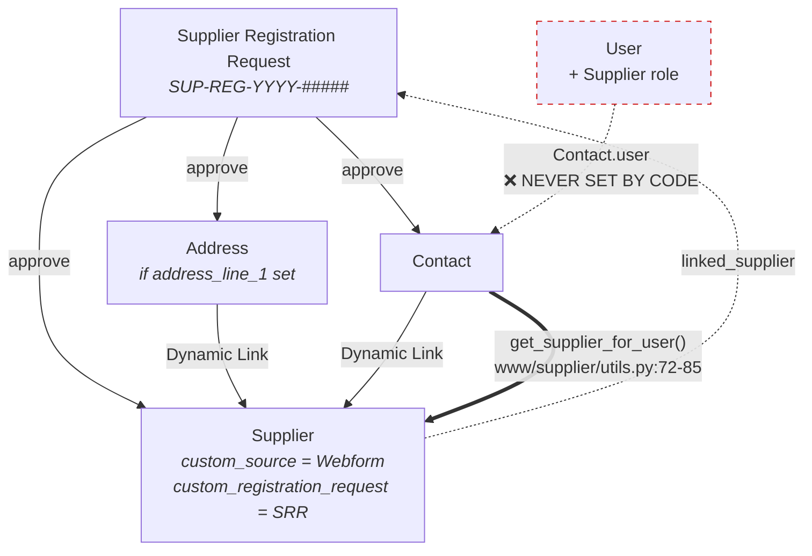

# Supplier & Manager Portals — Developer Reference (INCOMPLETE MODULE)

> ⚠️ **NOT PRODUCTION-READY** — these screens exist but are incomplete. Do not use them for real business. Do not ship them to customers. Treat every statement below as a description of a **prototype that was parked**, not of a feature.

> **Status:** Preview / incomplete — no automated test coverage of any kind
> **Last verified:** 2026-08-21 against site `metal`, branch `feature/container-redesign` (HEAD `ce7a9d6`)
> **Verification method:** source read + live HTTP against `http://localhost:8000` + REST queries as Administrator
> **User-facing companion:** [user/80-portals-preview.md](../user/80-portals-preview.md)

All paths below are relative to the app root `apps/scrap_metal_suite/scrap_metal_suite/` unless stated otherwise.

---

## 1. Purpose & intended design

Three loosely-coupled prototypes, all authored 2025-12-01 and essentially untouched since (the only later edit is `www/supplier/utils.py`, 2025-12-02):

| Sub-module | Entry point | Intended role |
|---|---|---|
| Supplier self-registration | `www/supplier-registration-form.html` + `.py` | Guest-accessible web form → submittable `Supplier Registration Request` → office approves → Supplier/Contact/User provisioned |
| Supplier portal | `www/supplier/` (5 pages) | Authenticated supplier self-service: prices, sell, invoices, drop-off booking |
| Manager portal | `www/manager/` (3 pages) | Manager KPIs, three-tier price announcement, world commodity price reference |

The intended identity chain is `User → Contact → (Dynamic Link) → Supplier`, resolved on every supplier portal request.

`docs/USER_MANUAL_PROGRESS.md:60-66` already classifies all of `/manager`, `/supplier`, and `/supplier-registration-form` as **STALE — Future development — DO NOT DOCUMENT NOW**. This document exists to record *what is actually there*, not to promote them.

> **Correction to `CLAUDE.md`:** the project root `CLAUDE.md:13` states approval "Auto-creates Supplier, Contact, User on approval". **This is false.** No User is ever created. See §4.3.

---

## 2. Maturity assessment

### 2.1 Per-screen verdict

| Screen | Route | HTTP (guest) | Real data? | Verdict |
|---|---|---|---|---|
| Registration form | `/supplier-registration-form` | 200 | Yes (submits successfully) | **Functional but incomplete** — no attachments, no email, no anti-abuse |
| Supplier dashboard | `/supplier` | 301 → `/login` | Yes (supplier + registration metadata) | **Thin but real** — 4 read-only fields, no actions |
| Supplier price | `/supplier/price` | 301 → `/login` | **No** | **Stub** — one `<p>` of placeholder text |
| Supplier sell | `/supplier/sell` | 301 → `/login` | **No** | **Stub** |
| Supplier invoice | `/supplier/invoice` | 301 → `/login` | **No** | **Stub** |
| Supplier dropoff | `/supplier/dropoff` | 301 → `/login` | **No** | **Stub** |
| Manager dashboard | `/manager` | **200 — no auth** | Partly (2 of 4 KPIs) | **Half-wired + publicly exposed** |
| Manager price | `/manager/price` | **200 — no auth** | Partly (names/UOM only) | **Read-only; misleading fallback** |
| Manager world price | `/manager/world-price` | **200 — no auth** | **No** | **Fully hardcoded; actively misleading** |

### 2.2 The four stub supplier pages

`www/supplier/price.html`, `sell.html`, `invoice.html`, `dropoff.html` are byte-for-byte the same 32-line template with one word and one sentence changed. Each renders exactly:

```html
<div class="page-content">
    <p class="info-message">View current scrap metal prices here.</p>
</div>
```

Their `.py` companions (`price.py`, `sell.py`, `invoice.py`, `dropoff.py`) are identical 12-line files that set a title, set `active_page`, and call `get_supplier_context(context)`. **They fetch nothing.** There is no `<script>`, no `frappe.call`, no form, no button anywhere in these four pages. Nothing is "dead-wired" here — nothing was wired at all.

### 2.3 Dead code inventory

| Location | Dead thing | Why |
|---|---|---|
| `www/supplier-registration-form.py:14-19` | `context.countries` | The template never iterates it. `supplier-registration-form.html:117` hardcodes `<option value="">Loading countries...</option>` and `:228-242` fetches the list client-side via `api.v1.get_countries` instead. The server-side query runs on every page load and is discarded. |
| `www/manager/world-price.py:16-41` | `context.world_prices` | `world-price.html` **never references it**. The template hardcodes six metal cards at `:23-99`. The Python defines only three metals — already out of sync with the six in the template. |
| `www/manager/world-price.py:43-47` | `context.exchange_rates` | Never referenced. `world-price.html:110-121` hardcodes the same three rates inline. |
| `www/manager/index.py:23-35` | `Supplier Registration` branch | Guarded by `frappe.db.exists("DocType", "Supplier Registration")`, which is permanently false — the doctype is `Supplier Registration **Request**`. The `else` branch at `:36-38` always executes. Verified: `GET /api/resource/DocType/Supplier Registration` → **404**; `.../Supplier Registration Request` → **200**. |
| `www/manager/index.html:70`, `:116` | Two `/app/supplier-registration` links | Same wrong doctype name. The Desk SPA returns HTTP 200 for any `/app/*` path, so the failure is client-side: the user lands on a "not found" list view. |
| `www/manager/index.py:41-42` | `total_purchases_formatted` / `total_weight_formatted` | Hardcoded `"฿0"` / `"0 T"` with the in-source comment `# Placeholder - will need actual purchase data`. |

---

## 3. Data model

### 3.1 `Supplier Registration Request`

`scrap_metal_suite/doctype/supplier_registration_request/supplier_registration_request.json`

| Property | Value |
|---|---|
| `is_submittable` | `1` |
| `autoname` | `naming_series:` → `SUP-REG-.YYYY.-` |
| `title_field` | `company_name` |
| `track_changes` | `1` |
| `index_web_pages_for_search` | `1` ⚠️ see §8.4 |

Field groups: company info, contact, address, materials (free text), bank details, **four `Attach` fields** (`id_card_attachment`, `business_license_attachment`, `tax_certificate_attachment`, `other_documents` — `json:246-269`), notes, approval block.

`allow_on_submit: 1` is correctly set on `status`, `approved_by`, `approval_date`, `rejection_reason`, `linked_supplier` (`json:74, 293, 300, 312, 321`), so the post-submit mutations in `approve()`/`reject()` are legal.

Permissions (`json:342-378`) — **note the omissions**:

| Role | read | write | create | submit | delete |
|---|:--:|:--:|:--:|:--:|:--:|
| System Manager | ✓ | ✓ | ✓ | ✓ | ✓ |
| Purchase Manager | ✓ | ✓ | ✓ | ✓ | ✓ |
| Purchase User | ✓ | — | — | — | — |

There is **no `Manager` role entry** — the role the manager portal is nominally built for cannot read registrations at all. There is no `Supplier` role entry either (correct, but means a supplier can never see their own request).

### 3.2 Supplier custom fields

`fixtures/custom_field.json`:

| Fieldname | Purpose |
|---|---|
| `custom_source` | `Manual` \| `Webform` — set by `overrides/supplier.py:14-17` or `:86` |
| `custom_registration_request` | Link back to the `Supplier Registration Request` (`insert_after: custom_source`) |
| `short_code` | 2–8 char ASCII, `unique`, `reqd: 1` — **added much later** for the container/price-lock naming series, and it breaks approval (§4.4) |

### 3.3 Identity chain



The dashed red edge is the whole problem: `Contact.user` is the **only** join the portal uses, and nothing in the codebase ever writes it.

Verified on the live dev site:

- Auto-created contact `Piyanuch leelatpaiboon-teststes` (from approving `SUP-REG-2025-00002`) → **`user` field absent/empty**.
- Contact `test_brighton` → `user: tes_sup@email.com`, hand-created by the project owner on the same day, evidently to test the portal manually.
- `Supplier teststes` also has a `portal_users` child row (`tes_sup@email.com`) — that is ERPNext's own **Portal User** mechanism, which **this module does not use or read**. Two competing linking schemes coexist.

---

## 4. Registration → approval flow

### 4.1 Guest submission

`www/supplier-registration-form.html:255-294` → `frappe.call` →
`scrap_metal_suite.scrap_metal_suite.doctype.supplier_registration_request.supplier_registration_request.submit_registration`

`supplier_registration_request.py:165-215`:

```python
@frappe.whitelist(allow_guest=True)
def submit_registration(data):
```

- `:177-180` validates 8 required fields, throws on the first missing one.
- `:183-188` duplicate-email guard against status `Pending Approval` / `Approved`.
- `:194-204` **explicit field allow-list** of 20 fieldnames. This is good — a guest cannot set `status`, `approved_by`, `linked_supplier`, or any `*_attachment` field by injecting extra JSON keys.
- `:206-209` `doc.status = "Draft"` → `insert(ignore_permissions=True)` → `doc.submit()`.

`before_submit` (`:23-25`) then forces `status = "Pending Approval"`.

**Verified live**: an unauthenticated `POST` with no session cookie returned
`{"message":{"success":true,...,"registration_id":"SUP-REG-2026-00001"}}`. (Test record subsequently cancelled and deleted.)

### 4.2 Approval trigger

`supplier_registration_request.js:7-25` adds an **Approve** button under an *Actions* group, gated on `status === "Pending Approval" && docstatus === 1`, calling the whitelisted document method `approve`. A **Reject** button (`:27-47`) prompts for a mandatory reason and calls `reject`.

### 4.3 What `approve()` actually does

`supplier_registration_request.py:27-56`:

1. `:30-31` guard on status.
2. `:34` `_create_supplier()` → `:79-100`.
3. `:37-38` `_create_address()` — **only if `address_line_1` is truthy** (`:102-124`).
4. `:41` `_create_contact()` → `:126-162`.
5. `:44-48` set `status`/`approved_by`/`approval_date`/`linked_supplier`, `save(ignore_permissions=True)`.

**What it does NOT do:**

- ❌ **No `User` is created.** There is no `frappe.new_doc("User")` anywhere in the file.
- ❌ **`contact.user` is never assigned** (`_create_contact`, `:133-161`).
- ❌ **No `Supplier` role is granted** to anybody.
- ❌ **No email is sent** — there is no `frappe.sendmail` in the module, despite `supplier-registration-form.html:212` promising *"We will contact you via email once your application has been processed."*
- ❌ **No attachments are copied** from the request to the Supplier.
- ❌ **No `Portal User` row** is added to the Supplier.

**Consequence:** the supplier portal is unreachable by construction. `get_supplier_for_user()` (`www/supplier/utils.py:72`) starts with `frappe.db.get_value("Contact", {"user": user}, "name")` — for a supplier created by `approve()` this returns `None`, so `get_supplier_context` sets `context.error = "No supplier account linked to your user."` (`utils.py:57-59`).

### 4.4 Approval hard-fails on Thai company names ⚠️ BLOCKER

`_create_supplier` (`:99`) calls `supplier.insert(ignore_permissions=True)`, which fires the `Supplier.before_insert` hook chain (`hooks.py:274-277`), including `overrides.supplier.populate_short_code`.

`overrides/supplier.py:39-54` → `_derive_default` (`:65-70`) strips everything outside `[A-Za-z0-9]`; if fewer than 2 characters survive it returns `""`, and `:45-52` raises:

```
Short Code is required. Auto-default could not derive an ASCII abbreviation
from the supplier name — please type a 2-8 character code (A-Z, 0-9)…
```

**Verified live** — `POST /api/resource/Supplier` with `supplier_name: "ร้านรับซื้อของเก่าทดสอบ"` returns
`frappe.exceptions.ValidationError: Short Code is required…` with the traceback showing `run_method("before_insert")` → `populate_short_code`.

Neither the guest form nor the doctype nor the approval JS provides any way to supply a `short_code`. **Therefore: approving any registration whose `company_name` is Thai-only fails, and the operator has no in-flow remedy.** For a Thai scrap yard this is the majority case.

The failure occurs mid-`approve()` and rolls the request back; it is not a partial-write hazard, but it is a complete dead end. Workaround: create the Supplier manually in the Desk with an explicit Short Code.

### 4.5 Rejection

`reject(reason)` (`:58-77`) — status guard, mandatory reason, sets `status = "Rejected"`, records `approved_by`/`approval_date`, saves. No notification to the applicant.

### 4.6 Validation gap

`validate_email` (`:13-21`) is guarded by `if self.is_new()`. On an **amended** document (`amended_from` exists, `json:323-331`) `is_new()` is true on the amend copy, so the duplicate check does apply there. But the check compares against statuses `Pending Approval`/`Approved` only — a `Rejected` request does not block re-registration, which is probably intended.

---

## 5. Routing, roles & auth

### 5.1 Route resolution

Frappe `www/` convention: `www/supplier/index.html` → `/supplier`, `www/supplier/price.html` → `/supplier/price`, etc. No `website_route_rules` entry exists for any of these — they are pure filesystem routes.

### 5.2 `role_home_page`

`hooks.py:71-73`:

```python
role_home_page = {
    "Supplier": "supplier"
}
```

A user holding the `Supplier` role is redirected to `/supplier` after login. In practice this never fires for a registration-created supplier, because no User is ever created (§4.3). The `Supplier` role does exist on the site (verified `GET /api/resource/Role/Supplier` → 200).

### 5.3 Supplier portal auth — implemented in `utils.py`, not by the framework

`www/supplier/utils.py:7-64`, `get_supplier_context()`, called by all five supplier pages. Redirect ladder:

| Priority | Condition | Action | Line |
|---|---|---|---|
| 0 | `session.user == "Guest"` | redirect `/login?redirect-to=/supplier` | `:27-29` |
| 1 | `System Manager` or `Administrator` role | redirect `/app` | `:34-37` |
| 2 | `Manager` and not `Supplier` | redirect `/manager` | `:39-42` |
| 3 | `POS Operator` and not `Supplier` | redirect `/pos` | `:44-47` |
| 4 | no `Supplier` role | `context.error`, render error box | `:50-52` |
| 5 | no linked supplier | `context.error`, render error box | `:57-59` |

**Verified**: `GET /supplier` as guest → `301 MOVED PERMANENTLY`, `Location: /login?redirect-to=/supplier`. All five routes behave the same.

> ⚠️ **301 is a *permanent* redirect.** `frappe.Redirect` defaults to HTTP 301 and browsers cache it aggressively. A visitor who hits `/supplier` while logged out can have `/supplier → /login` pinned in their browser cache, so a later authenticated visit never reaches the server. This is a latent support burden. A 302/303 is the correct status for a session-dependent redirect.

Two further notes on `get_supplier_context`:

- The ladder hardcodes `/supplier` as the `redirect-to` target for **all five pages** (`:28`), so a logged-out user deep-linking to `/supplier/invoice` lands on the dashboard after login.
- `get_registration_info` (`utils.py:102-117`) calls `frappe.get_doc("Supplier", supplier_name)` a **second time**, immediately after `get_supplier_for_user` already loaded the same doc (`:90`). Two full document loads per page render.

### 5.4 Manager portal auth — **there is none** 🔓

`www/manager/index.py`, `price.py`, `world-price.py` contain **no login check, no role check, and no `login_required` flag.** Frappe `www/` pages are public unless the context says otherwise. The manager sidebar (`www/manager/includes/sidebar.html`) has a "Back to Desk" link but that is cosmetic.

**Verified live, unauthenticated:**

```
GUEST 200  /manager
GUEST 200  /manager/price
GUEST 200  /manager/world-price
```

and `/manager` rendered `<div class="kpi-value">18</div>` — the site's live supplier count — to an anonymous request. `/manager/price` rendered real item names from the catalogue. See §8.1.

### 5.5 Permission gaps summary

| Gap | Detail |
|---|---|
| Manager portal is fully public | No gate whatsoever (§5.4) |
| `Manager` role has no doctype permissions | Not present in `supplier_registration_request.json` permissions; the portal's own "Review Registrations" link would 403/404 for a plain `Manager` anyway |
| `Supplier` role has no doctype permissions on the request | A supplier cannot view their own registration status |
| Two competing supplier-identity schemes | `Contact.user` + Dynamic Link (used by this code) vs. ERPNext `Portal User` child table (present in data, ignored by this code) |

---

## 6. Page-by-page reference

### 6.1 `/supplier-registration-form`

| Item | Value |
|---|---|
| Template | `www/supplier-registration-form.html` (297 lines) |
| Context | `www/supplier-registration-form.py` (21 lines) |
| Auth | none — guest |
| CSS | `public/css/supplier_registration.css` (327 lines) |
| Endpoints called | `scrap_metal_suite.api.v1.get_countries` (`:229`, on DOMContentLoaded); `…supplier_registration_request.submit_registration` (`:272`, on submit) |
| Dead | `context.countries` (never rendered) |

Notes:
- No `<input type="file">` anywhere — the four `Attach` fields on the doctype are unreachable from the web.
- Collapsible sections (`:142`, `:175`) use Bootstrap 4 `data-toggle="collapse"` / `data-target`. The inline JS (`:245-252`) only toggles the `+`/`-` glyph and `aria-expanded`; it **never sets `display` or toggles a class**, so panel visibility depends entirely on the Bootstrap build shipped with the site's web theme. Bootstrap 5 renamed the attribute to `data-bs-toggle`. ⚠️ **UNVERIFIED** — determining whether the panels actually expand requires a real browser; not tested.
- The `error` callback (`:287-292`) only restores the button state; it renders no message of its own and relies on Frappe's default error dialog.

### 6.2 `/supplier` (dashboard)

| Item | Value |
|---|---|
| Template | `www/supplier/index.html` (54 lines) |
| Context | `www/supplier/index.py` (12 lines) → `get_supplier_context` |
| Endpoints called | none (server-rendered only) |
| Real data | `supplier.supplier_name`; and if `custom_registration_request` is set: `registration.name`, `.registration_date`, `.approval_date` |
| Content | one placeholder sentence at `:49` |

### 6.3–6.6 `/supplier/price`, `/sell`, `/invoice`, `/dropoff`

All four: identical structure, `get_supplier_context` only, **zero endpoints, zero data, zero controls.** See §2.2. Placeholder strings at `price.html:27`, `sell.html:27`, `invoice.html:27`, `dropoff.html:27`.

### 6.7 Supplier sidebar

`www/supplier/includes/sidebar.html` (27 lines) — 5 nav links + logout (`/?cmd=web_logout`). All 5 targets resolve. Active state driven by `context.active_page`. Mobile bottom-nav styling exists at `public/css/supplier_portal.css:237-289`.

### 6.8 `/manager` (dashboard)

| Item | Value |
|---|---|
| Template | `www/manager/index.html` (134 lines) |
| Context | `www/manager/index.py` (44 lines) |
| Auth | **none** |
| Endpoints called | none |

| KPI | Source | State |
|---|---|---|
| Total Suppliers | `frappe.db.count("Supplier", {"disabled": 0})` (`index.py:13`) | ✅ real |
| +N this month | `frappe.db.count("Supplier", {"creation": [">=", first_day]})` (`:17-20`) | ✅ real |
| Total Purchases (THB) | `"฿0"` literal (`:41`) | ❌ hardcoded |
| Total Weight (Tons) | `"0 T"` literal (`:42`) | ❌ hardcoded |
| Pending Registrations | dead branch (`:23-27`) | ❌ always `0` |
| Recent registrations table | dead branch (`:30-35`) | ❌ always `[]` |

**Verified live**: the dev site holds two `Supplier Registration Request` records (`SUP-REG-2025-00001` Rejected, `SUP-REG-2025-00002` Approved) yet `/manager` renders Pending Registrations `0` and the `No recent registrations` empty state.

Quick-action links (`index.html:112-127`): `/manager/price` ✅, `/manager/world-price` ✅, `/app/supplier` ✅, `/app/supplier-registration` ❌ (and the same broken target at `:70`).

### 6.9 `/manager/price`

| Item | Value |
|---|---|
| Template | `www/manager/price.html` (141 lines) |
| Context | `www/manager/price.py` (58 lines) |
| Auth | **none** |
| Endpoints called | none |

`price.py:18-23` selects up to 20 `Item` rows where `item_group like "%Scrap%"`, then `get_item_price` (`:44-58`) looks up `Item Price` on price lists **`Standard Buying`**, **`VIP Buying`**, **`Premium Buying`** with `buying: 1`.

**Verified against the live site:**

| Price list | Exists? |
|---|---|
| `Standard Buying` | yes (stock ERPNext) |
| `VIP Buying` | **no** |
| `Premium Buying` | **no** |
| `TEST_POS_BUYING` | yes — this is the list the POS flow actually uses |

Rendered output for real items was `฿-` in **all three** columns. The three-tier scheme described in `CLAUDE.md` ("Price Tier Strategy (Planned)") was never configured.

Two further issues:

- The `item_group like "%Scrap%"` filter is ASCII/English-only. It matches the existing `Scrap Metal` group but would silently miss any Thai-named item group, and it also misses `Bag and wastage`.
- **Misleading fallback**: `price.html:57-99` — when `prices` is empty the template emits five hardcoded rows (Copper Wire ฿280 / Aluminum Scrap ฿65 / Steel-Iron ฿12 / Brass ฿150 / Stainless Steel ฿45) with **no "sample data" label visible to the user** and a `Last Updated` column stamped `frappe.utils.nowdate()`. The only marker is an HTML comment at `:58`. See §8.2.
- `price.py:36-39` swallows every exception with a bare `except Exception: pass`, so a genuine query failure is indistinguishable from "no items" — and silently routes the user into the fake sample table.

Item names are rendered as `{{ item.item_name }}` (`price.html:43`) with no translation — correct per the project's never-translate-item-names rule.

### 6.10 `/manager/world-price`

| Item | Value |
|---|---|
| Template | `www/manager/world-price.html` (133 lines) |
| Context | `www/manager/world-price.py` (49 lines) — **entirely dead** |
| Auth | **none** |
| Endpoints called | **none — there is no API integration of any kind** |

The template hardcodes six metal cards inline (`:23-99`): Copper $8,945, Aluminum $2,485, Steel (HRC) $520, Zinc $2,890, Lead $2,125, Nickel $16,250 — plus percentage deltas. Exchange rates are hardcoded at `:110-121` (USD ฿34.85, EUR ฿37.20, CNY ฿4.82).

`world-price.py` builds `context.world_prices` (three metals) and `context.exchange_rates`, and **the template references neither**. The Python and the template already disagree on how many metals exist.

> ⚠️ `world-price.html:20` renders `Last updated: {{ frappe.utils.formatdate(frappe.utils.nowdate()) }}` — **today's date, always**, above numbers that have not changed since 2025-12-01. This is the most dangerous single line in the module: it presents multi-year-stale constants as same-day market data. The disclaimer at `:129` sits below the fold of the price cards.

Comments in `world-price.py:10-14` name the intended providers (LME, Kitco, MetalPrices API, Trading Economics). None is implemented.

### 6.11 Manager sidebar

`www/manager/includes/sidebar.html` (24 lines) — 3 nav links, "Back to Desk" → `/app`, logout. All targets resolve.

### 6.12 `api/v1/__init__.py`

| Function | Line | Auth | Notes |
|---|---|---|---|
| `get_countries()` | `:11-19` | `allow_guest=True` | Returns the full `Country` table (~250 rows) on every registration-form load. Verified reachable with no session. No caching, no pagination. |
| `debug_supplier_link()` | `:22-66` | login required | Verified: `403` for guest. Returns only the **caller's own** roles/contact/dynamic-links/supplier. A debug endpoint left in shipped code. |

### 6.13 `overrides/supplier.py`

Wired via `hooks.py:272-279`:

```python
doc_events = {
    "Supplier": {
        "before_insert": [
            "…set_source_on_manual_create",
            "…populate_short_code",
        ],
        "before_save": "…populate_short_code",
    }
}
```

- `set_source_on_manual_create` (`:14-17`) — defaults `custom_source` to `"Manual"`. `_create_supplier` pre-sets `"Webform"` (`supplier_registration_request.py:86`), so the hook correctly leaves registration-created suppliers alone.
- `populate_short_code` (`:20-54`) — belongs to the container/price-lock naming work, not to this module, but it is what breaks approval (§4.4). Collision suffixing at `:73-87`, format guard `^[A-Z0-9]{2,8}$` at `:9`/`:57-62`.

Note `populate_short_code` runs on **both** `before_insert` and `before_save`, so it re-validates on every Supplier save.

### 6.14 CSS

`hooks.py:32-37` loads all three portal stylesheets — plus `pos.css` — into **every** website page via `web_include_css`:

```python
web_include_css = [
    "/assets/scrap_metal_suite/css/supplier_registration.css",
    "/assets/scrap_metal_suite/css/supplier_portal.css",
    "/assets/scrap_metal_suite/css/manager_portal.css",
    "/assets/scrap_metal_suite/css/pos.css",
]
```

| File | Lines | Scoping |
|---|---|---|
| `supplier_portal.css` | 290 | mostly scoped under `.supplier-portal`; `.info-message`, `.error-box`, `.company-info-bar` are **global** |
| `manager_portal.css` | 482 | scoped under `.manager-portal`; `.kpi-card`, `.content-card`, `.price-table`, `.tier-badge`, `.empty-state` are **global** |
| `supplier_registration.css` | 327 | registration form |

Unscoped class names (`.kpi-card`, `.price-table`, `.info-message`, `.content-card`) are shipped to every web page including the live POS terminals. No collision has been reported, but this is an unnecessary bleed surface and a needless payload on the yard terminals.

---

## 7. Known gaps & what "finishing this" would require

Ordered by what blocks what. Items 7.1–7.3 must be done before any supplier-facing screen has meaning.

### 7.1 🔴 BLOCKER — approval does not provision a login

**Gap:** `approve()` creates Supplier + Address + Contact but no `User`, and never sets `Contact.user`. The entire supplier portal is dead on arrival.

**To finish:**
1. In `_create_contact`, create or fetch a `User` (`user_type = "Website User"`, `send_welcome_email`), assign the `Supplier` role, and set `contact.user`.
2. Decide **one** canonical linking scheme — `Contact.user` + Dynamic Link (what `utils.py` reads) **or** ERPNext's `Supplier.portal_users`. Both exist in the live data today. If you adopt `portal_users`, rewrite `get_supplier_for_user`.
3. Handle the email-collision case: `email` may already belong to an existing `User`.
4. Make the whole of `approve()` transactional — right now a failure after `_create_supplier()` leaves an orphan Supplier.

### 7.2 🔴 BLOCKER — Thai company names cannot be approved

**Gap:** §4.4. `populate_short_code` throws for any name with <2 ASCII alphanumerics. No UI path supplies one.

**To finish (pick one):**
- Add a `short_code` field to `Supplier Registration Request` (required at approval time, not at guest-submit time) and pass it through `_create_supplier`; **or**
- Have `_create_supplier` synthesise a fallback code (e.g. `SUP` + zero-padded sequence) when derivation fails; **or**
- Prompt for the code in `supplier_registration_request.js` before calling `approve`.

Whichever you choose, add a regression test with a Thai-only `company_name` — this is the *default* case in production, not an edge case.

### 7.3 🟠 No notification anywhere

No email on submit, approve, or reject, while the form explicitly promises one (`supplier-registration-form.html:212`). Either implement `frappe.sendmail` (three touchpoints, plus Email Templates so the copy can be Thai) or remove the promise from the form.

### 7.4 🟠 Registration form cannot collect documents

The doctype has four `Attach` fields; the form has no upload control. A guest-facing upload path also needs its own hardening (size cap, MIME allow-list, `is_private = 1`, and a story for orphaned files when a request is rejected).

### 7.5 🟠 Manager dashboard is half-wired

- Fix the doctype name: `"Supplier Registration"` → `"Supplier Registration Request"` in `index.py:23, 24, 31` and in the two `/app/supplier-registration` links (`index.html:70, 116` → `/app/supplier-registration-request`).
- Implement Total Purchases and Total Weight against the real models (POS Order / Dropoff / Scrap Weight Container) or **delete the two cards** — a permanently-zero KPI is worse than no KPI.
- Grant the `Manager` role read permission on `Supplier Registration Request`, or the fixed links will still fail for the intended audience.

### 7.6 🟠 Price announcement announces nothing

- Create the `VIP Buying` / `Premium Buying` price lists, or drop the tier columns.
- Reconcile with the price list the POS actually uses (`TEST_POS_BUYING` on dev) — the page currently queries lists nobody prices against.
- Replace the `like "%Scrap%"` item filter with a configured Item Group list (there is precedent: `Production Sorting Settings` already holds an allowed-Item-Group child table).
- Remove the `except Exception: pass` at `price.py:36-39`.
- **Delete the sample-data fallback** (`price.html:57-99`) — see §8.2.
- If the page is meant to *set* prices, none of that exists: no form, no write endpoint, no permission model.

### 7.7 🟠 World price is fiction

Either implement a real feed (scheduled job → a `World Metal Price` doctype → render from stored rows with a genuine fetch timestamp) or **delete the page**. Minimum acceptable interim state: remove the `nowdate()` "Last updated" line, move the disclaimer above the prices, and grey the numbers out.

### 7.8 🟡 The four supplier stub pages

`price`, `sell`, `invoice`, `dropoff` need to be built from zero — each needs a data query, a template, an API surface, and a permission story. `invoice` in particular should reuse ERPNext's existing supplier portal rather than being rebuilt. Recommendation: **delete these four routes** until someone is actually assigned to build them; a link that leads to "View your invoices here." is worse than no link.

### 7.9 🟡 Localisation

Every string in all nine pages is hardcoded English. None uses `_()`. The rest of the app has an established bilingual pattern (`docs/BILINGUAL_GUIDE.md`, the `POS_I18N` module) that this module does not participate in. A Thai-facing supplier portal in English is unusable regardless of how the plumbing is fixed.

### 7.10 🟡 Correctness / hygiene

| Item | Location |
|---|---|
| 301 redirect should be 302/303 | `www/supplier/utils.py:28` and the redirect ladder |
| `redirect-to` always points at `/supplier` regardless of the page requested | `utils.py:28` |
| Supplier doc loaded twice per render | `utils.py:90` and `:104` |
| Remove or gate `debug_supplier_link` | `api/v1/__init__.py:22` |
| Remove dead `context.countries` | `www/supplier-registration-form.py:14-19` |
| Remove dead `world-price.py` context | whole file |
| Scope or lazily load portal CSS | `hooks.py:32-37` |
| Verify Bootstrap collapse version | `supplier-registration-form.html:142, 175` |

---

## 8. Security review

### 8.1 🔴 HIGH — Manager portal is unauthenticated and leaks business data

**Finding.** `www/manager/index.py`, `price.py`, and `world-price.py` implement no authentication or authorisation. Frappe serves `www/` pages publicly by default.

**Verified**, no session cookie:

```
GET /manager             → 200
GET /manager/price       → 200
GET /manager/world-price → 200
```

`/manager` returned `<div class="kpi-value">18</div>` — the live count of non-disabled Suppliers. `/manager/price` returned real `Item` names and UOMs from the catalogue.

**Impact.** Any anonymous visitor (and any search-engine crawler) can read the yard's supplier headcount, its month-over-month supplier growth, and its item catalogue. On the production host `smt.x-desk.tech` this is internet-facing. Both `index.py:13` and `price.py:18` run their queries with the **Guest** user's identity, but `frappe.db.count` and `frappe.get_all` in a website context do not enforce the DocType read permission the way `frappe.client.get_list` would — the data comes back regardless.

**Remediation.**
1. Immediate: block `/manager` at the reverse proxy.
2. Proper: add an explicit guard to all three `get_context` functions — mirror the pattern already in `www/supplier/utils.py:27-52` (redirect Guest to `/login`, then require the `Manager` role).
3. Consider a shared `www/manager/utils.py` so the guard cannot be forgotten when a fourth page is added — the current copy-paste-per-page structure is exactly how this gap appeared.

### 8.2 🟠 MEDIUM — Fabricated prices rendered as if authoritative

Two separate instances:

1. `www/manager/world-price.html:20` stamps **today's date** on six hardcoded, years-stale metal prices and three hardcoded FX rates. The only disclaimer is at `:129`, below the price cards.
2. `www/manager/price.html:57-99` renders five fake THB buying prices whenever the item query returns nothing — with a `Last Updated` column set to today and **no on-screen indication that the data is fake**. Because `price.py:36-39` swallows all exceptions, a broken query also lands the user here.

**Impact.** This is not a classic vulnerability but it is a real integrity risk: a manager can price a purchase off numbers the system invented and labelled with today's date. In a commodity-buying business that is a direct financial exposure. It is also worse now that §8.1 makes both pages publicly readable — an outsider could cite them as the yard's published prices.

**Remediation.** Delete both fallbacks. If a placeholder must remain, render an unmissable banner and remove the timestamp.

### 8.3 🟠 MEDIUM — Unthrottled guest write endpoint

`submit_registration` is `allow_guest=True` and performs an `insert` + `submit` with `ignore_permissions=True`. **Verified: no rate limiting exists anywhere in the app** — `grep -rn "rate_limit" --include=*.py` over the whole app returns nothing. There is no CAPTCHA and no honeypot on the form.

**Impact.** Unauthenticated database growth. Each request also writes a Version row (`track_changes: 1`) and a submitted docstatus, so records cannot simply be bulk-deleted — they must be cancelled first. The duplicate-email guard (`:183-188`) is trivially bypassed by varying the email.

**Mitigating factor:** the field allow-list at `:194-204` is a genuinely good control — a guest cannot set `status`, `approved_by`, `linked_supplier`, or any attachment field.

**Remediation.** Apply `@frappe.rate_limit(limit=5, seconds=3600)` (or Frappe's `Website Settings` guest throttle), add a CAPTCHA, and consider requiring email verification before the record reaches `Pending Approval`.

### 8.4 🟠 MEDIUM — Unencrypted bank details + web-search indexing flag

`Supplier Registration Request` stores `bank_name`, `bank_account_number`, `bank_branch`, `bank_account_name` as plain `Data` fields, collected over a guest form.

Separately, `supplier_registration_request.json:333` sets `"index_web_pages_for_search": 1`. On this doctype that flag is meaningless in practice (there is no website route or `Website Generator` behaviour attached, and permissions restrict reads), but it signals intent that should be removed — it is exactly the wrong flag on a record holding bank account numbers and national ID attachments.

**Remediation.** Set `index_web_pages_for_search: 0`. Consider whether bank details belong on a guest-writable doctype at all; ERPNext's `Bank Account` doctype with restricted permissions is the better home. Confirm the four `Attach` fields will be created as **private** files when they are eventually wired up (§7.4) — an `Attach` field on a public-facing flow defaults to a guessable `/files/` URL unless `is_private` is enforced.

### 8.5 🟢 LOW — `get_countries` open to guests

`api/v1/__init__.py:11-19`, `allow_guest=True`, returns the entire `Country` table uncached and unpaginated on every form load. Verified reachable with no session.

**Impact.** Negligible disclosure (public reference data), minor DoS amplification. Already noted in `docs/archive/EXISTING_API_SECURITY_REVIEW.md:19`.

**Remediation.** Cache the result, or drop the endpoint entirely and render the list server-side from the `context.countries` that `supplier-registration-form.py:14-19` already computes and throws away.

### 8.6 🟢 LOW — `debug_supplier_link` shipped in production

`api/v1/__init__.py:22-66`. Requires login (**verified: 403 for guest**) and returns only the *caller's own* roles, contact, dynamic links, and supplier — so it discloses nothing the caller could not otherwise obtain. Already flagged at `docs/archive/EXISTING_API_SECURITY_REVIEW.md:344` with a standing recommendation to remove it.

**Remediation.** Delete it, or gate it behind `System Manager`.

### 8.7 ✅ Checked and clear

| Check | Result |
|---|---|
| SQL injection | None. All queries use `frappe.db.get_value` / `frappe.get_all` / `frappe.db.count` with dict or list filters. No raw `frappe.db.sql` in any file in scope. |
| Template XSS | None found. Jinja autoescaping is on and no `\| safe` filter appears in any of the nine templates. Guest-supplied `company_name` reaches `www/manager/index.html:85` only through the dead branch, and would be escaped anyway. |
| Mass assignment via `submit_registration` | Blocked by the explicit field allow-list (`:194-204`). |
| Privilege escalation via guest submit | Not possible — `status` is forced to `Draft` then `Pending Approval`; `approve()` requires an authenticated caller with write access. |
| Supplier portal cross-tenant data leak | `get_supplier_for_user` resolves strictly from the session user's own Contact. No `supplier` parameter is accepted from the request anywhere. |
| CSRF on the guest endpoint | Not applicable — the endpoint creates only a pending record and grants nothing. |

---

## 9. Testing

### 9.1 What exists

**Nothing.**

A repository-wide search for `supplier_registration`, `submit_registration`, `get_supplier_context`, `get_countries`, `debug_supplier_link`, `www/supplier`, and `www/manager` across all `.py` and `.js` files returns **no test file**. The only non-source hits are documentation and `CLAUDE.md`.

For contrast, the shipped modules have substantial coverage: `api_test/test_e2e_full_flow.py` (24/24), the Playwright suite in `ui_test/` (3/3), plus the settlement and production-sorting suites. **This module is the only significant surface in the app with zero tests.**

Every factual claim in this document therefore rests on source reading plus the manual verification recorded in §9.3.

### 9.2 What is needed

**Unit / integration (`api_test/`), in priority order:**

| # | Test | Guards |
|---|---|---|
| 1 | Approving a request with a **Thai-only** `company_name` succeeds | §7.2 blocker — this is the default production case |
| 2 | After `approve()`, a `User` exists, holds the `Supplier` role, and `Contact.user` resolves back to the Supplier | §7.1 blocker |
| 3 | `get_supplier_for_user()` returns the right Supplier for a provisioned user and `None` for an unprovisioned one | core join |
| 4 | `submit_registration` rejects each of the 8 missing required fields | `:177-180` |
| 5 | `submit_registration` ignores injected `status` / `approved_by` / `linked_supplier` / `*_attachment` keys | allow-list at `:194-204` |
| 6 | Duplicate-email guard fires for `Pending Approval` and `Approved`, not for `Rejected` | `:183-188` |
| 7 | `approve()` on a non-`Pending Approval` request throws | `:30-31` |
| 8 | `reject()` requires a reason and sets status | `:58-77` |
| 9 | A request with no `address_line_1` approves without creating an Address | `:37-38` |
| 10 | Failure inside `approve()` leaves no orphan Supplier | transactionality, §7.1 |

**HTTP / permission tests — these are the ones that would have caught the live bugs:**

| # | Test | Guards |
|---|---|---|
| 11 | `GET /manager` as Guest is **401/403 or redirects to /login** | §8.1 — currently 200 |
| 12 | Same for `/manager/price` and `/manager/world-price` | §8.1 |
| 13 | `GET /supplier*` as Guest redirects to `/login` | `utils.py:27-29` |
| 14 | Every role in the redirect ladder lands where §5.3 says | `utils.py:34-47` |
| 15 | `/manager` renders a non-zero Pending Registrations count when pending requests exist | §7.5 — currently always 0 |
| 16 | `debug_supplier_link` is 403 for Guest | `api/v1/__init__.py:22` |
| 17 | Rate limit rejects the Nth guest submission in a window | §8.3 — no limiter exists yet |

**Playwright (`ui_test/`):** submit the registration form end-to-end; confirm the country dropdown populates; confirm the Bank Details / Additional Notes collapsibles actually expand (§6.1, currently ⚠️ UNVERIFIED); confirm a provisioned supplier can log in and reach `/supplier`.

### 9.3 Manual verification performed for this document (2026-08-21)

Site `metal` at `http://localhost:8000`, Administrator session where noted.

| # | Check | Result |
|---|---|---|
| 1 | HTTP status of all 10 routes as Guest | `/supplier*` → 301 → `/login?redirect-to=/supplier`; `/manager*` → **200**; `/supplier-registration-form` → 200 |
| 2 | `/manager` content as Guest | rendered `Total Suppliers = 18`, Purchases `฿0`, Weight `0 T`, Pending `0`, `No recent registrations` |
| 3 | `/manager/price` content as Guest | real item names + UOM; **all three price columns `฿-`** |
| 4 | `/manager/world-price` content as Guest | hardcoded `8,945` / `2,485` / `520` / `34.85` present |
| 5 | Guest `POST submit_registration` | **succeeded** → `SUP-REG-2026-00001`; record then cancelled and deleted |
| 6 | Guest `GET api.v1.get_countries` | 200, full country list |
| 7 | Guest `GET api.v1.debug_supplier_link` | **403** |
| 8 | `DocType "Supplier Registration"` | **404** |
| 9 | `DocType "Supplier Registration Request"` | 200 |
| 10 | Price lists present | `Standard Buying` ✓, `TEST_POS_BUYING` ✓, `VIP Buying` ✗, `Premium Buying` ✗ |
| 11 | Existing registration requests | `SUP-REG-2025-00001` Rejected, `SUP-REG-2025-00002` Approved → `linked_supplier: teststes` |
| 12 | Auto-created Contact `Piyanuch leelatpaiboon-teststes` | Dynamic Link to `teststes` present; **`user` field empty** |
| 13 | Contact `test_brighton` | `user: tes_sup@email.com` — hand-created, proves the link must be built manually |
| 14 | Supplier `teststes` | `custom_source: Webform`, `custom_registration_request: SUP-REG-2025-00002`, `portal_users: [tes_sup@email.com]`, **no `short_code`** |
| 15 | `POST /api/resource/Supplier` with Thai-only name | **ValidationError: "Short Code is required…"**, traceback through `before_insert` → `populate_short_code` |
| 16 | Roles exist | `Manager`, `Supplier`, `POS Operator`, `Purchase Manager`, `Purchase User`, `Production Operator` all → 200 |
| 17 | `grep -rn "rate_limit" --include=*.py` | no matches — no throttling anywhere in the app |

**Not verified (requires a real browser):** whether the registration form's Bootstrap collapsibles expand (§6.1); the rendered appearance of any page at mobile breakpoints.
