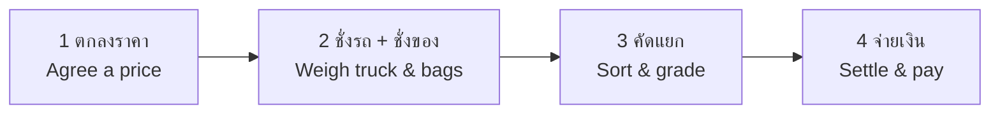

# Start Here / เริ่มต้นที่นี่

> **Status:** Production
> **Who / ใคร:** ทุกคนที่ใช้งานหน้าจอในลาน / everyone who uses a terminal in the yard
> **Last verified:** 2026-08-21

อ่านหน้านี้ก่อน แล้วค่อยไปที่คู่มือของงานที่คุณทำ
Read this once, then go to the guide for the job you actually do.

---

## 1. ระบบนี้ทำอะไร / What this system does

ลานรับซื้อเศษโลหะมี 4 ขั้นตอนหลัก ระบบนี้ทำให้ตัวเลขทั้ง 4 ขั้นตอนตรงกัน
A scrap yard does four things. This system makes the numbers from all four agree.



**ทำไมต้องบันทึกทุกอย่าง / Why everything gets recorded:** น้ำหนักถูกวัด 3 ทาง — ตาชั่งรถ, ผลรวมของถุงแต่ละใบ, และน้ำหนักที่ผู้ขายแจ้งไว้ ถ้าไม่ตรงกัน ระบบจะเตือน
Weight is measured three ways — the weighbridge, the sum of individual bags, and what the supplier declared. When they disagree, the system flags it. That gap is the whole point of the paperwork.

---

## 2. งานของคุณอยู่ตรงไหน / Which guide is yours

| ถ้าคุณ… / If you… | อ่าน / Read |
|---|---|
| ชั่งถุงของที่ตาชั่ง / Weigh bags on the bench scale | [10 — POS Scrap Terminal](10-pos-scrap-terminal.md) |
| ชั่งรถบนตาชั่งรถ / Weigh trucks on the weighbridge | [11 — Truck Terminal](11-truck-terminal.md) |
| รับของทั้งงาน ตั้งแต่ต้นจนจบ / Run a whole drop-off | [12 — Drop-off & Containers](12-dropoff-receiving.md) |
| คัดแยกและตรวจเกรด / Sort and grade material | [20 — Production Sorting](20-production-sorting.md) |
| ทำราคา ใบสั่งซื้อ และสรุปยอด / Price, order, settle | [30 — Price Lock & Settlement](30-settlement.md) |
| พิมพ์เอกสารหรือสติ๊กเกอร์ / Print anything | [40 — Printing & Labels](40-printing.md) |
| หาทางแก้ปัญหา / Fix something that went wrong | [90 — Troubleshooting](90-troubleshooting.md) |

---

## 3. เข้าสู่ระบบและเปิดกะ / Logging in and opening a session

หน้าจอในลานทุกหน้าต้องมี **กะ (Session)** ที่เปิดอยู่ กะคือการบอกระบบว่า *ใคร* กำลังใช้ *ตาชั่งตัวไหน*
Every terminal needs an open **session**. A session tells the system *who* is working on *which scale* — that is how a weight gets attributed to a person and a device.

1. เปิดหน้า `/pos` — Open `/pos`
2. เลือกโปรไฟล์ (POS Profile) — Pick your profile
   → กำหนดว่ารายการสินค้าอะไรแสดงบนหน้าจอ / this decides which item grades appear on screen
3. เลือกตาชั่ง — Pick your scale
   → ตาชั่ง 1 ตัวใช้ได้ทีละ 1 กะเท่านั้น / a scale can only be held by one session at a time
4. กด **เปิดกะ / Open Session**

**สำคัญ / Important:** ระบบจะพาคุณไปหน้าจอไหน ขึ้นอยู่กับ *ประเภทของตาชั่ง*
Which terminal you land on depends on the **scale's type**, not on what you clicked:

| ประเภทตาชั่ง / Scale type | ไปที่ / Takes you to |
|---|---|
| Scrap | `/pos/terminal` — [POS Scrap Terminal](10-pos-scrap-terminal.md) |
| Truck | `/pos/truck` — [Truck Terminal](11-truck-terminal.md) |

ถ้าไปผิดหน้า แปลว่าเลือกตาชั่งผิดตัว ให้ปิดกะแล้วเปิดใหม่
If you land on the wrong screen, you picked the wrong scale. Close the session and open a new one.

**ปิดกะเมื่อเลิกงาน / Close your session when you finish.** กะที่เปิดค้างไว้จะล็อกตาชั่งไม่ให้คนอื่นใช้ ระบบจะปิดให้เองถ้าไม่มีการใช้งานเกิน 90 นาที
An open session holds the scale lock and nobody else can use that device. The system force-closes sessions idle for more than 90 minutes, but do not rely on that.

---

## 4. สิ่งที่เหมือนกันทุกหน้าจอ / What every terminal shares

แถบด้านบน / The header bar:

```
┌─────────────────────────────────────────────────────────────────┐
│ ← │ X-DESK │ SES-… │ โปรไฟล์ │ ผู้ใช้ │ ⚖ ตาชั่ง │ นาฬิกา │ TH ☀ 🖨 │
└─────────────────────────────────────────────────────────────────┘
```

| ส่วน / Element | ทำอะไร / What it does |
|---|---|
| `SES-…` | เลขกะปัจจุบัน / your session number |
| ⚖ ตาชั่ง | ชื่อตาชั่ง จุดสีบอกสถานะเชื่อมต่อ / scale name; the dot shows connection state |
| **TH / EN** | สลับภาษา / switches language |
| ☀ / 🌙 | สลับธีมสว่าง-มืด / light and dark theme |
| 🖨 Print | พิมพ์เอกสารของงานปัจจุบัน / print for the current job |

**ชื่อสินค้าไม่แปล / Item names are never translated.** `ทองแดงปอก` คือชื่อจริงของเกรดนั้น ไม่ใช่คำที่แปลได้ — จะแสดงเป็นภาษาไทยเสมอ ไม่ว่าจะตั้งภาษาอะไร
`ทองแดงปอก` is the grade's actual identity, not a label. It stays Thai in every language, on every screen and every printout. If you ever see an English item name, that is a bug — report it.

---

## 5. การเชื่อมต่อตาชั่ง / Connecting the scale

ตาชั่งต่อผ่านสาย USB/Serial เข้ากับเครื่องคอมพิวเตอร์ที่หน้าจอนั้น ไม่ได้ต่อผ่านอินเทอร์เน็ต
The scale connects by USB/serial cable to the computer running the terminal — not over the network. Two consequences:

- ต้องกดอนุญาตในเบราว์เซอร์ครั้งแรก / the browser asks permission the first time, and you must click it — it cannot connect on its own
- ถ้าเปลี่ยนเครื่องคอมพิวเตอร์ ต้องต่อสายและอนุญาตใหม่ / move to a different computer and you reconnect from scratch

จุดสีข้างชื่อตาชั่ง / The dot beside the scale name:

| สี / Colour | หมายความว่า / Means |
|---|---|
| 🟢 เขียว / green | เชื่อมต่อแล้ว อ่านค่าได้ / connected and reading |
| 🔴 แดง / red | ยังไม่เชื่อมต่อ — กรอกน้ำหนักมือได้ / not connected — you can still type weights by hand |

**กรอกมือได้เสมอ / Manual entry always works.** ถ้าตาชั่งเสีย งานไม่หยุด — พิมพ์น้ำหนักเองได้ ระบบจะบันทึกว่าเป็นการกรอกมือ
If the scale fails, work does not stop. Type the weight in. The system records that it was entered by hand rather than read from the device, which is exactly what an auditor needs to know later.

---

## 6. การสแกน QR / Scanning QR codes

เอกสารและสติ๊กเกอร์ทุกใบมี QR code สแกนได้จากปุ่ม **สแกน / Scan**
Every document and bag sticker carries a QR code. Use the **Scan** button.

| สแกนอะไร / What you scan | ระบบทำอะไร / What happens |
|---|---|
| QR ของงานรับของ / a drop-off QR | เปิดงานนั้น / loads that drop-off |
| QR บนสติ๊กเกอร์ถุง / a bag sticker QR | เปิดงานที่ถุงนั้นอยู่ และไฮไลต์ถุงนั้น / loads the bag's drop-off and highlights that bag |

พิมพ์รหัสเองก็ได้ถ้ากล้องอ่านไม่ติด — ช่องค้นหารับทั้ง `DO-…` และ `CTN-…`
You can type the code instead if the camera will not read it. The search box accepts both `DO-…` and `CTN-…` values.

---

## 7. ถ้าติดปัญหา / If something goes wrong

1. ดูหัวข้อ **ปัญหาที่พบบ่อย** ในคู่มือของงานนั้น / check the "What can go wrong" section in your module's guide
2. ถ้ายังไม่ได้ ดู [90 — Troubleshooting](90-troubleshooting.md)
3. ถ้ายังไม่ได้ แจ้งหัวหน้างาน พร้อม **เลขเอกสาร** และ **รูปหน้าจอ** / escalate with the **document number** and a **screenshot**

เลขเอกสารสำคัญที่สุด — `DO-…`, `CTN-…`, `SW-…` ทำให้ตามเรื่องได้ทันที
The document number matters more than the description. `DO-…`, `CTN-…`, `SW-…` lets someone find the exact record in seconds.
