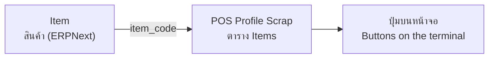

# Adding Items to the Screen — Office Guide / คู่มือเพิ่มรายการสินค้าบนหน้าจอ

> **Status:** Production
> **Who / ใคร:** ออฟฟิศ / ผู้ดูแลระบบ — office or admin (not yard operators)
> **Where / ที่ไหน:** Desk — `/app/item` and `/app/pos-profile-scrap`
> **Last verified:** 2026-08-25 — ทดสอบกับระบบจริง / tested against a live site

ปุ่มเกรดที่ผู้ชั่งเห็นบนหน้าจอ มาจากการตั้งค่า 2 ที่ ไม่ใช่ที่เดียว
The grade buttons an operator sees come from **two** places, not one. Getting this wrong is the most common reason a new grade "doesn't show up".

---

## 1. อะไรเป็นตัวกำหนดหน้าจอ / What decides what appears

| ที่ / Place | ทำหน้าที่ / Role |
|---|---|
| **Item** (`/app/item`) | ตัวสินค้าจริง — ชื่อ, หน่วย, กลุ่ม / the real record: name, UOM, group |
| **POS Profile Scrap → Items** | เลือกว่า *สินค้าไหน* ขึ้นบนหน้าจอไหน และเรียงยังไง / which items appear on which terminal, and in what order |

**สินค้าเป็นของ ERPNext ปกติ ไม่ใช่ของแอปนี้ / Items are stock ERPNext.** แอปนี้ไม่ได้เพิ่มช่องพิเศษให้ Item เลย (เพิ่มเฉพาะที่ Supplier 3 ช่อง)
This app adds **no custom fields to Item** — its only custom fields are three on `Supplier`. So an Item is created exactly the way any ERPNext item is.

**ไม่มีหน้าจอไหนสร้างสินค้าได้ / Nothing creates items from a terminal.** ต้องเข้า Desk เท่านั้น — ไม่มี API สำหรับสร้าง Item, Scale, POS Profile หรือ Supplier
There is **no API** to create an `Item`, `Scale`, `POS Profile Scrap`, `Item Group` or `Supplier`. All of it is desk data entry, by design.

---

## 2. เตรียมก่อนเริ่ม / Before you start

| ต้องมี / You need | หมายเหตุ / Notes |
|---|---|
| สิทธิ์เข้า Desk / desk access | ผู้ชั่งทำไม่ได้ / yard operators cannot do this |
| ชื่อเกรดภาษาไทยที่ถูกต้อง / the exact Thai grade name | **ชื่อนี้คือตัวตนของสินค้า ห้ามแปล** / this name IS the item's identity — never translated, anywhere |
| รู้ว่าจะให้ขึ้นหน้าจอไหน / which profile | แต่ละ POS Profile Scrap = หน้าจอชุดหนึ่ง / one profile = one terminal's button set |

---

## 3. เพิ่มเกรดใหม่ขึ้นหน้าจอ / Walkthrough: add a new grade

**สถานการณ์ / Scenario:** เพิ่มเกรดใหม่ `ทองเหลืองหนา` ให้ขึ้นบนหน้าจอชั่งเศษ
Add a new grade `ทองเหลืองหนา` to the scrap weighing terminal.

### ขั้นที่ 1 — สร้าง Item / Create the Item

1. ไปที่ `/app/item/new` — Go to `/app/item/new`
2. **Item Code** — `ทองเหลืองหนา`
3. **Item Name** — `ทองเหลืองหนา`
   → ⚠️ **ชื่อนี้คือชื่อที่จะขึ้นบนปุ่ม บนสติ๊กเกอร์ และบนใบชั่ง** / this is the name that appears on the button, the sticker, and the receipt
4. **Item Group** — เลือกกลุ่มที่ใช้อยู่ / pick your existing group
   → มีผลกับการคัดแยก ดู [20](20-production-sorting.md) / affects Production Sorting
5. **Default Unit of Measure** — `Kg`
   → ถ้าเว้นว่าง ระบบใช้ `Kg` ให้เอง / if blank, the terminal falls back to `Kg`
6. **Save**

### ขั้นที่ 2 — เพิ่มเข้าหน้าจอ / Add it to the profile

7. ไปที่ `/app/pos-profile-scrap` แล้วเปิดโปรไฟล์ที่ต้องการ / open the profile you want
8. ในตาราง **Items** กด Add Row / add a row in the **Items** table
9. **Item Code** — เลือก `ทองเหลืองหนา`
10. **Category** — เช่น `ทองเหลือง` (ไม่บังคับ) / optional, e.g. `ทองเหลือง`
    → ถ้าใส่ จะกลายเป็นแท็บบนหน้าจอ / becomes a tab on the terminal
11. **Display Order** — เช่น `10`
    → ตัวเลขน้อยขึ้นก่อน / lower numbers come first
12. **Save**

**เสร็จแล้ว / Result:** ผู้ชั่ง **กด Ctrl+Shift+R** แล้วจะเห็นปุ่มใหม่
The operator presses **Ctrl+Shift+R** and the new button appears. Without the hard refresh they may keep seeing the old set — see [90 — Troubleshooting](90-troubleshooting.md).

---

## 4. จัดกลุ่มและเรียงลำดับ / Walkthrough: grouping and ordering

หน้าจอเรียงตาม **หมวด (Category) ก่อน แล้วค่อย Display Order**
The screen sorts by **Category first, then Display Order**.

| ตั้งค่า / Setting | ผลลัพธ์ / Effect |
|---|---|
| Category ใส่ค่า / has a value | กลายเป็นแท็บ เรียงตามตัวอักษร / becomes a tab, tabs sorted alphabetically |
| Category ว่าง / blank | ไปอยู่ **ท้ายสุด** / sorts to the **very end** |
| Display Order = ตัวเลข | น้อยขึ้นก่อน / lower first |
| Display Order ว่าง / blank | ไปอยู่ **ท้ายกลุ่ม** / sorts to the end of its group |

**เคล็ดลับ / Tip:** ใส่ Display Order เป็น 10, 20, 30 เว้นช่วงไว้ เพิ่มของใหม่แทรกกลางได้โดยไม่ต้องแก้ทั้งตาราง
Number them 10, 20, 30 rather than 1, 2, 3 — then a new grade can be slotted between two existing ones without renumbering everything.

---

## 5. เอาเกรดออกจากหน้าจอ / Walkthrough: remove a grade

**อย่าลบ Item / Do NOT delete the Item.** งานเก่าที่ชั่งไปแล้วอ้างถึงสินค้านั้นอยู่
Old drop-offs, containers and receipts reference it. Deleting breaks their history.

แทนที่จะลบ ให้ **ลบแถวออกจากตาราง Items ของโปรไฟล์** เท่านั้น
Instead, just **delete the row from the profile's Items table**. The Item stays, the history stays, and the button disappears.

ถ้าจะเลิกใช้ถาวร ให้ตั้ง Item เป็น `Disabled` ใน ERPNext / to retire it permanently, mark the Item `Disabled` in ERPNext.

---

## 6. ปัญหาที่พบบ่อย / What can go wrong

| อาการ / Symptom | สาเหตุ / Cause | แก้ยังไง / Fix |
|---|---|---|
| เพิ่มแล้วปุ่มไม่ขึ้น / Added it, no button appears | เบราว์เซอร์ยังใช้ไฟล์เก่า / cached page | **Ctrl + Shift + R** |
| **ปุ่มหายเงียบ ๆ ไม่มี error** / A row is silently missing, no error | `item_code` ในโปรไฟล์ชี้ไปที่ Item ที่ไม่มีอยู่ — ระบบข้ามไปเฉยๆ / the profile row points at an Item that does not exist; the terminal skips it silently | ตรวจสะกด `item_code` ให้ตรงกับ Item จริง / check the code matches a real Item exactly |
| ชื่อบนปุ่มไม่ตรงกับที่พิมพ์ในโปรไฟล์ / The button shows a different name than the profile row | **ชื่อมาจาก Item ไม่ได้มาจากโปรไฟล์** / the name is read from the **Item record**, not the profile row | แก้ที่ Item / edit the Item's `item_name` |
| เกรดใหม่ไปอยู่ท้ายสุด / New grade sorts to the bottom | Category หรือ Display Order ว่าง / blank Category or Display Order | ใส่ค่าให้ทั้งสองช่อง / fill both in |
| หน่วยขึ้นเป็น Kg ทั้งที่ตั้งอย่างอื่น / Shows `Kg` despite a different UOM | Item ไม่ได้ตั้ง Default UOM / the Item has no default UOM | ตั้ง `Default Unit of Measure` ที่ Item / set it on the Item |
| แก้ราคาในโปรไฟล์แล้วไม่มีอะไรเกิดขึ้น / Changing the price list changes nothing | หน้าจอชั่งเศษ **ไม่ได้อ่าน** `price_list` หรือ `show_price` เลย / the scrap terminal never reads those fields | ราคาอยู่ที่ Price Lock — ดู [30](30-settlement.md) / pricing lives in Price Lock |

---

## 7. สรุป / Quick reference

**สองที่ที่ต้องแก้ / The two places**

| จะทำอะไร / To do this | แก้ที่ / Edit here |
|---|---|
| เปลี่ยนชื่อที่แสดง / change the displayed name | **Item** → `item_name` |
| เปลี่ยนหน่วย / change the unit | **Item** → `Default Unit of Measure` |
| ให้ขึ้น/ไม่ขึ้นบนหน้าจอ / show or hide on a terminal | **POS Profile Scrap** → Items table |
| เปลี่ยนลำดับหรือแท็บ / reorder or re-tab | **POS Profile Scrap** → `display_order`, `category` |

**กฎเหล็ก / Hard rules**

- ชื่อสินค้าเป็นภาษาไทยและ **ห้ามแปล** ไม่ว่าจะเลือกภาษาอะไร / item names are canonical Thai and are never translated, in any language, on any screen or printout
- ห้ามลบ Item ที่เคยใช้ชั่งแล้ว / never delete an Item that has been weighed
- แต่ละโปรไฟล์คือหน้าจอชุดหนึ่ง แก้โปรไฟล์เดียวไม่กระทบเครื่องอื่น / one profile is one terminal's button set; editing one does not affect the others
