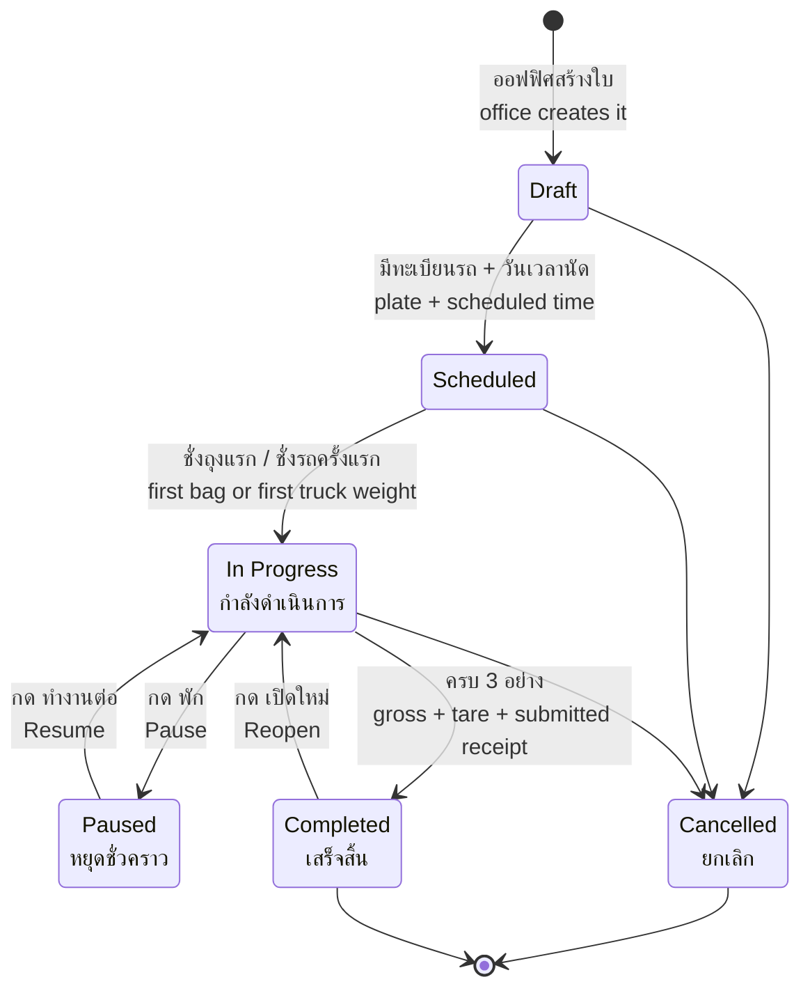
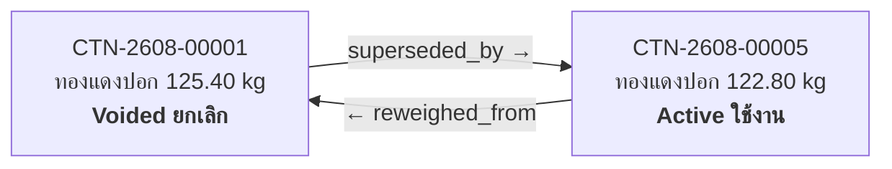
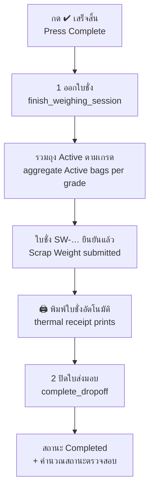

# Drop-off & Container Weighing — Operator Guide / คู่มือผู้ใช้งาน

> **Status:** Production
> **Who / ใคร:** POS Operator (ผู้ชั่งของ), Manager / System Manager (สำหรับการข้ามการตรวจสอบ)
> **Where / ที่ไหน:** `/pos` → เปิดกะ → `/pos/terminal?session=SES-…` (หน้าจอชั่งของ)
> **Last verified:** 2026-08-25 — ทดสอบกับระบบจริง / tested against a live site

---

## ⚡ ฉบับย่อ — งานทั้งวันสรุปได้เท่านี้ / The short version

| | ทำอะไร / Do this |
|---|---|
| **1** | ค้นหาใบส่งมอบ `DO-…` (พิมพ์ สแกน หรือใส่ทะเบียนรถ) |
| **2** | วางถุง → กดเกรด → กด **บันทึก & พิมพ์สติ๊กเกอร์** |
| **3** | ติดสติ๊กเกอร์ที่ถุง ยกลง แล้วทำถุงต่อไป |
| **4** | ครบทุกถุงแล้ว กด **เสร็จสิ้น** |
| **5** | ส่งใบชั่งที่พิมพ์ออกมาให้ผู้ขาย |

**กฎ 2 ข้อของงานนี้ / The two rules**

1. **ถุงแก้ไขไม่ได้** — ผิดแล้วต้อง **ชั่งใหม่** หรือ **ยกเลิก** พร้อมเหตุผล ของเดิมไม่หาย
   A bag is never edited. Reweigh or void it with a reason; the original stays on record.
2. **ทุกใบส่งมอบต้องมีใบสั่งซื้ออยู่แล้ว** — ไม่มีลูกค้าวอล์กอิน ถ้ารถมาโดยไม่มีใบ ให้ออฟฟิศออกใบยืนยันราคาก่อน
   Every drop-off is pre-linked to an order. No walk-ins — the office issues a Price Lock first.

**ถ้าติดตรงไหน** ข้าม ไป [ข้อ 12 ปัญหาที่พบบ่อย](#12-ปัญหาที่พบบ่อย--what-can-go-wrong)
**Stuck?** Jump to §12.

---

## 1. งานนี้คืออะไร / What this is for

รถบรรทุกมาถึงลานพร้อมของที่ตกลงราคาไว้แล้ว งานของคุณคือ **ชั่งของทีละถุง** แล้วบันทึกว่าถุงไหนเป็นเกรดอะไร หนักเท่าไหร่ เมื่อชั่งครบทุกถุงแล้วระบบจะออก **ใบชั่ง (Scrap Weight)** หนึ่งใบให้ผู้ขาย

A truck arrives with material that was already priced. Your job is to **weigh it one bag at a time**, recording which grade each bag holds and what it weighs. When every bag is on the scale record, the system issues **one Scrap Weight receipt** for the supplier to take away.

**เมื่อไหร่ที่ใช้ / When you use it:** ตั้งแต่ถุงแรกลงตาชั่ง จนถึงตอนที่ผู้ขายเซ็นรับใบชั่ง
From the moment the first bag hits the bench scale until the supplier signs the receipt.

**ผลลัพธ์ / What you end up with:**

| เอกสาร / Document | คือ / What it is |
|---|---|
| `CTN-2608-00001` … | **หนึ่งใบต่อหนึ่งถุง** — Scrap Weight Container. ติดสติ๊กเกอร์ที่ถุงจริง / one record per physical bag, with a printed sticker on it |
| `SW-SMC-260821-1` | **ใบชั่งรวมของงานนี้** — Scrap Weight receipt, ยอดรวมแยกตามเกรด / the supplier's receipt, totalled per grade |
| `DO-SMC-260821-1` | **ใบส่งมอบ** — Dropoff, กล่องที่ครอบทั้งงาน / the drop-off document that ties it all together |

**สองอย่างที่ต้องเข้าใจก่อน / Two rules that shape everything:**

1. **ถุงแก้ไขไม่ได้ / A bag is never edited.** ชั่งผิดก็ยกเลิกใบเก่า แล้วชั่งใบใหม่ ระบบเก็บทั้งสองใบไว้ ตัวเลขเก่าไม่หายไปไหน
   Weighed wrong? The old record is voided and a new one is created. Both stay in the system forever. Nothing is overwritten — that is what makes the paperwork trustworthy.
2. **ทุกใบส่งมอบต้องผูกกับใบสั่งซื้ออย่างน้อย 1 ใบ / Every drop-off must be linked to at least one POS Order.** ไม่มีการรับของแบบไม่มีใบสั่งซื้อ ถ้ารถมาถึงแล้วยังไม่มี ให้ออฟฟิศทำ Price Lock ก่อน
   There are no walk-ins. If a truck shows up without one, the office creates a Price Lock first — that auto-creates the POS Order.

---

## 2. วงจรการรับของ / The drop-off lifecycle



**อธิบายแบบง่าย / In plain language:**

| สถานะ / Status | หมายความว่า / Means | คุณทำอะไรได้ / What you can do |
|---|---|---|
| **Draft** ร่าง | ออฟฟิศยังกรอกไม่ครบ / office hasn't finished setting it up | รอ / wait |
| **Scheduled** นัดหมาย | พร้อมแล้ว รอรถมา / ready, waiting for the truck | ค้นหาแล้วเริ่มชั่งได้ / find it and start weighing |
| **In Progress** กำลังดำเนินการ | มีการชั่งไปแล้วอย่างน้อย 1 ครั้ง / at least one weight recorded | ชั่งเพิ่ม, ชั่งซ้ำ, ยกเลิกถุง, พัก, ปิดงาน |
| **Paused** หยุดชั่วคราว | ปล่อยตาชั่งให้คนอื่นใช้ชั่วคราว / the scale is released for someone else | กด **ทำงานต่อ / Resume** |
| **Completed** เสร็จสิ้น | ออกใบชั่งแล้ว ปิดงานแล้ว / receipt issued, job closed | อ่านอย่างเดียว หรือกด **เปิดใหม่ / Reopen** |
| **Cancelled** ยกเลิก | ยกเลิกทั้งงาน (ต้องมีเหตุผล) / whole job cancelled, reason required | อ่านอย่างเดียว / read-only |

**สำคัญ / Important:** ระบบจะเลื่อนเป็น **เสร็จสิ้น / Completed** เองก็ต่อเมื่อครบทั้ง 3 อย่างนี้ — น้ำหนักรถขาเข้า (gross), น้ำหนักรถขาออก (tare), และ **ใบชั่งที่ออกแล้ว** ขาดอย่างใดอย่างหนึ่งก็ยังปิดไม่ได้
The system only auto-promotes to Completed when all three exist: truck gross, truck tare, and a **submitted Scrap Weight receipt**. Missing any one keeps it In Progress.

### สถานะตรวจสอบ — คนละเรื่องกับสถานะงาน / Verification status is a separate thing

นอกจากสถานะงานแล้ว ยังมี **สถานะตรวจสอบ** ที่ระบบคำนวณให้เอง มันไม่บล็อกการทำงาน แต่บอกว่าตัวเลขตรงกันหรือเปล่า

Alongside the job status there is a **verification status**. It never blocks you — it just reports whether the numbers agree.

| ค่า / Value | เมื่อไหร่ / When |
|---|---|
| **Pending** รอตรวจ | ยังชั่งไม่ครบ (ขาด gross / tare / น้ำหนักของ) / weights still missing |
| **Verified** ตรวจสอบแล้ว | ครบและตรงทุกอย่าง / all three checks pass |
| **Needs Review** ต้องตรวจสอบ | ครบแล้วแต่มีอย่างน้อย 1 อย่างไม่ผ่าน / complete but at least one check failed |

สามอย่างที่ตรวจ / The three checks:

1. **น้ำหนักรถสุทธิ vs ผลรวมถุง** — Truck net vs sum of bags (เกณฑ์ 0.1%)
2. **น้ำหนักตามแจ้ง vs น้ำหนักจริง** — Indicated vs actual (เกณฑ์ 0.1%)
3. **เกรดที่ส่งมา vs เกรดที่แจ้ง** — Grade mix (ไม่มีเกณฑ์ตัวเลข ผ่าน/ไม่ผ่านเท่านั้น)

---

## 3. เตรียมก่อนเริ่ม / Before you start

| ต้องมี / You need | หมายเหตุ / Notes |
|---|---|
| กะที่เปิดอยู่ (POS Session) | ต้องเป็นกะของคุณเอง คนอื่นเปิดค้างไว้ใช้ไม่ได้ / must be *your* session — the API rejects someone else's |
| ตาชั่งประเภท **Scrap** | ถ้าเลือกตาชั่ง Truck ระบบจะพาไปหน้าชั่งรถแทน / a Truck-type scale redirects you to `/pos/truck` |
| ใบส่งมอบที่สถานะ Scheduled หรือ In Progress | ถ้ายังเป็น Draft ให้ออฟฟิศกรอกทะเบียนรถกับเวลานัดก่อน |
| เลขใบส่งมอบ หรือ ทะเบียนรถ | ใช้ค้นหา — พิมพ์หรือสแกน QR ก็ได้ |
| สติ๊กเกอร์ในเครื่องพิมพ์ | ทุกถุงพิมพ์สติ๊กเกอร์ 1 ใบทันทีที่บันทึก |

**ถ้าตาชั่งไม่ต่อ ก็ทำงานได้ / If the scale is not connected you can still work.** พิมพ์น้ำหนักเองได้ ระบบบันทึกว่าเป็นการกรอกมือ (Manual Entry)
Type the weight by hand. The system stamps the record as Manual Entry, which is exactly what an auditor wants to see.

---

## 4. หน้าจอ / The screen

หน้าจอชั่งของแบ่งเป็น **3 ช่อง** ลากเส้นแบ่งกลางเพื่อปรับความกว้างได้ ดับเบิลคลิกเพื่อรีเซ็ต

The weighing terminal is a **three-pane** layout. Drag either divider to resize; double-click a divider to reset it. Your widths are remembered on that browser.

```
┌───────────────┬─┬──────────────────────────┬─┬────────────────────┐
│ รายการสินค้า   │ │ ใบส่งมอบ + การ์ดชั่ง        │ │ รายการถุงที่ชั่งแล้ว   │
│ Items         │▓│ Drop-off + weigh card    │▓│ Container journal  │
│               │ │                          │ │                    │
│ [ทองแดงปอก]   │ │ ค้นหา DO-… / สแกน         │ │ ภาชนะ (3)  310.00 Kg│
│ [ทองแดงเล็ก]  │ │ ┌──────────────────────┐ │ │ ┌────────────────┐ │
│ [ทองเหลือง]   │ │ │ เกรด: ทองแดงปอก   ✕  │ │ │ │ทองแดงปอก        │ │
│               │ │ │  125.40 Kg  stable   │ │ │ │CTN-2608-00001  │ │
│               │ │ │ น้ำหนักสุทธิ [125.40]│ │ │ │ถุง 125.40 Kg ●  │ │
│               │ │ │ ประเภท [ถุง ▾]       │ │ │ │[ชั่งใหม่][พิมพ์][ยกเลิก]│
│               │ │ │ [ บันทึก & พิมพ์ ]    │ │ │ └────────────────┘ │
│               │ │ │ 📷 ถ่ายรูป (0)        │ │ │  …                 │
│               │ │ │ หมายเหตุ [        ]  │ │ │ ▸ ยกเลิก (1)       │
│               │ │ └──────────────────────┘ │ │                    │
│               │ │ [⏸พัก][✔เสร็จสิ้น][↺เปิดใหม่]│ │                 │
└───────────────┴─┴──────────────────────────┴─┴────────────────────┘
   ซ้าย / left      กลาง / middle                ขวา / right
```

| ส่วน / Area | ทำอะไร / What it does |
|---|---|
| **ซ้าย — รายการสินค้า** | คลิกเกรด 1 ครั้ง = ตั้งเป็น "เกรดที่กำลังชั่ง" ปุ่มจะเรืองขึ้น / one click sets the Active Grade; the button highlights |
| แท็บหมวด / category tabs | กรองรายการ แท็บ **From Order** แสดงเฉพาะเกรดที่แจ้งไว้ในใบส่งมอบนี้ |
| **กลาง — ช่องค้นหา** | พิมพ์ `DO-…` หรือทะเบียนรถ หรือสแกน QR / หรือวาง `CTN-…` แล้วระบบจะเปิดใบส่งมอบแม่ให้ |
| **กลาง — การ์ดใบส่งมอบ** | ผู้ขาย, วันนัด, ทะเบียน, สถานะ, น้ำหนักรถขาเข้า, รายการที่แจ้งไว้ |
| **กลาง — การ์ดชั่ง** | เกรด → น้ำหนัก → ประเภทภาชนะ → บันทึก |
| น้ำหนักสด / live display | ตัวเลขจากตาชั่งแบบเรียลไทม์ ขึ้นคำว่า `stable` เมื่อนิ่ง ถ้าไม่ต่อจะขึ้น "Manual entry" |
| **กลาง — แถบปุ่ม** | พัก / ทำงานต่อ / เสร็จสิ้น / เปิดใหม่ — ปุ่มจะโผล่เฉพาะที่ใช้ได้ตามสถานะ |
| **ขวา — สมุดถุง** | ถุงทั้งหมดเรียงตามเวลาชั่ง หัวตารางบอกจำนวนถุงและน้ำหนักรวม |
| แถวถุง / a journal row | ชื่อเกรด, เลข `CTN-…`, ประเภท, น้ำหนัก, 📷 จำนวนรูป, ป้ายสถานะ |
| ▸ ยกเลิก (N) | กล่องพับเก็บถุงที่ยกเลิกไปแล้ว กดเพื่อกาง / collapsed block of voided bags |

**หัวจอด้านบน / The header** มีปุ่มที่ใช้บ่อย: 🖨 **Print** = พิมพ์ใบชั่งล่าสุดของงานนี้ซ้ำ, **Summary** = สรุปกะ, **Close Session** = ปิดกะ

---

## 5. รับของปกติ / Walkthrough: weigh a normal drop-off

**สถานการณ์ / Scenario:** รถทะเบียน `82-4471 ปทุมธานี` ของผู้ขาย "สมชายรีไซเคิล" มาถึง ใบส่งมอบคือ `DO-SMC-260821-1` แจ้งไว้ว่ามี ทองแดงปอก 300 กก. และ ทองเหลือง 150 กก. รวม 450 กก. คุณจะชั่งเป็น 4 ถุง

Truck `82-4471 ปทุมธานี` arrives. Drop-off `DO-SMC-260821-1` declares 300 kg of ทองแดงปอก and 150 kg of ทองเหลือง — 450 kg total. You will weigh it as four bags.

1. **เปิดหน้าจอ / Open the terminal** — `/pos` → เลือกโปรไฟล์ + ตาชั่ง Scrap → **เปิดกะ / Open Session**
   → ระบบพาไป `/pos/terminal?session=SES-260821-00013` / you land on the weighing terminal

2. **ค้นหาใบส่งมอบ / Find the drop-off** — พิมพ์ `DO-SMC-260821-1` ในช่องค้นหา (หรือ `82-4471`, หรือกด **สแกน / Scan** แล้วส่อง QR บนใบคิว)
   → รายการขึ้นมา คลิกเลือก
   → การ์ดใบส่งมอบกางออก แสดง ผู้ขาย / วันนัด / ทะเบียน / สถานะ **Scheduled**
   → ช่องขวาขึ้นว่า *"ยังไม่มีภาชนะ — เลือกเกรดจากรายการสินค้าเพื่อเริ่มชั่ง"*

3. **ดูรายการที่แจ้งไว้ / Check what was declared** — กดหัวข้อ **Expected Items** ในการ์ด
   → เห็น `ทองแดงปอก 300.00 Kg` และ `ทองเหลือง 150.00 Kg`
   → แท็บ **From Order** ทางซ้ายกรองให้เหลือแค่ 2 เกรดนี้

4. **วางถุงแรกบนตาชั่ง / Put the first bag on the scale**

5. **เลือกเกรด / Pick the grade** — คลิก `ทองแดงปอก` ทางซ้าย
   → ปุ่มเรืองขึ้น
   → การ์ดกลางขึ้น pill: `ทองแดงปอก ✕`
   → ปุ่ม **บันทึก & พิมพ์สติ๊กเกอร์** และ **📷 ถ่ายรูป** เปิดใช้งาน

6. **อ่านน้ำหนัก / Read the weight**
   → ถ้าตาชั่งต่ออยู่: ช่อง **น้ำหนักสุทธิ** เติมเองเป็น `125.40` และขึ้นคำว่า `stable`
   → ถ้าไม่ต่อ: พิมพ์ `125.40` เอง

   > ตัวเลขจากตาชั่งบันทึกได้ตรง ๆ ไม่ต้องพิมพ์ซ้ำ ถ้าไม่ถูกก็พิมพ์ทับได้เลย
   > A scale reading saves as-is — no need to retype it. If it looks wrong, just type over it.

7. **เลือกประเภทภาชนะ / Pick the container type** — `ถุง / Bag` (ค่าเริ่มต้น) หรือ `ถัง / Bin`, `พาเลท / Pallet`, `อื่น ๆ / Other`

8. *(ถ้าต้องการ)* **ถ่ายรูป / Take a photo** — กด **📷 ถ่ายรูป** → ถ่าย → **เพิ่มแล้วถ่ายต่อ** หรือ **เพิ่มแล้วปิด**
   → ตัวเลขบนปุ่มขึ้นเป็น `1` — รูปยังอยู่ในบัฟเฟอร์ จะแนบเข้าถุงตอนกดบันทึก
   → *(the photo is buffered and attached to the bag after it saves)*

9. **กดบันทึก / Press Save** — **บันทึก & พิมพ์สติ๊กเกอร์**
   → แจ้งเตือนสีเขียว: *เพิ่มภาชนะแล้ว / Container added*
   → **สติ๊กเกอร์พิมพ์ออกมาทันที** ขนาด 50×80 มม. มีเลข `CTN-2608-00001`, QR, ชื่อเกรด `ทองแดงปอก`, น้ำหนัก `125.4 kg`, เลขใบส่งมอบ, ผู้ขาย, ทะเบียน, ผู้ชั่ง, วันเวลา
   → **ติดสติ๊กเกอร์ที่ถุงจริง** / stick it on the physical bag
   → ช่องขวาเพิ่มแถวใหม่ หัวตารางเป็น `ภาชนะ (1)  125.40 Kg`
   → สถานะใบส่งมอบเปลี่ยนเป็น **In Progress**
   → การ์ดชั่งล้างตัวเอง พร้อมถุงถัดไป

10. **ทำซ้ำสำหรับถุงที่เหลือ / Repeat for the rest**

    | ถุง / Bag | เกรด | น้ำหนัก | ได้เลข |
    |---|---|---|---|
    | 1 | ทองแดงปอก | 125.40 | `CTN-2608-00001` |
    | 2 | ทองแดงปอก | 98.60 | `CTN-2608-00002` |
    | 3 | ทองแดงปอก | 76.00 | `CTN-2608-00003` |
    | 4 | ทองเหลือง | 150.00 | `CTN-2608-00004` |

    → หัวตารางขวา: `ภาชนะ (4)  450.00 Kg`

11. **ปิดงาน / Finish** — ไปที่ [§9 ปิดงานและพิมพ์ใบชั่ง](#9-ปิดงานและพิมพ์ใบชั่ง--walkthrough-finish--print-the-receipt)

**เสร็จแล้วได้อะไร / Result:** ถุงจริง 4 ใบมีสติ๊กเกอร์ติดอยู่ ตรงกับ 4 ใบบันทึกในระบบ ใบส่งมอบรวม 450.00 กก. ตรงกับที่แจ้งไว้พอดี
Four physical bags carry stickers that match four records. The drop-off totals 450.00 kg, exactly as declared.

---

## 6. ชั่งซ้ำ / Walkthrough: reweigh a bag

**เมื่อไหร่ / When:** ตัวเลขผิด — ตาชั่งยังไม่นิ่งตอนกดบันทึก, ถุงชนอะไร, หรือมีของหล่นออกจากถุง

**สิ่งที่เกิดขึ้นจริง / What actually happens:** ระบบ **ไม่แก้ตัวเลขในใบเดิม** แต่จะ **ยกเลิกใบเดิม** แล้ว **สร้างใบใหม่** ที่ชี้กลับไปหาใบเดิม

The system does **not** edit the old record. It **voids** it and **creates a new one** that points back at it.



ใบเก่าได้สถานะ **Voided (ยกเลิก)** — **ไม่ใช่** "Reweighed" ตัวเลขเก่ายังอ่านย้อนหลังได้เสมอ ผลรวมนับเฉพาะใบที่ Active
The old record becomes **Voided** — *not* "Reweighed". Its number is still readable forever; only Active bags count toward the total.

**ขั้นตอน / Steps** — สมมติ `CTN-2608-00001` ชั่งได้ `125.40` แต่ที่ถูกคือ `122.80`

1. **หาแถวถุงในช่องขวา / Find the row** — เลื่อนหา `CTN-2608-00001`
   *ทางลัด / shortcut:* สแกน QR บนสติ๊กเกอร์ของถุงนั้น → ระบบเปิดใบส่งมอบแม่ให้และ **ไฮไลต์แถวนั้นให้กะพริบ** ประมาณ 2 วินาที
2. **กด ชั่งใหม่ / Press Reweigh** บนแถวนั้น
   → หน้าต่างขึ้น: เลขถุง `CTN-2608-00001`, น้ำหนักปัจจุบัน `125.40 Kg`
3. **กรอกน้ำหนักใหม่** — `122.80`
4. **กรอกเหตุผล (บังคับ) / Reason is required** — เช่น `ตาชั่งยังไม่นิ่ง`
   → ถ้าเว้นว่าง ระบบเตือน *ต้องระบุเหตุผล / Reason required*
5. **ยืนยัน / Confirm**
   → แจ้งเตือน: *ชั่งภาชนะใหม่แล้ว / Container reweighed*
   → **สติ๊กเกอร์ใบใหม่พิมพ์ออกมา** — `CTN-2608-00005` และมีคำว่า **↻ REWEIGHT • ชั่งซ้ำ** อยู่หัวสติ๊กเกอร์
   → **ลอกสติ๊กเกอร์เก่าออก ติดใบใหม่แทน** / peel the old sticker off, stick the new one on
   → `CTN-2608-00001` ย้ายไปอยู่ในกล่อง **▸ ยกเลิก (1)**
   → น้ำหนักรวมลดลง 2.60 กก.

**ถ้าออกใบชั่งไปแล้ว / If the receipt was already issued:**
ระบบจะ **ยกเลิกใบชั่งนั้นทันที** และแจ้งเลขใบที่ถูกยกเลิกให้ทราบ ถุงใหม่จะถูกทำเครื่องหมายว่าเป็นการชั่งซ้ำ คุณชั่งซ้ำหลายถุงติดกันได้ แล้วค่อยกด **เสร็จสิ้น** ครั้งเดียว ระบบจะออก **ใบชั่งฉบับแก้ไข** ใบเดียว

The old receipt is cancelled on the spot. Reweigh as many bags as you need, then press **Complete** once — you get a single **amended** receipt covering all of them.

---

## 7. ยกเลิกถุง / Walkthrough: void a bag

**เมื่อไหร่ / When:** ถุงนั้นไม่ควรอยู่ในงานนี้เลย — ชั่งซ้ำสองรอบโดยไม่ตั้งใจ, ชั่งผิดใบส่งมอบ, หรือของถูกส่งคืน

Use Void when the bag should not be part of this job at all — a double-scan, wrong drop-off, or the material went back on the truck.

**ต่างจากชั่งซ้ำยังไง / How it differs from Reweigh:** ชั่งซ้ำ = ยกเลิกใบเก่า **+ สร้างใบใหม่**. ยกเลิก = ยกเลิกใบเก่า **เฉยๆ**
Reweigh voids *and replaces*. Void just voids.

1. กด **ยกเลิก / Void** (ปุ่มสีแดง) บนแถวถุงที่ต้องการ
2. หน้าต่างขึ้น แสดงเลขถุง เช่น `CTN-2608-00003`
3. **กรอกเหตุผล (บังคับ)** — เช่น `สแกนซ้ำ ถุงเดียวกัน`
4. **ยืนยัน**
   → แจ้งเตือนสีส้ม: *ยกเลิกภาชนะแล้ว / Container voided*
   → แถวย้ายไปกล่อง **▸ ยกเลิก (N)**
   → น้ำหนักรวมและจำนวนถุงลดลง
   → ถ้ามีใบชั่งที่ออกไปแล้ว ใบนั้น **ถูกยกเลิกด้วย**

**ยกเลิกทั้งงาน / Voiding the whole weighing:** มีคำสั่งที่ยกเลิกถุงที่ Active ทั้งหมดพร้อมกันแล้วปลดล็อกตาชั่ง แต่ **ไม่มีปุ่มบนหน้าจอชั่ง** ต้องให้ผู้ดูแลระบบสั่งจากหลังบ้าน
There is a bulk "void all bags" operation, but **no button on the terminal** — it is an admin/console action.

---

## 8. พักงานและกลับมาทำต่อ / Walkthrough: pause & resume

**เมื่อไหร่ / When:** พักเที่ยง เปลี่ยนกะ หรือมีรถอีกคันต้องใช้ตาชั่งเดี๋ยวนี้

**พัก / Pausing:**

1. กด **⏸ พัก / Pause** ในแถบปุ่มกลาง
2. กรอกเหตุผล (ไม่บังคับ) — เช่น `พักเที่ยง`
3. ยืนยัน
   → สถานะเป็น **Paused (หยุดชั่วคราว)**
   → **ล็อกกะถูกปลด** — คนอื่นเข้ามาทำต่อได้
   → **ล็อกตาชั่งยังอยู่** — งานนี้ยังผูกกับตาชั่งตัวเดิม

**ทำงานต่อ / Resuming:**

1. ค้นหาใบส่งมอบนั้นอีกครั้ง
2. กด **▶ ทำงานต่อ / Resume**
   → สถานะกลับเป็น **In Progress**
   → ผูกกับกะปัจจุบันของคุณ

**ต้องใช้ตาชั่งตัวเดิม / Same scale required.** ถ้ากะของคุณใช้ตาชั่งคนละตัว ระบบจะปฏิเสธ: *"ตราชั่งไม่ตรงกับที่ล็อก"* ให้ปิดกะ แล้วเปิดใหม่ด้วยตาชั่งที่ถูกต้อง
If your session is on a different scale, Resume is refused. Close your session and reopen it on the correct scale.

> ⚠️ **ระวัง / Careful:** ตอนสถานะเป็น **Paused** การ์ดชั่งยังแสดงอยู่และ **ยังบันทึกถุงได้** โดยสถานะไม่กลับเป็น In Progress ให้กด **ทำงานต่อ** ก่อนชั่งเสมอ ดูข้อ 12
> While Paused the weigh card is still visible and **will still accept a bag**, leaving the status stuck on Paused. Always press Resume first. See §12.

---

## 9. ปิดงานและพิมพ์ใบชั่ง / Walkthrough: finish & print the receipt

นี่คือจังหวะที่ผู้ขายได้กระดาษกลับบ้าน ปุ่มเดียวทำสองอย่าง

This is the moment the supplier gets paper. One button does two things:



1. **ตรวจช่องขวาก่อน / Check the journal first** — จำนวนถุงและน้ำหนักรวมต้องตรงกับของจริงในลาน
   → `ภาชนะ (4)  450.00 Kg`
2. **กด ✔ เสร็จสิ้น / Complete**
3. **ยืนยันในกล่องที่เด้งขึ้น / Confirm**
4. → แจ้งเตือน: *ออกใบชั่ง / Receipt issued* พร้อมเลข `SW-SMC-260821-1`
   → **ใบชั่งความร้อน 80 มม. พิมพ์ออกมาทันที**
   → แจ้งเตือน: *เสร็จสิ้น / Completed*
   → **หน้าจอล้างตัวเอง** กลับไปที่ช่องค้นหา พร้อมรับรถคันถัดไป

**บนใบชั่งมีอะไร / What is on the receipt:**

| บรรทัด | ตัวอย่าง |
|---|---|
| หัวใบ | `ใบชั่งสินค้า` · เลขที่ `SW-SMC-260821-1` |
| วันที่ / Drop-off / ทะเบียนรถ | `21/08/2026` · `DO-SMC-260821-1` · `82-4471 ปทุมธานี` |
| ผู้ขาย | `สมชายรีไซเคิล` |
| รายการ (1 บรรทัดต่อ 1 เกรด) | `ทองแดงปอก (3 ภาชนะ)   300.00 kg`<br/>`ทองเหลือง (1 ภาชนะ)   150.00 kg` |
| น้ำหนักรวม | `450.00 kg` |
| จำนวนภาชนะรวม | `4` |
| ผู้ชั่ง / เวลาพิมพ์ | ชื่อคุณ · เวลาปัจจุบัน |
| QR สองอัน | ใบส่งมอบ + ใบชั่ง |

**สังเกต / Note:** ใบชั่งสรุป **ตามเกรด** ไม่ได้ลิสต์ทีละถุง ผู้ขายเห็นว่า "ทองแดงปอก 300 กก. จาก 3 ถุง" ไม่ใช่ 3 บรรทัดแยกกัน รายละเอียดรายถุงอยู่ในสติ๊กเกอร์และในระบบ
The receipt is a **per-grade** summary, not a bag list. Per-bag detail lives on the stickers and in the system.

**พิมพ์ซ้ำ / Reprinting:** ค้นหาใบส่งมอบนั้นอีกครั้ง แล้วกด **🖨 Print** บนหัวจอ ระบบจะดึง **ใบชั่งที่ใช้งานอยู่จริง** เสมอ — ไม่ใช่ใบที่ถูกยกเลิกไปแล้ว
Reload the drop-off and press **🖨 Print** in the header. It always fetches the currently-active receipt, never a cancelled one.

**ถ้ายังไม่มีถุงเลย / With no bags:** ระบบปฏิเสธ *"ไม่มีภาชนะที่ใช้งานอยู่ในใบส่งมอบนี้"*

**ถ้าน้ำหนักรถยังไม่ครบ / If the truck weights are missing:** ยังกดเสร็จสิ้นได้ — คนชั่งรถกับคนชั่งของทำงานคนละที่คนละเวลา ใบส่งมอบจะเป็น **Completed** แต่สถานะตรวจสอบเป็น **Pending** จนกว่าน้ำหนักรถจะครบ
You can still Complete. Truck weighing and bag weighing run on separate stations and schedules. Verification stays **Pending** until the truck side lands.

---

## 10. เปิดงานที่ปิดแล้ว / Walkthrough: reopen a completed drop-off

**เมื่อไหร่ / When:** ปิดงานไปแล้วแต่เจอถุงตกหล่นอยู่ใต้พาเลท หรือต้องชั่งซ้ำใบที่ปิดไปแล้ว

1. **ค้นหาใบส่งมอบ** — พิมพ์ `DO-SMC-260821-1`
   → การ์ดชั่งหายไป แทนที่ด้วยแถบเขียว: *ใบดร็อปออฟเสร็จสิ้นแล้ว กดเปิดใหม่ด้านบนเพื่อเพิ่มถุง*
   → ช่องขวายังแสดงถุงเดิมทั้งหมด (อ่านอย่างเดียว)
2. **กด ↺ เปิดใหม่ / Reopen**
3. **กรอกเหตุผล (บังคับ)** — เช่น `พบถุงตกหล่น 1 ใบ`
   → ถ้าเว้นว่างหรือกด Cancel จะไม่ทำอะไร
4. → แจ้งเตือนสีส้ม: *เปิดใบดร็อปออฟใหม่ — ใบชั่ง SW-SMC-260821-1 ถูกยกเลิก จะออกใบใหม่เมื่อกดเสร็จสิ้นการชั่งครั้งถัดไป*
   → สถานะกลับเป็น **In Progress**
   → การ์ดชั่งกลับมา
   → **ล็อกกะถูกปลด** — คนอื่นเข้ามาชั่งต่อได้ (ล็อกตาชั่งยังอยู่)
5. **ชั่งถุงที่ตกหล่น** ตามขั้นตอนปกติใน §5
6. **กด ✔ เสร็จสิ้น อีกครั้ง**
   → ได้ใบชั่ง **ฉบับแก้ไข** เลข `SW-SMC-260821-1-1`
   → หัวใบมีคำว่า `ใบชั่งสินค้า (ฉบับแก้ไข)` และกล่อง `** ฉบับแก้ไข • AMENDED **` พร้อมข้อความ `แทนที่ฉบับ SW-SMC-260821-1`

**ต้องเก็บใบเก่าคืน / Collect the old paper.** ใบเดิมถูกยกเลิกแล้ว พิมพ์ไม่ได้อีก — ถ้าผู้ขายถือใบเก่าอยู่ ให้เอาคืนแล้วให้ใบใหม่แทน
The old receipt is cancelled and can no longer be printed. If the supplier is holding it, swap it for the amended one.

**ระบบไม่เด้งกลับเป็น Completed เอง / It will not snap back to Completed.** ตราบใดที่ยังไม่มีใบชั่งที่ยืนยันแล้ว ใบส่งมอบจะอยู่ที่ In Progress
As long as no submitted receipt exists, the drop-off stays In Progress.

---

## 11. ของไม่ตรงที่แจ้ง / Walkthrough: deviations

ผู้ขายแจ้งไว้อย่าง มาจริงอีกอย่าง — เกิดขึ้นบ่อย ระบบ **ไม่ห้ามคุณชั่ง** แต่จะจดไว้แล้วรายงานตอนปิดงาน

The supplier declared one thing and delivered another. This is normal. The system **never blocks you from weighing** — it records the fact and reports it when the job closes.

**หลักการ / The principle:** คุณคือคนวัด ไม่ใช่คนตัดสิน ชั่งของตามที่มันเป็นจริง แล้วปล่อยให้ระบบกับผู้จัดการจัดการเรื่องที่ไม่ตรงกัน
You are the measurer, not the judge. Weigh what is actually there. Reconciliation is the system's job, then the manager's.

### 11a. เกรดที่ไม่ได้แจ้งไว้ / A grade nobody declared

**สถานการณ์:** แจ้งไว้ ทองแดงปอก + ทองเหลือง แต่ในรถมี `ทองแดงเล็ก` มาด้วย 1 ถุง 40 กก.

1. คลิกแท็บ **All** ทางซ้าย (แท็บ *From Order* กรอง `ทองแดงเล็ก` ออกไป)
2. คลิก `ทองแดงเล็ก` → ชั่ง `40.00` → **บันทึก & พิมพ์**
   → **บันทึกได้ตามปกติ ไม่มีคำเตือนตอนนี้**
3. ตอนกด **เสร็จสิ้น** → สถานะตรวจสอบเป็น **Needs Review (ต้องตรวจสอบ)**
4. บนใบส่งมอบ (หน้าหลังบ้าน) จะมีบรรทัด:
   `ทองแดงเล็ก: ไม่ได้คาด • Unplanned (1 bag)`

### 11b. เกรดที่แจ้งไว้แต่ไม่ได้มา / A declared grade that never arrived

**สถานการณ์:** แจ้ง ทองเหลือง 150 กก. แต่ไม่มีถุงทองเหลืองเลย

- ชั่งเฉพาะที่มีจริง อย่าสร้างถุงเปล่า
- ตอนปิดงาน → **Needs Review** พร้อมบรรทัด `ทองเหลือง: ขาดส่ง • Missing`

### 11c. เกรดถูก แต่น้ำหนักไม่ตรง / Right grade, wrong weight

**สถานการณ์:** แจ้ง ทองแดงปอก 300 กก. ชั่งได้จริง 268 กก.

- **ไม่นับเป็นปัญหาเรื่องเกรด** — เกรดตรง
- ไปโผล่ที่ **น้ำหนักตามแจ้ง vs น้ำหนักจริง** แทน: ต่างกัน 32 กก. = 7.1% เกินเกณฑ์ 0.1% → **Needs Review**
- ชั่งตามจริง เขียนหมายเหตุถ้าจำเป็น

### สรุปตารางไหนจับอะไร / Which check catches what

| สิ่งที่เกิดขึ้น | ตรวจโดย | ผลลัพธ์ |
|---|---|---|
| มีเกรดที่ไม่ได้แจ้ง | Grade mix | `⚠ Unplanned` |
| เกรดที่แจ้งไม่มาเลย | Grade mix | `⚠ Missing` |
| เกรดตรง น้ำหนักต่างเกิน 0.1% | Indicated vs Actual | `✗ ไม่ผ่าน` |
| ผลรวมถุง ≠ น้ำหนักรถสุทธิ เกิน 0.1% | Truck vs Scrap | `✗ ไม่ผ่าน` |

### ใครแก้ Needs Review / Who clears a Needs Review

**ไม่ใช่คุณ / Not you.** ผู้จัดการเปิดใบส่งมอบในหน้าหลังบ้าน (`/app/dropoff/DO-SMC-260821-1`) แล้วกด **Mark Verified (Override)** พร้อมกรอกเหตุผล ระบบบันทึกว่าใครข้าม เมื่อไหร่ เพราะอะไร และปุ่มนั้นหายไปหลังใช้แล้ว

A manager opens the drop-off in the desk UI and presses **Mark Verified (Override)** with a reason. Who overrode it, when, and why are all recorded permanently, and it prints on the drop-off receipt.

---

## 12. ปัญหาที่พบบ่อย / What can go wrong

### ระบบบอกว่าใบส่งมอบนี้ถูกล็อกกับกะอื่น / "Dropoff is locked to session …"

**สาเหตุ:** มีคนอื่นเริ่มชั่งงานนี้ไว้แล้วและยังไม่ได้กดพัก

**วิธีแก้:** หาคนนั้นให้กด **พัก** จากเครื่องของเขา แล้วคุณกด **ทำงานต่อ** — หรือให้เขาชั่งต่อจนจบ

### กด ทำงานต่อ แล้วขึ้นว่าตาชั่งไม่ตรง / Resume refused, scale mismatch

**สาเหตุ:** งานนี้ผูกกับตาชั่งตัวหนึ่ง แต่กะของคุณเปิดด้วยอีกตัว

**วิธีแก้:** **ปิดกะ** แล้วเปิดใหม่ด้วยตาชั่งที่ระบบระบุ

### ชั่งไปแล้วแต่จำนวนถุงไม่ขึ้น / Saved a bag but the count stayed on Paused

**สาเหตุ:** ใบส่งมอบสถานะ **Paused** ตอนที่คุณกดบันทึก ถุงถูกบันทึกจริง แต่สถานะไม่ขยับ

**วิธีแก้:** กด **▶ ทำงานต่อ / Resume** ถุงที่บันทึกไปแล้วยังอยู่ครบ

**ป้องกัน:** ดูสถานะบนการ์ดใบส่งมอบทุกครั้งก่อนวางถุงแรก

### สติ๊กเกอร์ไม่พิมพ์ / The sticker did not print

1. เช็กว่ากระดาษหมดหรือเครื่องพิมพ์ออฟไลน์
2. กด **พิมพ์สติ๊กเกอร์ / Print Sticker** บนแถวถุงนั้นในช่องขวา — พิมพ์ซ้ำได้ไม่จำกัด
3. ถ้าเบราว์เซอร์บล็อกป๊อปอัป ให้อนุญาตสำหรับเว็บนี้
4. ถ้าไม่มีปุ่มพิมพ์เลย แปลว่าโปรไฟล์ปิดการพิมพ์สติ๊กเกอร์ไว้ — แจ้งผู้ดูแล

### พิมพ์ใบชั่งซ้ำแล้วขึ้นว่าพิมพ์เอกสารที่ยกเลิกไม่ได้ / "Not allowed to print cancelled documents"

**สาเหตุ:** คุณพยายามพิมพ์ใบเก่าที่ถูกยกเลิกไปแล้ว (จากการชั่งซ้ำหรือการเปิดใหม่)

**วิธีแก้:** ใช้ปุ่ม **🖨 Print** บนหัวจอ มันดึงใบที่ใช้งานอยู่จริงเสมอ ถ้ายังไม่มีใบเลยจะขึ้นว่า *ยังไม่มีใบชั่ง — กดเสร็จสิ้นการชั่งก่อน*

### กดเสร็จสิ้นแล้วขึ้นว่าไม่มีภาชนะ / "no active containers on this Dropoff"

**สาเหตุ:** ถุงทุกใบถูกยกเลิกไปหมด หรือยังไม่ได้ชั่งอะไรเลย

**วิธีแก้:** ชั่งอย่างน้อย 1 ถุงก่อน

### ค้นหาไม่เจอทั้งที่รู้ว่ามีใบ / Search finds nothing

**สาเหตุ:** การค้นหาแบบบางส่วนดูเฉพาะใบที่นัดหมายภายใน **±3 วัน** จากวันนี้

**วิธีแก้:** พิมพ์ **เลขใบส่งมอบเต็ม** หรือ **ทะเบียนรถเต็ม** — การค้นหาแบบตรงตัวไม่จำกัดวันที่

### น้ำหนักเกินพิกัดตาชั่ง / "Weight exceeds scale capacity"

**สาเหตุ:** น้ำหนักที่กรอกมากกว่าพิกัดสูงสุดที่ตั้งไว้ของตาชั่งตัวนั้น

**วิธีแก้:** เช็กว่าพิมพ์ตัวเลขเกินหรือเปล่า ถ้าถุงหนักเกินจริง ต้องแบ่งถุงหรือย้ายไปชั่งบนตาชั่งรถ

### สถานะเป็น Needs Review / Verification says Needs Review

**นี่ไม่ใช่ข้อผิดพลาด** เป็นรายงาน ดู [§11](#11-ของไม่ตรงที่แจ้ง--walkthrough-deviations) ผู้จัดการเป็นคนเคลียร์

---

## 13. สรุป / Quick reference

### ปุ่มไหนทำอะไร / Button map

| ปุ่ม / Button | ที่ไหน / Where | ผลลัพธ์ / Effect |
|---|---|---|
| คลิกเกรด / grade tile | ซ้าย | ตั้งเกรดที่กำลังชั่ง |
| **บันทึก & พิมพ์สติ๊กเกอร์** | กลาง | สร้างถุงใหม่ + พิมพ์สติ๊กเกอร์ + แนบรูปที่ถ่ายไว้ |
| **📷 ถ่ายรูป** | กลาง | เก็บรูปไว้แนบตอนบันทึก |
| **⏸ พัก / Pause** | กลาง | ปลดล็อกกะ เก็บล็อกตาชั่ง |
| **▶ ทำงานต่อ / Resume** | กลาง | จองงานกลับมาที่กะของคุณ |
| **✔ เสร็จสิ้น / Complete** | กลาง | ออกใบชั่ง + พิมพ์ + ปิดงาน |
| **↺ เปิดใหม่ / Reopen** | กลาง | ยกเลิกใบชั่ง กลับไป In Progress |
| **ชั่งใหม่ / Reweigh** | แถวถุง | ยกเลิกใบเก่า + สร้างใบใหม่ |
| **พิมพ์สติ๊กเกอร์** | แถวถุง | พิมพ์สติ๊กเกอร์ซ้ำ |
| **ยกเลิก / Void** | แถวถุง | ยกเลิกถุงนั้น (ไม่สร้างใหม่) |
| **🖨 Print** | หัวจอ | พิมพ์ใบชั่งที่ใช้งานอยู่ซ้ำ |

### เลขเอกสาร / Document numbers

| รูปแบบ | ตัวอย่าง | คือ |
|---|---|---|
| `DO-{ผู้ขาย}-YYMMDD-#` | `DO-SMC-260821-1` | ใบส่งมอบ / Drop-off |
| `CTN-YYMM-#####` | `CTN-2608-00001` | ถุง 1 ใบ / one bag — **นี่คือรหัสเดียวของถุง ไม่มีเลขลำดับอื่น** |
| `SW-{ผู้ขาย}-YYMMDD-#` | `SW-SMC-260821-1` | ใบชั่ง / receipt |
| `…-1`, `…-2` ต่อท้าย | `SW-SMC-260821-1-1` | ใบชั่งฉบับแก้ไข / amended receipt |
| `SES-YYMMDD-#####` | `SES-260821-00013` | กะ / session |

### ต้องกรอกเหตุผลเมื่อไหร่ / When a reason is mandatory

| การกระทำ | ต้องมีเหตุผล? |
|---|---|
| ชั่งใหม่ / Reweigh | ✅ บังคับ |
| ยกเลิกถุง / Void | ✅ บังคับ |
| เปิดใหม่ / Reopen | ✅ บังคับ |
| ข้ามการตรวจสอบ / Override | ✅ บังคับ |
| พัก / Pause | ⬜ ไม่บังคับ |
| ยกเลิกทั้งงาน / Cancel drop-off | ✅ บังคับ |

### สิ่งที่ห้ามลืม / Do not forget

- 🏷️ **ติดสติ๊กเกอร์ทุกถุง** — ถุงที่ไม่มีสติ๊กเกอร์ = ถุงที่ตามหาไม่เจอตอนคัดแยก
- 🔄 **ชั่งซ้ำ = ลอกสติ๊กเกอร์เก่าออก** ถุงหนึ่งใบมีได้สติ๊กเกอร์เดียวที่ยังใช้งานอยู่
- ⏸️ **พักก่อนเดินออกจากเครื่อง** ไม่งั้นตาชั่งค้างอยู่กับกะคุณ
- 📄 **ตรวจน้ำหนักบนใบชั่งก่อนยื่นให้ผู้ขาย**
- 🔒 **ปิดกะเมื่อเลิกงาน**

---

## ต่อไปอ่าน / Where to go next

| เรื่อง | อ่าน |
|---|---|
| ชั่งรถบนตาชั่งรถ | [11 — Truck Terminal](11-truck-terminal.md) |
| เปิด/ปิดกะ ตั้งตาชั่ง | [10 — POS Scrap Terminal](10-pos-scrap-terminal.md) |
| คัดแยกหลังรับของ | [20 — Production Sorting](20-production-sorting.md) |
| พิมพ์เอกสารและสติ๊กเกอร์ | [40 — Printing & Labels](40-printing.md) |
| แก้ปัญหาอื่น ๆ | [90 — Troubleshooting](90-troubleshooting.md) |
| รายละเอียดทางเทคนิค | [admin/12 — Drop-off & Containers](../admin/12-dropoff-receiving.md) |
