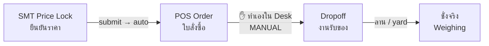

# Scheduling a Drop-off — Office Guide / คู่มือการเปิดงานรับของ

> **Status:** Production
> **Who / ใคร:** `SMT Manager` หรือ `System Manager` — ดูข้อ 1a / `SMT Manager` or `System Manager` — see §1a
> **Where / ที่ไหน:** Desk — `/app/dropoff/new`
> **Last verified:** 2026-08-25 — ทดสอบกับระบบจริง / tested against a live site

นี่คือขั้นตอนที่เชื่อมราคาเข้ากับลาน ถ้าไม่ทำขั้นตอนนี้ รถมาถึงแล้วชั่งไม่ได้
This is the step that connects a price to the yard. Without it, a truck arrives and cannot be weighed.

---

## 1. งานนี้คืออะไร / What this is for

ระบบไม่รับของแบบ "รถมาแล้วค่อยคิดราคา" — ทุกงานต้องมีใบสั่งซื้อรออยู่ก่อน
There are no walk-ins. Every drop-off must be bound to a POS Order **before** the truck is weighed. The Dropoff document is what the yard terminal searches for and loads.

**สำคัญ / Important:** ไม่มีปุ่ม "สร้างงานรับของ" ที่ไหนเลย — ต้องสร้างเองใน Desk
**Nothing creates a Dropoff automatically.** There is no button on the Price Lock or POS Order form, and no API. Someone in the office creates it by hand. This is the one manual link in an otherwise automated chain.

---

## 1a. ใครทำได้ / Who can do this

**บน production (`smt.x-desk.tech`): `SMT Manager` และ `System Manager`**
On production, `SMT Manager` and `System Manager` can create a Dropoff. Verified 2026-08-21.

| Role | Price Lock | Dropoff (production) |
|---|---|---|
| `SMT Manager` | — | ✅ **create = 1** |
| `System Manager` | ✅ | ✅ create = 1 |
| `SMT Accounting Manager` | ✅ create + submit | ❌ create = 0 |
| `SMT Accountant` | ✅ create + submit | ❌ create = 0 |
| `POS Operator` | — | ❌ create = 0 (can edit an existing one) |
| `Production Manager` / `Production Worker` | — | ❌ create = 0 |

### ⚠️ สิทธิ์บน production ไม่ได้เก็บใน git / Production permissions are NOT in version control

สิทธิ์ชุดนี้ตั้งผ่านหน้า Role Permission Manager ซึ่งเขียนลงตาราง `Custom DocPerm` ของฐานข้อมูล production โดยตรง
This permission set was configured through the Role Permission Manager, which writes `Custom DocPerm` rows directly into the production database. `Custom DocPerm` rows **override the doctype's own permissions entirely**.

ผลที่ตามมา / What follows from that:

- บทบาท `SMT Manager`, `Production Manager`, `Production Worker` **มีอยู่แค่บน production** — ไม่มีในโค้ดและไม่มีบนเครื่อง dev
  `SMT Manager`, `Production Manager` and `Production Worker` **exist only on production**. They are not in the repo and not on the dev site `metal`.
- `hooks.py` ส่งออก fixtures แค่ `Custom Field`, `Scale`, `Print Format` — **ไม่รวม `Custom DocPerm` และ `Role`**
  The app's `fixtures` cover `Custom Field`, `Scale` and `Print Format` — **not `Custom DocPerm`, not `Role`**.
- **ถ้าสร้าง site ใหม่ จะเหลือแค่ `System Manager` ที่สร้างงานรับของได้** ออฟฟิศจะทำงานไม่ได้ทันที
  **A fresh install comes up with only `System Manager` able to create a Dropoff**, and the office is locked out on day one.
- เครื่อง dev มีสิทธิ์ไม่เหมือน production — บั๊กเรื่องสิทธิ์ที่ทดสอบบน dev จึงเชื่อไม่ได้
  Dev permissions do not match production, so permission behaviour tested on `metal` does not reflect the real system.

**สิ่งที่ควรทำ / What should happen:** เพิ่ม `Custom DocPerm` และ `Role` เข้า fixtures หรือเขียนสิทธิ์ลงใน doctype JSON เพื่อให้ตามไปกับโค้ด — ยังไม่ได้ทำ ต้องให้เจ้าของระบบตัดสินใจ
Either add `Custom DocPerm` and `Role` to the app's fixtures, or encode the permissions in the doctype JSON so they travel with the code. Not done here — this is an owner's decision, not a documentation fix.

---

## 2. เส้นทางทั้งหมด / The full chain

| ขั้น / Step | ใครทำ / Who | อัตโนมัติไหม / Automatic? |
|---|---|---|
| Price Lock | ออฟฟิศ / office | — |
| POS Order | — | ✅ สร้างเองเมื่อ submit Price Lock / auto-created on submit |
| **Dropoff** | **ออฟฟิศ / office** | ❌ **ต้องทำเอง / manual** |
| ชั่ง / weighing | ลาน / yard | — |

---

## 3. เตรียมก่อนเริ่ม / Before you start

| ต้องมี / You need | หมายเหตุ / Notes |
|---|---|
| Price Lock ที่ submit แล้ว / a submitted Price Lock | POS Order จะถูกสร้างให้อัตโนมัติ — ดู [30 §4](30-settlement.md) / the POS Order appears by itself |
| ทะเบียนรถ / the truck's license plate | บังคับ / required field |
| วันเวลาที่นัด / the scheduled window | บังคับ — เวลาจบต้องหลังเวลาเริ่ม / required; end must be after start |

---

## 4. ขั้นตอน / Walkthrough: schedule a drop-off

**สถานการณ์ / Scenario:** ผู้ขาย `_TEST_ACME` นัดส่ง `ทองแดงปอก` 1,000 กก. พรุ่งนี้เช้า ทะเบียน `70-1234`
Supplier `_TEST_ACME` is delivering 1,000 kg of `ทองแดงปอก` tomorrow morning, plate `70-1234`.

1. **เปิดฟอร์มใหม่ / Open a new Dropoff** — `/app/dropoff/new`

2. **กรอกทะเบียนรถ / Enter the license plate** — `70-1234`
   → บังคับ ถ้าเว้นว่างจะบันทึกไม่ได้ / required; the form will not save without it

3. **ตั้งวันเวลานัด / Set the scheduled window**
   - `Dropoff Scheduled Start` — บังคับ / required
   - `Dropoff Scheduled End` — ต้องหลัง Start / must be later than Start
   → ถ้าตั้งกลับกัน ระบบจะเตือน / reversing them is rejected

4. **ผูกใบสั่งซื้อ / Link the POS Order** — ในตาราง **Linked Orders** เพิ่มแถว แล้วเลือก POS Order ที่ Price Lock สร้างไว้
   In the **Linked Orders** table, add a row and pick the POS Order created by your Price Lock.
   → **ขั้นตอนนี้ห้ามข้าม** ถ้าไม่ผูก ระบบจะขึ้น **"POS Order Required"** ตอนบันทึก
   → **Do not skip this.** Saving without it throws **"POS Order Required"**.

5. **ใส่รายการที่คาดว่าจะได้รับ / Fill Expected Items** — `ทองแดงปอก`, 1,000 กก.
   → ต้องเป็นสินค้าที่มีอยู่ในใบสั่งซื้อที่ผูกไว้ และทุกใบสั่งซื้อต้องมีอย่างน้อย 1 รายการปรากฏที่นี่
   → Every expected item must exist in at least one linked order, **and** every linked order must contribute at least one item. Both directions are checked.

6. **บันทึก / Save**
   → ระบบตั้งชื่อให้เอง เช่น `DO-ACME-260822-1` (รหัสผู้ขาย + วันที่ + ลำดับ)
   → the name is generated: `DO-ACME-260822-1` — supplier short code, date, sequence
   → ผู้ขายถูกเติมให้เองจากใบสั่งซื้อ ไม่ต้องกรอก / the supplier is filled in from the linked orders; you do not type it
   → สถานะเริ่มต้นคือ **Scheduled** / status starts as **Scheduled**

**เสร็จแล้ว / Result:** ลานค้นหา `DO-ACME-260822-1` หรือสแกน QR แล้วเริ่มชั่งได้ทันที
The yard can now find `DO-ACME-260822-1` by search or QR scan and start weighing. See [12 — Drop-off & Containers](12-dropoff-receiving.md).

---

## 5. หลายใบสั่งซื้อในงานเดียว / Walkthrough: several orders, one truck

ถ้ารถคันเดียวส่งของตามใบสั่งซื้อหลายใบ ให้เพิ่มหลายแถวใน Linked Orders
If one truck covers several orders, add several rows to **Linked Orders**.

**ข้อจำกัด / The constraint:** ทุกใบต้องเป็น **ผู้ขายรายเดียวกัน**
All linked orders must belong to the **same supplier**. Mixing suppliers is rejected with *"All orders in a Drop-off must be from the same supplier"* — one truck, one supplier, always.

รายการที่คาดว่าจะได้รับ ให้รวมของจากทุกใบ / Expected Items should cover the union of all linked orders.

---

## 6. ปัญหาที่พบบ่อย / What can go wrong

| อาการ / Symptom | สาเหตุ / Cause | แก้ยังไง / Fix |
|---|---|---|
| **"POS Order Required"** ตอนบันทึก | ไม่ได้ผูกใบสั่งซื้อ / Linked Orders is empty | เพิ่มอย่างน้อย 1 แถว ถ้ายังไม่มีใบสั่งซื้อ ให้ทำ Price Lock ก่อน / add at least one row; if no order exists, create and submit a Price Lock first |
| **"All orders … same supplier"** | ผูกใบสั่งซื้อของคนละผู้ขาย / orders from different suppliers | แยกเป็นคนละงานรับของ / split into separate drop-offs |
| รายการที่คาดไว้ถูกปฏิเสธ / Expected item rejected | สินค้านั้นไม่มีในใบสั่งซื้อที่ผูกไว้ / the item is not on any linked order | ลบรายการนั้น หรือผูกใบสั่งซื้อที่มีสินค้านั้นเพิ่ม / remove it, or link the order that contains it |
| ลานหางานไม่เจอ / The yard cannot find the drop-off | ยังไม่ได้บันทึก หรือค้นผิดเลข / not saved, or wrong number | ตรวจว่าสถานะเป็น `Scheduled` แล้วส่งเลข `DO-…` ให้ลาน / confirm status `Scheduled` and give the yard the `DO-…` number |
| เวลาจบก่อนเวลาเริ่ม / End before start | ตั้งเวลากลับกัน / reversed | แก้ให้ End หลัง Start / make End later than Start |

---

## 7. สรุป / Quick reference

**ช่องบังคับ / Required fields**

| ช่อง / Field | หมายเหตุ / Note |
|---|---|
| `License Plate` | ทะเบียนรถ |
| `Dropoff Scheduled Start` | ต้องมี — ใช้ตั้งชื่อเอกสารด้วย / also determines the document's date |
| `Status` | เริ่มที่ `Scheduled` |
| `Linked Orders` | ≥ 1 แถว ผู้ขายเดียวกัน / at least one row, single supplier |

**สิ่งที่ระบบเติมให้เอง / Filled in for you:** ชื่อเอกสาร, ผู้ขาย, น้ำหนักจริงทั้งหมด, สถานะถัดไป
document name, supplier, all actual weights, and every later status transition.

**อย่าแก้เองหลังลานเริ่มชั่งแล้ว / Do not hand-edit once weighing has started.** ตัวเลขน้ำหนักคำนวณจากถุงที่ชั่งจริง การแก้ในฟอร์มจะถูกเขียนทับ
Weight figures are computed from the bags actually weighed; edits in the form are overwritten on the next save.
