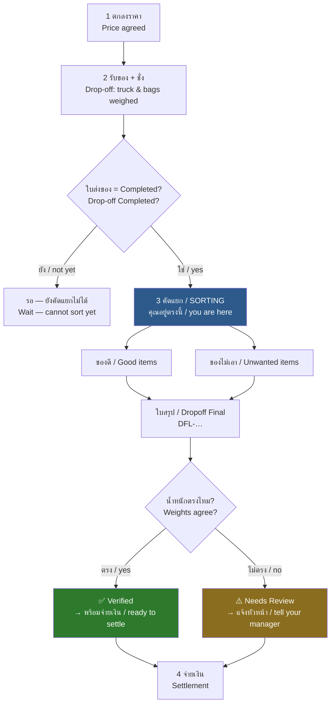

# Production Sorting — Operator Guide / คู่มือผู้ใช้งาน

> **Status:** Production
> **Who / ใคร:** พนักงานคัดแยก (`Production Worker`), หัวหน้าฝ่ายผลิต (`Production Manager`) — *Production Worker, Production Manager*
> **Where / ที่ไหน:** **`/pos/production`** ← ใช้หน้านี้ / use this one
> **Last verified:** 2026-08-21

> ## ⚠️ ใช้ `/pos/production` เท่านั้น / Use `/pos/production` only
>
> ระบบมีหน้าจอคัดแยก **2 หน้า** แต่หน้า **`/production/terminal` กดบันทึกไม่ได้** — กดแล้วขึ้น Error ทุกครั้ง
> There are **two** sorting screens. The one at **`/production/terminal` cannot save** — every save fails with an error.
>
> | หน้าจอ / Screen | ใช้ได้ไหม / Works? |
> |---|---|
> | `/pos/production` (สีส้ม / orange, 3 ช่อง) | ✅ ใช้ได้ / **Use this** |
> | `/production/terminal` (สีน้ำเงิน / blue, 2 ช่อง) | ❌ บันทึกไม่ได้ / cannot save |
>
> ถ้าเปิดจากหน้า `/pos` แล้วกดการ์ด **Production Sorting** จะเข้าหน้าที่ถูกต้องเสมอ
> Entering from `/pos` and clicking the **Production Sorting** card always lands you on the right one.

---

## 1. งานนี้คืออะไร / What this is for

หลังจากรับของเข้าลานและชั่งเสร็จแล้ว เราจะรู้แค่ว่า **ของหนักเท่าไร** แต่ยังไม่รู้ว่า **ของนั้นคืออะไรจริง ๆ**

Receiving tells the yard **how much** arrived. It does not tell it **what actually arrived**. Sorting is where someone opens the bags, looks at the metal, and says so.

งานคัดแยกคือการแยกของที่รับมาออกเป็น 2 กอง แล้วชั่งทีละกอง:

Sorting splits the delivered material into two piles and weighs each:

| กอง / Pile | ความหมาย / Meaning |
|---|---|
| **ของดี / Good** | ของที่ลานเก็บไว้และ **จ่ายเงิน** — kept and **paid for** |
| **ของไม่เอา / Unwanted** | ของที่ลาน **ไม่รับ** และคืนผู้ขาย — refused and **returned to the supplier** |

> **สำคัญมาก / The one rule that matters:**
> ต้องชั่งและบันทึก **ทั้ง 2 กอง** ถึงจะครบ
> **ของดี + ของไม่เอา ต้องเท่ากับน้ำหนักที่รับเข้ามา**
> You must weigh and record **both** piles. **Good + Unwanted must equal the received weight.**
> ถ้าบันทึกแค่ของดี ระบบจะคิดว่าของหายไป และจะขึ้น **Needs Review**
> Recording only the good pile makes the system think material vanished, and it flags **Needs Review**.

---

## 2. ขั้นตอนนี้อยู่ตรงไหน / Where it fits in the flow



**ก่อนหน้า / Before you:** [12 — รับของและชั่งถุง / Drop-off & Containers](12-dropoff-receiving.md)
**หลังจากคุณ / After you:** [30 — ราคาและการจ่ายเงิน / Price Lock & Settlement](30-settlement.md)

---

## 3. เตรียมก่อนเริ่ม / Before you start

**สิ่งที่ต้องมี / You need:**

| | รายการ / Item | หมายเหตุ / Note |
|---|---|---|
| 1 | บัญชีที่มีสิทธิ์ `Production Worker` | ถ้าไม่มี จะขึ้น "Access Denied" / otherwise you get "Access Denied" |
| 2 | ตาชั่งที่ตั้งเป็น **Production** — เช่น `Prod-1`, `Prod-2` | ตาชั่งของ POS หรือตาชั่งรถจะไม่ขึ้นในรายการ / scrap and truck scales do not appear here |
| 3 | สาย USB ต่อตาชั่ง (ถ้าจะอ่านน้ำหนักอัตโนมัติ) | ใช้ Chrome หรือ Edge เท่านั้น / Chrome or Edge only |
| 4 | **เลขใบส่งของ (Drop-off ID)** ที่สถานะเป็น **Completed** | เช่น `DO-260821-00014` |

**ตรวจก่อน / Check first:**

- ใบส่งของต้องเป็น **Completed** เท่านั้น — ถ้ายังเป็น *In Progress* แปลว่ายังชั่งไม่เสร็จ ระบบจะไม่ให้คัดแยก
  The drop-off must be **Completed**. If it is still *In Progress*, weighing is not finished and the system will refuse.
- คุณเปิดกะได้ **ครั้งละ 1 กะ** เท่านั้น ถ้ามีกะค้างอยู่ ต้องปิดก่อน
  You may hold **one open session at a time**. Close the old one first.
- **กะจะปิดเองถ้าไม่มีการใช้งาน 10 นาที** — ถ้าหายไปนาน กลับมาต้องเปิดกะใหม่
  **A session auto-closes after 10 minutes idle.** Come back late and you will need a new one.

---

## 4. หน้าจอ / The screen

เปิด `/pos` → กดการ์ด **🔧 Production Sorting** → เข้าหน้า `/pos/production`

Open `/pos` → click the **🔧 Production Sorting** card → you land on `/pos/production`.

**ก่อนเปิดกะ / Before a session exists** — หน้าจอจะแสดงรายการตาชั่งให้เลือกเท่านั้น / the screen shows only a scale picker.

**หลังเปิดกะ / Once a session is open** — หน้าจอแบ่งเป็น 3 ช่อง / the screen is three panels:

```
┌────────────── แถบบน / Header ─────────────────────────────────────┐
│ ← กลับ  X-DESK  [PSORT-SES-260821-00003]  ชื่อคุณ  ⚖ Prod-1 ●    │
│                🔧 Production Sorting            [EN] [Close Session]│
└───────────────────────────────────────────────────────────────────┘
┌── ซ้าย / LEFT ────┬── กลาง / MIDDLE ─────────┬── ขวา / RIGHT ─────┐
│ เลือกใบส่งของ     │ ชั่งของ                  │ สรุปการคัดแยก      │
│ Select Dropoff    │ Weigh Items              │ Current Sorting    │
│                   │                          │                    │
│ [ค้นหา…        ]  │      12.480 kg           │ Good:     0.000 kg │
│                   │   ← น้ำหนักตัวใหญ่       │ Unwanted: 0.000 kg │
│ DO-260821-00014   │                          │ Total:    0.000 kg │
│ ผู้ขาย: …          │ [ 12.480 ] kg [⚖ Scale]  │ Variance: …        │
│ น้ำหนัก: 660.50   │                          │ ─────────────────  │
│                   │ Selected: ทองแดงปอก      │ (รายการที่เพิ่ม)   │
│ รายการ / Items:   │                          │ (items you added)  │
│  ทองแดงปอก 400.0 │ ┌─ ของดี ─┬─ ของไม่เอา ─┐│                    │
│  ทองเหลือง 260.5 │ │ Good ✔  │  Unwanted   ││                    │
│                   │ └─────────┴─────────────┘│                    │
│ [ ล้าง / Clear ]  │ [From Dropoff][All][…]   │                    │
│                   │ ┌──────┬──────┬──────┐   │ ┌────────────────┐ │
│                   │ │ทองแดง│ทองแดง│ทอง   │   │ │ Submit Sorting │ │
│                   │ │ ปอก  │ เล็ก │เหลือง│   │ └────────────────┘ │
│                   │ └──────┴──────┴──────┘   │                    │
│                   │ Remarks: [           ]   │                    │
│                   │ [ ✚ Add Item ]           │                    │
└───────────────────┴──────────────────────────┴────────────────────┘
```

| ส่วน / Part | ทำอะไร / What it does |
|---|---|
| **⚖ Prod-1 ●** | จุดสีเขียว = ตาชั่งต่ออยู่ · สีแดง = ยังไม่ต่อ / green dot = scale connected, red = not |
| **ซ้าย / LEFT** | ค้นหาและล็อกใบส่งของ · แสดงรายการที่ผู้ขายส่งมาเป็นตัวเทียบ / find and lock the drop-off; shows what was received as a reference |
| **กลาง / MIDDLE** | น้ำหนักตัวใหญ่ · แท็บ **ของดี / ของไม่เอา** · ปุ่มรายการสินค้า · ปุ่ม **Add Item** |
| **ขวา / RIGHT** | ยอดรวมสด · รายการที่เพิ่มแล้ว · ปุ่ม **Submit Sorting** |
| **แท็บ From Dropoff** | กรองให้เหลือเฉพาะรายการที่มาในใบส่งของนี้ — กดอันนี้ก่อนเสมอ / filters to only what came in this drop-off — start here |

> **ตารางสินค้าสีเทาจาง = ยังไม่ได้เลือกใบส่งของ**
> **A greyed-out item grid means no drop-off is selected yet.** เลือกใบส่งของก่อน แล้วปุ่มจะกดได้ / pick one and the buttons wake up.

---

## 5. คัดแยกงานที่รับเข้ามา / Walkthrough: sort a completed drop-off

**ตัวอย่าง / Example:** ใบส่งของ `DO-260821-00014` — น้ำหนักรับเข้า **660.50 kg** (ทองแดงปอก 400.00 kg, ทองเหลือง 260.50 kg)

---

**ขั้นที่ 1 — เปิดกะและเลือกตาชั่ง / Open a session and pick a scale**

1. เปิด `/pos` → กดการ์ด **🔧 Production Sorting**
2. หน้าจอขึ้น **Start Production Session** พร้อมรายการตาชั่ง
3. กด **⚖ Prod-1**

**บนหน้าจอ / On screen:** ขึ้นข้อความเขียว *"Session started"* → หน้าจอโหลดใหม่ → แถบบนขึ้นเลขกะ เช่น `PSORT-SES-260821-00003`
A green *"Session started"* toast, the page reloads, and the header shows your session number.

---

**ขั้นที่ 2 — ต่อตาชั่ง / Connect the scale**  *(ข้ามได้ถ้าจะพิมพ์น้ำหนักเอง / skip if entering weights by hand)*

1. กดที่ป้าย **⚖ Prod-1** บนแถบบน
2. เลือก **🔌 Connect**
3. Chrome จะถามว่าจะใช้พอร์ตไหน → เลือกพอร์ต USB ของตาชั่ง → **Connect**

**บนหน้าจอ / On screen:** จุดข้างชื่อตาชั่งเปลี่ยนเป็น **สีเขียว** และตัวเลขน้ำหนักตัวใหญ่เริ่มขยับตามของบนตาชั่ง
The dot turns **green** and the big number starts tracking the scale.

---

**ขั้นที่ 3 — เลือกใบส่งของ / Pick the drop-off**

1. พิมพ์ `DO-260821-00014` ลงช่องค้นหาช่องซ้าย
   *(พิมพ์ทะเบียนรถหรือชื่อผู้ขายก็ได้ / a plate number or supplier name also works — ต้องอย่างน้อย 2 ตัวอักษร / minimum 2 characters)*
2. กดผลลัพธ์ที่ต้องการ

**บนหน้าจอ / On screen:**

```
Dropoff ID:    DO-260821-00014
Supplier:      บริษัท … จำกัด
Total Weight:  660.5 kg

Items:
  ทองแดงปอก        400.0 kg
  ทองเหลือง        260.5 kg
```

พร้อมกันนั้น ตารางสินค้าตรงกลางจะสว่างขึ้น และแท็บ **From Dropoff** จะโผล่มาและถูกเลือกอัตโนมัติ
The item grid lights up, and a **From Dropoff** tab appears and is auto-selected.

> รายการใต้ *Items* คือ **ของที่ผู้ขายส่งมา** ไว้ใช้เทียบเท่านั้น ไม่ใช่ผลการคัดแยก
> The list under *Items* is **what was received** — a reference, not your result.

---

**ขั้นที่ 4 — ตรวจว่าอยู่แท็บ "ของดี" / Confirm you are on the Good tab**

ดูตรงกลาง — แท็บซ้าย **Good Items (Keep & Pay)** ต้องเป็นสีเข้ม (active)
Check the middle panel — the left tab **Good Items (Keep & Pay)** must be the highlighted one.

---

**ขั้นที่ 5 — ชั่งและเพิ่มรายการแรก / Weigh and add the first item**

1. เอา **ทองแดงปอก** ที่คัดแล้วขึ้นตาชั่ง
2. รอตัวเลขนิ่ง — เช่น **385.00**
   *(ไม่มีตาชั่ง? พิมพ์ `385` ลงช่อง / no scale? type `385` into the input)*
3. กดปุ่มสินค้า **ทองแดงปอก** ในตาราง
   → บรรทัด *Selected:* เปลี่ยนเป็น `ทองแดงปอก`
   → ปุ่ม **✚ Add Item** เปลี่ยนจากสีเทาเป็นกดได้
4. *(ถ้าต้องการ)* พิมพ์หมายเหตุในช่อง **Remarks** เช่น `ปนสายไฟเล็กน้อย`
5. กด **✚ Add Item**

**บนหน้าจอ / On screen:** ช่องขวาขึ้น

```
Good Items:
  ทองแดงปอก              385.000 Kg   [x]

Good:      385.000 kg
Unwanted:    0.000 kg
Total:     385.000 kg
Variance:  -275.500 kg (-41.71%)
```

น้ำหนักตัวใหญ่กลับเป็น `0.000` และปุ่มสินค้าถูกยกเลิกการเลือก — พร้อมสำหรับรายการถัดไป
The big number resets to `0.000` and the item deselects, ready for the next one.

> **Variance ยังแดงอยู่ ไม่ต้องตกใจ** — เพราะยังชั่งไม่ครบ ตัวเลขจะเข้าที่เมื่อบันทึกครบทุกกอง
> **Ignore the variance for now.** It only means you have not finished. It closes as you add the rest.

---

**ขั้นที่ 6 — ทำซ้ำจนครบทุกเกรด / Repeat for every grade**

ทำขั้นที่ 5 ซ้ำสำหรับของดีทุกเกรด — Repeat step 5 for each good grade:

| เกรด / Grade | น้ำหนัก / Weight |
|---|---|
| ทองแดงปอก | 385.000 kg |
| ทองแดงเล็ก | 12.000 kg |
| ทองเหลือง | 255.500 kg |
| **รวมของดี / Good total** | **652.500 kg** |

> เกรดที่ผู้ขายไม่ได้แจ้งมาก็เพิ่มได้ — กดแท็บ **All** เพื่อดูรายการทั้งหมด
> You may add grades the supplier never declared — click the **All** tab to see everything. นี่คือประเด็นของการคัดแยก: ของที่ส่งมาว่า "ทองแดงปอก" อาจกลายเป็นสองเกรดหลังคัดจริง / that is the point of sorting: one declared grade often becomes two real ones.

ตอนนี้ยังเหลือ **660.50 − 652.50 = 8.00 kg** → ไปขั้นตอนต่อไป
That leaves **8.00 kg** unaccounted → continue to the next section.

---

## 6. ของที่ไม่ต้องการ / Walkthrough: record unwanted material

ของที่ลานไม่รับ **ต้องชั่งและบันทึกด้วย** ไม่ใช่ทิ้งเฉย ๆ เพราะมันคือส่วนที่อธิบายว่าน้ำหนักที่หายไปนั้นไปไหน

Refused material **must still be weighed and recorded**. It is what accounts for the gap.

---

**ขั้นที่ 1 — สลับไปแท็บของไม่เอา / Switch to the Unwanted tab**

กดแท็บ **Unwanted Items (Return)** ตรงกลาง

**บนหน้าจอ / On screen:** แท็บขวาเปลี่ยนเป็นสีเข้ม (active) — หน้าจอส่วนอื่นเหมือนเดิม
The right tab becomes active. Nothing else changes.

> **ตรวจแท็บทุกครั้งก่อนกด Add Item** — หน้าจอไม่มีอย่างอื่นบอกว่าคุณอยู่แท็บไหน ถ้าเผลอ ของไม่เอาจะกลายเป็นของที่ต้องจ่ายเงิน
> **Check the tab before every Add Item.** Nothing else on screen tells you which pile you are filling — get it wrong and the yard pays for scrap it refused.

---

**ขั้นที่ 2 — ชั่งของไม่เอาและเพิ่ม / Weigh and add**

1. เอากองที่ไม่รับขึ้นตาชั่ง — เช่น **8.00 kg**
2. กดปุ่มสินค้าที่ใกล้เคียงที่สุด — เช่น **ทองเหลือง**
3. พิมพ์เหตุผลลงช่อง **Remarks** เช่น `ปนดินและสนิม`
4. กด **✚ Add Item**

**บนหน้าจอ / On screen:**

```
Good Items:
  ทองแดงปอก              385.000 Kg   [x]
  ทองแดงเล็ก              12.000 Kg   [x]
  ทองเหลือง              255.500 Kg   [x]
Unwanted:
  ทองเหลือง                8.000 Kg   [x]

Good:      652.500 kg
Unwanted:    8.000 kg
Total:     660.500 kg
Variance:    0.000 kg (0.00%)
```

**Variance เป็น 0.000 kg = ครบแล้ว** / **Variance at 0.000 kg means everything is accounted for.**

---

> ### ⚠️ ช่องเหตุผลการคืน / About the return reason
>
> ในระบบมีช่อง **เหตุผลการคืน / Return Reason** (Contamination / Wrong Material / Packaging / Dirt-Debris / Other) แต่ **หน้าจอนี้ไม่มีช่องให้เลือก** ทุกรายการจึงถูกบันทึกเป็น **"Other"** และพิมพ์ออกมาเป็น "Other" บนใบคัดแยก
>
> The system has a **Return Reason** field, but **this screen has no control for it**. Every unwanted row is saved as **"Other"** and prints as "Other".
>
> **ทางแก้ตอนนี้ / Workaround:** พิมพ์เหตุผลลงช่อง **Remarks** ทุกครั้ง / always type the reason into **Remarks**. ถ้าจำเป็นต้องระบุเหตุผลให้ถูกต้อง ให้หัวหน้าแก้ในหน้า Desk ภายหลัง / a manager can correct it on the desk form afterwards.

---

## 7. น้ำหนักไม่ตรง / Walkthrough: variance over threshold

**เกณฑ์ที่ระบบใช้จริง = 0.1%** ซึ่ง **แคบมาก** / **The live threshold is 0.1%** — which is very tight.

| น้ำหนักรับเข้า / Received | คลาดเคลื่อนได้ไม่เกิน / Tolerance at 0.1% |
|---|---|
| 100.00 kg | 0.10 kg |
| 660.50 kg | **0.66 kg** |
| 1,000.00 kg | 1.00 kg |

เกินกว่านี้ = ระบบตั้งเป็น **Needs Review** / Beyond that the record is set to **Needs Review**.

---

**ตัวอย่าง / Example:** คัดครบแล้วได้รวม **655.00 kg** จากที่รับมา **660.50 kg** → ขาด **5.50 kg** (0.83%) → เกิน 0.66 kg

---

**ขั้นที่ 1 — ดูช่องขวาก่อนกด Submit / Read the right panel before submitting**

```
Total:     655.000 kg
Variance:   -5.500 kg (-0.83%)
```

**ตัวเลขติดลบ = ชั่งได้น้อยกว่าที่รับมา / A negative number means you weighed less than arrived.**

---

**ขั้นที่ 2 — หาสาเหตุก่อน อย่าเพิ่งกด Submit / Find the cause first**

| สาเหตุที่พบบ่อย / Common cause | ตรวจอย่างไร / How to check |
|---|---|
| ลืมชั่งกองที่ไม่เอา | ดูรายการฝั่งขวา มี *Unwanted* ไหม / is there an Unwanted group at all? |
| เผลออยู่แท็บผิด | ยอด Good สูงผิดปกติ / does Good look too high? |
| ยังมีถุงไม่ได้เปิด | เดินกลับไปดูที่กอง / walk back and look |
| กดเพิ่มรายการซ้ำ | มีบรรทัดซ้ำในรายการไหม / duplicate lines in the list? — กด **[x]** ลบได้ / press **[x]** to remove |
| น้ำ ดิน ที่ระเหย/ร่วงหาย | ของแบบนี้หายจริง — ต้องให้หัวหน้ารับทราบ / genuine loss — escalate |

ถ้าเป็นข้อ 1–4 ให้แก้แล้วชั่งเพิ่ม ตัวเลข Variance จะขยับทันที
For causes 1–4, fix it and add the missing rows — the variance updates live.

---

**ขั้นที่ 3 — ถ้าน้ำหนักหายจริง ให้บันทึกและแจ้ง / If the loss is real, record it and escalate**

1. ตรวจว่าบันทึกครบทุกกองแล้ว
2. กด **Submit Sorting** ตามปกติ — ระบบจะรับ **แต่ตั้งเป็น Needs Review**
3. **แจ้งหัวหน้าฝ่ายผลิตพร้อมเลข `DFL-…`** — Tell your Production Manager, with the `DFL-…` number.

> ระบบ **ไม่ได้ห้าม** คุณบันทึก และ **ไม่มีปุ่มอนุมัติในหน้าจอนี้** งานจะค้างสถานะ **Needs Review** จนกว่าหัวหน้าจะจัดการในหน้า Desk
> The system does **not block** you, and there is **no approve button on this screen**. It sits at **Needs Review** until a manager handles it on the desk.

---

## 8. ปิดงานและพิมพ์ / Walkthrough: complete & print

**ขั้นที่ 1 — ตรวจครั้งสุดท้าย / Final check**

| ตรวจ / Check | ควรเป็น / Should read |
|---|---|
| ยอด Good | ตรงกับกองของดีที่ชั่ง |
| ยอด Unwanted | ตรงกับกองที่ไม่รับ |
| Total | เท่ากับ Total Weight ของใบส่งของ |
| Variance | ใกล้ `0.000 kg` มากที่สุด |

---

**ขั้นที่ 2 — กด Submit Sorting**

1. กด **Submit Sorting** ปุ่มใหญ่ช่องขวา
2. ขึ้นกล่องยืนยัน / a confirmation box appears:

```
Submit sorting for DO-260821-00014?
Good Items: 3
Unwanted: 1
```

3. กด **Yes**

**บนหน้าจอ / On screen:** ขึ้นข้อความเขียว *"Sorting submitted: SORT-260821-00007"*
จากนั้นหน้าจอ **ล้างเอง** — ช่องค้นหาว่าง รายการหายหมด พร้อมรับงานถัดไป
A green *"Sorting submitted: SORT-260821-00007"* toast, then the screen **clears itself** and is ready for the next drop-off.

> **จดเลข `SORT-…` ไว้** — หน้าจอนี้ไม่มีที่ให้ย้อนดู และ **แก้ไขไม่ได้แล้ว**
> **Write the `SORT-…` number down.** This screen has no history view, and the record **can no longer be edited**.
>
> บันทึกผิด? ต้องให้ **หัวหน้าฝ่ายผลิต** ยกเลิก (Cancel) ในหน้า Desk แล้วคัดแยกใหม่ พนักงานทั่วไปยกเลิกเองไม่ได้
> Recorded something wrong? A **Production Manager** must Cancel it on the desk, then you sort again. Workers cannot cancel.

---

**ขั้นที่ 3 — ดูผลการตรวจสอบ / See the verification result**

การกด Submit สร้าง **ใบสรุป / Dropoff Final** ให้อัตโนมัติ (`DFL-260821-00007`) — นี่คือที่เก็บผล **Verified / Needs Review**
Submitting automatically creates a **Dropoff Final** (`DFL-260821-00007`). That is where the **Verified / Needs Review** result lives.

1. เปิดหน้า Desk → พิมพ์ `Dropoff Final` ในช่องค้นหา
2. เปิดใบที่ตรงกับใบส่งของของคุณ

**บนหน้าจอ / On screen:**

| สถานะ / Status | แปลว่า / Means | ทำอะไรต่อ / Do what |
|---|---|---|
| **Verified** (`Unsettled`) | น้ำหนักตรงในเกณฑ์ / weights agree | เสร็จ — ส่งต่อฝ่ายบัญชี / done, accounting takes over |
| **Needs Review** (`In Progress`) | เกินเกณฑ์ / over threshold | แจ้งหัวหน้า / escalate to your manager |
| **Pending** (`Draft`) | ยังไม่มีรายการคัดแยก / no sorting recorded yet | ตรวจว่ากด Submit สำเร็จจริงไหม / check your submit actually went through |

> ถ้าคัดแยกใบส่งของเดียวกัน **หลายรอบ** (คนละกะ คนละคน) ระบบจะ **รวมทุกรอบ** เข้าใบสรุปเดียวกัน และคำนวณ Variance จากยอดรวมทั้งหมด
> If the same drop-off is sorted in **several passes**, the system **adds them all** into the one Dropoff Final and re-checks the variance against the combined total.

---

**ขั้นที่ 4 — พิมพ์ใบคัดแยก / Print the sorting report**

**หน้าจอคัดแยกไม่มีปุ่มพิมพ์** ต้องพิมพ์จากหน้า Desk ของ **Dropoff Final**
**Neither sorting screen has a print button.** You print from the **Dropoff Final** desk form.

1. เปิด `DFL-260821-00007`
2. กด **🖨 Print** (หรือ Ctrl+P)
3. ฟอร์แมต **`ใบคัดแยก`** ถูกเลือกไว้ให้แล้ว / the **`ใบคัดแยก`** format is already selected
4. กด **Print**

**สิ่งที่พิมพ์ออกมา / What comes out** — A4 สองภาษา / bilingual A4:

| ส่วน / Section | เนื้อหา / Contents |
|---|---|
| หัวกระดาษ | `ใบคัดแยก / Sorting Report` + เลข `DFL-…` + ป้ายสถานะ |
| ข้อมูลทั่วไป | เลขใบส่งของ · ผู้ขาย · ทะเบียนรถ · **สถานะตรวจสอบ** |
| สินค้าดี / Good Items | ทุกเกรด + น้ำหนัก + ยอดรวม |
| ของที่ไม่ต้องการ / Unwanted | ทุกเกรด + **เหตุผล** + น้ำหนัก + ยอดรวม |
| สรุปค่าเบี่ยงเบน | น้ำหนักรับเข้า · น้ำหนักตรวจสอบรวม · ส่วนต่าง kg และ % · **✓ ผ่าน / ✗ ไม่ผ่าน** |
| ลายเซ็น | **ผู้คัดแยก** และ **ผู้ตรวจสอบ** |

> ชื่อสินค้าพิมพ์เป็น **ภาษาไทยตามต้นฉบับเสมอ** — `ทองแดงปอก` ยังเป็น `ทองแดงปอก` ในทุกภาษา ไม่มีการแปล
> Item names always print **exactly as they are** — `ทองแดงปอก` stays `ทองแดงปอก` in every language. Item names are identifiers, never translated.

---

**ขั้นที่ 5 — ปิดกะ / Close your session**

1. กลับไปหน้า `/pos/production`
2. กด **Close Session** มุมขวาบน
3. กด **Yes**

**บนหน้าจอ / On screen:** ขึ้น *"Session closed successfully"* แล้วกลับหน้าเริ่ม
ตาชั่งถูกปลดล็อกให้คนถัดไปใช้ได้ / the scale is released for the next operator.

> ลืมปิด? ระบบปิดให้เองหลังไม่มีการใช้งาน **10 นาที** แต่ควรปิดเองทุกครั้ง
> Forgot? The system closes it after **10 minutes** idle — but close it yourself anyway.

---

## 9. ปัญหาที่พบบ่อย / What can go wrong

| อาการ / Symptom | สาเหตุ / Cause | วิธีแก้ / Fix |
|---|---|---|
| **"Access Denied"** ตอนเปิดหน้า | ไม่มีสิทธิ์ `Production Worker` | แจ้งผู้ดูแลระบบเพิ่มสิทธิ์ / ask an admin to add the role |
| **กด Save แล้ว Error ทุกครั้ง** | คุณอยู่หน้า **`/production/terminal`** (สีน้ำเงิน) ซึ่งบันทึกไม่ได้ | ไปที่ **`/pos/production`** แทน / go to `/pos/production` |
| **"You already have an open session"** | มีกะค้างอยู่ | ปิดกะเดิมก่อน หรือรอ 10 นาที / close it, or wait 10 minutes |
| **ค้นหาแล้วไม่เจอใบส่งของ** | ใบส่งของยังไม่เป็น *Completed* | ค้นหาเจอเฉพาะ **Completed** เท่านั้น — ให้ฝ่ายรับของปิดงานก่อน / only Completed drop-offs appear |
| **พิมพ์ไปแล้วไม่มีอะไรขึ้น** | พิมพ์ไม่ถึง 2 ตัวอักษร | พิมพ์อย่างน้อย 2 ตัว / type at least 2 characters |
| **ตารางสินค้าเทาจาง กดไม่ได้** | ยังไม่ได้เลือกใบส่งของ | เลือกใบส่งของก่อน / pick a drop-off first |
| **ปุ่ม ✚ Add Item กดไม่ได้** | ยังไม่ได้เลือกสินค้า หรือน้ำหนักเป็น 0 | ต้องมี **ทั้งสอง**: สินค้าที่เลือก **และ** น้ำหนัก > 0 / you need both |
| **หาเกรดที่ต้องการไม่เจอในตาราง** | ตารางดึงจาก POS Profile ไม่ใช่ตั้งค่าคัดแยก | กดแท็บ **All** ก่อน · ถ้ายังไม่มี ให้ System Manager เพิ่มเข้า POS Profile Scrap / click **All**; if still missing, a System Manager must add it to the POS Profile Scrap |
| **ตาชั่งต่อไม่ได้** | ใช้เบราว์เซอร์ผิด หรือคนอื่นถือพอร์ตอยู่ | ใช้ Chrome/Edge · ปิดแท็บอื่นที่ต่อตาชั่ง · กด **🔄 Reconnect** |
| **ตัวเลขน้ำหนักไม่ขยับ** | ตาชั่งหลุด (จุดเป็นสีแดง) | กด **🔄 Reconnect** · หรือพิมพ์น้ำหนักเอง / or type the weight in |
| **Variance ติดลบมาก** | ยังชั่งไม่ครบ | ชั่งกองที่เหลือ โดยเฉพาะ **ของไม่เอา** / weigh what is left, especially the Unwanted pile |
| **Variance เป็นบวก** | ชั่งได้มากกว่าที่รับเข้า — น่าจะกดซ้ำ | ตรวจรายการซ้ำ กด **[x]** ลบ / look for duplicate lines and remove them |
| **บันทึกของไม่เอาผิดเป็นของดี** | เผลออยู่แท็บ Good | ยังไม่กด Submit → กด **[x]** ลบแล้วทำใหม่ · กด Submit ไปแล้ว → **ต้องให้หัวหน้ายกเลิก** / not yet submitted, delete and redo; already submitted, a manager must cancel it |
| **เหตุผลการคืนขึ้นเป็น "Other" ทุกอัน** | หน้าจอไม่มีช่องเลือกเหตุผล (ข้อจำกัดที่ทราบแล้ว) | เขียนเหตุผลใน **Remarks** ให้หัวหน้าแก้ในหน้า Desk / write it in Remarks; a manager corrects it on the desk |
| **สถานะค้างที่ Needs Review** | ส่วนต่างเกิน 0.1% | ไม่มีปุ่มอนุมัติในหน้าจอนี้ — แจ้งหัวหน้าพร้อมเลข `DFL-…` / no approve button here; escalate with the `DFL-…` number |
| **สถานะเป็น Pending ทั้งที่กด Submit แล้ว** | ใบสรุปยังไม่มีรายการ — Submit อาจไม่สำเร็จ | ตรวจ list ของ Production Sorting ว่ามีเลข `SORT-…` ของคุณจริง / check the Production Sorting list for your `SORT-…` |
| **เปิด Dropoff จากหน้า Desk ไม่ได้** | `Production Worker` ไม่มีสิทธิ์อ่าน Dropoff | ปกติ — ใช้ข้อมูลในหน้าจอคัดแยกแทน หรือขอให้หัวหน้าเปิดให้ / expected; use the terminal, or ask a manager |
| **กะหายไประหว่างพัก** | ปิดอัตโนมัติหลังไม่ใช้งาน 10 นาที | เปิดกะใหม่ — งานที่ Submit แล้วไม่หาย / open a new one; anything already submitted is safe |

---

## 10. สรุป / Quick reference

**ที่อยู่ / Where**

| | |
|---|---|
| ✅ หน้าจอคัดแยก / Sorting screen | **`/pos/production`** |
| ❌ อย่าใช้ / Do not use | `/production/terminal`, `/production` |
| ผลการตรวจสอบ + พิมพ์ / Result & print | Desk → **Dropoff Final** → `ใบคัดแยก` |

**ลำดับงาน 8 ขั้น / The eight steps**

```
1. /pos → 🔧 Production Sorting
2. เลือกตาชั่ง Prod-1     → เปิดกะ / session opens
3. ⚖ badge → 🔌 Connect   → จุดเขียว / green dot
4. ค้นหาใบส่งของ          → ตารางสินค้าสว่าง / grid wakes up
5. แท็บ Good   → ชั่ง → เลือกสินค้า → ✚ Add Item   (ทำซ้ำ / repeat)
6. แท็บ Unwanted → ชั่ง → เลือกสินค้า → ✚ Add Item  (ทำซ้ำ / repeat)
7. Variance ≈ 0.000 kg   → Submit Sorting → จด SORT-…
8. Close Session
```

**เลขเอกสาร / Document numbers**

| รูปแบบ / Format | คืออะไร / What it is |
|---|---|
| `PSORT-SES-260821-00003` | กะคัดแยก / your sorting session |
| `SORT-260821-00007` | ใบคัดแยก 1 รอบ / one sorting pass |
| `DFL-260821-00007` | ใบสรุป — ที่เก็บผล Verified/Needs Review และที่ใช้พิมพ์ / the summary; holds the result and prints |
| `DO-260821-00014` | ใบส่งของ / the drop-off you are sorting |

**ตัวเลขที่ต้องจำ / Numbers to remember**

| | |
|---|---|
| เกณฑ์ส่วนต่าง / Variance threshold | **0.1%** (660 kg → ±0.66 kg) |
| กะปิดอัตโนมัติ / Session auto-close | **10 นาที / minutes** idle |
| ค้นหาต้องพิมพ์อย่างน้อย / Minimum search | **2 ตัวอักษร / characters** |
| กะเปิดพร้อมกันได้ / Sessions per person | **1** |

**กฎที่ห้ามลืม / Rules you cannot forget**

1. **ของดี + ของไม่เอา = น้ำหนักที่รับเข้ามา** — ไม่งั้นขึ้น Needs Review / otherwise it flags.
2. **ตรวจแท็บทุกครั้งก่อนกด Add Item** — Good กับ Unwanted หน้าตาเหมือนกันมาก / they look identical.
3. **กด Submit แล้วแก้ไม่ได้** — ต้องให้หัวหน้ายกเลิก / only a manager can undo it.
4. **จดเลข `SORT-…` และ `DFL-…`** — หน้าจอล้างตัวเองทันที / the screen clears itself immediately.
5. **เหตุผลการคืน ให้เขียนใน Remarks** — จนกว่าช่องเลือกเหตุผลจะถูกเพิ่มเข้ามา / until the reason picker is added.
6. **ชื่อสินค้าเป็นภาษาไทยเสมอ ไม่แปล** — `ทองแดงปอก` คือ `ทองแดงปอก` / item names are never translated.

**ต้องการความช่วยเหลือ / Need more**

- [12 — รับของและชั่งถุง / Drop-off & Containers](12-dropoff-receiving.md)
- [30 — ราคาและการจ่ายเงิน / Price Lock & Settlement](30-settlement.md)
- [90 — แก้ปัญหา / Troubleshooting](90-troubleshooting.md)
- ผู้ดูแลระบบ / For admins: [admin/20-production-sorting.md](../admin/20-production-sorting.md)
