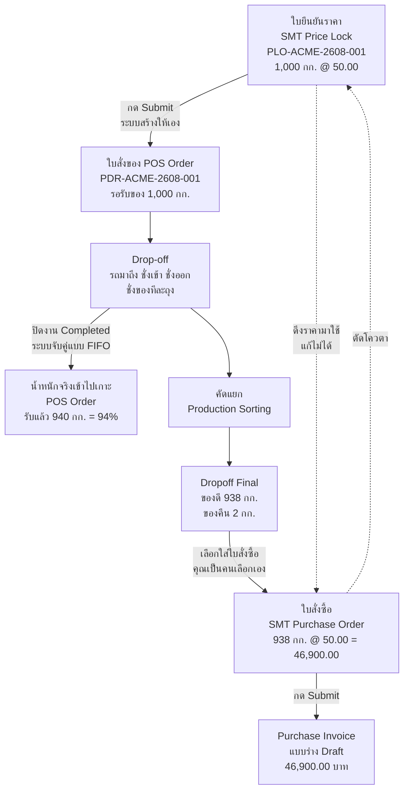

# Price Lock & Settlement — User Guide / คู่มือผู้ใช้งาน

> **Status:** Production — ใช้งานจริง แต่มีข้อควรระวัง 3 ข้อในหัวข้อ 10 / in daily use, with three known traps listed in §10
> **Who / ใคร:** SMT Accountant, SMT Accounting Manager, System Manager
> **Where / ที่ไหน:** Frappe desk เท่านั้น ไม่มีหน้าจอ terminal / desk only, there is no touch terminal for this
> **Desk paths:** `/app/smt-accounting` (workspace) · `/app/smt-price-lock` · `/app/smt-purchase-order` · `/app/dropoff-final`
> **Last verified:** 2026-08-21 against `feature/container-redesign`

---

## 0. คำเตือนเรื่องชื่อเอกสาร / A naming trap, read this first

ระบบนี้มีเอกสาร 2 ใบที่ชื่อคล้ายกันมาก และ **ทำคนละหน้าที่ คนละเวลา**
Two documents in this system have confusingly similar names and do **completely different jobs at opposite ends of the process**.

| เอกสาร / DocType | ชื่อบนกระดาษ / Printed as | คืออะไร / What it actually is | เมื่อไหร่ / When |
|---|---|---|---|
| **SMT Price Lock** | **ใบยืนยันราคา** | ราคาที่ตกลงกับผู้ขาย — สัญญาว่าจะซื้อกี่กิโล ราคาเท่าไหร่ / the agreed price. A promise to buy N kg at X baht | **ก่อน** ของมาถึง / **before** anything is delivered |
| **SMT Purchase Order** | **ใบสั่งซื้อ** | เอกสารสรุปยอดจ่ายเงิน / the settlement document that closes the money | **หลัง** ชั่ง คัดแยก เสร็จแล้ว / **after** weighing and sorting are done |

ในโค้ดของระบบ `SMT Price Lock` ยังถูกเรียกว่า "PO" และ `SMT Purchase Order` ถูกเรียกว่า "PO Final" อยู่ — เป็นชื่อเก่าที่ยังไม่ได้เปลี่ยน ถ้าเจอข้อความ error ที่พูดถึง "PO" ให้เข้าใจว่าหมายถึง **ใบยืนยันราคา**
Internally the code still calls `SMT Price Lock` "the PO" and `SMT Purchase Order` "the PO Final" — leftover names from an earlier design. **If an error message mentions "PO", it means the Price Lock (ใบยืนยันราคา).**

---

## 1. งานนี้คืออะไร / What this is for

งานนี้คือฝั่ง **เงิน** ของลาน ไม่ใช่ฝั่งชั่ง คนที่ทำงานหน้านี้นั่งอยู่ในออฟฟิศ ไม่ได้อยู่ที่ตาชั่ง
This is the **money** side of the yard, not the weighing side. You work here from a desk, not from a terminal next to a scale.

หน้าที่มี 3 อย่าง:
Three jobs:

1. **ล็อกราคา / Lock a price** — ผู้ขายโทรมาถามราคา คุณตกลงว่าจะรับ 1,000 กก. ที่ 50 บาท/กก. แล้วออก **ใบยืนยันราคา** ราคานั้นถูกตรึงไว้ ตลาดขึ้นลงยังไงก็ไม่กระทบ
   A supplier calls, you agree 1,000 kg at 50 THB/kg, you issue a **ใบยืนยันราคา**. That rate is now frozen regardless of what the market does.
2. **ติดตามว่าส่งมาครบไหม / Track delivery against that lock** — ระบบจับคู่ของที่ชั่งได้จริงเข้ากับใบยืนยันราคาให้อัตโนมัติ คุณแค่ดูว่าเหลือค้างเท่าไหร่
   The system matches weighed material back to the lock automatically. You watch the remaining balance.
3. **สรุปยอดจ่าย / Settle the money** — เมื่อคัดแยกเสร็จ คุณออก **ใบสั่งซื้อ** ระบุว่าของที่รับจริงกิโลไหนไปกินโควตาของใบยืนยันราคาใบไหน แล้วระบบสร้างใบแจ้งหนี้ (Purchase Invoice) แบบร่างให้
   Once sorting is done you raise a **ใบสั่งซื้อ** saying which accepted kilos consume which price lock, and the system drafts a Purchase Invoice for you.

**เมื่อไหร่ที่ใช้ / When you use it:** ทุกครั้งที่ตกลงราคากับผู้ขาย และทุกครั้งที่ของคัดแยกเสร็จพร้อมจ่ายเงิน
Every time you agree a price, and every time sorted material is ready to be paid for.

**ผลลัพธ์ / What you end up with:** ใบแจ้งหนี้ซื้อ (Purchase Invoice) แบบร่าง ที่คุณตรวจแล้วส่งต่อให้ฝ่ายจ่ายเงิน
A Draft Purchase Invoice, which you review and then submit for payment.

> **ราคาไม่เคยแสดงที่หน้าจอในลาน / Price never appears on a yard terminal.** พนักงานชั่งของไม่เห็นราคาและไม่เห็นยอดเงิน เห็นแต่น้ำหนัก — เป็นการออกแบบโดยตั้งใจ
> Operators weighing bags see weight only, never rates or amounts. That is deliberate.

---

## 2. เส้นทางของราคาและเงิน / How money flows through the system

**สองจุดที่ต้องแยกให้ออก / Two different kinds of matching happen, do not confuse them:**

| | จับคู่น้ำหนัก / Weight matching | จับคู่เงิน / Money matching |
|---|---|---|
| เกิดที่ไหน / Where | Drop-off → POS Order | Dropoff Final → ใบยืนยันราคา |
| ใครทำ / Who does it | **ระบบทำเอง** แบบ FIFO ใบเก่าก่อน / **automatic**, FIFO, oldest order first | **คุณเลือกเอง** ทีละแถว / **you choose**, row by row |
| ใช้น้ำหนักอะไร / Which weight | น้ำหนักดิบที่ชั่งได้ / raw weighed material | น้ำหนักของดีหลังคัดแยก / accepted weight after sorting |
| มีผลกับเงินไหม / Touches money | **ไม่มี** — แค่บอกว่าส่งครบยัง / **no** — it only reports fulfilment | **มี** — นี่คือยอดที่จ่าย / **yes** — this is what gets paid |

---

## 3. เตรียมก่อนเริ่ม / Before you start

| ต้องมี / You need | หมายเหตุ / Notes |
|---|---|
| สิทธิ์ **SMT Accountant** หรือ **SMT Accounting Manager** / the role | สองบทบาทนี้สิทธิ์เท่ากันทุกอย่างในตอนนี้ / the two roles are identical today |
| ผู้ขายมี **Short Code** แล้ว / Supplier has a Short Code | ช่อง Short Code (2–8 ตัวอักษร) บังคับกรอก ถ้าว่างจะสร้างเอกสารไม่ได้เลย และจะขึ้นข้อความ *"Supplier … has no Short Code"* / mandatory. Without it document creation fails outright |
| **Item** ของเกรดนั้นมีอยู่ในระบบ / the Item exists | ชื่อสินค้าเป็นภาษาไทยและ **ห้ามแปล** เช่น `ทองแดงปอก`, `อลูมิเนียมฉาก` / item names are canonical Thai and are **never translated** |
| ของที่จะสรุปยอดต้องมี **Dropoff Final** สถานะ `Unsettled` / a Dropoff Final in `Unsettled` | ถ้าคัดแยกยังไม่เสร็จหรือ variance เกิน จะเลือกไม่ขึ้น — ดูหัวข้อ 10 / if sorting is incomplete or out of tolerance it will not appear in the picker — see §10 |

**เข้าหน้าไหน / Where to go:** เปิด workspace **SMT Accounting** ที่ `/app/smt-accounting` — มีทางลัดไป **SMT Price Lock** (การ์ดเขียว) และ **SMT Purchase Order** (การ์ดน้ำเงิน)
Open the **SMT Accounting** workspace. It has shortcuts to **SMT Price Lock** (green) and **SMT Purchase Order** (blue).

---

## 4. ยืนยันราคา / Walkthrough: quote and lock a price

**สถานการณ์ / Scenario:** วันที่ 21 ส.ค. 2026 ผู้ขาย ACME Metals ตกลงจะส่ง `ทองแดงปอก` 1,000 กก. ที่ 50.00 บาท/กก. ราคานี้ยืนถึงวันที่ 28 ส.ค.
On 21 Aug 2026 ACME Metals agrees to deliver 1,000 kg of `ทองแดงปอก` at 50.00 THB/kg, price valid through 28 Aug.

1. **New SMT Price Lock** — จาก workspace กด shortcut สีเขียว / from the workspace, green shortcut
2. **Supplier** = `ACME Metals`
   → ช่อง Supplier Name เติมเอง / Supplier Name fills itself
3. **PO Date** = `2026-08-21` (ค่าเริ่มต้นคือวันนี้ / defaults to today)
4. **Expiry Date** = `2026-08-28`
   → ช่องนี้ **ไม่บังคับ** ถ้าเว้นว่าง ใบนี้จะไม่มีวันหมดอายุเอง / **optional**. Leave it blank and the lock never auto-expires
5. **Items** — เพิ่ม 1 แถว / add one row:

   | Item Code | PO Qty | PO Rate (THB) |
   |---|---|---|
   | `ทองแดงปอก` | `1000` | `50` |

   → PO Amount คำนวณให้ทันที = `50,000.00` / PO Amount computes immediately
6. **Save** → ระบบตั้งชื่อเอกสารเป็น **`PLO-ACME-2608-001`**
   → `PLO` = Price Lock · `ACME` = short code ของผู้ขาย · `2608` = ปี/เดือน (ค.ศ. 2026 เดือน 08) · `001` = ลำดับที่ของผู้ขายรายนี้ในเดือนนี้
   → `PLO` = Price Lock, `ACME` = supplier short code, `2608` = YYMM, `001` = counter per supplier per month
7. **Submit**

**เสร็จแล้วได้อะไร / Result:**

ใบยืนยันราคา `PLO-ACME-2608-001` แสดงว่า:

| ช่อง / Field | ค่า / Value |
|---|---|
| Status | `Open` |
| Total PO Value | `50,000.00` |
| Total Settled Value | `0.00` ⚠️ *(ช่องนี้จะค้างที่ 0.00 ตลอดไป — ดูหัวข้อ 10 / this field stays at 0.00 forever — see §10)* |
| Items → `ทองแดงปอก` | PO Qty `1,000.000` · Settled Qty `0.000` · Remaining Qty `1,000.000` |

**และระบบสร้างเอกสารอีกใบให้เองเงียบๆ / And the system silently created a second document:**

จะมีข้อความสีเขียวเด้งขึ้นว่า *"POS Order … created"* — นั่นคือ **`PDR-ACME-2608-001`** ซึ่งเป็นใบสั่งของที่ฝั่งลานใช้ทำงาน คุณ **ไม่ต้องสร้างเอง** และเลข `PDR` จะตรงกับเลข `PLO` เสมอ ต่างกันแค่ 3 ตัวหน้า
A green toast says *"POS Order … created"*. That is **`PDR-ACME-2608-001`**, the delivery order the yard works against. You never create it by hand, and its number always mirrors the Price Lock's — only the 3-letter prefix changes.

**พิมพ์ใบยืนยันราคา / Printing it:** กด Print → รูปแบบ **`ใบยืนยันราคา`** ถูกตั้งเป็นค่าเริ่มต้นแล้ว เป็นกระดาษ A4 สองภาษา มีช่องเซ็นชื่อ `ผู้ขาย / Supplier` และ `ผู้รับซื้อ / Buyer`
Press Print. The **`ใบยืนยันราคา`** format is already the default — bilingual A4 with signature lines for supplier and buyer.

---

## 5. ออกใบสั่งซื้อ / Walkthrough: raise a purchase order

**ข่าวดี: ขั้นตอนนี้ไม่มีอะไรให้ทำ / Good news — there is nothing to do here.**

ตอนที่คุณกด Submit ในหัวข้อ 4 ระบบสร้าง **POS Order** `PDR-ACME-2608-001` ให้แล้ว นี่คือ "ใบสั่งซื้อ" ในความหมายของงานประจำวัน — เป็นใบที่บอกลานว่า *ต้องรับของอะไร กี่กิโล จากใคร*
Submitting the Price Lock already created **POS Order** `PDR-ACME-2608-001`. In day-to-day terms *that* is the purchase order — it tells the yard what to expect, how much, from whom.

เปิดดูที่ `/app/pos-order/PDR-ACME-2608-001`:

| ช่อง / Field | ค่า / Value | หมายความว่า / Means |
|---|---|---|
| Status | `Pending` | ยังไม่ได้รับของเลย / nothing received yet |
| SMT Price Lock | `PLO-ACME-2608-001` | ลิงก์กลับไปที่ราคาที่ล็อกไว้ / back-link to the locked price |
| Order Items → `ทองแดงปอก` | Ordered `1,000.000` kg | สิ่งที่สัญญาไว้ / what was contracted |
| Contracted Weight | `1,000.000` | ผลรวมของ Order Items / sum of the order items |
| Total Received | `0.000` | ยังไม่มีของเข้า / nothing weighed in yet |
| Fulfillment Status | `Pending` | |

> **สังเกต / Note:** ใน POS Order **ไม่มีช่องราคาเลย** ตั้งใจให้เป็นแบบนั้น พนักงานลานเปิดใบนี้ดูก็ไม่เห็นเงิน
> There is **no rate field anywhere on the POS Order**. By design — a yard operator opening this document sees no money.

**แล้ว "ใบสั่งซื้อ" ที่เป็นชื่อเอกสารจริงล่ะ / So what about the document literally named ใบสั่งซื้อ?**
นั่นคือ `SMT Purchase Order` ซึ่งออก **ทีหลัง** ตอนสรุปยอด — อยู่ในหัวข้อ 8
That is the `SMT Purchase Order`, raised **at the end** when settling — see §8.

**ถ้าต้องสร้าง Drop-off ให้ผู้ขายที่ยังไม่มีใบยืนยันราคา / If a truck turns up with no lock:**
สร้างไม่ได้ Drop-off ทุกใบ **ต้องผูกกับ POS Order อย่างน้อย 1 ใบ** ถ้าฝั่งลานพยายามสร้างจะขึ้นข้อความ:
You cannot. Every Drop-off **must** be bound to at least one POS Order. The yard will see:

> *A Dropoff must be linked to at least one POS Order. Create a Price Lock first (it auto-creates the POS Order), then add it to this Dropoff's Linked Orders table.*

แปลว่า **ไม่มีลูกค้าวอล์กอิน** ถ้ารถมาถึงโดยไม่ได้นัด ออฟฟิศต้องออกใบยืนยันราคาให้ก่อน แล้วลานถึงจะเปิดงานรับของได้
There are **no walk-ins**. If a truck arrives unannounced, the office issues a Price Lock on the spot before the yard can open a Drop-off.

---

## 6. รับของตามใบสั่งซื้อ / Walkthrough: receive against a PO

**สถานการณ์ / Scenario:** 22 ส.ค. รถของ ACME มาถึง สัญญาไว้ 1,000 กก. แต่มาจริง 940 กก.
On 22 Aug the ACME truck arrives. 1,000 kg was contracted; 940 kg actually shows up.

ขั้นตอนนี้ **ฝ่ายลานเป็นคนทำ** ไม่ใช่คุณ — ดู [12 — Drop-off & Containers](12-dropoff-receiving.md) คุณแค่ต้องเข้าใจว่าเกิดอะไรขึ้นกับตัวเลข
The yard does this work, not you — see [12 — Drop-off & Containers](12-dropoff-receiving.md). What matters to you is what happens to the numbers.

1. ลานสร้าง **Drop-off** `DO-ACME-260822-1` แล้วใส่ `PDR-ACME-2608-001` ในตาราง Linked Orders
2. ชั่งรถเข้า `3,940.000` กก. → ชั่งรถออก `3,000.000` กก. → **สุทธิ `940.000` กก.**
3. ชั่งของทีละถุง รวมได้ `940.000` กก. ของ `ทองแดงปอก`
4. ลานปิดงาน สถานะ Drop-off เป็น **`Completed`**

**ทันทีที่สถานะเป็น Completed ระบบจับคู่น้ำหนักให้เอง / The moment it hits Completed, the system allocates:**

- ระบบเรียง POS Order ที่ผูกไว้ **ตามวันที่สั่ง เก่าก่อน (FIFO)**
  Linked POS Orders are sorted by order date, **oldest first (FIFO)**
- ของ `ทองแดงปอก` มี 940.000 กก. · ใบนี้สั่งไว้ 1,000.000 กก. · เคยรับไปแล้ว 0 → ยังขาด 1,000.000 → จ่ายให้ได้เท่าที่มี = **940.000 กก.**
  940.000 kg available, 1,000.000 wanted, 0 already received → allocate all 940.000

กลับไปดู `PDR-ACME-2608-001`:

| ช่อง / Field | ค่า / Value |
|---|---|
| Weighed Items | 1 แถว: Dropoff `DO-ACME-260822-1` · `ทองแดงปอก` · `940.000` kg |
| Order Items → `ทองแดงปอก` | Ordered `1,000.000` · Received `940.000` · Fulfilled `94.00%` |
| Total Received | `940.000` |
| Fulfillment Percent | `94.00` |
| **Fulfillment Status** | **`Partial`** |
| Status | `Pending` ⚠️ *(ควรเป็น `Processing` — ดูหัวข้อ 10 / should read `Processing` — see §10)* |

**เกณฑ์ของ Fulfillment Status / How Fulfillment Status is decided:**

| ได้รับ / Received | สถานะ / Status |
|---|---|
| 0% | `Pending` |
| น้อยกว่า 98% / under 98% | `Partial` |
| 98% – 102% | `Fulfilled` |
| มากกว่า 102% / over 102% | `Over-delivered` |

ช่วง 98–102% คือ "ถือว่าครบ" เพราะน้ำหนักจริงไม่มีทางตรงเป๊ะ ความชื้น เศษดิน และค่าคลาดเคลื่อนของตาชั่งกินไปได้ 1–2%
The 98–102% band means "close enough". Real weights never land exactly — moisture, dirt and scale tolerance eat 1–2%.

**คัดแยกต่อ / Then sorting happens** ([20 — Production Sorting](20-production-sorting.md)): จาก 940.000 กก. คัดได้ **ของดี 938.000 กก.** และ **ของคืน 2.000 กก.** (เหตุผล: ปนเปื้อน)
Of the 940.000 kg, **938.000 kg is accepted** and **2.000 kg is rejected** (reason: contamination).

ระบบสร้าง **Dropoff Final** `DFL-260822-00001` ให้เอง:

| ช่อง / Field | ค่า / Value |
|---|---|
| Dropoff | `DO-ACME-260822-1` |
| Good Items → `ทองแดงปอก` | `938.000` kg ← **นี่คือของที่ต้องจ่ายเงิน / this is what gets paid for** |
| Unwanted Items → `ทองแดงปอก` | `2.000` kg (Return Reason: ปนเปื้อน) |
| Total Good Weight | `938.000` |
| Total Unwanted Weight | `2.000` |
| Total Verified Weight | `940.000` |
| Dropoff Total Weight | `940.000` |
| Weight Variance | `0.000` kg (`0.00%`) |
| Variance Threshold | `0.10%` |
| Verification Status | `Verified` |
| **Status** | **`Unsettled`** ← พร้อมให้คุณสรุปยอด / ready for you to settle |

> **ของคืน 2 กก. ไม่มีใครจ่ายเงินให้ / Nobody pays for the 2 kg.** มันถูกคืนผู้ขายจริงๆ และจะ **ไม่** ไปตัดโควตาในใบยืนยันราคา — จำจุดนี้ไว้ จะเจอผลของมันในหัวข้อ 8
> It physically goes back to the supplier and it does **not** consume any of the price lock. Remember this — it bites in §8.

---

## 7. รับไม่ครบ / Walkthrough: partial fulfilment

ตอนนี้สถานะคือ: ล็อกไว้ 1,000 กก. · ส่งมาแล้ว 940 กก. · **ยังขาดอยู่ 60 กก.**
Right now: 1,000 kg locked, 940 kg delivered, **60 kg still outstanding**.

**ใบยืนยันราคายังเป็น `Open` อยู่ / The Price Lock is still `Open`** — เพราะยังไม่มีใครกดสรุปยอด สถานะจะเปลี่ยนก็ต่อเมื่อคุณ Submit ใบสั่งซื้อในหัวข้อ 8 เท่านั้น
Nothing has settled yet, so nothing has changed on it. Its status only moves when you submit a ใบสั่งซื้อ in §8.

**ทางเลือกมี 2 ทาง / You have two options:**

### 7a. ผู้ขายส่งของที่เหลือมาอีกรอบ / The supplier delivers the balance

24 ส.ค. รถมาอีกคัน ของ `ทองแดงปอก` สุทธิ `60.000` กก.

ลาน **ใช้ POS Order ใบเดิม** `PDR-ACME-2608-001` — ไม่ต้องออกใบใหม่ ระบบจะจับคู่ให้:
The yard reuses the **same** POS Order. The system allocates:

- ต้องการ 1,000.000 · เคยรับไปแล้ว **940.000** (นับจาก Drop-off ใบอื่น) → ยังขาด **60.000** · ของมี 60.000 → จ่าย **60.000**
  1,000.000 wanted, 940.000 already received from other drop-offs, so 60.000 still needed, 60.000 available → allocate 60.000

| `PDR-ACME-2608-001` | ก่อน / Before | หลัง / After |
|---|---|---|
| Total Received | `940.000` | `1,000.000` |
| Fulfillment Percent | `94.00` | `100.00` |
| Fulfillment Status | `Partial` | **`Fulfilled`** |

> **เพดานอยู่ที่จำนวนที่สั่ง / The allocation is capped at the contracted quantity.** ถ้ารอบสองมา 80 กก. ระบบจะเกาะเข้า POS Order แค่ 60 กก. ส่วนอีก 20 กก. จะไม่ถูกจับคู่กับใบไหนเลย — ของยังอยู่ใน Drop-off และยังคัดแยกได้ แต่ต้องจ่ายเงินด้วย **Spot** ในหัวข้อ 8
> If 80 kg had arrived, only 60 kg would attach to this POS Order. The extra 20 kg is left unallocated — it still exists in the Drop-off and still gets sorted, but you must pay for it as **Spot** in §8.

คัดแยกรอบสอง: ของดี `60.000` กก. ของคืน `0.000` กก. → **Dropoff Final `DFL-260824-00001`** สถานะ `Unsettled` · Good `60.000` kg

### 7b. ผู้ขายไม่ส่งที่เหลือแล้ว / The supplier never delivers the balance

ก็ปล่อยไว้ ใบยืนยันราคาจะค้างสถานะ `Partially Settled` ตลอดไปหลังจากที่คุณสรุปยอดรอบแรก
Leave it. The lock will sit at `Partially Settled` indefinitely once you settle the first delivery.

**ข้อสำคัญ / Important:** ใบที่เป็น `Partially Settled` **ระบบจะไม่หมดอายุให้อัตโนมัติ** แม้เลยวันหมดอายุไปแล้ว เพราะผู้ขายส่งของมาแล้วบางส่วน — ต้องมีคนตัดสินใจเอง (ดูหัวข้อ 9)
A `Partially Settled` lock is **never auto-expired**, even past its expiry date, because the supplier has already performed in part. A human must decide what to do with it — see §9.

---

## 8. สรุปยอดสุดท้าย / Walkthrough: final settlement

**นี่คือขั้นตอนที่เงินออก / This is the step where money is committed.**

### 8a. สรุปยอดรอบแรก / Settle the first delivery

1. **New SMT Purchase Order** — จาก workspace กด shortcut สีน้ำเงิน
2. **Supplier** = `ACME Metals`
3. **Final Date** = `2026-08-22`
4. **Custom Reference** — เว้นว่างไว้ / leave blank
   → ถ้ากรอก ข้อความที่กรอกจะกลายเป็น **ชื่อเอกสาร** แทนเลขอัตโนมัติ ใช้เมื่อต้องอ้างอิงเลขของผู้ขาย ระวังชื่อซ้ำ
   → If filled, whatever you type **becomes the document name** instead of the auto number. Use it to mirror a supplier's own reference. Duplicates will fail.
5. **Dropoff Finals** — เพิ่ม 1 แถว เลือก `DFL-260822-00001`
   → ตัวเลือกจะกรองให้เหลือเฉพาะของผู้ขายรายนี้ที่สถานะ `Unsettled` เท่านั้น
   → The picker only offers this supplier's `Unsettled` Dropoff Finals
   → Weight (kg) เติมเอง = `938.000`
6. **Allocations** — เพิ่ม 1 แถว / add one row:

   | ช่อง / Field | ใส่อะไร / What to enter |
   |---|---|
   | Dropoff Final | `DFL-260822-00001` |
   | Item Code | `ทองแดงปอก` |
   | Qty | `938` |
   | Source | `PO` |
   | SMT Price Lock | `PLO-ACME-2608-001` |
   | Rate (THB) | **เติมเอง = `50.00` แก้ไม่ได้** / **auto-filled, cannot be overridden** |

   → Amount = `46,900.00`
7. **Save** → ชื่อเอกสาร **`SPO-ACME-2608-001`**
8. ตรวจยอด / Check the totals:

   | ช่อง / Field | ค่า / Value |
   |---|---|
   | Total PO Value | `46,900.00` |
   | Total Spot Value | `0.00` |
   | **Grand Total** | **`46,900.00`** |

9. **Submit**

**เกิดอะไรขึ้นตอน Submit / What submitting does — four things at once:**

| ผลกระทบ / Effect | รายละเอียด / Detail |
|---|---|
| ตัดโควตาใบยืนยันราคา / consumes the lock | `PLO-ACME-2608-001` → `ทองแดงปอก` Settled Qty `0.000` → **`938.000`** · Remaining Qty `1,000.000` → **`62.000`** · Status `Open` → **`Partially Settled`** |
| ปิด Dropoff Final | `DFL-260822-00001` → Status **`Settled`** · PO Final = `SPO-ACME-2608-001` · บันทึกชื่อคุณและเวลาไว้ / your user and timestamp are stamped on |
| สร้างใบแจ้งหนี้ / drafts the invoice | **Purchase Invoice** สถานะ `Draft` ยอด `46,900.00` — ลิงก์ไว้ในช่อง Purchase Invoice |
| ล็อกเอกสาร / locks the document | Status → `Submitted` แก้ไม่ได้แล้ว ต้อง Cancel อย่างเดียว / immutable from here, cancel is the only way back |

**พิมพ์ / Print:** รูปแบบ **`ใบสั่งซื้อ`** เป็นค่าเริ่มต้น A4 สองภาษา มีตารางรายการจัดสรร และช่องเซ็น `ผู้ขาย / Supplier` กับ `พนักงานบัญชี / Accountant`

**ขั้นตอนสุดท้าย / Last step:** เปิด Purchase Invoice ที่เป็นร่าง **ใส่คลังสินค้า (Warehouse)** ตรวจภาษี แล้วค่อย Submit — ระบบตั้งใจไม่ Submit ให้ เพราะต้องมีคนตรวจก่อน
Open the Draft Purchase Invoice, **set the warehouse**, check tax, then submit it yourself. The system deliberately never submits it for you.

### 8b. สรุปยอดรอบสอง / Settle the second delivery

ทำแบบเดิม เลือก `DFL-260824-00001` จัดสรร `60.000` กก. `ทองแดงปอก` Source `PO` → `PLO-ACME-2608-001` Rate `50.00` → Amount `3,000.00`

→ ชื่อเอกสาร `SPO-ACME-2608-002` · Grand Total `3,000.00` · Purchase Invoice ร่างอีกใบ

**ผลที่ใบยืนยันราคา / What happens to the lock:**

| `PLO-ACME-2608-001` → `ทองแดงปอก` | |
|---|---|
| PO Qty | `1,000.000` |
| Settled Qty | `938.000` + `60.000` = **`998.000`** |
| Remaining Qty | **`2.000`** |
| Status | **`Partially Settled`** — ไม่ใช่ `Fully Settled` / **not** `Fully Settled` |

### 8c. สรุปยอดเงินทั้งหมด / The money, end to end

| | จำนวน / Amount |
|---|---|
| ล็อกราคาไว้ / Locked | `1,000.000` kg × `50.00` = `50,000.00` |
| ส่งมาจริง 2 เที่ยว / Delivered, net, 2 trips | `940.000` + `60.000` = `1,000.000` kg |
| รับได้หลังคัดแยก / Accepted after sorting | `938.000` + `60.000` = **`998.000` kg** |
| คืนผู้ขาย / Returned to supplier | `2.000` kg |
| **จ่ายจริง / Actually paid** | `46,900.00` + `3,000.00` = **`49,900.00` บาท** |
| ค้างในใบยืนยันราคา / Left open on the lock | `2.000` kg |

**ทำไมยังเหลือ 2 กก. / Why 2 kg is still hanging:** ผู้ขายส่งครบ 1,000 กก. แล้วจริง แต่ 2 กก. ถูกปฏิเสธตอนคัดแยก ใบยืนยันราคานับ **เฉพาะกิโลที่จ่ายเงิน** ของที่คืนไปจึงไม่เคยตัดโควตา ใบนี้จะไม่มีวันเป็น `Fully Settled` เอง
The supplier did deliver the full 1,000 kg, but 2 kg was rejected at sorting. The lock counts **paid kilos only**, and returned material never settles. This lock will never reach `Fully Settled` on its own.

**ทำยังไงกับ 2 กก.ที่ค้าง / What to do about it:** ปล่อยไว้ก็ได้ (ไม่มีผลเสีย แค่รกรายงาน) หรือถ้าจะปิดจริงๆ ต้อง Cancel ใบสั่งซื้อทั้ง 2 ใบ แล้วทำใหม่ — ซึ่งมักไม่คุ้ม
Leave it (harmless, just untidy in reports), or cancel both settlements and redo them — usually not worth it.

### 8d. เมื่อไหร่ใช้ Spot / When to use Spot instead of PO

ถ้าของที่รับมาไม่มีใบยืนยันราคารองรับ — เช่น ส่งเกิน หรือคัดแยกแล้วได้เกรดอื่นที่ไม่ได้ล็อกราคาไว้ — ให้ตั้ง Source = **`Spot`** แล้ว **พิมพ์ราคาเอง**
When received material has no lock behind it — over-delivery, or sorting produced a grade you never quoted — set Source to **`Spot`** and **type the rate yourself**.

| | `PO` | `Spot` |
|---|---|---|
| ราคามาจากไหน / Rate | ดึงจากใบยืนยันราคา แก้ไม่ได้ / pulled from the lock, locked | คุณพิมพ์เอง / you type it |
| ตัดโควตาไหม / Consumes a lock | ตัด / yes | ไม่ตัด / no |
| ต้องมีใบยืนยันราคาไหม / Needs a lock | ต้องมี และต้องสถานะ `Open` หรือ `Partially Settled` / yes, and it must be `Open` or `Partially Settled` | ไม่ต้อง / no |

ใบสั่งซื้อใบเดียวผสม `PO` กับ `Spot` ได้ ยอดจะแยกกันในช่อง Total PO Value และ Total Spot Value
One settlement can mix both. The totals are reported separately.

---

## 9. ใบสั่งซื้อหมดอายุ / Walkthrough: an expired PO

**สถานการณ์ / Scenario:** 21 ส.ค. คุณล็อกราคา `อลูมิเนียมฉาก` ไว้ให้ ACME 500 กก. ที่ 20.00 บาท/กก. หมดอายุ 25 ส.ค. แล้วผู้ขายเงียบหายไป
On 21 Aug you locked 500 kg of `อลูมิเนียมฉาก` at 20.00 THB/kg for ACME, expiring 25 Aug. The supplier then goes quiet.

ใบนี้คือ `PLO-ACME-2608-002` · Total PO Value `10,000.00` · Status `Open`

**ระบบตรวจให้ทุกวันตอนตี 1 / A job runs every day at 01:00** และจะเปลี่ยนสถานะเป็น `Expired` ให้เอง เมื่อครบเงื่อนไขทั้งหมดนี้:
It flips locks to `Expired` when **all** of these hold:

- สถานะเป็น `Open` เท่านั้น / status is `Open` — `Partially Settled` **ไม่โดน** / is **never** touched
- มีการกรอก Expiry Date ไว้ / an Expiry Date is set — เว้นว่างไว้ = ไม่มีวันหมดอายุ / blank means never
- วันหมดอายุ **ผ่านไปแล้ว** / the expiry date is **in the past**
- เอกสารถูก Submit แล้ว / the document is submitted

**เส้นเวลาที่แม่นยำ / The exact timing:**

| วันที่ / Date | เวลา 01:00 ระบบทำอะไร / What the 01:00 job does | สถานะ / Status |
|---|---|---|
| 24 ส.ค. | ยังไม่ถึงกำหนด / not yet due | `Open` |
| **25 ส.ค.** (วันหมดอายุ) | **ยังไม่เปลี่ยน** — วันหมดอายุคือวันสุดท้ายที่ยังใช้ได้ / **no change** — the expiry date is the last valid day | `Open` |
| **26 ส.ค.** | เปลี่ยนเป็น Expired / flips it | **`Expired`** |

**พอเป็น `Expired` แล้วทำอะไรได้บ้าง / Once expired:**

- **จัดสรรของเข้าใบนี้ไม่ได้อีก** ถ้าลองใส่ในใบสั่งซื้อจะโดนบล็อก:
  **You can no longer allocate against it.** Attempting to do so is blocked:
  > *Allocation row 1: PO PLO-ACME-2608-002 has status Expired, cannot allocate against it*
- ของที่มาถึงทีหลังต้องจ่ายด้วย **Spot** โดยพิมพ์ราคาปัจจุบันเข้าไป
  Material arriving afterwards must be paid at **Spot** with today's rate typed in
- ถ้าจะรับราคาเดิม ต้อง **สร้างใบยืนยันราคาใบใหม่** ไม่มีปุ่ม "ต่ออายุ"
  To honour the old price you must **create a new Price Lock**. There is no renew button.

**ยกเลิกใบที่ยังไม่มีใครส่งของ / Cancelling an untouched lock:** กด Cancel ได้เลย — ระบบจะยกเลิก POS Order `PDR-ACME-2608-002` ที่สถานะยัง `Pending` ให้ด้วยอัตโนมัติ
Press Cancel. The system also cancels the paired POS Order if it is still `Pending`.

**ยกเลิกใบที่มีคนส่งของแล้ว / Cancelling a lock that has settled quantity:** ทำไม่ได้ จะขึ้นข้อความ
Blocked:
> *Cannot cancel: Row 1 (ทองแดงปอก) has settled quantity 938.0. Cancel related PO Finals first.*

ต้องไล่ Cancel ใบสั่งซื้อทุกใบที่อ้างถึงมันก่อน แล้วค่อย Cancel ใบยืนยันราคา
Cancel every settlement that references it first, then the lock.

---

## 10. ปัญหาที่พบบ่อย / What can go wrong

| อาการ / Symptom | สาเหตุ / Cause | แก้ยังไง / Fix |
|---|---|---|
| **Total Settled Value เป็น `0.00` เสมอ** แม้จ่ายเงินไปแล้วครึ่งใบ / **always reads `0.00`** even after settling | 🐛 **บั๊กที่ยืนยันแล้ว** ช่องนี้คำนวณตอน Save เท่านั้น และการตัดโควตาไม่ผ่าน Save / **confirmed bug** — the field is only computed on save, and settlement bypasses save | อย่าใช้ช่องนี้ ให้ดู **Settled Qty × PO Rate** ในตาราง Items แทน หรือดู Grand Total ในใบสั่งซื้อ / ignore it. Read **Settled Qty × PO Rate** from the Items table, or the settlement's Grand Total |
| **POS Order Status ค้างที่ `Pending`** ทั้งที่ Fulfillment Status เป็น `Fulfilled` แล้ว / **stuck at `Pending`** while Fulfillment Status says `Fulfilled` | 🐛 **บั๊กที่ยืนยันแล้ว** ตอนระบบจับคู่น้ำหนัก มันข้ามการคำนวณสถานะ / **confirmed bug** — the allocation write skips the status recalculation | เชื่อ **Fulfillment Status** อย่าเชื่อ Status ถ้าอยากให้ตรง เปิด POS Order แล้ว Save ซ้ำ 1 ครั้ง / trust **Fulfillment Status**, not Status. Opening and re-saving the POS Order corrects it |
| **Dropoff Final เลือกไม่ขึ้นในใบสั่งซื้อ** / does not appear in the picker | สถานะไม่ใช่ `Unsettled` — ส่วนใหญ่เป็น `In Progress` เพราะ variance ตอนคัดแยกเกิน `0.10%` / status is not `Unsettled`, usually `In Progress` because sorting variance exceeded `0.10%` | ⚠️ **ไม่มีทางแก้จากหน้าจอ** ไม่มีปุ่ม override และหน้าฟอร์ม Dropoff Final แก้ไม่ได้เลย ต้องให้ System Manager แก้ผ่าน API หรือให้ฝ่ายคัดแยกทำใหม่ให้ตรง / **no UI escape hatch exists.** The form is read-only and there is no override button. A System Manager must fix it via API, or sorting must be redone |
| Dropoff Final เป็น `Unsettled` แต่ Verification Status เป็น `Needs Review` | ครั้งแรกผ่านเกณฑ์ แล้วมีการคัดแยกเพิ่มทีหลังจนเกินเกณฑ์ สถานะเลยค้าง / it passed once, then later sorting pushed it out of tolerance and the status stayed | ระบบ **จะยอมให้สรุปยอดได้** ทั้งที่ยังไม่ผ่านการตรวจ ให้ดู Verification Status ด้วยตาทุกครั้งก่อนกด Submit / the system **will let you settle it anyway**. Check Verification Status by eye before submitting |
| *Supplier … has no Short Code* | ผู้ขายยังไม่ได้กรอก Short Code | เปิด Supplier กรอก Short Code (2–8 ตัวอักษร) แล้วลองใหม่ |
| *Allocation row 1: Total allocation of … exceeds remaining qty …* | จัดสรรเกินโควตาที่เหลือในใบยืนยันราคา | ลดจำนวนลง หรือแยกส่วนเกินไปเป็น `Spot` |
| *Dropoff Final DFL-…: Item ทองแดงปอก has 938.0 kg but only 900.0 kg allocated. All items must be fully allocated.* | จัดสรรไม่ครบ ระบบบังคับให้ **ของดีทุกกิโลทุกเกรด** ต้องมีที่ไป | เพิ่มแถวให้ครบ ถ้าไม่มีล็อกรองรับให้ใช้ `Spot` — **ปิดครึ่งๆ ไม่ได้** / add rows until every gram is covered. Use `Spot` if no lock backs it. **Partial closure is impossible** |
| *Row 1: Dropoff Final … is already settled. Cancel the existing PO Final first.* | ใบนั้นถูกสรุปยอดไปแล้ว | หาใบสั่งซื้อเดิมจากช่อง PO Final ในหน้า Dropoff Final แล้ว Cancel ก่อน |
| *Cannot cancel: Purchase Invoice … is submitted.* | ใบแจ้งหนี้ถูก Submit ไปแล้ว | Cancel Purchase Invoice ก่อน (ถ้ามีการจ่ายเงินแล้ว ต้อง Cancel Payment Entry ก่อนอีกที) แล้วค่อย Cancel ใบสั่งซื้อ |
| **แก้เอกสารที่ Submit ไปแล้วไม่ได้เลย ปุ่ม Amend ไม่ทำงาน** / **Amend does nothing on submitted documents** | ⚠️ ไม่มีบทบาทไหนมีสิทธิ์ Amend เลย รวมทั้ง System Manager / no role holds the amend permission, System Manager included | Cancel แล้ว **สร้างใหม่ทั้งใบ** — ยอมรับว่าเลขเอกสารจะไม่ต่อเนื่อง / cancel and **create a fresh document**. Accept the gap in numbering |
| ยอดรวมในใบพิมพ์ `ใบสรุปการส่งมอบ` เป็น `0.00` ทั้งแถว / the total row on the POS Order printout reads `0.00` | 🐛 บั๊กในเทมเพลตพิมพ์ / template bug | อ่านตัวเลขจากแถวรายการแทน ยอดรายแถวถูกต้อง / read the per-item rows, they are correct |
| ในใบพิมพ์ `ใบยืนยันราคา` คอลัมน์ `ชำระแล้ว / Settled` แสดงเลขที่ดูเป็นเงิน ไม่ใช่กิโล | 🐛 แถวยอดรวมเอา Total Settled Value (บาท) มาวางใต้คอลัมน์กิโล | อ่านเฉพาะแถวรายการ อย่าอ่านแถวรวมของคอลัมน์นี้ |

---

## 11. สรุป / Quick reference

### เอกสารทั้งหมด / The documents

| เอกสาร / DocType | เลขที่ / Numbering | ใครสร้าง / Created by | พิมพ์เป็น / Prints as |
|---|---|---|---|
| SMT Price Lock | `PLO-ACME-2608-001` | คุณ / you | **ใบยืนยันราคา** |
| POS Order | `PDR-ACME-2608-001` | ระบบ (ตอน Submit Price Lock) / automatic | **ใบสรุปการส่งมอบ** |
| Dropoff | `DO-ACME-260822-1` | ฝ่ายลาน / the yard | ใบคิวสองภาษา |
| Dropoff Final | `DFL-260822-00001` | ระบบ (ตอน Submit Production Sorting) / automatic | ใบคัดแยก |
| SMT Purchase Order | `SPO-ACME-2608-001` | คุณ / you | **ใบสั่งซื้อ** |
| Purchase Invoice | `ACC-PINV-2026-00012` | ระบบ (ตอน Submit ใบสั่งซื้อ) แบบร่าง / automatic, Draft | มาตรฐาน ERPNext |

**อ่านเลขเอกสาร / Reading a document number:** `PLO` **-** `ACME` **-** `2608` **-** `001` = ประเภท − รหัสย่อผู้ขาย − ปีเดือน (พ.ศ. 2569 = ค.ศ. 2026) − ลำดับของผู้ขายรายนี้ในเดือนนั้น
type − supplier short code − YYMM − per-supplier monthly counter.

### สถานะใบยืนยันราคา / Price Lock statuses

| สถานะ / Status | หมายความว่า / Means | ทำอะไรต่อได้ / What you can do |
|---|---|---|
| `Open` | Submit แล้ว ยังไม่มีใครส่งของมาตัดโควตา / submitted, nothing settled | จัดสรรได้ · Cancel ได้ · **หมดอายุเองได้** / allocate, cancel, **can auto-expire** |
| `Partially Settled` | ตัดโควตาไปบางส่วน / some quantity settled | จัดสรรต่อได้ · Cancel **ไม่ได้** · **ไม่หมดอายุเอง** / allocate more, cannot cancel, **never auto-expires** |
| `Fully Settled` | Remaining Qty เป็น 0 ทุกแถว / every row at zero remaining | ดูอย่างเดียว / read-only |
| `Expired` | เลยวันหมดอายุตอนที่ยังเป็น `Open` / passed its expiry while `Open` | **จัดสรรไม่ได้** ต้องออกใบใหม่ / **cannot allocate**, issue a new lock |
| `Cancelled` | ยกเลิกแล้ว / cancelled | ไม่มี / nothing |

### สถานะ POS Order / POS Order statuses

| Fulfillment Status | หมายความว่า / Means |
|---|---|
| `Pending` | ยังไม่มีของเข้า / nothing received (0%) |
| `Partial` | ได้ไม่ถึง 98% / under 98% |
| `Fulfilled` | 98–102% ถือว่าครบ / close enough |
| `Over-delivered` | เกิน 102% / over 102% |

### สถานะ Dropoff Final / Dropoff Final statuses

| สถานะ / Status | หมายความว่า / Means | สรุปยอดได้ไหม / Settleable |
|---|---|---|
| `Draft` | สร้างแล้ว ยังไม่มีการคัดแยก / created, no sorting yet | ไม่ได้ / no |
| `In Progress` | คัดแยกแล้ว แต่ variance เกินเกณฑ์ / sorted but out of tolerance | ไม่ได้ — และไม่มีทาง override / no, and no override exists |
| `Unsettled` | พร้อมจ่ายเงิน / ready to pay | **ได้** / **yes** |
| `Settled` | จ่ายแล้ว / paid | ไม่ได้ (จ่ายไปแล้ว) / no |

### กฎที่ระบบบังคับ ห้ามฝืน / Rules the system enforces, no exceptions

1. **ราคาจากใบยืนยันราคาแก้ไม่ได้** ถ้าตั้ง Source = `PO` ระบบเขียนทับราคาที่คุณพิมพ์ทุกครั้ง จะจ่ายราคาอื่นต้องใช้ `Spot`
   A `PO` allocation's rate is overwritten from the lock every time you save. To pay a different rate you must use `Spot`.
2. **ของดีทุกกิโลต้องมีที่ไป** ปิด Dropoff Final ครึ่งๆ ไม่ได้ — ทั้งใบหรือไม่ทำเลย
   Every kilo of good material must be allocated. A Dropoff Final closes in full or not at all.
3. **ห้ามข้ามผู้ขาย** ทุกอย่างในใบสั่งซื้อใบเดียวต้องเป็นผู้ขายรายเดียวกัน
   Everything on one settlement must belong to one supplier.
4. **จัดสรรเกินโควตาไม่ได้** ระบบเช็คทั้งตอน Save และตอน Submit
   You cannot allocate more than a lock's remaining quantity. Checked at save and again at submit.
5. **ไม่มีลูกค้าวอล์กอิน** ทุก Drop-off ต้องมี POS Order ซึ่งมาจากใบยืนยันราคาเท่านั้น
   No walk-ins. Every Drop-off needs a POS Order, which only a Price Lock creates.
6. **ชื่อสินค้าไม่แปล** `ทองแดงปอก` คือชื่อจริงของเกรด ไม่ใช่คำที่แปลได้ ทุกหน้าจอทุกใบพิมพ์แสดงเป็นไทยเสมอ
   Item names are canonical Thai identifiers, never translated, on every screen and every printout.

---

**ต่อไป / See also:** [12 — Drop-off & Containers](12-dropoff-receiving.md) · [20 — Production Sorting](20-production-sorting.md) · [40 — Printing & Labels](40-printing.md) · [90 — Troubleshooting](90-troubleshooting.md) · ฝั่งเทคนิค / technical: [admin/30-settlement.md](../admin/30-settlement.md)
