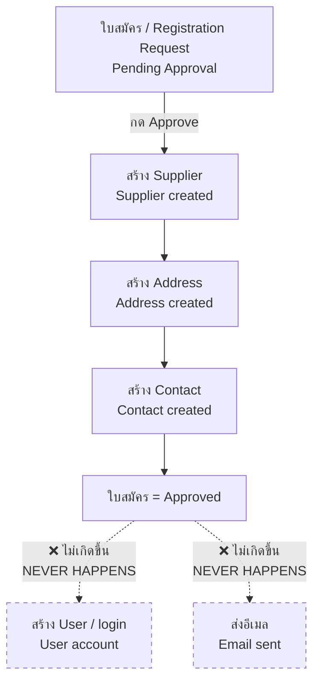

# Supplier & Manager Portals (Preview) / พอร์ทัลผู้ขายและผู้จัดการ (ตัวอย่าง)

> ⚠️ **NOT PRODUCTION-READY / ยังไม่พร้อมใช้งานจริง** — these screens exist but are incomplete. Do not use them for real business. / หน้าจอเหล่านี้มีอยู่จริงแต่ยังพัฒนาไม่เสร็จ **ห้ามใช้กับงานจริง**
>
> **อย่าเชื่อตัวเลขบนหน้าจอเหล่านี้ / Do not trust the numbers on these screens.** ราคาโลกเป็นตัวเลขปลอมที่พิมพ์ค้างไว้ในโค้ด และตัวเลขสรุปบางตัวเป็นศูนย์เสมอ
> The world prices are fake numbers hardcoded in the page, and several dashboard totals are permanently zero.

> **Status:** Preview / ตัวอย่าง — incomplete, untested, no automated tests exist
> **Who / ใคร:** ผู้ดูแลระบบและผู้ประเมินระบบเท่านั้น / system owners and evaluators only — **not** yard staff, **not** suppliers
> **Last verified / ตรวจสอบล่าสุด:** 2026-08-21 (site `metal`, branch `feature/container-redesign`)

---

## 1. What these are meant to become / เป้าหมายของระบบนี้

มีหน้าจออยู่ 3 กลุ่มในโมดูลนี้ ทั้งหมดเป็นแนวคิดที่เริ่มทำไว้แล้วหยุด
There are three groups of screens here. All three were started and then parked.

| กลุ่ม / Group | ที่อยู่ / Route | เจตนาเดิม / Intended purpose |
|---|---|---|
| สมัครสมาชิกผู้ขาย / Supplier registration | `/supplier-registration-form` | ให้ผู้ขายรายใหม่กรอกข้อมูลเองผ่านเว็บ แล้วสำนักงานกดอนุมัติ / let a new supplier self-register on the web, office approves |
| พอร์ทัลผู้ขาย / Supplier portal | `/supplier` | ให้ผู้ขายที่ล็อกอินแล้วดูราคา ขายของ ดูใบแจ้งหนี้ และนัดส่งของ / let a logged-in supplier see prices, sell, view invoices, book a drop-off |
| พอร์ทัลผู้จัดการ / Manager portal | `/manager` | ให้ผู้จัดการดูสรุป ประกาศราคา และดูราคาโลก / let a manager see KPIs, publish prices, check world prices |

**สิ่งที่เสร็จจริงมีแค่การรับใบสมัคร / The only part that genuinely works end-to-end is taking in an application.**
ทุกอย่างหลังจากนั้น — สร้างบัญชีผู้ใช้ ส่งอีเมล และหน้าจอผู้ขายทั้งหมด — ยังไม่ได้ทำ
Everything after that — creating a login, sending an email, and every supplier-facing screen — was never built.

---

## 2. Current state at a glance / สถานะปัจจุบัน

| หน้าจอ / Screen | ที่อยู่ / Route | ใช้ได้ / Works | ใช้ได้บางส่วน / Partial | ยังไม่ต่อ / Not wired |
|---|---|:---:|:---:|:---:|
| แบบฟอร์มสมัคร / Registration form | `/supplier-registration-form` | ✅ | | |
| อนุมัติใบสมัคร / Approve a request | Desk → Supplier Registration Request | | ⚠️ | |
| หน้าหลักผู้ขาย / Supplier dashboard | `/supplier` | | ⚠️ | |
| ราคา (ผู้ขาย) / Supplier price | `/supplier/price` | | | ❌ |
| ขายของ / Sell | `/supplier/sell` | | | ❌ |
| ใบแจ้งหนี้ / Invoice | `/supplier/invoice` | | | ❌ |
| นัดส่งของ / Dropoff | `/supplier/dropoff` | | | ❌ |
| หน้าหลักผู้จัดการ / Manager dashboard | `/manager` | | ⚠️ | |
| ประกาศราคา / Price announcement | `/manager/price` | | ⚠️ | |
| ราคาโลก / World price | `/manager/world-price` | | | ❌ |

**อ่านตารางนี้อย่างไร / How to read this table**

- ✅ **ใช้ได้ / Works** — ทำงานได้ตามที่เขียนไว้ / does what it says
- ⚠️ **ใช้ได้บางส่วน / Partial** — โหลดขึ้นและมีข้อมูลจริงบ้าง แต่มีบางส่วนพัง เป็นศูนย์เสมอ หรือหลอกตา / loads and shows *some* real data, but parts are broken, permanently zero, or misleading
- ❌ **ยังไม่ต่อ / Not wired** — หน้าจอโหลดขึ้นแต่ไม่มีข้อมูลจริงเลย มีแต่ข้อความหนึ่งบรรทัด หรือตัวเลขปลอมที่พิมพ์ค้างไว้ / the page loads but contains no real data at all — just one sentence of placeholder text, or fake hardcoded numbers

---

## 3. Supplier registration / สมัครสมาชิกผู้ขาย

### 3.1 หน้าที่ผู้ขายกรอก / The form the supplier fills in

**ที่อยู่ / Route:** `/supplier-registration-form` — เปิดได้โดยไม่ต้องล็อกอิน / open to anyone, no login needed

ตรวจแล้วว่าโหลดขึ้นจริง (HTTP 200 สำหรับผู้เยี่ยมชมทั่วไป) และส่งข้อมูลได้จริง
Verified: loads (HTTP 200 as Guest) and submissions really do go through.

ช่องที่ต้องกรอก / Required fields:

| ช่อง / Field | ไทย |
|---|---|
| Company / Business Name | ชื่อบริษัทหรือร้าน |
| Supplier Type | ประเภท (Individual / Company / Partnership) |
| Contact Person Name | ชื่อผู้ติดต่อ |
| Email | อีเมล |
| Mobile Number | เบอร์มือถือ |
| Address Line 1, City, Country | ที่อยู่ อำเภอ/เขต ประเทศ |

ช่องที่ไม่บังคับ / Optional: Tax ID, Business Registration Number, Phone, Address Line 2, State, Postal Code, Materials Supplied, Bank Details, Notes.

**เมื่อกดส่ง / On submit:** ระบบสร้างใบสมัครและส่งเข้าคิวรออนุมัติทันที แล้วแสดงเลขที่ใบสมัคร (เช่น `SUP-REG-2026-00001`)
The system creates the request, immediately submits it for approval, and shows a registration ID such as `SUP-REG-2026-00001`.

### 3.2 ปัญหาของหน้านี้ / Problems with this page

| ปัญหา / Problem | รายละเอียด / Detail |
|---|---|
| **แนบเอกสารไม่ได้** / Cannot attach documents | ตัวใบสมัครมีช่องแนบบัตรประชาชน ทะเบียนการค้า และหนังสือรับรองภาษี — แต่**แบบฟอร์มบนเว็บไม่มีปุ่มแนบไฟล์เลย** ต้องให้สำนักงานแนบเองภายหลัง / the request record has four attachment slots (ID card, business licence, tax certificate, other) but **the web form has no upload control at all**. The office must attach them by hand afterwards. |
| **ไม่มีอีเมลตอบกลับ** / No confirmation email | หน้าจอบอกว่า "We will contact you via email once your application has been processed" — **ระบบไม่ได้ส่งอีเมลใด ๆ ทั้งตอนสมัคร ตอนอนุมัติ และตอนปฏิเสธ** / the screen promises an email. **No email is ever sent** — not on submit, not on approval, not on rejection. Someone must phone the supplier. |
| **ไม่มีระบบกันสแปม** / No spam protection | ไม่มี CAPTCHA และไม่มีการจำกัดจำนวนครั้ง ใครก็ได้ยิงใบสมัครเข้ามาได้ไม่จำกัด / no CAPTCHA, no rate limit. Anyone on the internet can create unlimited registration records. |
| **หัวข้อพับเก็บอาจกดไม่ได้** / Collapsible sections may not open | ส่วน "Bank Details" และ "Additional Notes" ต้องกดเพื่อขยาย — โค้ดที่เขียนไว้เปลี่ยนแค่เครื่องหมาย `+`/`-` แต่ไม่ได้สั่งเปิดเนื้อหาเอง ⚠️ ยังไม่ได้ทดสอบบนเบราว์เซอร์จริง / the JavaScript only flips the `+`/`-` icon; the actual open/close relies on Bootstrap. ⚠️ **UNVERIFIED** — not tested in a real browser. |
| **ภาษาอังกฤษล้วน** / English only | ไม่มีภาษาไทยบนหน้าจอนี้เลย ผู้ขายไทยส่วนใหญ่กรอกไม่ได้ / the entire form is in English. Most Thai suppliers cannot use it as-is. |

### 3.3 การอนุมัติ / Approving a request

สำนักงานเปิดใบสมัครใน Desk (`Supplier Registration Request`) แล้วกด **Actions → Approve** หรือ **Actions → Reject**
The office opens the request in the Desk and uses **Actions → Approve** or **Actions → Reject**.

**สิ่งที่เกิดขึ้นเมื่ออนุมัติ / What approval actually does:**

> ⚠️ **ข้อผิดพลาดสำคัญที่สุดของโมดูลนี้ / The single most important defect in this module**
>
> **การอนุมัติไม่ได้สร้างบัญชีผู้ใช้ / Approval does not create a User account.**
> ผู้ขายที่ได้รับอนุมัติจึงไม่มีรหัสล็อกอิน และ**เข้าพอร์ทัลผู้ขายไม่ได้เลย**
> An approved supplier therefore has no login and **can never reach the supplier portal.**
>
> เอกสารเก่าของโปรเจกต์ (`CLAUDE.md`) เขียนว่า "Auto-creates Supplier, Contact, User on approval" — **ข้อความนั้นผิด** ระบบสร้างแค่ Supplier, Address และ Contact เท่านั้น
> The old project note claiming approval auto-creates a User is **wrong**.

> ⚠️ **ชื่อภาษาไทยจะอนุมัติไม่ผ่าน / Thai-only company names cannot be approved**
>
> ถ้าช่อง "Company / Business Name" เป็นภาษาไทยล้วน (เช่น `ร้านรับซื้อของเก่า`) การกด Approve จะ**ล้มเหลว**พร้อมข้อความ *"Short Code is required…"*
> If the company name contains fewer than two A–Z/0–9 characters, pressing Approve **fails** with *"Short Code is required…"*.
>
> สาเหตุ: ระบบต้องการรหัสย่อภาษาอังกฤษ 2–8 ตัวสำหรับ Supplier ทุกราย และสร้างให้อัตโนมัติไม่ได้จากชื่อไทย — แต่ทั้งแบบฟอร์มเว็บและหน้าจออนุมัติ**ไม่มีช่องให้กรอกรหัสย่อ**
> Every Supplier needs a 2–8 character ASCII short code. It cannot be derived from a Thai name, and **neither the web form nor the approval screen offers a place to type one.**
>
> **ทางแก้ชั่วคราว / Workaround:** อย่าใช้ปุ่ม Approve — สร้าง Supplier เองใน Desk แล้วกรอก Short Code ด้วยมือ / do not use the Approve button. Create the Supplier manually in the Desk and type the Short Code yourself.

**สิ่งที่เกิดขึ้นเมื่อปฏิเสธ / What rejection does:** บันทึกเหตุผล เปลี่ยนสถานะเป็น Rejected — **ไม่มีการแจ้งผู้สมัคร** / records the reason and sets status to Rejected. **The applicant is not notified.**

---

## 4. Supplier portal screens / หน้าจอผู้ขาย

> ⚠️ **ในทางปฏิบัติ ไม่มีผู้ขายรายใดเข้าหน้าจอกลุ่มนี้ได้ / In practice no supplier can reach these screens at all**, เพราะการอนุมัติไม่สร้างบัญชีผู้ใช้ (ดูข้อ 3.3) — because approval never creates a login (see §3.3).
>
> จะเข้าได้ต้องให้ผู้ดูแลระบบสร้าง User ให้สิทธิ์ `Supplier` และผูก User เข้ากับ Contact ของผู้ขายด้วยมือใน Desk
> Reaching them requires an admin to manually create a User, grant the `Supplier` role, and hand-link that User to the supplier's Contact record in the Desk.

ถ้ายังไม่ได้ล็อกอิน ทุกหน้าจะเด้งไปหน้า `/login` (ตรวจสอบแล้ว)
If you are not logged in, all five routes redirect to `/login` — verified.

### 4.1 หน้าหลัก / Dashboard — `/supplier` ⚠️

**หน้าเดียวในกลุ่มนี้ที่แสดงข้อมูลจริง / The only screen in this group that shows real data.**

แสดง / Shows:
- ชื่อบริษัท / company name
- เลขที่ใบสมัคร / registration number
- วันที่สมัคร / registration date
- วันที่อนุมัติ / approval date

ไม่มีปุ่มใด ๆ ไม่มียอดขาย ไม่มีน้ำหนัก ไม่มีรายการล่าสุด — มีแค่ประโยคว่า *"Welcome to your supplier dashboard. Use the sidebar to navigate."*
No buttons, no totals, no weights, no recent activity — just one welcome sentence.

### 4.2 ราคา / Price — `/supplier/price` ❌

**ว่างเปล่า** — มีแค่หัวข้อ "Price" และประโยค *"View current scrap metal prices here."*
**Empty.** A heading and one sentence. **ไม่มีราคาแม้แต่ตัวเดียว / not a single price is displayed.**

### 4.3 ขายของ / Sell — `/supplier/sell` ❌

**ว่างเปล่า** — มีแค่หัวข้อ "Sell" และประโยค *"Create a new sale transaction here."*
**Empty.** ไม่มีฟอร์ม ไม่มีปุ่ม สร้างรายการขายไม่ได้ / no form, no button, nothing can be created.

### 4.4 ใบแจ้งหนี้ / Invoice — `/supplier/invoice` ❌

**ว่างเปล่า** — มีแค่หัวข้อ "Invoice" และประโยค *"View your invoices here."*
**Empty.** ไม่มีรายการใบแจ้งหนี้ / no invoice list, no download.

### 4.5 นัดส่งของ / Dropoff — `/supplier/dropoff` ❌

**ว่างเปล่า** — มีแค่หัวข้อ "Dropoff" และประโยค *"Schedule and manage your material drop-offs here."*
**Empty.** จองคิวส่งของไม่ได้ / no booking, no schedule, no list.

> **หมายเหตุ / Note:** โมดูล Drop-off ตัวจริงที่ใช้งานได้อยู่ที่หน้าจอในลาน ไม่ได้อยู่ที่นี่ — ดู [12 — Drop-off & Containers](12-dropoff-receiving.md)
> The real, working drop-off module lives in the yard terminals, not here.

---

## 5. Manager portal screens / หน้าจอผู้จัดการ

> 🔓 **ปัญหาความปลอดภัย / Security problem — ทุกหน้าในกลุ่มนี้เปิดให้คนทั่วไปเข้าได้โดยไม่ต้องล็อกอิน**
> **Every page in this group is readable by anyone on the internet without logging in.** ตรวจสอบแล้ว: `/manager`, `/manager/price` และ `/manager/world-price` ตอบ HTTP 200 ให้ผู้เยี่ยมชมที่ไม่ได้ล็อกอิน และ**แสดงจำนวนผู้ขายทั้งหมดกับรายชื่อสินค้าจริงของกิจการ**
> Verified: all three return HTTP 200 to an unauthenticated visitor and **disclose your live supplier count and your real item catalogue.**
>
> จนกว่าจะแก้ ควรปิดกั้นเส้นทาง `/manager` ที่ระดับ reverse proxy / until this is fixed, block `/manager` at the reverse proxy.

### 5.1 หน้าหลักผู้จัดการ / Dashboard — `/manager` ⚠️

| การ์ด / KPI card | สถานะ / State |
|---|---|
| Total Suppliers | ✅ ตัวเลขจริง / real count |
| +N this month | ✅ ตัวเลขจริง / real count |
| **Total Purchases (THB)** | ❌ **เป็น `฿0` เสมอ** — ไม่ได้ต่อกับข้อมูลการซื้อจริง / **always `฿0`**, hardcoded, not connected to any purchase data |
| **Total Weight (Tons)** | ❌ **เป็น `0 T` เสมอ** — ไม่ได้ต่อกับข้อมูลน้ำหนักจริง / **always `0 T`**, hardcoded |
| **Pending Registrations** | ❌ **เป็น `0` เสมอ** — โค้ดค้นหาใบสมัครผิดชื่อ / **always `0`** — the code looks for the wrong record type |
| **Recent Supplier Registrations** (ตาราง) | ❌ **ขึ้นว่า "No recent registrations" เสมอ** แม้จะมีใบสมัครอยู่จริง / **always shows "No recent registrations"** even when real requests exist |

ตรวจสอบแล้วบนระบบทดสอบ: มีใบสมัครจริงอยู่ 2 ใบ แต่หน้าจอยังแสดง Pending = 0 และ "No recent registrations"
Verified on the dev site: two real registration requests exist, yet the dashboard still shows Pending = 0 and an empty table.

**ปุ่มลัด / Quick actions:**

| ปุ่ม / Button | ผลลัพธ์ / Result |
|---|---|
| Update Prices | ✅ ไปหน้า `/manager/price` |
| Check World Prices | ✅ ไปหน้า `/manager/world-price` |
| Manage Suppliers | ✅ ไปหน้า Supplier ใน Desk |
| **Review Registrations** | ❌ **ลิงก์เสีย** — ชี้ไปที่ `/app/supplier-registration` ซึ่ง**ไม่มีอยู่จริง** (ชื่อจริงคือ Supplier Registration **Request**) / **dead link** — points at a record type that does not exist |
| **View All** (มุมตาราง) | ❌ **ลิงก์เสียแบบเดียวกัน** / same dead link |

### 5.2 ประกาศราคา / Price announcement — `/manager/price` ⚠️

หน้านี้**ดูข้อมูลอย่างเดียว แก้ราคาไม่ได้** — ชื่อหน้าว่า "Price Announcement" แต่ประกาศราคาไม่ได้จริง
This page is **read-only. It cannot set or announce any price**, despite its name. ปุ่ม "Add New Price" เพียงพาไปหน้า Item Price ของ Desk / the "Add New Price" button just links out to the Desk.

ตารางแสดง 3 คอลัมน์ราคา: Standard / VIP / Premium

> ⚠️ **ทั้งสามคอลัมน์ขึ้น `฿-` ทั้งหมดบนระบบที่ตรวจสอบ / All three price columns render `฿-` on the site we checked.**
> เพราะรายการราคา `VIP Buying` และ `Premium Buying` **ไม่มีอยู่จริง** และรายการราคาที่ระบบ POS ใช้จริงก็ไม่ใช่ `Standard Buying`
> The `VIP Buying` and `Premium Buying` price lists **do not exist**, and the price list the POS actually uses is not `Standard Buying` either. โครงสร้างราคาสามระดับนี้เป็นเพียงแผน ยังไม่เคยตั้งค่าจริง / the three-tier pricing scheme is a plan that was never configured.

> ⚠️ **อันตราย: ถ้าไม่พบสินค้าเลย หน้าจอจะแสดง "ราคาตัวอย่าง" ปลอม / Danger: if no items are found, the page silently shows five rows of FAKE sample prices** (Copper Wire ฿280, Aluminum Scrap ฿65, Steel/Iron ฿12, Brass ฿150, Stainless Steel ฿45) โดย**ไม่มีคำเตือนว่าเป็นของปลอม** และประทับวันที่ของวันนี้ไว้ด้วย / with **no warning that they are fake**, stamped with today's date.

**ชื่อสินค้า / Item names:** ตารางแสดงชื่อสินค้าตามที่บันทึกไว้จริง ไม่มีการแปล — ถูกต้องแล้ว / the table renders item names exactly as stored, untranslated — which is correct.

### 5.3 ราคาโลก / World price — `/manager/world-price` ❌

> ⚠️ **ราคาทั้งหมดบนหน้านี้เป็นตัวเลขปลอมที่พิมพ์ค้างไว้ในโค้ด ไม่ได้ดึงจากที่ไหนทั้งสิ้น**
> **Every number on this page is a fake constant typed into the page source. There is no API, no feed, no live data of any kind.**

หน้าจอแสดง Copper $8,945 / Aluminum $2,485 / Steel (HRC) $520 / Zinc $2,890 / Lead $2,125 / Nickel $16,250 และอัตราแลกเปลี่ยน USD ฿34.85, EUR ฿37.20, CNY ฿4.82 — **ตัวเลขเหล่านี้เป็นค่าคงที่ ไม่เคยเปลี่ยน**
These values are constants. They never change. ไม่มีปุ่มรีเฟรช / there is no refresh button.

> ⚠️ **หลอกตาที่สุด / The most misleading part:** มุมขวาบนเขียนว่า **"Last updated: <วันที่ของวันนี้>"** — วันที่นั้นคือวันที่คุณเปิดหน้าจอ ไม่ใช่วันที่ของราคา ราคาถูกพิมพ์ไว้ตั้งแต่ตอนเขียนโค้ดและ**เก่าหลายปีแล้ว**
> The header says **"Last updated: <today's date>"**. That date is simply today. The prices themselves were typed in when the page was written and are **years stale**. อย่าใช้ตัดสินใจรับซื้อเด็ดขาด / never use these to make a buying decision.

หน้าจอมีคำเตือนเล็ก ๆ ที่ท้ายหน้าว่าเป็นราคาตัวอย่าง แต่อยู่ต่ำกว่าราคาและวันที่ที่ดูน่าเชื่อถือ
There is a small disclaimer at the bottom of the page, but it sits below the authoritative-looking prices and date.

---

## 6. What does NOT work yet / สิ่งที่ยังใช้ไม่ได้

สรุปทุกอย่างที่ห้ามคาดหวังจากโมดูลนี้
Everything you must not expect from this module.

### 6.1 ผู้ขาย / For suppliers

| สิ่งที่ยังทำไม่ได้ / Cannot do | หมายเหตุ / Note |
|---|---|
| ❌ ล็อกอินเข้าพอร์ทัลหลังได้รับอนุมัติ / Log in after being approved | การอนุมัติไม่สร้างบัญชีผู้ใช้ ต้องสร้างและผูกด้วยมือทุกราย / approval creates no User; every account must be hand-built |
| ❌ ดูราคาที่ระบบเสนอ / See offered prices | หน้า `/supplier/price` ว่างเปล่า |
| ❌ สร้างรายการขาย / Create a sale | หน้า `/supplier/sell` ว่างเปล่า |
| ❌ ดูหรือดาวน์โหลดใบแจ้งหนี้ / View or download invoices | หน้า `/supplier/invoice` ว่างเปล่า |
| ❌ จองคิวส่งของ / Book a drop-off slot | หน้า `/supplier/dropoff` ว่างเปล่า |
| ❌ แนบเอกสารตอนสมัคร / Attach documents when registering | แบบฟอร์มไม่มีปุ่มแนบไฟล์ |
| ❌ รับอีเมลยืนยันหรือแจ้งผล / Receive any email | ระบบไม่ส่งอีเมลเลย แม้หน้าจอจะบอกว่าส่ง |
| ❌ ใช้ภาษาไทย / Use Thai | ทุกหน้าจอในโมดูลนี้เป็นภาษาอังกฤษล้วน |

### 6.2 ผู้จัดการ / For managers

| สิ่งที่ยังทำไม่ได้ / Cannot do | หมายเหตุ / Note |
|---|---|
| ❌ ดูยอดซื้อรวม / See total purchases | `฿0` ตายตัว |
| ❌ ดูน้ำหนักรวม / See total weight | `0 T` ตายตัว |
| ❌ เห็นจำนวนใบสมัครที่รออนุมัติ / See pending registrations | `0` เสมอ (โค้ดหาผิดชื่อ) |
| ❌ เห็นรายชื่อใบสมัครล่าสุด / See recent registrations | ว่างเสมอ (โค้ดหาผิดชื่อ) |
| ❌ กดจากหน้าจอไปดูใบสมัคร / Jump to registrations from the dashboard | ลิงก์เสียทั้งสองจุด |
| ❌ ตั้งหรือประกาศราคา / Set or publish a price | หน้า "Price Announcement" อ่านอย่างเดียว |
| ❌ ดูราคาระดับ VIP / Premium | รายการราคาสองตัวนั้นไม่มีอยู่จริง |
| ❌ ดูราคาโลกจริง / See real world prices | เป็นตัวเลขปลอมที่พิมพ์ค้างไว้ |

### 6.3 ความปลอดภัย / Security

| ปัญหา / Issue | ความเสี่ยง / Risk |
|---|---|
| 🔓 `/manager` ทั้ง 3 หน้าเปิดให้คนทั่วไปเข้าได้ / all three manager pages are public | เปิดเผยจำนวนผู้ขายและรายชื่อสินค้าของกิจการต่อสาธารณะ / discloses supplier count and item catalogue publicly |
| 🔓 ใครก็ยิงใบสมัครเข้ามาได้ไม่จำกัด / unlimited anonymous registrations | ฐานข้อมูลถูกถล่มด้วยข้อมูลขยะได้ / database can be flooded with junk |
| 🔓 ใบสมัครเก็บเลขบัญชีธนาคารแบบไม่เข้ารหัส / bank account numbers stored unencrypted | ข้อมูลการเงินของผู้ขายอยู่ในระบบโดยไม่มีการปกป้องเพิ่มเติม / supplier financial data sits in plain fields |

### 6.4 การทดสอบ / Testing

> ❌ **โมดูลนี้ไม่มีการทดสอบอัตโนมัติแม้แต่ชุดเดียว / This module has zero automated tests.**
> ค้นทั้งโปรเจกต์แล้วไม่พบไฟล์ทดสอบใดที่แตะหน้าจอหรือ API ของพอร์ทัลเลย ทุกข้อความในเอกสารนี้มาจากการอ่านโค้ดและเปิดหน้าจอจริงด้วยมือ
> A search of the whole project found no test touching any portal page or endpoint. Everything in this document comes from reading the source and exercising the running site by hand.

---

## ถ้าคุณต้องรับผู้ขายรายใหม่วันนี้ / If you need to onboard a supplier today

อย่าใช้โมดูลนี้ ให้ทำใน Desk แทน
Do not use this module. Do it in the Desk instead.

1. สร้าง **Supplier** ใหม่ใน Desk / create a new **Supplier** in the Desk
2. กรอก **Short Code** เป็นตัวอักษรอังกฤษ 2–8 ตัว (เช่น `TRP`, `ACME01`) / type a 2–8 character ASCII **Short Code**
3. กรอกชื่อผู้ขายเป็นภาษาไทยได้ตามปกติ / the supplier name itself can be Thai
4. ผู้ขายรายนั้นพร้อมใช้กับหน้าจอในลานทันที / that supplier is immediately usable by the yard terminals

ดูขั้นตอนงานจริงที่ [12 — Drop-off & Containers](12-dropoff-receiving.md) และ [30 — Price Lock & Settlement](30-settlement.md)
For the real workflow see the drop-off and settlement guides.

---

## เอกสารสำหรับผู้พัฒนา / Developer reference

รายละเอียดทางเทคนิค ตำแหน่งไฟล์ และรายการช่องโหว่ อยู่ที่ [admin/80-portals-internals.md](../admin/80-portals-internals.md)
Technical detail, file locations, and the full gap list are in the admin guide.
